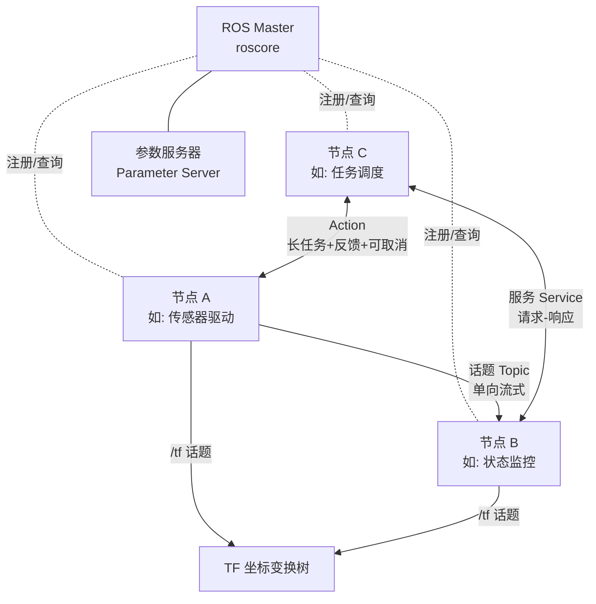
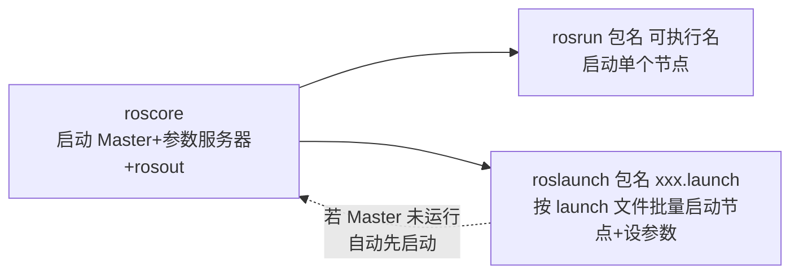

# 01 核心概念总览

> English version: [01_core_concepts.md](../en/10_ros1_basics/01_core_concepts.md)

## 目标

- 理解 ROS1 的整体架构：Master、节点、话题、服务、Action、参数服务器、TF 各自的角色
- 理解"计算图 (Computation Graph)"这一核心抽象
- 分清 `roscore`、`rosrun`、`roslaunch` 三个命令的关系
- 认识包 (package) 与工作空间 (workspace) 的目录结构，知道 `package.xml` 和 `CMakeLists.txt` 分别管什么
- 能根据场景在话题 / 服务 / Action 之间做出正确选型

## 原理简介

### ROS1 架构

ROS1 不是操作系统，而是一套**分布式进程间通信框架 + 工具链 + 生态**。一个机器人应用被拆分为多个独立进程（节点），节点之间通过话题、服务、Action 交换数据，由 Master 负责"牵线搭桥"。



各组件职责：

| 组件 | 职责 |
|---|---|
| **Master** | 名字服务。节点启动时向它注册，发布/订阅双方通过它找到彼此。注意：**数据不经过 Master**，节点间建立点对点连接后直接传输 |
| **节点 (Node)** | 一个可执行进程，完成单一功能（驱动、算法、监控等）。跨语言：C++ (roscpp) 与 Python (rospy) 节点可自由互通 |
| **话题 (Topic)** | 单向、多对多的异步消息流，适合传感器数据等持续数据 |
| **服务 (Service)** | 一对一同步请求-响应，适合"问一次答一次"的短任务 |
| **Action** | 建立在话题之上的长任务协议，支持中途反馈与取消 |
| **参数服务器** | 挂在 Master 上的全局键值字典，存放配置参数（如轮径、最大速度） |
| **TF** | 维护坐标系之间随时间变化的变换关系树（如 `map → odom → base_link`），底层也是话题 (`/tf`) |

### 计算图 (Computation Graph)

运行中的所有节点、话题、服务连接关系构成一张有向图，称为**计算图**。节点是顶点，话题是边。用 `rqt_graph` 可以实时看到这张图——调试"消息为什么没收到"时第一件事就是看计算图上两个节点是否连上了。

### roscore、rosrun、roslaunch



- `roscore`：启动 Master、参数服务器和日志节点 `rosout`。**一台机器（一个 ROS 网络）只跑一个**。
- `rosrun <package> <executable>`：启动某个包里的一个节点，前提是 Master 已在运行。
- `roslaunch <package> <file>.launch`：按 XML 描述一次性启动多个节点、加载参数、重映射话题；若检测不到 Master 会**自动启动 roscore**。

### 包与工作空间

catkin 工作空间的标准结构（以本套件为例）：

```
~/ws_romindly/
├── src/                      # 源码空间：所有包放这里
│   └── romindly_ros1_tutorials/
│       ├── romindly_msgs/    # 一个包 = 一个功能单元
│       │   ├── package.xml
│       │   ├── CMakeLists.txt
│       │   ├── msg/  srv/  action/
│       ├── topic_demo/
│       ├── service_demo/
│       └── action_demo/
├── build/                    # catkin_make 生成的中间产物
└── devel/                    # 生成的可执行文件、消息头文件、setup.bash
```

每个包必备两个文件：

- **`package.xml`**：包的"身份证"。声明包名、版本、维护者、许可证，以及**依赖关系**（`build_depend` 编译期依赖 / `exec_depend` 运行期依赖）。rosdep 据此安装系统依赖，catkin 据此决定编译顺序。参考 [romindly_msgs/package.xml](https://github.com/Romindly-Dev/romindly_ros1_tutorials/blob/main/romindly_msgs/package.xml)。
- **`CMakeLists.txt`**：包的"构建脚本"。声明要编译哪些可执行文件、链接哪些库、生成哪些消息、安装哪些脚本。参考 [topic_demo/CMakeLists.txt](https://github.com/Romindly-Dev/romindly_ros1_tutorials/blob/main/topic_demo/CMakeLists.txt)。

`source devel/setup.bash` 的作用是把本工作空间注册进 ROS 的包搜索路径，此后 `rosrun`/`roslaunch` 才能找到你的包。**每开一个新终端都要 source 一次**（或写进 `~/.bashrc`）。

### 话题 vs 服务 vs Action 选型

| 维度 | 话题 Topic | 服务 Service | Action |
|---|---|---|---|
| 通信模型 | 发布/订阅，异步 | 请求/响应，同步阻塞 | 目标/反馈/结果，异步 |
| 连接关系 | 多对多 | 一对一 | 一对一 |
| 是否有返回值 | 无 | 有 | 有（结果+过程反馈） |
| 可否中途取消 | —（本身就是流） | 不可 | **可以 (preempt)** |
| 典型耗时 | 持续不断 | 毫秒~秒级 | 秒~分钟级 |
| 典型场景 | 传感器数据、状态广播、速度指令 | 查询状态、触发一次计算、切换模式 | 导航到目标点、机械臂运动、倒计时 |
| 本套件示例 | `topic_demo` | `service_demo` | `action_demo` |

**选型口诀**：数据流用话题；一问一答且很快用服务；任务时间长、要进度、可能取消用 Action。

## 运行示例

先编译并加载环境（后续所有教程默认已完成此步）：

```bash
cd ~/ws_romindly && catkin_make && source devel/setup.bash
```

启动 Master，并观察计算图中最初的成员：

```bash
# 终端 1
roscore
```

```bash
# 终端 2
rosnode list
rostopic list
```

预期输出：

```
/rosout

/rosout
/rosout_agg
```

即使什么节点都没启动，也有一个日志聚合节点 `/rosout` 在运行。再跑一个真实节点看看计算图变化：

```bash
# 终端 2
rosrun topic_demo talker
```

```bash
# 终端 3
rosnode list          # 多了 /talker_cpp
rostopic list         # 多了 /robot_status
rosnode info /talker_cpp
```

`rosnode info` 会显示该节点发布/订阅的话题及其与 Master 的连接信息——这就是在用命令行"读"计算图。

## 代码讲解

本篇聚焦概念，代码细节留给后续三篇；这里只看一个包的"骨架"如何声明自己。以 [romindly_msgs/package.xml](https://github.com/Romindly-Dev/romindly_ros1_tutorials/blob/main/romindly_msgs/package.xml) 为例：

```xml
<name>romindly_msgs</name>
<buildtool_depend>catkin</buildtool_depend>
<build_depend>message_generation</build_depend>
<exec_depend>message_runtime</exec_depend>
```

- `buildtool_depend`：构建工具，ROS1 固定为 `catkin`
- `build_depend`：编译时需要（生成消息代码要用 `message_generation`）
- `exec_depend`：运行时需要（别的节点加载消息要用 `message_runtime`）

再看 [topic_demo/CMakeLists.txt](https://github.com/Romindly-Dev/romindly_ros1_tutorials/blob/main/topic_demo/CMakeLists.txt) 的核心三行：

```cmake
add_executable(talker src/talker.cpp)            # 声明可执行文件
target_link_libraries(talker ${catkin_LIBRARIES}) # 链接 ROS 库
add_dependencies(talker ${catkin_EXPORTED_TARGETS}) # 确保先生成消息头文件再编译
```

`add_dependencies` 常被新手遗漏：它保证 `romindly_msgs` 的消息头文件先于 `talker.cpp` 生成，否则并行编译时可能报"找不到 RobotStatus.h"。

## 动手练习

1. 依次运行 `rosrun topic_demo talker` 与 `rosrun topic_demo listener`，然后执行 `rqt_graph`，截图观察两个节点通过 `/robot_status` 相连的计算图；再关掉 talker，刷新 rqt_graph 看图如何变化。
2. 在 `~/ws_romindly/src` 下用 `catkin_create_pkg my_first_pkg roscpp rospy` 新建一个空包，打开生成的 `package.xml` 与 `CMakeLists.txt`，对照本文说明找出依赖声明的位置，然后 `catkin_make` 确认能编译通过。

## 常见问题

**Q1: 运行 rosrun 报 `Unable to communicate with master`？**
Master 没启动。先在独立终端运行 `roscore`（`roslaunch` 则会自动启动）。

**Q2: `rosrun: package 'topic_demo' not found`？**
当前终端没有 source 工作空间。执行 `source ~/ws_romindly/devel/setup.bash`；建议追加到 `~/.bashrc`。

**Q3: 可以开两个 roscore 吗？**
同一 ROS 网络只能有一个 Master。第二个 `roscore` 会直接报错退出。多机器人通常共享一个 Master（通过 `ROS_MASTER_URI` 指向同一台机器）。

**Q4: Master 挂了正在通信的节点会断吗？**
已建立的话题连接是点对点的，不会立刻断；但新节点无法再注册、无法建立新连接。生产环境应保证 roscore 稳定运行。
