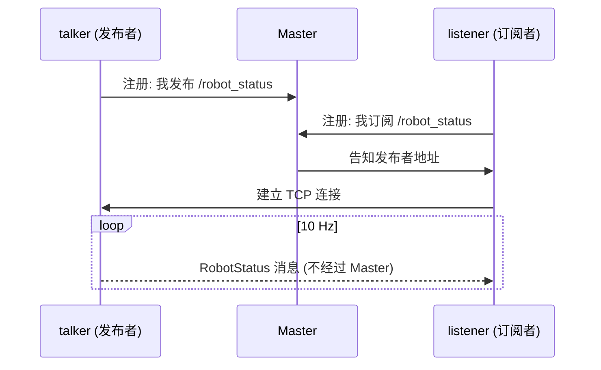

# 02 话题通信

## 目标

- 理解发布/订阅模型与话题通信的建立过程
- 会定义自定义消息（以 `RobotStatus.msg` 为例：字段、常量、Header）
- 读懂 C++ 与 Python 双版本的发布者/订阅者代码
- 理解 `queue_size` 的含义
- 会用 `rostopic echo/hz/info` 和 `rqt_graph` 观察话题

配套代码：[topic_demo](https://github.com/Romindly-Dev/romindly_ros1_tutorials/tree/main/topic_demo)、[romindly_msgs](https://github.com/Romindly-Dev/romindly_ros1_tutorials/tree/main/romindly_msgs)

## 原理简介

话题是**单向、异步、多对多**的消息流。发布者 (Publisher) 只管往话题上发，订阅者 (Subscriber) 只管收，双方互不感知、互不等待。Master 只在建立连接时牵线，之后消息走节点间的点对点 TCP 连接（TCPROS）。



要点：话题名 + 消息类型必须双方一致才能连通；一个话题可以有多个发布者和多个订阅者。

### 消息定义：RobotStatus.msg

自定义消息放在 [romindly_msgs/msg/RobotStatus.msg](https://github.com/Romindly-Dev/romindly_ros1_tutorials/blob/main/romindly_msgs/msg/RobotStatus.msg)：

```
uint8 STATE_IDLE=0
uint8 STATE_MOVING=1
uint8 STATE_CHARGING=2
uint8 STATE_ERROR=3

std_msgs/Header header
string robot_name      # 机器人名称
uint8 state            # 当前状态，取值见上方常量
float32 battery        # 电池电量百分比 (0~100)
float64 mileage        # 累计里程，单位: 米
```

- **常量**（带 `=` 的行）：给枚举值起名字，编译后成为类的静态常量，代码里写 `RobotStatus.STATE_MOVING` 而不是魔法数字 `1`
- **`std_msgs/Header`**：标准头，含时间戳 `stamp` 和坐标系 `frame_id`，凡是带时间/空间属性的消息都建议加
- **基础类型**：`string`、`uint8`、`float32`、`float64` 等，与 C++/Python 类型自动映射

`catkin_make` 时，`message_generation` 会把这个 `.msg` 文件生成为 C++ 头文件 `romindly_msgs/RobotStatus.h` 和 Python 模块 `romindly_msgs.msg.RobotStatus`（生成配置详见下一篇讲 CMakeLists 的部分）。

## 运行示例

默认已完成 `cd ~/ws_romindly && catkin_make && source devel/setup.bash`。

```bash
# 终端 1
roscore
```

```bash
# 终端 2：C++ 发布者
rosrun topic_demo talker
```

预期输出：

```
[ INFO] [1757130000.123]: publish: battery=100.0% mileage=0.00m
[ INFO] [1757130000.223]: publish: battery=100.0% mileage=0.05m
...
```

```bash
# 终端 3：Python 订阅者（跨语言互通）
rosrun topic_demo listener.py
```

预期输出：

```
[INFO] [1757130001.325]: [romindly_bot] state=1 battery=100.0% mileage=0.65m
...
```

C++ 发、Python 收，完全正常——ROS 消息在网络上是统一的序列化格式，与实现语言无关。也可以换成 `rosrun topic_demo talker.py` 和 `rosrun topic_demo listener` 组合验证。

### 用命令行工具观察

```bash
rostopic list                       # 列出所有话题
rostopic info /robot_status        # 查看类型、发布者、订阅者
rostopic echo /robot_status        # 打印消息内容
rostopic hz /robot_status          # 统计实际频率
rosmsg show romindly_msgs/RobotStatus   # 查看消息定义
```

`rostopic info /robot_status` 预期输出：

```
Type: romindly_msgs/RobotStatus

Publishers:
 * /talker_cpp (http://xxx:xxxxx/)

Subscribers:
 * /listener_py (http://xxx:xxxxx/)
```

`rostopic hz` 应稳定在 10 Hz 左右：

```
average rate: 10.000
	min: 0.100s max: 0.100s std dev: 0.00012s window: 50
```

图形化查看计算图：

```bash
rqt_graph
```

能看到 `talker_cpp → /robot_status → listener_py` 的连接。注意 `rostopic echo` 本身也是一个订阅节点，开着它时 rqt_graph 里会多出一个节点。

## 代码讲解

### C++ 发布者 [topic_demo/src/talker.cpp](https://github.com/Romindly-Dev/romindly_ros1_tutorials/blob/main/topic_demo/src/talker.cpp)

```cpp
ros::init(argc, argv, "talker_cpp");
ros::NodeHandle nh;
ros::Publisher pub =
    nh.advertise<romindly_msgs::RobotStatus>("robot_status", 10);
```

- `ros::init`：初始化节点并命名。节点名在网络中必须唯一
- `NodeHandle`：与 ROS 系统交互的句柄，发布/订阅/参数都通过它
- `advertise<T>(话题名, queue_size)`：注册为发布者。模板参数即消息类型

```cpp
ros::Rate rate(10);  // 10 Hz
while (ros::ok())
{
  romindly_msgs::RobotStatus msg;
  msg.header.stamp = ros::Time::now();
  msg.header.frame_id = "base_link";
  msg.state = romindly_msgs::RobotStatus::STATE_MOVING;  // 使用消息常量
  ...
  pub.publish(msg);
  ros::spinOnce();
  rate.sleep();
}
```

- `ros::Rate` + `rate.sleep()`：把循环稳定在 10 Hz
- `ros::ok()`：Ctrl+C 或节点被 kill 后变为 false，循环优雅退出
- `msg.state` 直接赋消息里定义的常量 `STATE_MOVING`，可读性远好于裸数字

### C++ 订阅者 [topic_demo/src/listener.cpp](https://github.com/Romindly-Dev/romindly_ros1_tutorials/blob/main/topic_demo/src/listener.cpp)

```cpp
void statusCallback(const romindly_msgs::RobotStatus::ConstPtr& msg)
{
  ROS_INFO("[%s] state=%u battery=%.1f%% mileage=%.2fm",
           msg->robot_name.c_str(), msg->state, msg->battery, msg->mileage);
  if (msg->battery < 20.0f)
    ROS_WARN("电量过低，请及时充电!");
}

ros::Subscriber sub = nh.subscribe("robot_status", 10, statusCallback);
ros::spin();
```

- 回调参数是 `ConstPtr`（共享指针），避免大消息拷贝
- `ros::spin()`：阻塞在此，不断处理到达的消息并调用回调；没有它回调永远不会执行

### Python 版本 [talker.py](https://github.com/Romindly-Dev/romindly_ros1_tutorials/blob/main/topic_demo/scripts/talker.py) / [listener.py](https://github.com/Romindly-Dev/romindly_ros1_tutorials/blob/main/topic_demo/scripts/listener.py)

```python
pub = rospy.Publisher("robot_status", RobotStatus, queue_size=10)
rate = rospy.Rate(10)
while not rospy.is_shutdown():
    msg = RobotStatus()
    msg.state = RobotStatus.STATE_MOVING
    pub.publish(msg)
    rate.sleep()
```

```python
rospy.Subscriber("robot_status", RobotStatus, status_callback)
rospy.spin()
```

与 C++ 一一对应：`rospy.Publisher` ↔ `advertise`，`rospy.is_shutdown()` ↔ `!ros::ok()`。差异点：rospy 的订阅回调运行在独立线程，不需要 `spinOnce`；`rospy.spin()` 只是阻止主线程退出。

### queue_size 到底是什么

发布端的 `queue_size` 是**发送缓冲队列长度**：当发布速度超过网络/订阅端消化速度时，消息先排队；队满后**丢弃最旧的消息**。订阅端 `subscribe` 的第二个参数同理是接收队列。

- 队列太小 + 发布太快 → 丢消息（对传感器流通常无所谓，最新数据才有价值）
- 队列太大 → 订阅端处理的可能是"陈旧"数据，控制类话题尤其要小心
- 经验值：高频传感器流 1~10；不能丢的低频事件可设大一些

## 动手练习

1. 修改 [talker.py](https://github.com/Romindly-Dev/romindly_ros1_tutorials/blob/main/topic_demo/scripts/talker.py)：当 `battery` 降到 0 时把 `msg.state` 改为 `RobotStatus.STATE_ERROR`，并把电量下降速度改为每次 0.5，用 `rostopic echo /robot_status` 验证 state 字段的变化。
2. 修改 [listener.cpp](https://github.com/Romindly-Dev/romindly_ros1_tutorials/blob/main/topic_demo/src/listener.cpp)：在回调里累加收到的消息条数，每收到 50 条打印一次统计。改完记得重新 `catkin_make`。

## 常见问题

**Q1: listener 收不到任何消息？**
按顺序排查：① 双方是否在同一 Master（`echo $ROS_MASTER_URI`）；② `rostopic list` 里话题名是否一致（注意命名空间前缀）；③ `rostopic info` 看两个节点是否都挂在话题上；④ 消息类型是否一致。

**Q2: 编译报 `romindly_msgs/RobotStatus.h: No such file or directory`？**
`topic_demo` 依赖的消息头文件还没生成。确认 `CMakeLists.txt` 中有 `add_dependencies(talker ${catkin_EXPORTED_TARGETS})`，且 `find_package` 与 `package.xml` 都声明了 `romindly_msgs` 依赖，然后完整重编译。

**Q3: `rosrun topic_demo talker.py` 报 Permission denied？**
脚本缺可执行权限：`chmod +x ~/ws_romindly/src/romindly_ros1_tutorials/topic_demo/scripts/*.py`。

**Q4: 修改 .msg 文件后代码里读到的还是旧字段？**
消息代码是编译期生成的，改完 `.msg` 必须重新 `catkin_make` 并重新 `source devel/setup.bash`。

**Q5: 发布后的第一条消息经常丢？**
`advertise` 之后与订阅者的连接需要几十毫秒建立，期间发布的消息没人收。持续流无影响；若只发一次，可在发布前 `sleep` 一小段或检查 `pub.getNumSubscribers()`。
