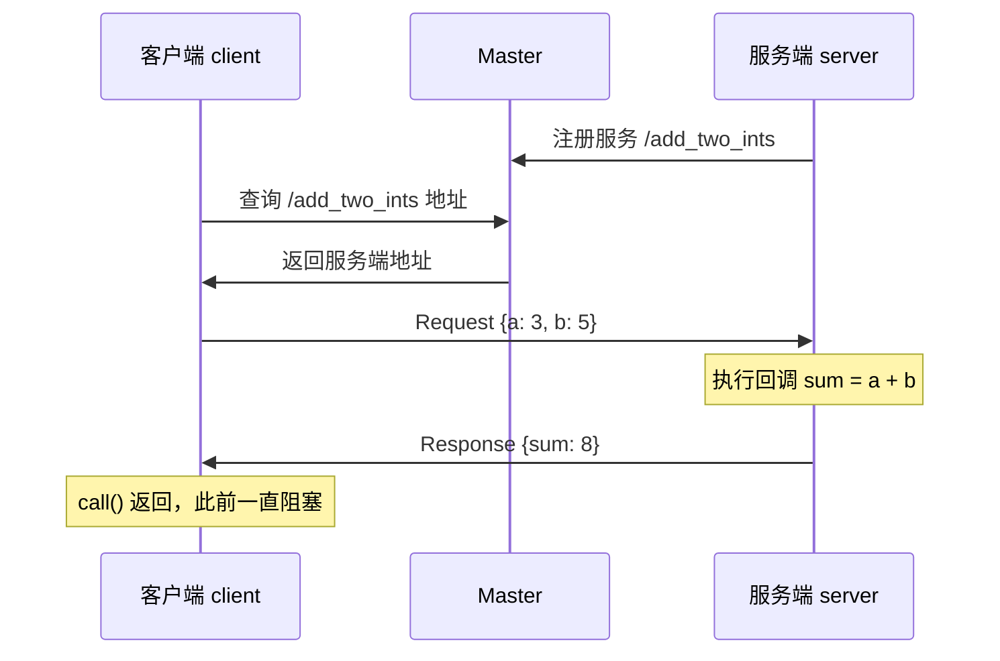

# 03 服务与自定义接口

## 目标

- 理解服务的请求-响应模型及其与话题的本质区别
- 会写 `.srv` 文件（以 `AddTwoInts.srv` 为例），掌握 `---` 分隔的结构
- 掌握 `romindly_msgs` 中 `message_generation` 的完整 CMake 配置
- 读懂 C++ / Python 双版本服务端与客户端代码
- 会用 `waitForExistence` / `wait_for_service` 做超时处理
- 会用 `rosservice call` 手动调用服务

配套代码：[service_demo](https://github.com/Romindly-Dev/romindly_ros1_tutorials/tree/main/service_demo)、[romindly_msgs](https://github.com/Romindly-Dev/romindly_ros1_tutorials/tree/main/romindly_msgs)

## 原理简介

服务是**一对一、同步**的远程过程调用 (RPC)：客户端发出请求后**阻塞等待**，服务端执行回调、填充响应并返回。同一个服务名只能有一个服务端，客户端可以有多个。



与话题对比：话题是"广播，不等回音"；服务是"点名提问，等到回答才继续"。因此服务回调必须**快**——回调执行期间客户端一直卡着。

### srv 文件结构

[romindly_msgs/srv/AddTwoInts.srv](https://github.com/Romindly-Dev/romindly_ros1_tutorials/blob/main/romindly_msgs/srv/AddTwoInts.srv)：

```
int64 a
int64 b
---
int64 sum
```

`---` 上方是请求 (Request) 字段，下方是响应 (Response) 字段。任意一段都可以为空（如"触发型"服务请求可以没有字段）。编译后生成三个类型：`AddTwoInts`、`AddTwoIntsRequest`、`AddTwoIntsResponse`。

### message_generation 配置要点

自定义接口能否编译成功，全看 [romindly_msgs/CMakeLists.txt](https://github.com/Romindly-Dev/romindly_ros1_tutorials/blob/main/romindly_msgs/CMakeLists.txt) 这五个环节是否齐全：

```cmake
find_package(catkin REQUIRED COMPONENTS
  message_generation      # ① 引入代码生成器
  std_msgs                # 消息中用到的依赖包
  actionlib_msgs          # action 生成需要
)

add_message_files(FILES RobotStatus.msg)    # ② 登记 msg
add_service_files(FILES AddTwoInts.srv)     # ②' 登记 srv
add_action_files(FILES Countdown.action)    # ②'' 登记 action

generate_messages(                          # ③ 触发生成，声明消息间依赖
  DEPENDENCIES
  std_msgs
  actionlib_msgs
)

catkin_package(                             # ④ 导出运行期依赖给下游包
  CATKIN_DEPENDS message_runtime std_msgs actionlib_msgs
)
```

配套 [package.xml](https://github.com/Romindly-Dev/romindly_ros1_tutorials/blob/main/romindly_msgs/package.xml) 中还有第 ⑤ 环：

```xml
<build_depend>message_generation</build_depend>
<exec_depend>message_runtime</exec_depend>
```

常见坑：
- `generate_messages` 必须出现在 `catkin_package` **之前**
- `.srv` 里引用了 `std_msgs/Header` 等外部类型时，`generate_messages(DEPENDENCIES ...)` 必须列出对应包
- 下游包（如 `service_demo`）要在自己的 `find_package` 与 `package.xml` 中依赖 `romindly_msgs`，并给可执行目标加 `add_dependencies(target ${catkin_EXPORTED_TARGETS})`，保证先生成接口代码再编译

## 运行示例

默认已完成 `cd ~/ws_romindly && catkin_make && source devel/setup.bash`。

```bash
# 终端 1
roscore
```

```bash
# 终端 2：C++ 服务端
rosrun service_demo add_two_ints_server
```

预期输出：

```
[ INFO] [1757130000.100]: add_two_ints 服务已就绪
```

```bash
# 终端 3：Python 客户端（跨语言调用）
rosrun service_demo add_two_ints_client.py 3 5
```

预期输出（客户端 / 服务端各一条）：

```
[INFO] [1757130002.345]: sum = 8
[ INFO] [1757130002.344]: request: a=3 b=5 -> sum=8
```

C++ 客户端同理：`rosrun service_demo add_two_ints_client 3 5`。

### 命令行工具

```bash
rosservice list                        # 列出所有服务
rosservice info /add_two_ints          # 查看类型与服务端节点
rossrv show romindly_msgs/AddTwoInts   # 查看 srv 定义
rosservice call /add_two_ints "a: 7
b: 35"
```

`rosservice call` 预期输出：

```
sum: 42
```

参数是 YAML 格式；简单类型也可以写成 `rosservice call /add_two_ints 7 35`。按两次 Tab 可自动补全参数模板。

## 代码讲解

### C++ 服务端 [service_demo/src/add_two_ints_server.cpp](https://github.com/Romindly-Dev/romindly_ros1_tutorials/blob/main/service_demo/src/add_two_ints_server.cpp)

```cpp
bool add(romindly_msgs::AddTwoInts::Request& req,
         romindly_msgs::AddTwoInts::Response& res)
{
  res.sum = req.a + req.b;
  return true;   // true = 调用成功；false 会让客户端 call() 返回失败
}

ros::ServiceServer service = nh.advertiseService("add_two_ints", add);
ros::spin();
```

- 回调签名固定为 `(Request&, Response&) -> bool`，填 `res` 即填响应
- 返回 `false` 表示"服务处理失败"，客户端 `client.call()` 会返回 false
- `ros::spin()` 负责派发到来的请求，与话题订阅同理

### C++ 客户端 [service_demo/src/add_two_ints_client.cpp](https://github.com/Romindly-Dev/romindly_ros1_tutorials/blob/main/service_demo/src/add_two_ints_client.cpp)

```cpp
ros::ServiceClient client =
    nh.serviceClient<romindly_msgs::AddTwoInts>("add_two_ints");

romindly_msgs::AddTwoInts srv;
srv.request.a = atoll(argv[1]);
srv.request.b = atoll(argv[2]);

// 阻塞等待服务上线，最多 5 秒
if (!client.waitForExistence(ros::Duration(5.0)))
{
  ROS_ERROR("等待 add_two_ints 服务超时，请先启动服务端");
  return 1;
}

if (client.call(srv))
  ROS_INFO("sum = %ld", (long)srv.response.sum);
```

- `srv` 对象同时包含 `request` 与 `response` 两半
- **`waitForExistence(timeout)`**：客户端可能先于服务端启动，直接 `call` 会立即失败。带超时地等待服务注册，超时返回 false，据此给出明确报错而不是无限卡死。传 `ros::Duration(-1)` 则无限等待
- `call()` 是同步阻塞调用，返回 true 才代表响应有效

### Python 版本 [add_two_ints_server.py](https://github.com/Romindly-Dev/romindly_ros1_tutorials/blob/main/service_demo/scripts/add_two_ints_server.py) / [add_two_ints_client.py](https://github.com/Romindly-Dev/romindly_ros1_tutorials/blob/main/service_demo/scripts/add_two_ints_client.py)

服务端：

```python
def handle_add(req):
    return AddTwoIntsResponse(sum=req.a + req.b)

rospy.Service("add_two_ints", AddTwoInts, handle_add)
rospy.spin()
```

Python 回调只收 `req`，**响应通过返回值给出**（返回 `AddTwoIntsResponse` 对象；抛异常则表示调用失败）。

客户端的超时处理：

```python
try:
    rospy.wait_for_service("add_two_ints", timeout=5.0)
except rospy.ROSException:
    rospy.logerr("等待 add_two_ints 服务超时，请先启动服务端")
    sys.exit(1)

add_two_ints = rospy.ServiceProxy("add_two_ints", AddTwoInts)
resp = add_two_ints(a, b)
```

- `rospy.wait_for_service` 与 C++ 的 `waitForExistence` 对应，但超时是**抛 `rospy.ROSException`** 而非返回 false，必须用 try/except 接住
- `ServiceProxy` 生成一个可调用对象，直接按请求字段顺序传参即可；调用期间若服务端崩溃会抛 `rospy.ServiceException`，严谨的代码也应捕获

## 动手练习

1. 在 `romindly_msgs` 中新增 `MultiplyTwoInts.srv`（请求 `int64 a` / `int64 b`，响应 `int64 product`），在 CMakeLists 的 `add_service_files` 登记后重新编译，用 `rossrv show` 验证，再仿照 [add_two_ints_server.py](https://github.com/Romindly-Dev/romindly_ros1_tutorials/blob/main/service_demo/scripts/add_two_ints_server.py) 写一个乘法服务端并用 `rosservice call` 测试。
2. 修改 [add_two_ints_server.cpp](https://github.com/Romindly-Dev/romindly_ros1_tutorials/blob/main/service_demo/src/add_two_ints_server.cpp)：当 `a` 或 `b` 为负数时返回 `false`，观察客户端 `client.call(srv)` 的行为变化及打印的错误。

## 常见问题

**Q1: 客户端报 `service [/add_two_ints] unavailable` 或一直卡住？**
服务端未启动或服务名不一致。`rosservice list` 确认服务存在；名字注意命名空间。本套件代码都带了 5 秒超时，超时报错即提示先启动服务端。

**Q2: 改了 .srv 后 Python 报 `ImportError: cannot import name ...`？**
接口代码没重新生成。重新 `catkin_make` 并 `source devel/setup.bash`，再确认 `add_service_files` 里登记了新文件。

**Q3: 服务回调里能不能干耗时的活（比如睡 30 秒）？**
不建议。回调执行期间客户端全程阻塞，且 C++ 单线程 spin 时同节点其他回调也被卡住。长任务应改用 Action（见下一篇）。

**Q4: `rosservice call` 提示 YAML 解析错误？**
多字段时注意引号内换行的写法：`rosservice call /add_two_ints "a: 7`（回车）`b: 35"`，或使用行内形式 `"{a: 7, b: 35}"`。

**Q5: 编译报 `Could not find messages which '.../AddTwoInts.srv' depends on`？**
`.srv` 引用了未声明的消息包。把对应包补进 `find_package(... COMPONENTS)`、`generate_messages(DEPENDENCIES ...)` 和 `package.xml` 三处。
