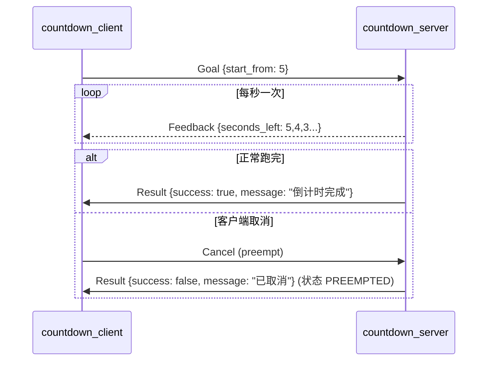

# 04 Action 通信

## 目标

- 理解为什么话题和服务都不适合"长任务"，Action 解决了什么问题
- 会写 `.action` 文件（以 `Countdown.action` 为例），掌握三段结构
- 读懂 `SimpleActionServer` / `SimpleActionClient` 的用法
- 会演示并理解 preempt（取消）机制
- 理解 Action 的底层实现——5 个话题

配套代码：[action_demo](https://github.com/Romindly-Dev/romindly_ros1_tutorials/tree/main/action_demo)、[romindly_msgs](https://github.com/Romindly-Dev/romindly_ros1_tutorials/tree/main/romindly_msgs)

## 原理简介

### 为什么需要 Action

设想"导航到 B 点"这类要跑几十秒的任务：

- 用**服务**：客户端会阻塞几十秒，期间既看不到进度，也无法取消
- 用**话题**：可以发指令、收进度，但目标与结果的对应关系、任务状态机都得自己造轮子

**Action = 长任务专用协议**：客户端发送目标 (Goal)，服务端周期性回传反馈 (Feedback)，结束时给出结果 (Result)；客户端可随时取消 (Preempt)，全程异步不阻塞。



### action 文件三段结构

[romindly_msgs/action/Countdown.action](https://github.com/Romindly-Dev/romindly_ros1_tutorials/blob/main/romindly_msgs/action/Countdown.action)：

```
# Goal: 从多少秒开始倒计时
int32 start_from
---
# Result: 是否正常完成
bool success
string message
---
# Feedback: 当前剩余秒数
int32 seconds_left
```

两个 `---` 把文件分为 **Goal / Result / Feedback** 三段。编译时由 `actionlib_msgs` 配合生成 7 个消息类型（`CountdownAction`、`CountdownGoal`、`CountdownResult`、`CountdownFeedback` 及带任务 ID 包装的 `ActionGoal/ActionResult/ActionFeedback`）。生成配置见 [romindly_msgs/CMakeLists.txt](https://github.com/Romindly-Dev/romindly_ros1_tutorials/blob/main/romindly_msgs/CMakeLists.txt) 中的 `add_action_files` 与 `actionlib_msgs` 依赖。

### 底层其实是 5 个话题

Action 不是新的传输机制，而是**架在 5 个话题上的协议层**：`goal`、`cancel`（客户端→服务端），`status`、`feedback`、`result`（服务端→客户端）。`actionlib` 库把这 5 个话题封装成状态机，你只面对 send_goal / feedback / result 的干净接口。

## 运行示例

默认已完成 `cd ~/ws_romindly && catkin_make && source devel/setup.bash`。

```bash
# 终端 1
roscore
```

```bash
# 终端 2：Action 服务端
rosrun action_demo countdown_server.py
```

```bash
# 终端 3：客户端，从 5 开始倒计时
rosrun action_demo countdown_client.py 5
```

客户端预期输出：

```
[INFO] [...]: 等待 countdown 动作服务...
[INFO] [...]: 目标已发送: 从 5 开始倒计时
[INFO] [...]: 反馈: 剩余 5 秒
[INFO] [...]: 反馈: 剩余 4 秒
[INFO] [...]: 反馈: 剩余 3 秒
[INFO] [...]: 反馈: 剩余 2 秒
[INFO] [...]: 反馈: 剩余 1 秒
[INFO] [...]: 结果: success=True message=倒计时完成
```

### 观察底层的 5 个话题

服务端运行时执行：

```bash
rostopic list | grep countdown
```

预期输出：

```
/countdown/cancel
/countdown/feedback
/countdown/goal
/countdown/result
/countdown/status
```

还可以直接偷看反馈流：`rostopic echo /countdown/feedback`。

### 演示取消 (preempt)

方式一：客户端跑长倒计时，中途 **Ctrl+C 杀掉客户端**——`SimpleActionClient` 析构时不会主动取消，但重新发一个新目标会抢占旧目标：

```bash
rosrun action_demo countdown_client.py 30   # 让它跑着
# 另开终端再发一个新目标，SimpleActionServer 只服务一个目标，旧目标被 preempt
rosrun action_demo countdown_client.py 5
```

服务端会打印 `倒计时被取消`，随后开始执行新目标。

方式二：直接向 cancel 话题发一条空消息，取消当前所有目标：

```bash
rosrun action_demo countdown_client.py 30   # 让它跑着
rostopic pub -1 /countdown/cancel actionlib_msgs/GoalID -- {}
```

服务端打印 `倒计时被取消`；客户端收到 Result：`success=False message=已取消`。

## 代码讲解

### 服务端 [action_demo/scripts/countdown_server.py](https://github.com/Romindly-Dev/romindly_ros1_tutorials/blob/main/action_demo/scripts/countdown_server.py)

```python
self._server = actionlib.SimpleActionServer(
    "countdown",
    CountdownAction,
    execute_cb=self.execute_cb,
    auto_start=False,
)
self._server.start()
```

- `SimpleActionServer`：一次只处理一个目标的简化服务端；新目标到来会自动 preempt 旧目标
- 类型传的是 `CountdownAction`（总类型），不是 Goal/Result
- **`auto_start=False` 后手动 `start()` 是官方强制写法**——构造即启动存在竞态风险，actionlib 会打警告

```python
def execute_cb(self, goal):
    if goal.start_from <= 0:
        self._server.set_aborted(
            CountdownResult(success=False, message="start_from 必须为正数"))
        return

    for seconds_left in range(goal.start_from, 0, -1):
        if self._server.is_preempt_requested() or rospy.is_shutdown():
            self._server.set_preempted(
                CountdownResult(success=False, message="已取消"))
            return
        self._server.publish_feedback(
            CountdownFeedback(seconds_left=seconds_left))
        rate.sleep()

    self._server.set_succeeded(
        CountdownResult(success=True, message="倒计时完成"))
```

execute 回调必须以**三种终态之一**收尾，对应任务状态机：

| 调用 | 终态 | 含义 |
|---|---|---|
| `set_succeeded(result)` | SUCCEEDED | 正常完成 |
| `set_preempted(result)` | PREEMPTED | 响应取消请求而终止 |
| `set_aborted(result)` | ABORTED | 服务端自身判定失败（如参数非法） |

取消是**协作式**的：actionlib 不会强杀你的回调，服务端必须在循环里主动轮询 `is_preempt_requested()` 并尽快退出——这也是长任务代码要写成"小步循环"的原因。

### 客户端 [action_demo/scripts/countdown_client.py](https://github.com/Romindly-Dev/romindly_ros1_tutorials/blob/main/action_demo/scripts/countdown_client.py)

```python
client = actionlib.SimpleActionClient("countdown", CountdownAction)
if not client.wait_for_server(rospy.Duration(5.0)):
    rospy.logerr("等待服务超时，请先启动 countdown_server.py")
    sys.exit(1)

client.send_goal(CountdownGoal(start_from=start_from), feedback_cb=feedback_cb)
client.wait_for_result()
result = client.get_result()
```

- `wait_for_server(timeout)`：与服务客户端的 `wait_for_service` 同理，超时返回 False
- `send_goal` 立即返回（异步），`feedback_cb` 在每条反馈到达时被调用
- 示例里 `wait_for_result()` 阻塞等结果是为了演示简单；实际应用中可以不等，靠 `done_cb` 回调拿结果，主线程继续干别的
- 想主动取消可调用 `client.cancel_goal()`（练习 2 会用到）

## 动手练习

1. 修改 [countdown_server.py](https://github.com/Romindly-Dev/romindly_ros1_tutorials/blob/main/action_demo/scripts/countdown_server.py)：在 `Countdown.action` 的 Goal 段加一个 `float32 interval` 字段（每步间隔秒数），服务端用 `rospy.Rate(1.0 / goal.interval)` 控制节奏。改 `.action` 后记得重新 `catkin_make`。
2. 修改 [countdown_client.py](https://github.com/Romindly-Dev/romindly_ros1_tutorials/blob/main/action_demo/scripts/countdown_client.py)：发送目标后 `rospy.sleep(3.0)`，然后调用 `client.cancel_goal()`，再 `wait_for_result()`，观察拿到的 result 与 `client.get_state()`（对照 `actionlib.GoalStatus.PREEMPTED`）。

## 常见问题

**Q1: 客户端报 `等待服务超时`？**
服务端未启动，或 Action 名不一致（客户端与服务端第一个参数都必须是 `countdown`）。`rostopic list | grep countdown` 看 5 个话题在不在。

**Q2: 服务端警告 `You've passed in true for auto_start ... you should always pass in false`？**
构造 `SimpleActionServer` 时没传 `auto_start=False`。按示例写法：先 `auto_start=False`，再显式 `start()`。

**Q3: 发了 cancel 服务端却停不下来？**
execute 回调里没有轮询 `is_preempt_requested()`，或者一步 sleep 太久没机会检查。把长任务拆成小步循环，每步都检查一次。

**Q4: 一条反馈都收不到？**
反馈频率取决于服务端 `publish_feedback` 的调用频率（本例 1 Hz）。另外确认 `feedback_cb` 是通过 `send_goal(..., feedback_cb=...)` 挂上的。

**Q5: 第二个客户端发目标，第一个客户端的任务怎么没了？**
这是 `SimpleActionServer` 的设计：**同一时刻只服务一个目标**，新目标自动抢占旧目标。需要并发处理多目标时使用底层的 `ActionServer` 类自行管理目标句柄。
