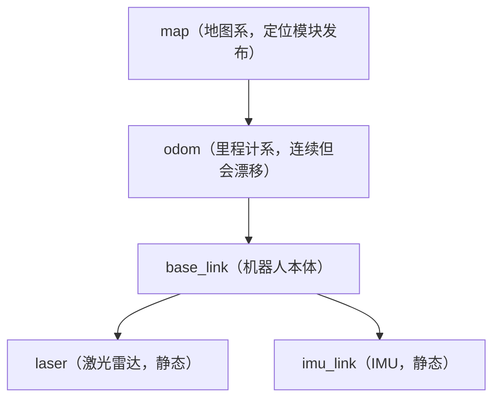

# 06 TF2 坐标变换

## 目标

- 理解为什么机器人系统需要 TF，以及 TF 树的组织方式
- 会写动态 TF 广播（含四元数的基本用法）与静态变换
- 会用 `lookup_transform` 查询任意两个坐标系间的变换，并正确处理三类异常
- 掌握 `view_frames`、`tf2_echo`、RViz 三种 TF 调试手段

配套示例包：[tf2_demo](https://github.com/Romindly-Dev/romindly_ros1_tutorials/tree/main/tf2_demo)

## 原理简介

### 为什么需要 TF

激光雷达报告"前方 3m 有障碍物"，是在**雷达自己的坐标系**（`laser`）下说的；导航要判断障碍物在地图上的位置，需要**地图坐标系**（`map`）下的坐标。机器人上每个传感器、每个部件都有自己的坐标系，把一个点从 A 系换算到 B 系涉及一连串平移和旋转——手工维护这些矩阵乘法既繁琐又易错。

TF（Transform）系统的做法：每个组件只负责广播"我和父坐标系之间的变换"，TF 库把所有变换组织成一棵**树**，任意两个系之间的变换由库自动沿树链式求解，并且**带时间戳缓存**（默认 10 秒），可以查询"0.5 秒前 laser 在 odom 下的位姿"。ROS1 中现行实现是 **tf2**（`tf2_ros` 包），旧的 `tf` 包已不推荐使用。

### TF 树与典型层级

TF 树的硬性规则：**每个坐标系只能有一个父系**（否则成环/多父，树就断了）。移动机器人的典型层级：



- `odom → base_link`：由里程计/底盘驱动**动态**广播，短期平滑但长期漂移
- `map → odom`：由定位模块（如 AMCL）发布，用于修正漂移
- `base_link → laser`：传感器安装位置固定，用**静态变换**广播一次即可

本示例实现了其中两段：动态的 `odom → base_link`（模拟圆周运动）和静态的 `base_link → laser`。

## 运行示例

```bash
cd ~/ws_romindly && catkin_make && source devel/setup.bash
roslaunch tf2_demo tf2_demo.launch
```

预期输出（每秒一行，坐标随圆周运动变化）：

```
[WARN] [...]: TF 查询失败: "odom" passed to lookupTransform argument target_frame does not exist.
[INFO] [...]: laser 在 odom 系下: x=2.19 y=0.11 z=0.10
[INFO] [...]: laser 在 odom 系下: x=2.11 y=0.68 z=0.10
[INFO] [...]: laser 在 odom 系下: x=1.93 y=1.22 z=0.10
```

启动最初一两秒出现 WARN 是**正常现象**：listener 的缓存还没收到足够的变换数据。之后 x/y 应在半径约 2m 的圆周附近变化，z 恒为 0.10（激光的静态安装高度）。

三个调试工具（另开终端）：

```bash
# 1. 生成 TF 树 PDF：odom → base_link → laser
rosrun tf2_tools view_frames.py && evince frames.pdf

# 2. 实时打印任意两系间的变换
rosrun tf2_ros tf2_echo odom laser

# 3. RViz 可视化：Fixed Frame 选 odom，Add → TF
rviz
```

`tf2_echo` 会持续打印 Translation / Rotation（四元数与 RPY 两种表示），是排查"变换到底对不对"的第一工具。

## 代码讲解

### 动态广播：dynamic_broadcaster.py

文件：[tf2_demo/scripts/dynamic_broadcaster.py](https://github.com/Romindly-Dev/romindly_ros1_tutorials/blob/main/tf2_demo/scripts/dynamic_broadcaster.py)

```python
broadcaster = tf2_ros.TransformBroadcaster()
rate = rospy.Rate(20)  # 20 Hz
```

`TransformBroadcaster` 底层就是往 `/tf` 话题发 `TFMessage`。动态变换必须**持续以固定频率发送**（这里 20Hz），停发超过缓存时间后查询就会失败。

```python
tfs = TransformStamped()
tfs.header.stamp = rospy.Time.now()
tfs.header.frame_id = "odom"        # 父坐标系
tfs.child_frame_id = "base_link"    # 子坐标系
```

`TransformStamped` 三要素：时间戳（必须填当前时间，TF 靠它做时间插值）、父系 `frame_id`、子系 `child_frame_id`。方向别搞反：这条消息表达的是"**base_link 在 odom 系下的位姿**"。

```python
tfs.transform.translation.x = radius * math.cos(theta)
tfs.transform.translation.y = radius * math.sin(theta)

yaw = theta + math.pi / 2.0
tfs.transform.rotation.z = math.sin(yaw / 2.0)
tfs.transform.rotation.w = math.cos(yaw / 2.0)
```

平移部分是标准圆周运动参数方程。旋转部分用**四元数**表示：ROS 中所有姿态都用四元数 (x, y, z, w)，避免欧拉角的万向锁问题。对于平面机器人只绕 z 轴转，四元数退化为 `z=sin(yaw/2), w=cos(yaw/2)`，可以手写；一般情形请用 `tf_conversions` 或 `tf.transformations.quaternion_from_euler`。`yaw = theta + 90°` 让车头始终指向圆周切线方向，即"沿着圆在开"。

### 静态变换：static_transform_publisher

文件：[tf2_demo/launch/tf2_demo.launch](https://github.com/Romindly-Dev/romindly_ros1_tutorials/blob/main/tf2_demo/launch/tf2_demo.launch)

```xml
<node pkg="tf2_ros" type="static_transform_publisher" name="laser_static_tf"
      args="0.2 0 0.1 0 0 0 base_link laser"/>
```

传感器安装位置不会变，用 `tf2_ros` 自带的 `static_transform_publisher` 发一次到 `/tf_static`（latched，新订阅者也能收到）即可，无需自己写节点。**参数顺序必须记牢**：

```
x y z yaw pitch roll parent_frame child_frame
```

即先平移（米）、后旋转，且旋转是 **yaw pitch roll 的顺序（不是 roll pitch yaw！）**，单位弧度。这里表示 laser 安装在 base_link 前方 0.2m、上方 0.1m，无旋转。它还支持 9 参数形式（旋转用四元数 x y z w），实际项目里传感器外参标定结果常用这种。

### 查询与异常处理：frame_listener.py

文件：[tf2_demo/scripts/frame_listener.py](https://github.com/Romindly-Dev/romindly_ros1_tutorials/blob/main/tf2_demo/scripts/frame_listener.py)

```python
buf = tf2_ros.Buffer()
tf2_ros.TransformListener(buf)
```

`Buffer` 是本地的 TF 树缓存，`TransformListener` 订阅 `/tf` 与 `/tf_static` 往里填数据。两者要在节点里**尽早创建**并保持存活——刚创建时缓存是空的，查询必然失败。

```python
tfs = buf.lookup_transform("odom", "laser", rospy.Time(0))
```

`lookup_transform(target, source, time)`：查询 source 系在 target 系下的位姿。时间填 `rospy.Time(0)` 表示"取最新可用的变换"，是最常用也最稳妥的写法；填 `rospy.Time.now()` 反而容易因数据未到而超时。注意 `odom → laser` 并没有被任何节点直接广播，TF 沿 `odom → base_link → laser` **自动链式合成**——这正是 TF 树的价值。

```python
except (
    tf2_ros.LookupException,
    tf2_ros.ConnectivityException,
    tf2_ros.ExtrapolationException,
) as exc:
    rospy.logwarn("TF 查询失败: %s", exc)
```

三类异常必须捕获，含义各不相同：

| 异常 | 触发场景 |
|---|---|
| `LookupException` | 坐标系不存在（还没广播、frame 名拼错） |
| `ConnectivityException` | 两个系都存在但不在同一棵树上（中间断链） |
| `ExtrapolationException` | 请求的时间点超出缓存范围（数据太旧或"未来"时间） |

不捕获的话，启动瞬间必然抛异常崩节点。

## 动手练习

1. 修改 `dynamic_broadcaster.py`，把 `radius` 改为 3.0、`angular_speed` 改为 1.0，用 `rosrun tf2_ros tf2_echo odom base_link` 验证平移量在 ±3m 范围内变化、转一圈耗时约 6.28 秒。
2. 在 `tf2_demo.launch` 中仿照 `laser_static_tf` 增加一个 `imu_link`：安装在 base_link 正上方 0.05m、无旋转。用 `view_frames.py` 确认 TF 树多出一个分支，再把 `frame_listener.py` 的查询目标从 `laser` 改为 `imu_link` 验证。

## 常见问题

**Q: 启动后一直刷 `LookupException: "odom" does not exist`？**
若只持续 1~2 秒属正常（缓存未填充）；若一直报，用 `rostopic hz /tf` 确认广播节点在发数据，再检查 frame 名拼写（TF 对大小写敏感，且 tf2 中 frame 名**不要带前导 `/`**）。

**Q: `view_frames.py` 提示找不到？**
Noetic 中脚本名为 `view_frames.py`（老教程写 `view_frames`）。未安装则 `sudo apt install ros-noetic-tf2-tools`。

**Q: RViz 里模型/TF 全部不显示，状态栏报 `Fixed Frame [map] does not exist`？**
本示例没有 map 系，把左侧 Global Options → Fixed Frame 改为 `odom`。

**Q: 静态变换的旋转参数填了没效果或方向不对？**
九成是把参数顺序当成 roll pitch yaw 了——`static_transform_publisher` 的顺序是 **yaw pitch roll**。改完用 `tf2_echo` 核对 RPY 输出。

**Q: 动态广播和静态广播能对同一对 frame 混用吗？**
不能。同一个 child frame 只能有一个父系、一种广播来源，否则 TF 树抖动，RViz 中表现为模型闪烁。
