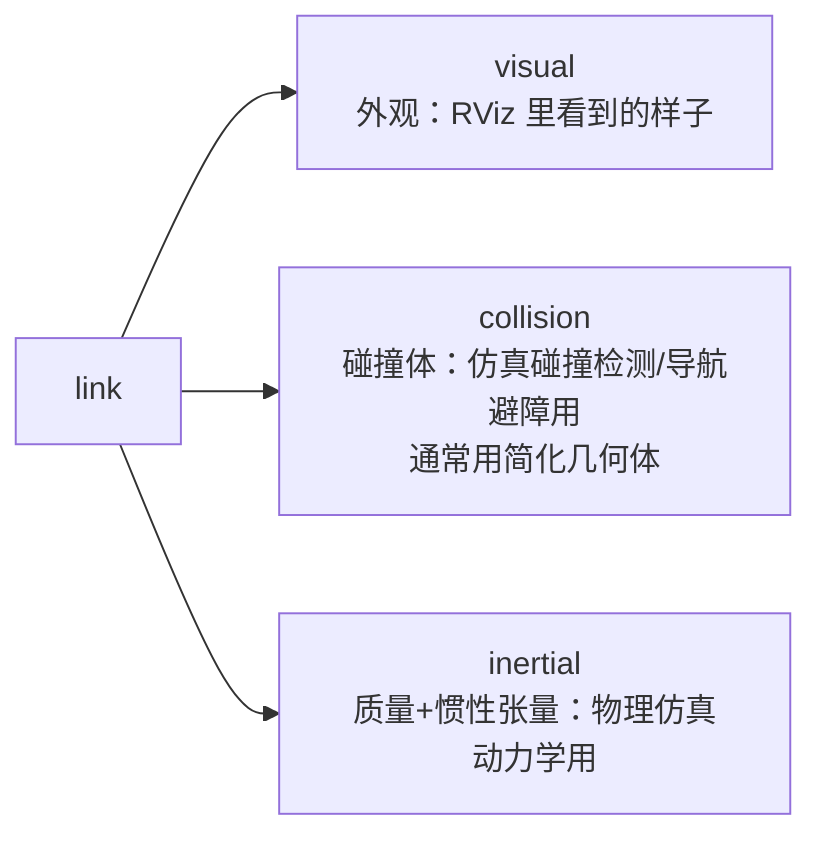

# 07 URDF 机器人建模

> English version: [07_urdf_modeling.md](../en/10_ros1_basics/07_urdf_modeling.md)

## 目标

- 理解 URDF 的 link/joint 模型与常用 joint 类型
- 掌握 link 的 visual/collision/inertial 三要素各自的用途
- 会用 xacro 的 property、macro 和数学表达式消除重复代码
- 理解 `robot_state_publisher` 与 `joint_state_publisher` 的分工，会在 RViz 中查看模型

配套示例包：[urdf_demo](https://github.com/Romindly-Dev/romindly_ros1_tutorials/tree/main/urdf_demo)

## 原理简介

### link 与 joint

URDF（Unified Robot Description Format）用 XML 把机器人描述成**刚体（link）+ 关节（joint）组成的树**：link 是有形状、质量的部件，joint 定义两个 link 之间的连接方式和相对位姿。和 TF 树一样，每个 link 只能有一个父 link。

常用 joint 类型：

| 类型 | 运动方式 | 典型用途 |
|---|---|---|
| `fixed` | 不动 | 传感器安装、虚拟系连接 |
| `continuous` | 绕轴无限旋转 | 驱动轮 |
| `revolute` | 绕轴有限旋转（带 limit） | 机械臂关节、云台 |
| `prismatic` | 沿轴平移（带 limit） | 升降机构 |
| `floating` / `planar` | 6 自由度 / 平面 3 自由度 | 少用 |

### link 三要素



只在 RViz 看模型的话有 visual 就够；但 **Gazebo 仿真中 collision 决定"撞不撞得到"、inertial 决定"推起来像不像真车"**——缺 inertial 的 link 在 Gazebo 里会被忽略或乱飞。本示例三要素齐全，正是为后续仿真章节做准备。

### 为什么用 xacro

纯 URDF 不支持变量和复用：左右轮除了 y 坐标符号相反，其余几十行完全一样，改个轮径要改四五处。xacro（XML macro）在 URDF 之上增加了**属性（property）、宏（macro）、数学表达式和条件**，编译期展开成纯 URDF。

### base_footprint 与 base_link 惯例

- `base_link`：机器人本体系，一般放在车体几何中心，**离地有高度**
- `base_footprint`：`base_link` 在地面上的**投影虚拟系**（z=0，无形状），导航栈（代价地图、AMCL）默认以它为机器人基准系，因为平面导航假设机器人贴地

两者用一个 fixed joint 连接，z 偏移即车体中心离地高度。

## 运行示例

```bash
cd ~/ws_romindly && catkin_make && source devel/setup.bash
roslaunch urdf_demo display.launch
```

预期效果：

- 弹出 RViz，显示蓝色车体、两个黑色驱动轮、前部黑色支撑球、顶部红色激光雷达的差速小车
- 同时弹出 `joint_state_publisher_gui` 小窗口，有 `left_wheel_joint`、`right_wheel_joint` 两根滑条
- **拖动滑条，RViz 里对应车轮跟着转动**——这就是"关节状态 → TF → 模型姿态"整条链路在工作

命令行验证：

```bash
# 单独检查 xacro 能否正确展开为 URDF（排错第一步）
xacro $(rospack find urdf_demo)/urdf/diff_robot.urdf.xacro

# 查看关节状态话题（拖滑条时 position 会变）
rostopic echo /joint_states -n 1

# 查看 TF 树：base_footprint → base_link → {left_wheel, right_wheel, caster, laser}
rosrun tf2_tools view_frames.py && evince frames.pdf
```

## 代码讲解

### diff_robot.urdf.xacro

文件：[urdf_demo/urdf/diff_robot.urdf.xacro](https://github.com/Romindly-Dev/romindly_ros1_tutorials/blob/main/urdf_demo/urdf/diff_robot.urdf.xacro)

**property：整车尺寸集中定义**

```xml
<robot name="diff_robot" xmlns:xacro="http://www.ros.org/wiki/xacro">
  <xacro:property name="base_length" value="0.40"/>
  <xacro:property name="wheel_radius" value="0.08"/>
  <xacro:property name="wheel_separation" value="0.34"/>
```

根标签必须声明 `xmlns:xacro` 命名空间，否则 xacro 指令不被识别。property 用 `${名字}` 引用，`${}` 内支持四则运算——所有尺寸只在文件头定义一次，改轮径全车自动联动。

**base_footprint 与 base_link 的连接**

```xml
<link name="base_footprint"/>

<joint name="base_joint" type="fixed">
  <parent link="base_footprint"/>
  <child link="base_link"/>
  <origin xyz="0 0 ${wheel_radius}" rpy="0 0 0"/>
</joint>
```

`base_footprint` 是空 link（无 visual/collision/inertial），仅作坐标系。z 偏移 `${wheel_radius}` 的含义：轮子着地时车体中心离地正好一个轮半径。

**drive_wheel 宏：一份代码实例化左右轮**

```xml
<xacro:macro name="drive_wheel" params="prefix y_offset">
  <link name="${prefix}_wheel">
    <visual>
      <origin xyz="0 0 0" rpy="${M_PI/2} 0 0"/>
      <geometry>
        <cylinder radius="${wheel_radius}" length="${wheel_width}"/>
      </geometry>
      ...
  <joint name="${prefix}_wheel_joint" type="continuous">
    <parent link="base_link"/>
    <child link="${prefix}_wheel"/>
    <origin xyz="0 ${y_offset} ${-wheel_radius/2}" rpy="0 0 0"/>
    <axis xyz="0 1 0"/>
  </joint>
</xacro:macro>

<xacro:drive_wheel prefix="left"  y_offset="${wheel_separation/2}"/>
<xacro:drive_wheel prefix="right" y_offset="${-wheel_separation/2}"/>
```

逐点说明：

- `params="prefix y_offset"`：宏的形参。调用两次，分别生成 `left_wheel`/`right_wheel` 两组 link+joint，y 偏移一正一负（`${wheel_separation/2}` 与 `${-wheel_separation/2}`，数学表达式直接写在属性里）
- visual 里 `rpy="${M_PI/2} 0 0"`：URDF 的圆柱默认轴线沿 z，绕 x 转 90° 后轴线沿 y——即车轮的旋转轴方向。注意这个 origin 只旋转**几何体外观**，不影响关节
- joint 类型 `continuous`（无限旋转），`<axis xyz="0 1 0"/>` 指定绕本 link 的 y 轴转
- collision 用与 visual 相同的圆柱；inertial 给了简化的质量与惯性张量，数值不精确但量级合理，足够 Gazebo 起步

**其余部件**：caster（万向轮简化为 fixed joint + 球体，位于车体前下方）和 laser（fixed joint，装在车顶前部 `xyz="0.1 0 ${base_height/2 + 0.02}"`）结构类似，不再展开。laser link 的名字与 [06 TF2 章节](06_TF2坐标变换.md) 中静态变换的 `laser` 系是同一个惯例。

### display.launch：可视化链路

文件：[urdf_demo/launch/display.launch](https://github.com/Romindly-Dev/romindly_ros1_tutorials/blob/main/urdf_demo/launch/display.launch)

```xml
<param name="robot_description"
       command="$(find xacro)/xacro $(find urdf_demo)/urdf/diff_robot.urdf.xacro"/>
```

`<param command=...>` 把命令的**标准输出**存进参数：即先运行 xacro 展开，再把纯 URDF 文本写入全局参数 `robot_description`——这是 ROS 生态约定的模型参数名，RViz、Gazebo、MoveIt 都从这里读模型。

```xml
<node pkg="robot_state_publisher" type="robot_state_publisher" name="robot_state_publisher"/>
<node pkg="joint_state_publisher_gui" type="joint_state_publisher_gui" name="joint_state_publisher_gui"/>
```

两个节点分工明确，缺一不可：

- `joint_state_publisher_gui`：从 `robot_description` 找出所有**可动关节**，用滑条发布 `/joint_states`（`sensor_msgs/JointState`，各关节角度）。真机上这个角色由底盘驱动/编码器节点承担
- `robot_state_publisher`：读 `robot_description` + 订阅 `/joint_states`，做正运动学解算，把每对 link 间的变换**发布成 TF**（fixed joint 发到 `/tf_static`，可动 joint 发到 `/tf`）

RViz 的 RobotModel 显示项只负责按 TF 摆放各 link 的 visual——所以"滑条 → /joint_states → robot_state_publisher → TF → RViz 里轮子转"。

## 动手练习

1. 把 `wheel_radius` 从 0.08 改为 0.12，重新 `roslaunch urdf_demo display.launch`，观察车轮变大且车体离地高度自动抬高（因为 `base_joint` 的 z 偏移引用了同一 property）——体会集中定义参数的好处。
2. 仿照 laser 给车尾加一个 `camera_link`：绿色小方块（`box size="0.03 0.08 0.03"`，需新增一个 material），fixed joint 装在 `xyz="${-base_length/2} 0 0"` 处。用 RViz 确认位置，并思考：为什么它不会出现在 joint_state_publisher_gui 的滑条里？（提示：fixed joint 没有自由度）

## 常见问题

**Q: RViz 里模型全白且报 `No transform from [xxx] to [base_footprint]`？**
`/joint_states` 没发出来（joint_state_publisher_gui 没启动或被关掉），robot_state_publisher 算不出可动关节的 TF。确认 GUI 窗口存在；无图形环境可改用无 GUI 的 `joint_state_publisher`。

**Q: roslaunch 直接报 xacro 解析错误？**
先单独运行 `xacro <文件路径>` 看具体报错行。高频错误：`${}` 里引用了未定义的 property、macro 调用时漏传 params、根标签缺 `xmlns:xacro` 声明。

**Q: visual 和 collision 一定要一样吗？**
不需要。visual 可以用精细 mesh 追求好看，collision 应该用**尽量简单**的几何体（box/cylinder/sphere）——仿真和导航的碰撞检测开销与 collision 复杂度直接相关。

**Q: inertial 数值随便填行不行？**
RViz 无所谓（根本不用它），但 Gazebo 里质量/惯性不合理的模型会抖动、翻车甚至飞出地图。粗略做法：按均匀密度几何体的惯性公式估算，保证量级正确。下一章仿真会回到这个话题。

**Q: 关掉 RViz 后整个 launch 都退出了？**
`display.launch` 里 rviz 节点带 `required="true"`，它退出即终止整个 launch——这是演示场景的有意设计。
