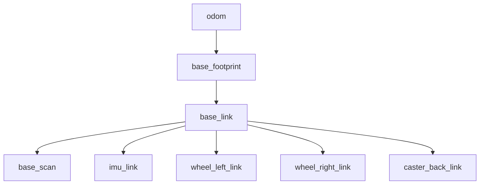
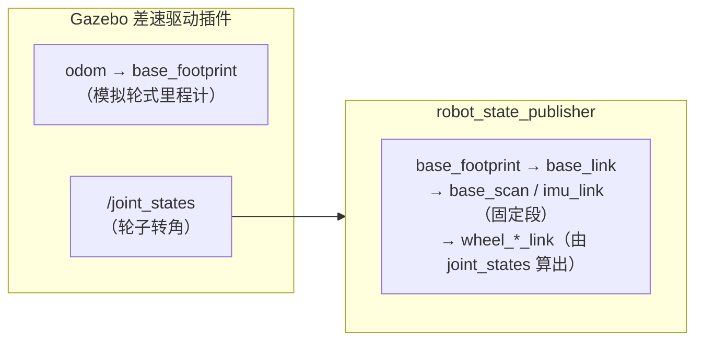

# 03 仿真中的 TF 树与传感器

## 目标

- 用 `view_frames` 导出仿真环境的完整 TF 树，逐层看懂 `odom → base_footprint → base_link → base_scan` 各段的含义
- 分清 `robot_state_publisher` 与 Gazebo 插件各自发布哪一段 TF——这是排查实机 TF 问题的思维模型
- 理解 `/clock` 与 `use_sim_time` 在仿真中的角色（回扣 [08 rosbag 篇](../10_ROS1基础/08_rosbag与调试工具.md)）
- 明确 20 章建图算法对输入的要求：`/scan` + 一棵完好的 `odom → base` TF

## 原理简介

[06 TF2 篇](../10_ROS1基础/06_TF2坐标变换.md)里我们手写过 `odom → base_link → laser` 的迷你 TF 树；TB3 仿真给出的是一棵**真实项目规格**的树。上一篇看到 `/scan` 的数据挂在 `base_scan` 系、`/odom` 描述的是 `base_footprint` 在 `odom` 系下的位姿——把传感器数据、里程计、机器人结构串成一个整体的，就是这棵 TF 树。建图算法（gmapping、cartographer）的工作本质是：**沿 TF 链把每一帧 `/scan` 从 `base_scan` 换算到 `odom` 系，再拼接成图**。TF 断一段，建图就废——所以进入 20 章前必须把这棵树看明白。

## 分步操作

### 第 1 步：导出 TF 树

终端 1 启动仿真，终端 2：

```bash
cd ~/ws_romindly
rosrun tf2_tools view_frames.py && evince frames.pdf
```

预期输出：

```
Listening to tf data during 5 seconds...
Generating graph in frames.pdf file...
```

打开的 PDF 应是这样一棵树（每个节点框内还标注了发布频率和发布者）：



### 第 2 步：逐层理解

| 变换段 | 含义 | 动/静 |
| --- | --- | --- |
| `odom → base_footprint` | 里程计：机器人从上电原点走到了哪。数值上与 `/odom` 话题的 pose 一致 | 动态（约 30 Hz） |
| `base_footprint → base_link` | footprint 是机器人在**地面上的投影**（z=0），base_link 是**底盘几何中心**（有高度）。两者只差一个固定的 z 平移 | 固定 |
| `base_link → base_scan` | 激光雷达安装位置（burger 上约位于中轴、离地 0.17 m） | 固定 |
| `base_link → imu_link` | IMU 安装位置 | 固定 |
| `base_link → wheel_left/right_link` | 两个驱动轮。注意它是**动态**的——轮子在转，转角来自 `/joint_states` | 动态 |

为什么要多一层 `base_footprint`？2D 建图和导航都在平面上算，用一个"贴地"的参考系最方便；而 URDF 的物理中心 `base_link` 悬在半空。这是 REP-105（ROS 坐标系命名规范）推荐的标准分层，实机上也长这样。

用 `tf2_echo` 验证一段静态变换（另开终端）：

```bash
rosrun tf tf_echo base_link base_scan
```

预期（数值恒定不变，因为是固定安装）：

```
At time ...
- Translation: [-0.032, 0.000, 0.172]
- Rotation: in Quaternion [0.000, 0.000, 0.000, 1.000]
```

再看动态段 `rosrun tf tf_echo odom base_footprint`，遥控小车动一动，Translation 应实时跟着变。

### 第 3 步：谁在发布哪段 TF

看 frames.pdf 里每段变换的 `Broadcaster` 字段，会发现整棵树由**两个来源**拼成：



- **`robot_state_publisher`**：[07 URDF 篇](../10_ROS1基础/07_URDF机器人建模.md)的老朋友。它读 URDF 得到所有**固定关节**的变换直接广播；对轮子这类**转动关节**，则订阅 `/joint_states` 拿到当前关节角再算出变换。它只负责"机器人身体内部"的 TF。
- **Gazebo 差速驱动插件**：扮演实机上"底盘驱动节点"的角色——积分轮速得到里程计，发布 `/odom` 话题 + `odom → base_footprint` 这段 TF，同时把轮子转角发到 `/joint_states` 供 robot_state_publisher 使用。

记住这个分工模型：**URDF 内部的 TF 归 robot_state_publisher，odom 到机器人的 TF 归底盘驱动**。将来实机上 TF 树断了，先看断的是哪段，就知道该查 URDF/robot_state_publisher 还是查底盘驱动节点。20 章建图会再往树顶加一段 `map → odom`（由建图/定位算法发布），届时整棵树就是 06 篇讲过的完整标准形态。

### 第 4 步：/clock 与 use_sim_time

08 篇讲 rosbag 回放时引入过仿真时钟；Gazebo 用的是**同一套机制**：

```bash
rosparam get /use_sim_time
# true
rostopic hz /clock
# average rate: ~1000
```

`turtlebot3_world.launch`（内部 include 的 `gazebo_ros` 启动文件）自动把 `/use_sim_time` 设为 `true`，Gazebo 以约 1 kHz 发布 `/clock`。此后所有节点的 `Time.now()` 读的都是**仿真时间**而非墙钟。这带来两个直接好处：

1. **TF 时间戳自洽**：所有 TF 和传感器消息都盖仿真时间戳，仿真卡顿（RTF < 1）时时间一起变慢，不会出现"数据比时钟旧"的错乱。
2. **暂停即冻结**：点 Gazebo 底部的暂停按钮，`/clock` 停发，全系统时间静止——试试暂停后运行 `rostopic echo /clock -n 1`，再恢复。

**坑**：如果先启动了仿真（`/use_sim_time` 已是 true），又想单独跑一个不属于仿真的节点（比如另拉一个 roscore 场景混用），节点会因等不到 `/clock` 而"时间为 0"卡死——与 08 篇 rosbag 回放"只开一半"的症状一模一样，排查思路相同：`rosparam get /use_sim_time` 和 `rostopic hz /clock` 两条命令对上号。

## 讲解：为下一章铺路

到这里，建图算法需要的两样输入在仿真里已全部就绪：

- **`/scan`**：360 束激光测距（上一篇已会读）
- **TF `odom → base_footprint → ... → base_scan`**：告诉算法"每帧激光是在哪个位姿下打出来的"

20 章启动 gmapping 时你会看到它的参数就是 `odom_frame`、`base_frame`、`scan` 话题名——现在你已经知道这些名字在 TF 树/话题列表里对应什么，调参和排错就有了地图。

## 动手练习

1. 用 `rosnode info /robot_state_publisher` 确认它订阅了 `/joint_states`、发布了 `/tf` 和 `/tf_static`；再 `rostopic echo -n 1 /tf_static` 看静态段是不是一次性广播（回忆 06 篇 static transform 的机制）。
2. 遥控小车原地旋转（只按 `a`），同时 `rosrun tf tf_echo odom base_scan`，观察哪些分量在变、哪些不变，并解释原因。
3. 把 Gazebo 暂停 10 秒再恢复，期间观察 RViz 中 TF 显示是否报错、恢复后是否正常——理解"仿真时间冻结"对下游的影响。
4. （进阶）`TURTLEBOT3_MODEL=waffle` 重启仿真再导一次 frames.pdf，对比 burger 多了哪些 frame（提示：相机）。

## 常见问题

**Q1：`view_frames.py` 报 `No such file or directory`。**
Noetic 里该脚本在 `tf2_tools` 包且带 `.py` 后缀：`rosrun tf2_tools view_frames.py`。旧教程写的 `rosrun tf view_frames`（不带 .py）是 Melodic 及更早的用法。

**Q2：frames.pdf 里 `odom → base_footprint` 缺失。**
说明 Gazebo 的差速驱动插件没起来，通常是仿真本身启动失败（回看终端 1 的报错），或 gzserver 是残留的旧进程——`killall -9 gzserver gzclient` 后重启仿真。

**Q3：RViz 报 `Message removed because it is too old`。**
典型的时钟不同步症状：某节点在 `/use_sim_time=false` 的环境下启动，盖的是墙钟时间戳，与仿真时间对不上。保证所有节点都在仿真启动**之后**、同一个 ROS Master 下启动即可。

**Q4：想手动补一段 TF（比如临时挂一个虚拟传感器）怎么办？**
用 06 篇学过的静态广播：`rosrun tf2_ros static_transform_publisher x y z yaw pitch roll base_link my_sensor`。但**不要**给已有父系的 frame 再发一份变换——一个 frame 只能有一个父系，双发布会导致 TF 树抖动，这是实机联调常见事故。

本章完。下一章：[20 2D 建图](../20_2D建图/README.md)——用这套仿真环境跑通第一张地图。
