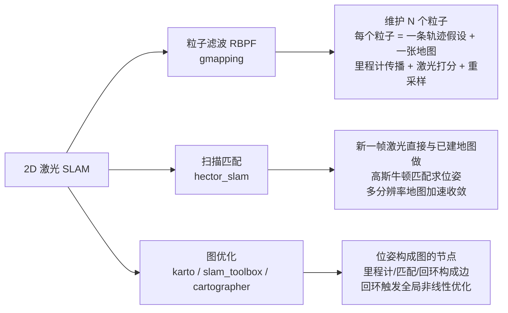
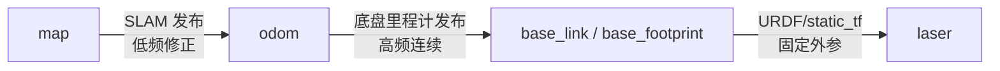

# 01 · 建图原理与方案选型

## 目标

- 理解占据栅格地图（Occupancy Grid Map）的数据表示与 `map.yaml` 各字段含义
- 用一句话说清 SLAM 问题，并能区分粒子滤波、扫描匹配、图优化三条技术路线
- 知道各建图方案对输入话题与 TF 的要求
- 能根据硬件条件与场景规模完成方案选型

## 原理简介

### 占据栅格地图

2D 建图的输出是一张占据栅格地图：把平面切成固定分辨率（如 5 cm）的格子，每个格子存一个"被障碍物占据的概率"。在 ROS 中通过 `nav_msgs/OccupancyGrid` 消息（话题 `/map`）发布，`data[]` 数组中每个格子取三种典型值：

| 值 | 含义 | 在 RViz / PGM 图中的颜色 |
| --- | --- | --- |
| `0` | 空闲（free），机器人可通行 | 白色 |
| `100` | 占据（occupied），有障碍物 | 黑色 |
| `-1` | 未知（unknown），激光从未覆盖 | 灰色 |

用 `map_server` 保存地图会得到两个文件：`map.pgm`（灰度图，像素即栅格）和 `map.yaml`（元信息）。`map.yaml` 字段：

```yaml
image: map.pgm            # 图像文件路径（相对 yaml 所在目录）
resolution: 0.050000      # 每像素对应的实际尺寸，单位 m/像素
origin: [-10.0, -10.0, 0.0]  # 图像左下角像素在 map 坐标系中的 [x, y, yaw]
negate: 0                 # 0=白色为空闲；1=颜色含义反转
occupied_thresh: 0.65     # 占据概率 > 0.65 判为占据（黑）
free_thresh: 0.196        # 占据概率 < 0.196 判为空闲（白）
```

`origin` 是最常被问到的字段：它决定了地图图像与 `map` 坐标系的对齐关系，导航时 AMCL/map_server 全靠它把像素坐标换算成世界坐标，手工裁剪 PGM 后必须同步修正 `origin`。

### SLAM 问题一句话定义

**SLAM（同步定位与建图）：机器人在未知环境中，仅凭自身传感器数据，同时估计"我在哪"（位姿）和"周围什么样"（地图）——两者互为前提，必须联合求解。**

### 三条技术路线



直观理解：

- **粒子滤波（gmapping）**：同时押注 N 种"我可能走过的路线"，每收到一帧激光就给所有假设打分，淘汰差的、复制好的。优点是框架简单、小场景稳定；缺点是历史无法修改——粒子一旦收敛到错误轨迹，地图错了就永远错了，且大场景需要更多粒子，内存和 CPU 随之膨胀。
- **扫描匹配（hector_slam）**：不做全局假设，每帧激光直接"对齐"到当前地图上，本质是把定位当成图像配准问题。不需要里程计，依赖高帧率雷达和丰富的环境几何特征；同样没有回环，误差只累积不修正。
- **图优化（slam_toolbox / cartographer）**：把每个历史位姿都保留为图节点，普通匹配和回环检测都只是往图里加约束边；检测到回环时对整张图做非线性最小二乘优化，**能回头修正历史轨迹**。这是大场景下唯一能把累积误差"拉回来"的路线，也是当前工业界主流。

### 建图对输入的要求

| 输入 | 类型 | gmapping | hector | slam_toolbox | cartographer |
| --- | --- | --- | --- | --- | --- |
| `/scan` | `sensor_msgs/LaserScan` | 必需 | 必需 | 必需 | 必需 |
| TF `odom → base_link` | 里程计 | 必需 | 不需要（可自发布） | 必需 | 可选（lua 中 `use_odometry`） |
| TF `base_link → 雷达 frame` | 外参 | 必需 | 必需 | 必需 | 必需（或 URDF） |
| IMU | `sensor_msgs/Imu` | 不用 | 可选 | 不用 | 2D 可选 / 3D 必需 |

所有算法都输出 TF `map → odom`（hector 无里程计时可配置为直接 `map → base_link` 或自己补发 `map → odom`）。为什么不直接发布 `map → base_link`？这是 ROS 的经典设计（REP 105）：TF 树中每个 frame 只能有一个父节点，`odom → base_link` 由底盘高频连续发布，SLAM 只负责低频修正 `map → odom` 这一段"漂移量"，两段叠加得到全局位姿：



建图前先用以下命令自检：

```bash
rostopic hz /scan                        # 确认激光帧率（TB3 仿真约 5 Hz）
rostopic echo -n1 /scan | head -20       # 确认 frame_id、range_min/max 合理
rosrun tf tf_echo odom base_footprint    # 确认里程计 TF 存在且随移动变化
rosrun rqt_tf_tree rqt_tf_tree           # 查看完整 TF 树是否连通
```

### 一张"好地图"的验收标准

建图不是跑完流程就算完成，交付前对照检查：

1. **墙体单线**：同一面墙在图上只有一条黑线，无重影、无双层；
2. **回环闭合**：绕场一圈回到起点，闭合处墙体对齐，错位小于 2–3 个栅格；
3. **直角是直角**：房间四角接近 90°，长走廊两侧平行不发散；
4. **无穿墙噪点**：墙外不应出现成片"空闲"区域（玻璃、镜面反射会造成）；
5. **可通行区域干净**：机器人走过的区域为白色，无莫名黑点（动态障碍残影）。

不满足时先排查硬件（里程计标定、雷达外参、时间同步），再考虑调算法参数——**80% 的地图问题根源在输入数据，不在 SLAM 参数**。

### 地图的加载与复用

建好的地图通过 `map_server` 重新发布，供定位与导航使用：

```bash
rosrun map_server map_server ~/maps/mymap.yaml
# 发布：/map (nav_msgs/OccupancyGrid, latched)、/map_metadata (nav_msgs/MapMetaData)
# 服务：/static_map (nav_msgs/GetMap)
```

预期输出：

```text
[ INFO] [...]: Loading map from image "/home/iot/maps/mymap.pgm"
[ INFO] [...]: Read a 384 X 384 map @ 0.050 m/cell
```

需要手工修图（擦除动态障碍残影、封住不允许通行的门）时，直接用 GIMP 打开 PGM 编辑：纯黑 (0) = 占据、纯白 (254/255) = 空闲、灰 (205) = 未知；只改像素不裁剪画布则 `map.yaml` 无需修改。

## 选型建议

| 你的条件 / 需求 | 推荐方案 | 理由 |
| --- | --- | --- |
| 教学入门、理解 SLAM 原理 | gmapping | 参数物理含义直观，粒子滤波是理解 SLAM 的经典起点 |
| 底盘无编码器 / 手持雷达扫图 | hector_slam | 唯一不需要里程计的方案 |
| 产品化部署、后续要做导航 | slam_toolbox | ROS 官方推荐（Nav2 默认），支持地图序列化续建与纯定位 |
| 超大场景（>5000 m²）、多传感器融合 | cartographer | 子图 + 分支定界回环，超大场景鲁棒性最好 |
| CPU 资源紧张的低成本控制器 | hector 或 gmapping（低粒子数） | 图优化后端有持续的后台计算开销 |

## 常见问题

**Q1：建图和定位是什么关系？**
建图阶段跑 SLAM 生成地图；部署阶段通常加载已有地图只做定位（AMCL 或 slam_toolbox localization 模式），见 [30_定位](../../30_定位/README.md)。SLAM 建图时自身也在定位，所以建好图后理论上可以一直跑 SLAM，但纯定位 CPU 开销小得多且地图不会被污染。

**Q2：为什么 RViz 里地图边缘有灰色区域？**
灰色 = `-1` 未知区域，激光没有扫到（被遮挡或超出量程）。属正常现象；导航时全局规划器默认不穿越未知区域（可配置）。

**Q3：分辨率选多少合适？**
室内导航通用 0.05 m。更细（0.025 m）地图更精致但内存与匹配开销约 4 倍；粗于 0.1 m 会导致窄门通道在代价地图中被"堵死"。

**Q4：2D 建图对雷达安装有什么要求？**
雷达必须水平安装且扫描平面内目标稳定（高度上避开桌面边缘等"时有时无"的物体）；`base_link → laser` 的 TF 必须准确，特别是 yaw 角，1° 的外参误差在 10 m 处就是 17 cm 的点云偏移。

**Q5：环境里有行人 / 叉车走动还能建图吗？**
可以但要讲究：动态物体会在图上留下黑色残影。对策是选人流少的时段建图、同一区域多扫几遍（概率更新会逐渐"洗掉"残影，hector 可调小 `update_factor_free` 加速）、最后用 GIMP 手工清理。大量持续动态障碍的场景优先选带概率更新和回环的方案（slam_toolbox / cartographer）。

**Q6：一定要用仿真练手吗？**
强烈建议。仿真里里程计和外参都是"完美"的，先在仿真中把流程和参数含义跑熟，实机出问题时才能区分"数据问题"和"参数问题"。本章所有实验都可先仿真后实机复现。

**Q7：像素坐标怎么换算成 map 坐标？**
读图程序常用。设图像高 H（像素），像素 (px, py)（左上角为原点、py 向下），则：

```text
x = origin[0] + px * resolution
y = origin[1] + (H - 1 - py) * resolution
```

注意 PGM 的 y 轴与 map 坐标系方向相反，这是自研工具读图时最常犯的错误。
