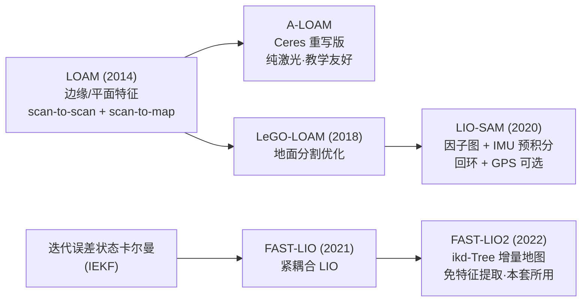

# 01 · 3D 激光 SLAM 概览与准备

## 目标

- 理解 3D 激光 SLAM 与 2D 建图的本质区别（地图形式、状态自由度、算力需求）
- 建立特征法（LOAM 系）与紧耦合直接法（LIO 系）的技术脉络
- 一次性装齐本章全部依赖（Ceres、GTSAM、Livox-SDK），编译通过四个仓库
- 准备好三套方案的公开演示数据集

## 一、2D vs 3D：不只是多了一个维度

| 维度 | 2D 激光 SLAM（20 章） | 3D 激光 SLAM（本章） |
| --- | --- | --- |
| 传感器 | 单线雷达（rplidar 等），一圈几千个点 | 多线机械式（VLP-16 等 16~128 线）或固态（Livox），每秒几十万点 |
| 地图形式 | 占据栅格（`nav_msgs/OccupancyGrid`，PGM 图片） | 三维点云地图（PCD 文件），可后处理为栅格/网格/八叉树 |
| 状态自由度 | 3 自由度（x, y, yaw），假设地面平整 | 6 自由度（x, y, z, roll, pitch, yaw），可处理坡道、颠簸、手持 |
| 运动畸变 | 一圈点少，常忽略 | 一帧 10 万点扫描期间载体在动，**必须去畸变**（靠 IMU 或匀速假设） |
| 算力 | 单核即可 | 点云配准 + 非线性优化，多核 x86 是起步配置 |

2D 方案里"雷达装歪了、过减速带地图糊掉"这类问题，正是 3 自由度假设失效的表现；3D SLAM 用完整的 6 自由度位姿从根本上解决它，代价是算力与传感器成本。

## 二、技术脉络：特征法与紧耦合



两条路线的核心差异：

- **特征法（LOAM 系）**：先从原始点云提取几何特征（边缘点、平面点），只用特征做配准，计算量可控；A-LOAM 是纯激光实现，LIO-SAM 在其特征前端之上加入 IMU 紧耦合与因子图后端。
- **直接法紧耦合（FAST-LIO2）**：跳过特征提取，把降采样后的原始点直接注册进增量式 kd 树（ikd-Tree），用迭代卡尔曼滤波把 IMU 与激光在状态层面融合，速度快、算力省。

"紧耦合"指 IMU 测量进入同一个状态估计问题（滤波器或因子图）与激光共同优化，而不是像 30 章 robot_localization 那样对两个独立里程计结果做松耦合融合。

## 三、点云基础

3D 雷达在 ROS 中的标准消息是 `sensor_msgs/PointCloud2`：一段二进制点数据加 `fields` 字段描述（每个点有哪些属性、什么类型、什么偏移）。用 `rostopic echo -n1 /velodyne_points --noarr` 可以只看头部与字段定义。常见字段：

| 字段 | 含义 | 谁需要它 |
| --- | --- | --- |
| `x, y, z` | 点坐标（米） | 所有方案 |
| `intensity` | 反射强度 | 可视化/特征辅助 |
| `ring` | 点所属的线号（0~N_SCAN-1） | **LIO-SAM 硬性要求** |
| `time` / `t` | 点相对帧头的时间戳 | **LIO-SAM/FAST-LIO 去畸变要求** |

PCL（Point Cloud Library）一句话：ROS 生态处理点云的标准 C++ 库（滤波、降采样、配准、KD 树都来自它），三套方案都依赖，随 `ros-noetic-desktop-full` 已装好，无需单独安装。

## 四、依赖安装总表

三套方案的额外依赖汇总如下，建议一次装齐：

| 依赖 | 被谁使用 | 安装方式 |
| --- | --- | --- |
| Ceres Solver 1.14 | A-LOAM（两级非线性优化） | apt 直装 |
| GTSAM 4.0 | LIO-SAM（因子图后端 iSAM2） | PPA 安装 |
| Livox-SDK + livox_ros_driver | FAST-LIO（Livox 雷达支持，编译必需） | 源码编译 + 随工作空间编译 |

### 4.1 Ceres（apt 直装即可）

Ubuntu 20.04 仓库自带 1.14 版，与 A-LOAM 兼容，无需源码编译：

```bash
sudo apt install libceres-dev
```

### 4.2 GTSAM（PPA 安装 4.0 系列）

```bash
sudo add-apt-repository ppa:borglab/gtsam-release-4.0
sudo apt update
sudo apt install libgtsam-dev libgtsam-unstable-dev
```

### 4.3 Livox-SDK（源码编译安装）

livox_ros_driver 依赖底层 SDK，SDK 需源码编译：

```bash
cd ~/workspace   # 任意源码目录，不要放进 catkin 工作空间
git clone https://github.com/Livox-SDK/Livox-SDK.git
cd Livox-SDK/build
cmake ..
make
sudo make install
```

SDK 装好后，`livox_ros_driver` 是普通 catkin 包，放在 `src/` 下随工作空间一起 `catkin_make` 即可（下一节统一编译）。

> 注意：FAST-LIO 的消息定义依赖 livox_ros_driver，**即使你只用 Velodyne 数据，也必须先编译出 livox_ros_driver**，否则 FAST_LIO 编译失败。

## 五、拉取仓库与编译

本章四个仓库均为 Romindly-Dev 组织的 fork（保持上游代码，便于统一维护），若你按 00 章脚本拉取过则已存在，缺哪个补哪个：

```bash
cd ~/ws_romindly/src
git clone -b devel  https://github.com/Romindly-Dev/A-LOAM.git
git clone -b master https://github.com/Romindly-Dev/LIO-SAM.git
git clone -b main --recursive https://github.com/Romindly-Dev/FAST_LIO.git   # 含 ikd-Tree 子模块，必须 --recursive
git clone -b master https://github.com/Romindly-Dev/livox_ros_driver.git
```

编译（在依赖全部装好之后）：

```bash
cd ~/ws_romindly
catkin_make
source devel/setup.bash
```

预期输出末尾为 `[100%] Built target ...`，且无红色 Error。四个包编译产物确认：

```bash
ls devel/lib/aloam_velodyne/   # ascanRegistration alaserOdometry alaserMapping kittiHelper
ls devel/lib/lio_sam/          # lio_sam_imuPreintegration lio_sam_imageProjection ...
ls devel/lib/fast_lio/         # fastlio_mapping
```

## 六、公开数据集准备

没有 3D 雷达实机也能完成本章全部实验，三套方案的作者都提供了官方 rosbag（托管在 Google Drive，链接以各仓库 README 为准，避免链接失效这里不贴直链）：

| 数据集 | 用于 | 获取方式 |
| --- | --- | --- |
| NSH indoor outdoor（VLP-16） | A-LOAM | `A-LOAM/README.md` 第 3 节的 Google Drive 链接 |
| KITTI Odometry | A-LOAM（可选） | KITTI 官网下载，用 `kitti_helper.launch` 转 bag |
| Walking / Park / Garden | LIO-SAM | `LIO-SAM/README.md` "Sample datasets" 一节的 Google Drive 链接 |
| Avia 室内 / NCLT（HDL-32E） | FAST-LIO | `FAST_LIO/README.md` 第 4 节 "Rosbag Example" 的 Google Drive 链接 |

下载后统一放到 `~/bags/`：

```bash
mkdir -p ~/bags
# 浏览器下载后移入，或在有图形界面的机器下载再 scp 到 Romindly Mind
```

> Google Drive 大文件命令行下载可用 `pip install gdown` 后 `gdown <文件ID>`；若网络受限，建议先在办公网下载再拷入设备。

## 常见问题

**Q1：`catkin_make` 报 `Could not find GTSAM`？**
确认 PPA 装的是 `libgtsam-dev`（4.0 系列）。若之前源码装过其他版本的 GTSAM 到 `/usr/local`，会与 PPA 版本冲突，需先清理 `/usr/local/lib/cmake/GTSAM*`。

**Q2：FAST_LIO 报 `ikd_Tree.h: No such file or directory`？**
克隆时漏了 `--recursive`。补救：`cd src/FAST_LIO && git submodule update --init --recursive`。

**Q3：FAST_LIO 报找不到 `livox_ros_driver/CustomMsg`？**
livox_ros_driver 不在 `src/` 下或尚未编译成功。先确保它单独能编过（`catkin_make --pkg livox_ros_driver`），再整体编译。

**Q4：编译时内存不足被 OOM 杀掉（cc1plus killed）？**
LIO-SAM/FAST_LIO 编译吃内存，8 GB 内存的 N150 款建议限制并行数：`catkin_make -j2`。

下一篇：[02 A-LOAM 实战](./02_A-LOAM实战.md)
