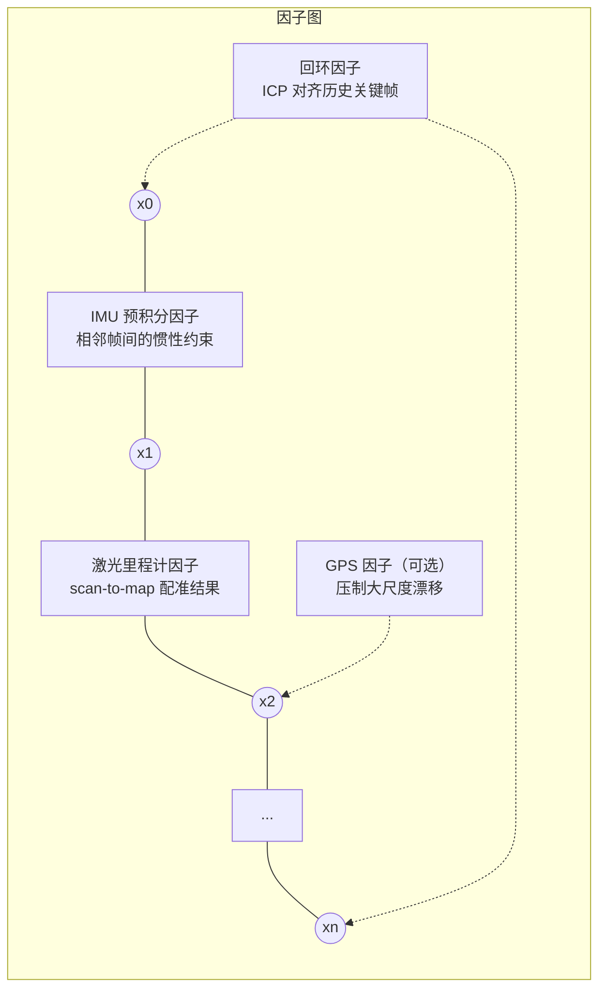

# 03 · LIO-SAM 实战

## 目标

- 理解因子图框架下的四类约束因子（IMU 预积分、激光里程计、GPS、回环）
- 明确 LIO-SAM 对传感器的三条硬性要求（9 轴 IMU、外参、点云 ring/time 字段）——实机接入 90% 的坑在这里
- 用官方 walking 数据集跑通建图，用 `save_map` 服务导出 PCD 地图
- 读懂 `config/params.yaml` 的关键参数

## 一、原理直观版：把 SLAM 变成一张"约束网"

LIO-SAM = Lidar-Inertial Odometry via Smoothing and Mapping。它把机器人轨迹上的每个关键帧位姿当作图中的一个节点，各种传感器测量都变成节点之间的"弹簧"（因子），后端（GTSAM 的 iSAM2）不断把整张网调整到最松弛（残差最小）的状态：



- **IMU 预积分因子**：把两关键帧之间几百条 IMU 读数"预积分"成一条相对运动约束，同时在线估计 IMU 零偏；IMU 还用于点云去畸变和给激光配准提供初值。
- **激光里程计因子**：LOAM 式边缘/平面特征 scan-to-map 配准（前端与 A-LOAM 一脉相承）。
- **GPS 因子**（可选）：给节点加全局位置约束，室外大场景防漂移。
- **回环因子**：发现回到旧地方时，用 ICP 把当前帧与历史关键帧对齐，误差沿整条轨迹回传修正——这正是 A-LOAM 缺失的能力。

好处：任何一类测量都只是"往图里加边"，传感器可插拔；历史轨迹可以被整体修正，地图全局一致。

## 二、传感器硬性要求（实机接入必读）

跑官方数据集不会遇到这些问题，但接自己的雷达/IMU 之前必须逐条核对：

1. **9 轴 IMU，≥200 Hz**。LIO-SAM 依赖 IMU 输出的 roll/pitch（重力对齐）初始化系统姿态、yaw（磁力计）配合 GPS 初始化航向，**6 轴 IMU（如 Ouster 雷达内置的）无法直接使用**。官方使用 500 Hz 的 Microstrain 3DM-GX5-25。
2. **IMU-雷达外参必须正确**。`params.yaml` 里有两组外参：`extrinsicRot`（加速度/角速度坐标系到雷达系的旋转）与 `extrinsicRPY`（姿态角坐标系到雷达系的旋转）。默认值是作者自己那颗 IMU 的（两组不一致）；**你的 IMU 若各轴一致，两组都应改成同一个旋转阵**。装错的典型症状见常见问题。
3. **点云必须带 `ring` 和 `time` 字段**（最常见踩坑）。`imageProjection` 节点检查每帧点云：
   - 无 `ring` 字段 → 直接报错退出：`Point cloud ring channel not available, please configure your point cloud data!`
   - 无 `time`/`t` 字段 → 警告并禁用去畸变：`Point cloud timestamp not available, deskew function disabled, system will drift significantly!`

   Velodyne 官方驱动默认输出这两个字段；很多仿真插件、旧驱动或经过转换的 bag 会丢失它们，这是"别人能跑我不能跑"的头号原因。

## 三、环境准备

```bash
# GTSAM（01 篇已装可跳过）
sudo add-apt-repository ppa:borglab/gtsam-release-4.0
sudo apt update && sudo apt install libgtsam-dev libgtsam-unstable-dev

cd ~/ws_romindly && catkin_make --pkg lio_sam -j2
source devel/setup.bash
```

数据集：从 `LIO-SAM/README.md` 的 "Sample datasets" 一节下载 **Walking dataset**（手持室内外，默认参数直接可跑）与 **Garden dataset**（测回环用），放到 `~/bags/`。注意 Rotation/Campus 两个数据集话题名不同（`imu_correct`），需按 README 改参数后才能跑。

## 四、分步操作：跑通 walking 数据集

**终端 1** — 启动 LIO-SAM（含 rviz）：

```bash
source ~/ws_romindly/devel/setup.bash
roslaunch lio_sam run.launch
```

**终端 2** — 回放（官方建议可 3 倍速；开回环时建议原速 `-r 1`）：

```bash
rosbag play ~/bags/walking_dataset.bag -r 3
```

预期：rviz 中绿色轨迹延伸，"Map (cloud)" 显示拼接点云；终端无红色报错。检查关键输出话题：

```bash
rostopic hz /lio_sam/mapping/odometry /lio_sam/imu/path
```

### 测试回环

用 Garden 数据集、原速回放；rviz 中取消勾选 "Map (cloud)"、勾选 "Map (global)"（前者只是 rviz 堆叠的历史点云，位置不会随回环修正而更新，后者才是优化后的全局地图）。绕环回到起点时可看到 `/lio_sam/mapping/loop_closure_constraints` 出现黄色回环边，轨迹整体微调。

### 保存地图

`params.yaml` 中 `savePCD: true` 可在退出时自动保存；更推荐随时调用服务（srv 定义：`float32 resolution, string destination → bool success`）：

```bash
rosservice call /lio_sam/save_map 0.2 "/Downloads/LOAM/"
```

地图（`GlobalMap.pcd`、轨迹与角/面特征点云）保存到 `~/Downloads/LOAM/`。destination 留空则用 `savePCDDirectory` 参数值；**注意该目录会被删除重建**，别指向已有数据的目录。查看：`pcl_viewer ~/Downloads/LOAM/GlobalMap.pcd`（`sudo apt install pcl-tools`）。

## 五、节点与话题一览

`run.launch` 通过 `module_loam.launch` 启动四个核心节点（另含 robot_state_publisher 与可选的 navsat GPS 模块）：

| 节点 | 输入 | 输出（主要） | 职责 |
| --- | --- | --- | --- |
| `imuPreintegration` | `imu_raw`、mapping 位姿 | `odometry/imu`（IMU 频率的高频里程计） | IMU 预积分、零偏估计、高频位姿外推 |
| `imageProjection` | `points_raw`、`imu_raw` | `lio_sam/deskew/cloud_deskewed`、`cloud_info` | 点云投影成距离图、按 IMU 去畸变、ring/time 校验 |
| `featureExtraction` | `deskew/cloud_info` | `lio_sam/feature/cloud_corner`、`cloud_surface` | LOAM 式边缘/平面特征提取 |
| `mapOptimization` | 特征点云、GPS（可选） | `lio_sam/mapping/odometry`、`map_global`、`path`、`/lio_sam/save_map` 服务 | scan-to-map 配准、因子图优化、回环、存图 |

给下游导航用的两个话题：`lio_sam/mapping/odometry`（激光频率、经全局优化）与 `odometry/imu`（IMU 频率、平滑但会被回环跳变修正）。

## 六、params.yaml 关键参数详解

| 参数 | 默认值 | 说明 |
| --- | --- | --- |
| `pointCloudTopic` | `points_raw` | 输入点云话题；接实机 Velodyne 时改为 `/velodyne_points` |
| `imuTopic` | `imu_raw` | 输入 IMU 话题（原始 9 轴数据） |
| `sensor` | `velodyne` | 雷达类型：`velodyne`/`ouster`/`livox`，决定 ring/time 字段解析方式 |
| `N_SCAN` / `Horizon_SCAN` | 16 / 1800 | 线数与每线点数，**必须与雷达一致**（如 VLP-16：16/1800） |
| `downsampleRate` | 1 | 线方向降采样，64 线可设 4 当 16 线用，省算力 |
| `lidarMinRange` / `lidarMaxRange` | 1.0 / 1000.0 | 距离裁剪（米） |
| `extrinsicTrans` | [0,0,0] | IMU→雷达平移 |
| `extrinsicRot` / `extrinsicRPY` | 见文件 | IMU→雷达两组旋转外参（见第二节第 2 条） |
| `edgeThreshold` / `surfThreshold` | 1.0 / 0.1 | 曲率阈值，划分边缘/平面特征 |
| `numberOfCores` | 4 | 建图优化线程数；N305（8 核）可保持 4，N150 建议 2 |
| `mappingProcessInterval` | 0.15 | 秒，两次 scan-to-map 的最小间隔，调大可降 CPU |
| `surroundingkeyframeAddingDistThreshold` | 1.0 | 米，移动多远加一个关键帧 |
| `loopClosureEnableFlag` | true | 回环开关 |
| `loopClosureFrequency` | 1.0 | Hz，回环检测频率 |
| `historyKeyframeSearchRadius` | 15.0 | 米，距当前位姿多近的历史关键帧才参与回环 |
| `historyKeyframeFitnessScore` | 0.3 | ICP 质量阈值，越小要求对齐越好，误回环时调小 |
| `savePCD` / `savePCDDirectory` | false / `/Downloads/LOAM/` | 退出时是否存图及路径（相对家目录） |

## 常见问题

**Q1：启动就报错 `Point cloud ring channel not available`？**
你的点云没有 `ring` 字段。Velodyne 用官方 `velodyne_driver`（本套 45 章）即可；其他雷达确认驱动输出，或换 `sensor` 类型适配。

**Q2：一回放 base_link 就上下乱跳、地图翻转？**
IMU 外参错误的典型症状（例如重力方向反了）。用 `rostopic echo /imu_raw` 静止时检查加速度：Z 轴应约 +9.8；按你的安装方向重算 `extrinsicRot`/`extrinsicRPY`。

**Q3：频繁打印 `Large velocity, reset IMU-preintegration!`？**
IMU 预积分发散被重置。常见原因：IMU 与雷达时间不同步（两个传感器时间戳来源不同）、IMU 噪声参数与实际严重不符、外参错误。优先核对时间戳（`rqt_bag` 看两话题时间差）与外参。

**Q4：跑一段后 CPU 打满、rviz 卡顿？**
按顺序尝试：`mappingProcessInterval` 调大到 0.2~0.3；`numberOfCores` 降到 2；rviz 中关闭 "Map (cloud)"；回放降速。N150 款建议同时开启这几项。

**Q5：回环没有触发？**
确认原速回放（ICP 慢，3 倍速可能来不及）、`loopClosureEnableFlag: true`、轨迹确实回到 `historyKeyframeSearchRadius`（15 m）内且时间差超过 `historyKeyframeSearchTimeDiff`（30 s）。

下一篇：[04 FAST-LIO 实战](./04_FAST-LIO实战.md)
