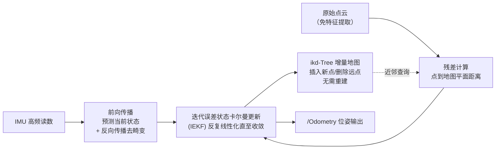

# 04 · FAST-LIO 实战

## 目标

- 直观理解 FAST-LIO2 的两大杀手锏：迭代误差状态卡尔曼滤波（IEKF）与 ikd-Tree，明白它为什么快、为什么适合 x86 边缘单元
- 正确编译（子模块 + livox_ros_driver 前置）并用官方数据集跑通 Livox 与 Velodyne 两种数据源
- 读懂 `config/*.yaml` 关键参数，掌握在 Romindly Mind 上的部署调优

## 一、原理直观版：为什么快

LIO-SAM 用因子图"记住"整条轨迹反复优化；FAST-LIO2 走另一条路——**只维护当前状态，把功夫花在每一帧的极致效率上**：



三个省算力的设计：

1. **免特征提取**：不再挑边缘/平面点，降采样后的原始点直接参与配准（每个点在地图中找近邻拟合小平面、算点面距离），省掉整个特征前端，也因此对雷达扫描方式不挑剔（机械式、Livox 非重复扫描都行）。
2. **IEKF 而非图优化**：状态只有当前时刻一个（位姿、速度、零偏、重力等），测量更新用作者推导的等价卡尔曼增益公式，计算量与点数成正比而不是与轨迹长度成正比——内存和 CPU 占用不随运行时间增长。
3. **ikd-Tree 增量式地图**：传统 kd 树每次加点都要整棵重建；ikd-Tree 支持增量插入、删除与自动平衡，并按"局部滑动窗口"丢弃远处地图点（`cube_side_length`），地图查询始终 O(log n)。

代价是**没有回环、没有全局优化**：它本质是一个极其稳健的激光-惯性里程计（LIO），长距离绕环仍会有小漂移。对 6 轴 IMU 即可工作（不需要磁力计），这也比 LIO-SAM 宽容得多。

## 二、环境准备

编译顺序有讲究：**Livox-SDK → livox_ros_driver → FAST_LIO**（即使只用 Velodyne 数据也要装前两者，FAST_LIO 的消息定义依赖 livox_ros_driver）。SDK 安装见 [01 篇](./01_3D激光SLAM概览与准备.md)第 4.3 节，这里确认剩余步骤：

```bash
# 1. 确认子模块存在（克隆时应带 --recursive）
cd ~/ws_romindly/src/FAST_LIO
git submodule update --init --recursive
ls include/ikd-Tree/    # 应有 ikd_Tree.cpp / ikd_Tree.h

# 2. 编译（livox_ros_driver 在同一工作空间会被 catkin 自动排在前面）
cd ~/ws_romindly && catkin_make -j2
source devel/setup.bash
```

数据集（`FAST_LIO/README.md` 第 4 节 "Rosbag Example" 的 Google Drive 链接）：

- **Livox Avia 室内 bag**：含 `livox_ros_driver/CustomMsg` 点云与内置 IMU，配 `avia.yaml`；
- **NCLT（Velodyne HDL-32E）bag**：作者转换好的 rosbag，配 `velodyne.yaml`。

下载后放 `~/bags/`。

## 三、分步操作

### 3.1 Livox 数据源（Avia bag）

**终端 1**：

```bash
source ~/ws_romindly/devel/setup.bash
roslaunch fast_lio mapping_avia.launch
```

**终端 2**：

```bash
rosbag play ~/bags/fast_lio_avia.bag   # 文件名以实际下载为准
```

rviz 中白色/彩色点云快速累积成稠密地图。观察输出频率：

```bash
rostopic hz /Odometry   # 应接近点云帧率（10 Hz），且非常稳定
```

### 3.2 Velodyne 数据源（NCLT bag）

```bash
roslaunch fast_lio mapping_velodyne.launch   # 终端 1
rosbag play ~/bags/nclt_xxx.bag              # 终端 2
```

`velodyne.yaml` 默认 `scan_line: 32`（HDL-32E）、话题 `/velodyne_points` 与 `/imu/data`，与 NCLT bag 一致。若换 VLP-16 数据：`scan_line` 改 16，并核对 `timestamp_unit`（点时间字段单位：0 秒 / 1 毫秒 / 2 微秒 / 3 纳秒，NCLT 为微秒）。

### 3.3 实机 Livox 雷达接入要点

必须用 `livox_lidar_msg.launch` 启动驱动（输出 `livox_ros_driver/CustomMsg`，带逐点时间戳；`livox_lidar.launch` 输出的标准 PointCloud2 缺逐点时间，无法去畸变）：

```bash
roslaunch livox_ros_driver livox_lidar_msg.launch
roslaunch fast_lio mapping_avia.launch   # Mid-360 用 mapping_mid360.launch
```

### 3.4 保存地图

`pcd_save_en: true`（默认开）时，**Ctrl-C 退出节点即自动把全程累积点云写入** `FAST_LIO/PCD/scans.pcd`：

```bash
pcl_viewer ~/ws_romindly/src/FAST_LIO/PCD/scans.pcd
```

长时间运行注意 `interval: -1` 表示全部点存进单个 PCD，内存可能吃紧，可改为按帧数分文件。

## 四、config yaml 参数详解（以 avia.yaml / velodyne.yaml 为准）

| 参数 | avia.yaml | velodyne.yaml | 说明 |
| --- | --- | --- | --- |
| `common.lid_topic` | `/livox/lidar` | `/velodyne_points` | 点云话题 |
| `common.imu_topic` | `/livox/imu` | `/imu/data` | IMU 话题 |
| `common.time_sync_en` | false | false | 软件时间同步，仅在无法硬同步且两传感器时钟差恒定时才开 |
| `preprocess.lidar_type` | 1 | 2 | 1=Livox 系列，2=Velodyne，3=Ouster |
| `preprocess.scan_line` | 6 | 32 | 线数（Avia 为 6） |
| `preprocess.timestamp_unit` | — | 2 | 点云 time/t 字段单位（2=微秒），仅标准 PointCloud2 需要 |
| `preprocess.blind` | 4 | 2 | 近距离盲区（米） |
| `mapping.acc_cov` / `gyr_cov` | 0.1 / 0.1 | 同 | IMU 加计/陀螺噪声协方差 |
| `mapping.det_range` | 450 | 100 | 雷达最大探测距离（米） |
| `mapping.extrinsic_T` / `extrinsic_R` | 出厂值 | [0,0,0.28] / 单位阵 | 雷达在 IMU 系下的外参；`extrinsic_est_en: true` 可在线微调 |
| `publish.dense_publish_en` | true | true | false 则稀疏发布配准点云，省带宽/CPU |
| `pcd_save.pcd_save_en` | true | true | 退出时保存 PCD |

launch 文件里还有一组运行时参数（`mapping_velodyne.launch` 默认值）：`point_filter_num: 4`（每 4 个点取 1 个）、`filter_size_surf: 0.5` / `filter_size_map: 0.5`（输入/地图体素降采样，米）、`max_iteration: 3`（IEKF 最大迭代数）、`cube_side_length: 1000`（局部地图立方体边长，米）。

主要输出话题：`/Odometry`（nav_msgs/Odometry 位姿）、`/cloud_registered`（世界系配准点云）、`/path`（轨迹）。

## 五、与 LIO-SAM 对比及 N305 部署建议

| 维度 | LIO-SAM | FAST-LIO2 |
| --- | --- | --- |
| 精度 | 大场景更优（回环 + 全局优化修正漂移） | 局部精度高，长程绕环有小漂移无法修正 |
| 算力 | 中高，随回环/轨迹规模增长 | 低且恒定，实测占用明显低于 LIO-SAM |
| 回环 | 有 | 无 |
| IMU 要求 | 9 轴、≥200 Hz、外参敏感 | 6 轴即可，支持在线估计外参 |
| 依赖复杂度 | GTSAM + 点云 ring/time 字段 | livox_ros_driver + 子模块，无 GTSAM |
| 适合 | 离线测绘、大场景全局一致地图 | 边缘/机载实时定位与建图、给导航供里程计 |

在 Romindly Mind（尤其 N150 款）上的调优顺序：

1. `roslaunch ... rviz:=false` 关掉可视化（rviz 往往比算法本身更耗 CPU），另一台机器远程 rviz 查看；
2. 调大 `filter_size_surf` / `filter_size_map`（0.5 → 0.8~1.0，室外）、调大 `point_filter_num`；
3. `dense_publish_en: false`、`path_en: false` 减少发布开销；
4. N305（8 核）默认参数即可流畅实时，余量足够同时跑导航栈。

## 常见问题

**Q1：编译报 `livox_ros_driver/CustomMsg not found` 或 `ikd_Tree.h` 缺失？**
前者：livox_ros_driver 未编译/未 source；后者：子模块没拉，`git submodule update --init --recursive`。

**Q2：警告 `Failed to find match for field 'time'`？**
标准 PointCloud2 输入缺逐点时间字段，无法去畸变。Velodyne 用官方驱动；Livox 必须用 `livox_lidar_msg.launch`（CustomMsg）。

**Q3：地图整体倾斜或初始化后即发散？**
启动时保持载体静止 2~3 秒让重力对齐完成；仍有问题则核对 `extrinsic_T/R` 与 IMU 话题单位（FAST-LIO 能自适应 g 与 m/s²，但坐标轴方向必须对）。

**Q4：跑久了内存持续上涨？**
多为 `pcd_save_en: true` + `interval: -1` 在内存里累积全程点云所致，不需要存图就关掉，或设 `interval` 分片保存。

至此本章完成。回顾选型：教学理解选 A-LOAM，测绘级全局一致地图选 LIO-SAM，边缘单元实时运行选 FAST-LIO；配合 [30_定位](../30_定位/README.md) 的 hdl_localization，可在 FAST-LIO/LIO-SAM 建好的 PCD 地图上做纯定位导航。
