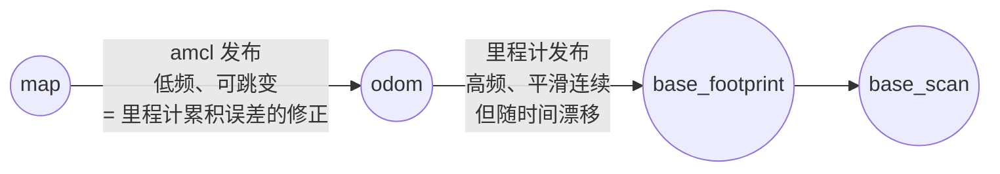

# 01 AMCL 原理与调参

> English version: [01_amcl.md](../en/30_localization/01_amcl.md)

## 目标

- 理解蒙特卡洛定位（MCL）的粒子滤波思想，能在 rviz 里通过粒子云判断定位质量；
- 掌握 `map_server + amcl` 的启动流程与 rviz 手动初始化操作；
- 看懂并能调整 AMCL 的核心参数（粒子数、更新阈值、运动/观测模型噪声、恢复机制）；
- 理解 AMCL 在 TF 树中的角色：为什么它发布的是 `map→odom`。

## 原理简介：一群粒子的"猜位置"游戏

AMCL（Adaptive Monte Carlo Localization，自适应蒙特卡洛定位）用一堆**粒子**表示机器人位姿的概率分布。每个粒子是一个假设：「机器人可能在 (x, y, θ)」，并带一个权重表示可信度。

算法循环三步：

1. **预测（运动更新）**：里程计说机器人前进了 0.3 m，就把所有粒子也前移 0.3 m，并按 `odom_alpha*` 参数撒上噪声——粒子云随之扩散（里程计不可全信）；
2. **校正（观测更新）**：拿当前激光扫描去和地图比对。假设某粒子的位置成立，激光应该打到哪些障碍物？和实测越吻合，该粒子权重越高；
3. **重采样**：按权重"优胜劣汰"，高权重粒子被复制，低权重粒子被淘汰——粒子云向真实位姿收敛。

"自适应"指粒子数按 KLD 采样动态调整：位姿不确定时多用粒子（上限 `max_particles`），收敛后自动减少（下限 `min_particles`），节省计算量。


在 rviz 中订阅 `/particlecloud`（类型 `geometry_msgs/PoseArray`，显示为一片红色小箭头）即可直观观察：**箭头聚成一小簇且朝向一致 = 定位好；箭头散布一大片或分成几簇 = 定位差**。

## 分步操作

### 1. 启动仿真与导航（内含 AMCL）

```bash
# 终端 1：Gazebo 仿真
export TURTLEBOT3_MODEL=burger
roslaunch turtlebot3_gazebo turtlebot3_world.launch

# 终端 2：导航栈（map_server + amcl + move_base + rviz）
export TURTLEBOT3_MODEL=burger
roslaunch turtlebot3_navigation turtlebot3_navigation.launch map_file:=$HOME/map.yaml
```

这个 launch 文件内部做了三件与定位相关的事：`map_server` 加载 20 章建好的地图并发布 `/map`；`amcl` 订阅 `/scan` 与 TF 做定位；`rviz` 加载导航配置。终端 2 预期输出包含：

```text
[ INFO] Requesting the map...
[ INFO] Received a 384 X 384 map @ 0.050 m/pix
[ INFO] Initializing likelihood field model; this can take some time on large maps...
[ INFO] Done initializing likelihood field model.
```

> 若单独手动启动，等价于 `rosrun map_server map_server $HOME/map.yaml` + 带参数的 `amcl` 节点，可参考 AMCL 源码包 `examples/amcl_diff.launch`（差速模型示例）。

### 2. rviz 手动初始化：2D Pose Estimate

刚启动时 AMCL 默认认为机器人在 `initial_pose_x/y/a`（默认全为 0），若与 Gazebo 中的真实位置不符，激光和地图会明显错位。此时：

1. 在 rviz 工具栏点击 **2D Pose Estimate**；
2. 在地图上机器人的**真实位置**按下鼠标左键，**拖动方向**指定朝向后松开；
3. 粒子云瞬间集中到该位置附近（散布范围由 `initial_cov_*` 决定）；
4. 用 `teleop` 让机器人小范围移动/旋转几秒，粒子云快速收缩，激光点贴合地图墙壁边缘即定位成功。

```bash
# 终端 3：键盘遥控，帮助粒子收敛
export TURTLEBOT3_MODEL=burger
roslaunch turtlebot3_teleop turtlebot3_teleop_key.launch
```

验证定位结果：

```bash
rostopic echo /amcl_pose -n 1     # 位姿 + 6x6 协方差
rosrun tf tf_echo map base_footprint
```

`/amcl_pose` 协方差矩阵对角线前两项（x、y 方差）小于 0.05 左右，通常说明已收敛。

### 3. 全局重定位服务

完全不知道机器人在哪（例如被搬动过，即"绑架问题"）时，可以让粒子撒满整张地图的自由区域重新收敛：

```bash
rosservice call /global_localization "{}"
```

调用后 rviz 中粒子云铺满全图，遥控机器人在**特征明显**（非长直走廊、非对称）的区域走动，粒子会逐步聚簇。地图存在对称结构时可能收敛到错误的对称解，此时仍需 2D Pose Estimate 人工纠正。另有 `rosservice call /request_nomotion_update "{}"` 可在机器人静止时强制做一次观测更新。

## 参数详解表

以下默认值核对自本仓库 `navigation/amcl/src/amcl_node.cpp`。参数写在 launch 中 `<node pkg="amcl">` 内，TB3 的实际值见 `turtlebot3_navigation/launch/amcl.launch`。

| 参数 | 默认值 | 说明与调参建议 |
| --- | --- | --- |
| `min_particles` | 100 | 粒子数下限。收敛后维持的最少粒子，太小容易在特征稀疏区丢定位 |
| `max_particles` | 5000 | 粒子数上限。全局重定位、大地图时需要更多；上调增加 CPU 占用 |
| `update_min_d` | 0.2 (m) | 平移超过该值才做一次滤波更新。调小→更新更频繁、定位更跟手但更耗 CPU |
| `update_min_a` | π/6 (≈0.52 rad) | 旋转更新阈值，同上。原地旋转易丢定位时可调小 |
| `resample_interval` | 2 | 每 N 次滤波更新做一次重采样。调大可缓解"粒子贫化"（多样性过快丢失） |
| `laser_z_hit` | 0.95 | 观测模型中"击中地图障碍物"的权重。地图与环境高度一致时保持高值 |
| `laser_z_rand` | 0.05 | 随机噪声测量的权重。环境中有大量地图上没有的动态障碍（行人、货架挪动）时适当上调，同时下调 `z_hit`，两者（likelihood_field 模型下）之和应为 1 |
| `odom_alpha1` | 0.2 | 旋转运动引入的旋转噪声。里程计打滑、定位在旋转后跳变→上调 |
| `odom_alpha2` | 0.2 | 平移运动引入的旋转噪声 |
| `odom_alpha3` | 0.2 | 平移运动引入的平移噪声。轮子打滑严重的场地上调 |
| `odom_alpha4` | 0.2 | 旋转运动引入的平移噪声 |
| `recovery_alpha_slow` | 0.001 | 慢速平均权重指数衰减率。与 fast 配合触发"注入随机粒子"的恢复机制；设为 0.0 可关闭 |
| `recovery_alpha_fast` | 0.1 | 快速平均权重衰减率。当短期权重明显低于长期权重（定位可能已丢）时随机撒粒子自救 |
| `initial_pose_x/y/a` | 0.0 | 初始位姿均值（map 系）。部署时写成机器人固定的开机点/充电桩位姿，可免去每次手动初始化 |
| `initial_cov_xx/yy` | 0.25 (m²) | 初始位姿 x/y 方差（即 0.5²），决定初始粒子撒布范围 |
| `initial_cov_aa` | (π/12)² (rad²) | 初始朝向方差 |

其他常用项：`laser_max_beams`（默认 30，每帧参与打分的激光束数）、`odom_model_type`（默认 `diff`，TB3 差速用 `diff` 或改进版 `diff-corrected`）、`laser_model_type`（默认 `likelihood_field`）、`transform_tolerance`（默认 0.1 s，TF 抖动报错时适当上调）。

## TF 链：为什么 AMCL 发布 map→odom 而不是 map→base

初学者直觉上会认为"定位就是算出机器人在地图里的位姿"，所以 AMCL 应该发布 `map→base_footprint`。但 TF 树中每个 frame 只允许一个父节点，而 `odom→base_footprint` 已经由里程计（TB3 的 Gazebo 插件或实机驱动）以高频率（约几十 Hz）连续发布了。AMCL 于是把自己算出的 `map` 系位姿，"扣除"当前里程计位姿，得到一个**修正量**作为 `map→odom` 发布：



这样设计的好处：

- **高频与低频解耦**：AMCL 只在机器人移动超过 `update_min_d/a` 时更新，频率低且结果可能跳变；控制器需要的高频连续位姿由里程计段提供，两段相乘得到 `map→base`；
- **各取所长**：`odom→base` 短期精确、长期漂移；`map→odom` 恰好补偿这份漂移。局部避障用 odom 系（连续不跳变），全局规划用 map 系（绝对准确）——这正是 REP-105 的坐标系约定；
- **可替换性**：换成 SLAM 或其他全局定位器，只需替换 `map→odom` 的发布者，里程计链路不动。

验证 TF 链：`rosrun tf view_frames && evince frames.pdf`，应看到 `map → odom → base_footprint → base_scan` 一条链，`map→odom` 的 broadcaster 是 `/amcl`。

## 常见问题

**Q1：激光点和地图墙壁明显错位，且越走偏得越多？**
定位已丢失。表现还包括：粒子云不收敛反而越来越散、`/amcl_pose` 协方差持续增大、rviz 中机器人模型"穿墙"。恢复手段按代价从低到高：① rviz 2D Pose Estimate 人工重设；② 调用 `/global_localization` 后遥控走动；③ 检查是否环境变化太大需要重新建图。

**Q2：机器人快速旋转后定位跳变或丢失？**
典型原因是旋转噪声参数偏小。上调 `odom_alpha1`/`odom_alpha4`，或调小 `update_min_a` 让旋转过程中多做几次更新；实机上还要确认 IMU/轮速标定与 `base` 到激光的 TF 外参是否准确。

**Q3：报错 `Timed out waiting for transform from base_footprint to map`？**
多为 TF 时序问题：确认仿真下所有终端 `use_sim_time` 为 true、时间源一致；适当上调 `transform_tolerance`（如 0.3~0.5）；用 `rosrun tf tf_monitor` 检查各段 TF 的延迟。

**Q4：环境里行人很多，定位频繁被干扰？**
动态障碍物不在地图上，会拉低所有粒子的观测得分。下调 `laser_z_hit` 至 0.7~0.8、上调 `laser_z_rand` 至 0.2~0.3，容忍"解释不了"的激光点；必要时限制 `laser_max_range` 忽略远处不可靠回波。

**Q5：开机后不想每次手动点 2D Pose Estimate？**
若机器人固定从充电桩启动，把充电桩在地图中的位姿写入 `initial_pose_x/y/a`。AMCL 也会按 `save_pose_rate` 周期把最新位姿存入参数服务器，配合外部脚本可实现"断电续定位"。

## 下一步

定位只用轮式里程计 + 激光仍有短板：里程计漂移大时 AMCL 的预测步会拖后腿。下一篇 [02 robot_localization 多传感器融合](02_robot_localization多传感器融合.md) 讲如何用 EKF 融合 IMU，为 AMCL 提供更平滑准确的 `odom→base`。
