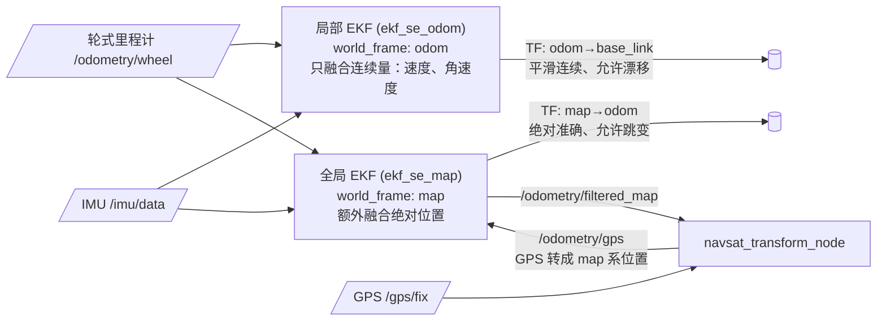

# 02 robot_localization 多传感器融合

> English version: [02_robot_localization.md](../en/30_localization/02_robot_localization.md)

## 目标

- 理解为什么单一里程计不够用，多传感器融合解决什么问题；
- 会写一份可直接运行的 `ekf.yaml`，看懂 15 维 config 布尔矩阵；
- 理解典型的"双 EKF + navsat_transform"架构，以及 robot_localization 与 AMCL 的分工；
- 能排查协方差爆炸、时间戳、frame 配置三类常见故障。

> 本仓库 `robot_localization`（fork 自 cra-ros-pkg，noetic-devel 分支）的 `params/` 目录下有官方注释版模板：`ekf_template.yaml`、`dual_ekf_navsat_example.yaml`、`navsat_transform_template.yaml`，本文参数均以其核对。

## 为什么要融合

每种传感器都有各自的"性格缺陷"：

| 传感器 | 提供什么 | 缺陷 |
| --- | --- | --- |
| 轮式里程计（编码器） | 相对位移、线速度 | 打滑、轮径误差 → 随距离**累积漂移**，尤其旋转角度误差大 |
| IMU | 角速度、线加速度、（融合磁力计后的）姿态 | 角速度短期准，加速度积分位置发散极快；有零偏 |
| GPS/GNSS | 全局绝对位置 | 只有室外可用，低频、有跳变、无姿态 |

融合的思路是**取长补短**：IMU 的角速度比轮式里程计推算的角度准得多（差速轮原地转弯打滑严重），用它修正航向；GPS 提供不漂移的全局锚点，抑制长期累积误差。融合输出一份比任何单一传感器都更平滑、更准确的位姿估计。

## EKF 直观解释：预测—校正

`ekf_localization_node` 用扩展卡尔曼滤波（EKF）维护一个 15 维状态：位置 (x, y, z)、姿态 (roll, pitch, yaw)、线速度、角速度、线加速度各 3 维。不推公式，只需理解它的循环节奏：


- **预测**：没有新测量时，按当前速度外推位姿，同时按 `process_noise_covariance` 放大不确定度——"越久没校正越心虚"；
- **校正**：每来一条测量（odom、imu 消息），比较测量值与预测值，按双方协方差加权折中。传感器消息里的 `covariance` 字段因此非常重要：它是 EKF 判断"该信谁"的依据。

## 分步操作

### 1. 安装与准备

```bash
sudo apt install ros-noetic-robot-localization   # 或使用本仓库源码编译
rospack find robot_localization
```

仿真环境启动（TB3 的 `/odom` 与 `/imu` 由 Gazebo 插件发布）：

```bash
export TURTLEBOT3_MODEL=burger
roslaunch turtlebot3_gazebo turtlebot3_world.launch
rostopic hz /odom /imu    # 确认两个话题都在正常发布（约 30 Hz / 200 Hz）
```

### 2. 编写 ekf.yaml（完整可用示例）

保存为 `~/catkin_ws/src/my_robot_bringup/config/ekf.yaml`：

```yaml
# 局部 EKF：融合轮式里程计 + IMU，输出 odom→base_footprint
frequency: 30            # 滤波输出频率 Hz（收到首条输入后开始）
sensor_timeout: 0.1      # 传感器超时（秒），超时则只做预测不校正
two_d_mode: true         # 平面机器人置 true：z/roll/pitch 及其速度恒为 0
publish_tf: true         # 发布 world_frame→base_link_frame 的 TF
print_diagnostics: true  # 配置有误时可在 /diagnostics 看到提示

map_frame: map                  # 不用全局定位时此项可留默认
odom_frame: odom
base_link_frame: base_footprint # TB3 的基座 frame
world_frame: odom               # 融合连续数据（轮odom/IMU）→ 填 odom_frame 的值

# ---- 输入 0：轮式里程计 ----
odom0: /odom
# 15 维布尔矩阵，顺序固定为：
#   [ x,  y,  z,
#     roll, pitch, yaw,
#     vx, vy, vz,
#     vroll, vpitch, vyaw,
#     ax, ay, az ]
# true = 使用该消息中的这一维。差速轮只取"车体系速度"最稳妥：
odom0_config: [false, false, false,
               false, false, false,
               true,  false, false,   # vx（差速轮无侧向速度，vy 不取）
               false, false, true,    # vyaw
               false, false, false]
odom0_queue_size: 10
odom0_differential: false
odom0_relative: false

# ---- 输入 1：IMU ----
imu0: /imu
imu0_config: [false, false, false,
              false, false, true,    # yaw（TB3 仿真 IMU 带姿态；实机无磁力计则改融 vyaw）
              false, false, false,
              false, false, true,    # vyaw 角速度
              true,  false, false]   # ax 线加速度
imu0_queue_size: 20
imu0_differential: false
imu0_relative: true                  # 以开机时刻姿态为零点，避免与地图朝向冲突
imu0_remove_gravitational_acceleration: true  # 从加速度中扣除重力

# 过程噪声：15x15 对角阵（此处省略，见正文"要点"；不写则用内置默认）
```

**process_noise_covariance 要点**：它是 15×15 矩阵（通常只填对角线），对角元素依次对应上面 15 个状态量，表示"预测阶段每个状态量自身的不确定度增长速度"。参考 `params/ekf_template.yaml` 的默认对角线量级：位置约 0.05、yaw 0.06、vx 0.025、vyaw 0.02、ax 0.01。调参方向：**某状态量输出滞后、跟不上真实运动 → 调大对应对角元（更信测量）；输出抖动噪声大 → 调小（更信模型）**。初学建议先不写此参数，用默认值跑通后再动。

### 3. 启动与验证

launch 文件：

```xml
<launch>
  <node pkg="robot_localization" type="ekf_localization_node"
        name="ekf_se_odom" clear_params="true">
    <rosparam command="load" file="$(find my_robot_bringup)/config/ekf.yaml"/>
    <remap from="odometry/filtered" to="odometry/filtered_odom"/>
  </node>
</launch>
```

> 注意：TB3 的 Gazebo 差速插件默认自己发布 `odom→base_footprint` TF，会与 EKF 冲突（一个 child frame 两个爹）。仿真练习时需修改 TB3 urdf/gazebo 配置关闭插件的 TF 发布（`<publishOdomTF>false</publishOdomTF>`，保留 `/odom` 话题），实机上则是在底盘驱动中关闭。

验证：

```bash
rostopic echo /odometry/filtered_odom -n 1   # 融合后的位姿+速度+协方差
rosrun tf tf_echo odom base_footprint        # 确认 TF 由 ekf_se_odom 发布
rosrun rqt_tf_tree rqt_tf_tree               # 检查 TF 树无重复父节点
```

预期：遥控机器人原地旋转数圈再回到出发点，融合后的 yaw 误差明显小于纯轮式 `/odom`。

## 典型双 EKF 架构

室外或需要 GPS 的场景使用两级 EKF（对应 `params/dual_ekf_navsat_example.yaml`）：



- **局部 EKF**：`world_frame: odom`，只融合速度/角速度等**连续量**，输出平滑不跳变的 `odom→base_link`，供控制与局部避障使用；
- **全局 EKF**：`world_frame: map`，在局部 EKF 输入之外再融合 GPS 折算的绝对位置，输出 `map→odom`（它发布的是 map→odom 这一段修正量，原理与 AMCL 相同），允许随 GPS 更新跳变；
- **navsat_transform_node**：把经纬度转成 map 系的米制坐标（需要 `magnetic_declination_radians`、`yaw_offset` 等参数），并与全局 EKF 互为输入。

## 与 AMCL 的配合

室内有地图的场景不需要 GPS，全局修正交给 AMCL，形成最常见的组合：

| TF 段 | 发布者 | 特性 |
| --- | --- | --- |
| `map → odom` | **AMCL**（激光 vs 地图） | 低频、可跳变，修正累积漂移 |
| `odom → base_footprint` | **EKF 局部滤波**（轮 odom + IMU） | 高频、平滑连续 |

配置要点：EKF 的 `world_frame` 必须是 `odom`（绝不能是 map，否则与 AMCL 抢 `map→odom`）；关闭底盘驱动自带的 TF 发布；AMCL 的 `odom_frame_id`/`base_frame_id` 与 EKF 的 frame 参数保持一致。收益：EKF 提供更准的航向递推，AMCL 预测步质量提高，`odom_alpha*` 可以调小，粒子收敛更快更稳。

## 常见问题

**Q1：协方差爆炸——`/odometry/filtered` 的 covariance 数值越来越大甚至 1e10？**
某些状态维度**没有任何测量在校正**，只被预测步不断放大。典型场景：`two_d_mode: false` 但没有传感器提供 z/roll/pitch。对策：平面机器人务必 `two_d_mode: true`；逐维检查所有 `*_config` 的并集，确保每个"参与估计"的维度至少有一个传感器为 true（或其导数被融合）。另外每种绝对位姿量最好只由一个传感器提供，两个源都给绝对 yaw 且互相矛盾会导致输出来回跳。

**Q2：警告 `Transform ... was unavailable for the time requested` 或输出滞后？**
传感器时间戳问题。检查：所有节点 `use_sim_time` 一致（仿真必须 true）；实机上各传感器主机做 NTP/chrony 对时；消息 header.stamp 不能是 0 或墙钟/仿真钟混用；必要时增大 `transform_timeout`、传感器 `*_queue_size`。用 `rostopic echo /imu/header/stamp` 与 `rostopic echo /odom/header/stamp` 对比时间源。

**Q3：frame 配置错误的典型症状？**
① `world_frame` 误填 `map` 但没有全局定位源 → TF 树断链或与 AMCL 冲突；② IMU 消息的 `frame_id` 与实际安装朝向不符（robot_localization 会按 TF 把 IMU 数据旋转到 base_link 系，缺少 `base_link→imu_link` 的静态 TF 时数据方向全错）→ 补 `static_transform_publisher`；③ 两个节点同时发布 `odom→base_footprint` → rqt_tf_tree 中该边闪烁、rviz 模型抖动，关掉其中一个。

**Q4：机器人静止时位姿仍在缓慢滑动？**
IMU 加速度零偏被积分。要么不融合加速度（`imu0_config` 的 ax 置 false），要么确认 `imu0_remove_gravitational_acceleration: true` 且 IMU 安装水平、已做零偏校准；也可开启 `two_d_mode` 减少受扰维度。

**Q5：如何快速判断配置是否被节点接受？**
`print_diagnostics: true` 后运行 `rostopic echo /diagnostics`，robot_localization 会明确指出可疑配置（如某传感器所有维度均为 false、协方差非正定等）。

## 下一步

2D 定位路线到此闭环：EKF 融合出高质量 `odom→base`，AMCL 给出 `map→odom`。第三阶段将补充 [03 hdl_localization]（🚧）：在 3D 点云地图中用 NDT/GICP 定位，适用于多层结构与室外无 GPS 场景。导航应用请继续 [40 导航](../40_导航/README.md)。
