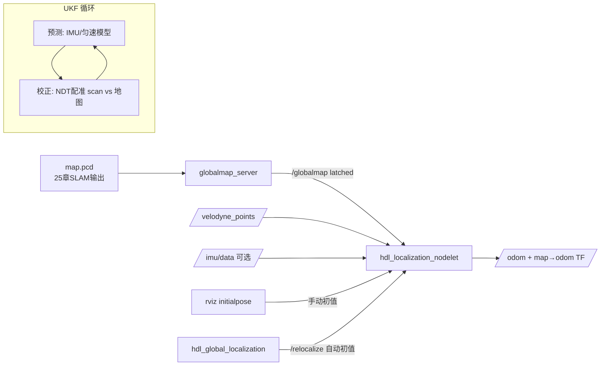

# 03 hdl_localization 三维点云定位

## 目标

- 理解 hdl_localization 的工作原理：在**已有 3D 点云地图**（[25 章 3D 激光 SLAM](../25_3D激光SLAM/README.md) 输出的 PCD 文件）中做实时定位，并与 2D AMCL 建立类比；
- 理清 ndt_omp / fast_gicp / hdl_global_localization 三个依赖包各自的角色；
- 掌握 globalmap_server 加载 PCD、rviz 给初值、`/relocalize` 全局重定位三种"告诉机器人它在哪"的方式；
- 在公开 bag（velodyne 数据）上跑通完整流程，并能针对 x86 边缘计算单元做实时性调优。

## 原理简介：把 AMCL 的思路搬进三维

AMCL 回答"我在 2D 栅格地图的哪个格子"，hdl_localization 回答"我在 3D 点云地图的哪个位置（含高度和姿态，共 6 自由度）"。两者的结构惊人地相似，只是每个组件都换成了三维版本：

| 角色 | AMCL（2D） | hdl_localization（3D） |
| --- | --- | --- |
| 地图 | `map_server` 加载 `map.pgm` | `globalmap_server` 加载 `map.pcd` |
| 观测模型（当前扫描 vs 地图打分/对齐） | likelihood field 激光模型 | **NDT / GICP 点云配准** |
| 滤波器（融合预测与观测） | 粒子滤波 | **UKF（无迹卡尔曼滤波）** |
| 预测来源 | 轮式里程计 | IMU（可选）或匀速运动模型 |
| 手动给初值 | rviz 2D Pose Estimate | rviz 2D Pose Estimate（同一个按钮） |
| 无初值全局重定位 | `global_localization` 服务 | `hdl_global_localization` + `/relocalize` 服务 |
| 对外输出 | `map→odom` TF + `/amcl_pose` | `map→odom` TF + `/odom` |

一次定位循环：UKF 用 IMU（或匀速模型）**预测**位姿 → 以预测值为初值，把当前帧点云与全局地图做 **NDT 配准**得到观测位姿 → UKF **校正**，输出平滑的 6DoF 位姿。粒子滤波靠"粒子多"扛非线性，UKF 靠 sigma 点近似非线性，计算量小得多——这正是 3D 定位能实时跑的关键。



### 依赖链：四个包各干什么

| 包 | 作用 | 关系 |
| --- | --- | --- |
| **hdl_localization** | 主体：globalmap_server + UKF + 配准调度，两个 nodelet | 调用下面三者 |
| **ndt_omp** | 多线程 OpenMP 版 NDT 配准（PCL 自带 NDT 的多核加速替代），`reg_method=NDT_OMP` 时使用 | 核心配准引擎，纯 CPU |
| **fast_gicp** | 多核/CUDA 加速的 GICP、VGICP、NDT 配准库；在本包中提供 `NDT_CUDA_P2D/D2D` 两种 GPU 配准 | 无 NVIDIA GPU 时仅作为编译依赖 |
| **hdl_global_localization** | 无初值全局重定位服务（BBS 分支限界 / FPFH+RANSAC / FPFH+TEASER 三种引擎），回答"完全不知道在哪"的问题 | 被 `/relocalize` 服务调用，可选 |

类比记忆：ndt_omp/fast_gicp 相当于 AMCL 的激光观测模型实现，hdl_global_localization 相当于 AMCL 的 `global_localization` 服务（把粒子撒满全图），只是 3D 下"撒粒子"代价太高，改用了专门的全局配准算法。

## 分步操作

### 1. 编译四个包

```bash
cd ~/catkin_ws/src
git clone https://github.com/Romindly-Dev/ndt_omp
git clone https://github.com/Romindly-Dev/fast_gicp --recursive   # 有子模块，必须 --recursive
git clone https://github.com/Romindly-Dev/hdl_localization
git clone https://github.com/Romindly-Dev/hdl_global_localization
cd ~/catkin_ws
catkin_make -DCMAKE_BUILD_TYPE=Release    # 不加 Release 配准速度会慢一个数量级
```

### 2. 准备地图与数据

用 25 章保存的 PCD 地图，或先用官方示例 bag 跑通（室外 velodyne 数据，含配套地图 `hdl_localization/data/map.pcd`）：

```bash
wget http://www.aisl.cs.tut.ac.jp/databases/hdl_graph_slam/hdl_400.bag.tar.gz
tar xzvf hdl_400.bag.tar.gz
```

使用自己的地图时，修改 launch 中 `globalmap_pcd` 指向你的 PCD 路径即可。

### 3. 启动定位

```bash
# 终端 1
rosparam set use_sim_time true
roslaunch hdl_localization hdl_localization.launch

# 终端 2
rviz -d $(rospack find hdl_localization)/rviz/hdl_localization.rviz

# 终端 3
rosbag play --clock hdl_400.bag
```

终端 1 预期输出（确认配准方法和地图加载成功）：

```text
[ INFO] NDT_OMP is selected
[ INFO] search_method DIRECT7 is selected
[ INFO] globalmap received!
```

真实雷达替代终端 3：启动 velodyne 驱动后传参 `points_topic:=/velodyne_points odom_child_frame_id:=velodyne`；若雷达上装有 IMU，加 `use_imu:=true imu_topic:=/imu/data`。

### 4. 给定初始位姿（三选一）

1. **launch 静态指定**（默认）：`specify_init_pose=true` 时用 `init_pos_*`/`init_ori_*` 作为初值——适合机器人每次从固定充电桩开机；
2. **rviz 手动**：工具栏 **2D Pose Estimate** 在地图上点击+拖动（发布到 `/initialpose`），与 AMCL 操作完全一致，只是地图换成了点云；
3. **全局重定位**（无需人工）：

```bash
rosservice call /relocalize
```

hdl_global_localization 会用 BBS 引擎（默认，可在 `config/general_config.yaml` 改为 FPFH_RANSAC / FPFH_TEASER）在全图搜索当前扫描的最佳匹配位置并重置 UKF——相当于 AMCL 的"绑架恢复"。

### 5. rviz 观察

- **/globalmap**：白色全局点云地图（latched，只发一次，rviz 晚开也能收到）；
- **/aligned_points**：当前帧配准后的点云（frame 为 `map`）——**与地图墙面、地面贴合 = 定位成功**；错开、漂移 = 定位失败；
- **/odom**（`nav_msgs/Odometry`）：估计位姿，`header.frame_id=map`；
- **/status**（`hdl_localization/ScanMatchingStatus`）：配准是否收敛、匹配误差、内点比例，调参时重点观察：

```bash
rostopic echo /status
```

### 6. TF 树去向

hdl_localization 的行为比 AMCL 更"聪明"：若 TF 树中已存在 `robot_odom_frame_id`（默认 `odom`，如底盘/robot_localization 在发 `odom→base_link`），它发布 **`map→odom`**，与 AMCL 的约定完全一致；若没有里程计 TF，则直接发布 `map→<odom_child_frame_id>`。与 30 章前两篇组合部署时保持默认即可，TF 链为 `map→odom→base_link→velodyne`。

## 参数详解表

以下参数均核对自 `launch/hdl_localization.launch` 与 nodelet 源码。

### globalmap_server_nodelet

| 参数 | 默认值 | 说明 |
| --- | --- | --- |
| `globalmap_pcd` | `data/map.pcd` | 全局点云地图路径，25 章 SLAM 输出的 PCD |
| `convert_utm_to_local` | true | 若存在 `<pcd>.utm` 文件，把 UTM 坐标平移回局部坐标（GPS 建图场景） |
| `downsample_resolution` | 0.1 | 地图体素降采样边长（m），越大内存/耗时越低 |

### hdl_localization_nodelet

| 参数 | 默认值 | 说明 |
| --- | --- | --- |
| `reg_method` | NDT_OMP | 配准方法：`NDT_OMP`（CPU 多线程）/ `NDT_CUDA_P2D` / `NDT_CUDA_D2D`（需 GPU，编译时开 `-DBUILD_VGICP_CUDA=ON`） |
| `ndt_resolution` | 1.0 | NDT 体素边长（m）。室外 1.0～2.0；室内狭小环境 0.5 左右 |
| `ndt_neighbor_search_method` | DIRECT7 | 近邻体素搜索：`DIRECT7`（准，稍慢）/ `DIRECT1`（极快，稍不稳）/ `KDTREE`；`DIRECT_RADIUS` 仅 CUDA 方法可用 |
| `ndt_neighbor_search_radius` | 2.0 | `DIRECT_RADIUS` 的搜索半径（m） |
| `downsample_resolution` | 0.1 | 输入扫描的体素降采样边长（m），实时性第一调节旋钮 |
| `odom_child_frame_id` | velodyne（launch 传入） | 定位的目标坐标系，输入点云先转到该系再配准（用于对齐雷达/IMU 坐标系） |
| `use_imu` | false（launch 传入） | 用 IMU 做 UKF 预测；false 则用匀速运动模型 |
| `invert_acc` / `invert_gyro` | false | IMU 坐标系轴向相反时翻转加速度/角速度符号 |
| `cool_time_duration` | 2.0 | 初始化后的冷却时间（s），期间忽略 IMU，等 UKF 稳定 |
| `enable_robot_odometry_prediction` | false | 用底盘里程计 TF（`robot_odom_frame_id`）做帧间预测，轮式机器人建议开启 |
| `robot_odom_frame_id` | odom | 底盘里程计坐标系名 |
| `specify_init_pose` | true | true 用下面 7 个参数做初值；false 则等 rviz `/initialpose` |
| `init_pos_x/y/z`, `init_ori_w/x/y/z` | 0,0,0 / 1,0,0,0 | 初始位置与四元数姿态 |
| `use_global_localization` | true | 启动 hdl_global_localization 并提供 `/relocalize` 服务 |
| `status_max_correspondence_dist` | 0.5 | `/status` 统计内点的最大对应距离（m），只影响状态报告不影响配准 |

## x86 边缘单元调优

x86 工控机/NUC 无独显时只能用 NDT_OMP，按以下顺序调（每步用 `/status` 的处理耗时和 `rostopic hz /odom` 验证达到雷达帧率 10 Hz）：

1. **线程数**：ndt_omp 默认用 `omp_get_max_threads()`（全部核心），源码无 ROS 参数，用环境变量限制，给导航等其他节点留核：

```bash
OMP_NUM_THREADS=4 roslaunch hdl_localization hdl_localization.launch
```

2. **输入降采样** `downsample_resolution`：0.1 → 0.2 → 0.3，配准点数按立方级下降，是收益最大的一档；室内小场景不要超过 0.3，特征会被抹掉；
3. **搜索方法**：`DIRECT7` → `DIRECT1`，速度提升数倍，代价是收敛稳健性略降（官方 README 也如此建议），配合 IMU 或里程计预测可弥补；
4. **NDT 分辨率** `ndt_resolution`：调大（如 1.0 → 2.0）体素数变少、速度更快，但精度变粗；
5. **地图降采样**（globalmap_server 的 `downsample_resolution`）：大地图先降到 0.2～0.5，同时缓解内存压力。

经验组合（i5 级 4 核、VLP-16、室内外混合）：`OMP_NUM_THREADS=4` + `downsample_resolution=0.2` + `DIRECT1` + `ndt_resolution=1.0`，可稳定 10 Hz。

## 常见问题

**Q1：定位跳变，`/aligned_points` 偶尔整体错开又弹回来？**
配准陷入局部极值。排查顺序：① `/status` 看 `inlier_fraction` 是否在跳变时刻骤降；② 走廊、隧道等几何退化场景本身无解，需 `use_imu:=true` 或 `enable_robot_odometry_prediction:=true` 增强预测约束；③ 用了 `DIRECT1` 就换回 `DIRECT7`；④ `ndt_resolution` 过大导致地图"糊"了，适当调小。

**Q2：rviz 给了初值但一直不收敛，点云和地图对不上？**
NDT 只有局部收敛性，初值误差超过约一个 `ndt_resolution`（尤其是角度差 >30°）就可能失败。重新给一次更准的初值，注意拖动方向；反复失败就 `rosservice call /relocalize` 让全局重定位来。另注意 rviz 的 2D Pose Estimate 不含 z 和俯仰/横滚，机器人在坡道上时手动初值天然有误差，需靠 UKF 慢慢拉回。

**Q3：地图很大（几百 MB PCD），加载后内存爆掉或 rviz 卡死？**
① 调大 globalmap_server 的 `downsample_resolution`（0.1 → 0.3～0.5）；② 建图阶段就先用 `pcl_voxel_grid` 离线压一遍：`pcl_voxel_grid map.pcd map_ds.pcd -leaf 0.2,0.2,0.2`；③ rviz 卡是渲染问题，把 `/globalmap` 显示的 Size 调小或干脆关掉，不影响定位本身。

**Q4：TF 冲突，rviz 报 `map` 到 `odom` 有两个发布者？**
hdl_localization 检测到 `odom` 系存在时会发布 `map→odom`，若此时 AMCL 或其他 SLAM 节点还在跑，两者会打架（表现为机器人模型在 rviz 里抖动）。同一时刻 `map→odom` 只能有一个发布者：关掉 AMCL/SLAM 节点，或改 hdl_localization 的 `robot_odom_frame_id` 隔离测试。

**Q5：开了 `use_imu:=true` 反而飘了？**
检查 IMU 坐标系与 `odom_child_frame_id` 是否一致（输入点云会被转换到该系，IMU 数据不会）；轴向定义相反时用 `invert_imu_acc` / `invert_imu_gyro` 翻转。不确定就先关掉 IMU，匀速模型在低速场景足够用。

---

下一步：[40 导航](../40_导航/README.md) 将把定位输出接入 move_base，让机器人真正"知道在哪"之后"走到要去的地方"。
