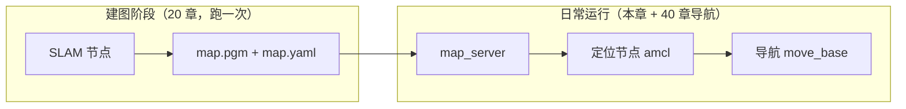

# 30 定位

本章解决"机器人在**已知地图**中知道自己在哪"的问题，覆盖 2D 概率定位、多传感器融合与 3D 点云定位三条技术路线。

## 本章内容

| 序号 | 文档 | 内容 | 状态 |
| --- | --- | --- | --- |
| 01 | [AMCL 原理与调参](01_AMCL原理与调参.md) | 蒙特卡洛粒子滤波定位：粒子云收敛、TF 链、全局重定位、调参表 | ✅ 可学习 |
| 02 | [robot_localization 多传感器融合](02_robot_localization多传感器融合.md) | EKF 融合轮式里程计与 IMU、双 EKF 架构、与 AMCL 的配合 | ✅ 可学习 |
| 03 | [hdl_localization 三维点云定位](03_hdl_localization三维点云定位.md) | 基于 NDT/GICP 的点云地图定位、3D 初始位姿给定 | ✅ 可学习 |

## 概念区分：建图时定位 vs 已知地图定位

初学者最容易混淆的一点：**SLAM 章节里机器人不是也知道自己在哪吗？为什么还要单独一章讲定位？**

两者回答的是不同的问题：

| | 建图时定位（SLAM） | 已知地图定位（本章） |
| --- | --- | --- |
| 地图 | 未知，边走边建 | 已有（20 章保存的 `map.yaml` + `map.pgm`） |
| 求解目标 | 同时估计**地图**和**位姿**（鸡生蛋问题） | 只估计**位姿**，地图是固定输入 |
| 典型工具 | gmapping / cartographer / slam_toolbox | **amcl** / robot_localization / hdl_localization |
| 计算开销 | 大（要维护和优化地图） | 小（只做位姿匹配），适合长期部署 |
| 失效模式 | 回环失败、地图重影 | 定位丢失（粒子发散）、被"绑架" |
| map→odom TF 来源 | SLAM 节点发布 | 定位节点（如 amcl）发布 |

工程实践中的分工是：**建图跑一次，定位天天跑**。部署到客户现场后，机器人每次开机加载同一张地图，由定位节点回答"我在地图的哪里"，导航栈才能规划路径。因此定位模块的稳定性直接决定整机可用性。

## 前置条件

- 完成 [20 2D 建图](../20_2D建图/README.md)，`$HOME/map.yaml` 已保存可用；
- 熟悉 [10 ROS1 基础](../10_ROS1基础/README.md) 中的 TF、topic、service 概念；
- 演示环境：Ubuntu 20.04 + ROS Noetic + TurtleBot3 Gazebo 仿真（[15 仿真入门](../15_仿真入门/README.md)）。

## 学完本章你应该能回答

1. AMCL 为什么发布 `map→odom` 而不是 `map→base_footprint`？
2. 机器人开机后定位不准，第一步该做什么？（提示：2D Pose Estimate / global_localization）
3. 轮式里程计明明会漂移，为什么 EKF 融合后的 `odom` 系仍然"必须连续、允许漂移"？
4. AMCL 和 robot_localization 同时运行时，TF 树上各自负责哪一段？
