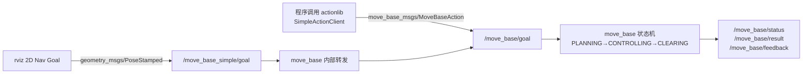

# 01 move_base 架构与快速上手

## 目标

- 理解 move_base 的完整数据流：目标输入 → 全局规划 → 局部控制 → 恢复行为。
- 在 TurtleBot3 Gazebo 仿真中跑通一次完整导航（初始化位姿 → 发目标 → 到达）。
- 掌握 move_base 自身的关键参数，学会用 `rostopic` 观察导航状态。
- 拿到一份实机接入前的 TF 链与话题核对表。

## 原理简介

move_base 是一个"调度器"：它本身不做规划，而是通过 **pluginlib 插件机制**加载三类可替换组件——全局规划器、局部规划器、恢复行为，并维护两张代价地图供它们使用。

### 目标输入的两条路



- `/move_base_simple/goal`：简单话题接口，发一个 `PoseStamped` 就走，**没有反馈**。rviz 的 2D Nav Goal 用的就是它。
- Action 接口（`/move_base/goal`）：能收到执行反馈、结果、并支持取消（`/move_base/cancel`），实际工程中程序发目标都应该走这条路。move_base 内部会把 simple goal 转成 action goal，所以两条路殊途同归。

### 插件机制

| 参数 | 默认值（源码 `move_base/cfg/MoveBase.cfg`） | 说明 |
| --- | --- | --- |
| `base_global_planner` | `navfn/NavfnROS` | 全局规划器插件名，可换 `global_planner/GlobalPlanner` |
| `base_local_planner` | `base_local_planner/TrajectoryPlannerROS` | 局部规划器插件名，TB3 默认改为 `dwa_local_planner/DWAPlannerROS` |
| `recovery_behaviors` | conservative_reset → rotate → aggressive_reset → rotate | 恢复行为链，按顺序逐级升级 |

### 恢复行为链

规划或控制持续失败（超过 `planner_patience` / `controller_patience`），或机器人在 `oscillation_timeout` 内没走出 `oscillation_distance`，就进入 CLEARING 状态，按序执行：

1. **保守清理**：清掉 `conservative_reset_dist`（默认 3 m）以外的 costmap 障碍；
2. **原地旋转**（rotate_recovery）：转一圈刷新传感器视野；
3. **激进清理**：清掉机器人本体以外几乎所有障碍；
4. **再旋转**；全部失败 → 目标 aborted。

`recovery_behavior_enabled: false` 可整体关闭；`clearing_rotation_allowed: false` 可单独禁掉旋转（阿克曼车必须禁）。

## 分步操作：TB3 仿真完整演示

三个终端均先设置模型（也可写入 `~/.bashrc`）：

```bash
export TURTLEBOT3_MODEL=burger
```

**终端 1 — 启动 Gazebo 世界：**

```bash
roslaunch turtlebot3_gazebo turtlebot3_world.launch
```

预期：Gazebo 打开六边形世界，无红色报错（首次启动加载模型可能等 10~30 秒）。

**终端 2 — 启动导航（使用建图章节保存的地图）：**

```bash
roslaunch turtlebot3_navigation turtlebot3_navigation.launch map_file:=$HOME/map.yaml
```

预期输出（节选）：

```
[ INFO] [...]: Using plugin "static_layer"
[ INFO] [...]: Using plugin "obstacle_layer"
[ INFO] [...]: Using plugin "inflation_layer"
[ INFO] [...]: Created local_planner dwa_local_planner/DWAPlannerROS
[ INFO] [...]: odom received!
```

rviz 同时打开，显示地图与激光点。

**步骤 3 — rviz 初始化位姿：** 点工具栏 **2D Pose Estimate**，在地图上机器人真实位置处按下并拖动出朝向箭头。绿色 amcl 粒子云应收拢在机器人周围；激光点与地图墙壁边缘贴合即成功。位姿不准时可小幅前后遥控让粒子收敛。

**步骤 4 — 发送目标：** 点 **2D Nav Goal**，在空旷处拖出目标位姿。rviz 中出现一条全局路径（绿线）与局部轨迹，机器人开始移动。

**步骤 5 — 观察运行状态（终端 3）：**

```bash
# 速度指令：移动中持续刷新，到达后归零
rostopic echo /cmd_vel

# 目标执行状态
rostopic echo /move_base/status
```

`/move_base/status` 中 `status` 字段含义：`1`=ACTIVE 执行中，`3`=SUCCEEDED 到达，`4`=ABORTED 失败放弃。到达时终端 2 打印 `Goal reached`。

其他有用命令：

```bash
rostopic hz /cmd_vel          # 应约等于 controller_frequency
rostopic echo /move_base/current_goal
rosrun actionlib_tools axclient.py /move_base   # 图形化发 action 目标
```

## move_base 关键参数详解

以下默认值核对自 `navigation/move_base/cfg/MoveBase.cfg`（TB3 的 launch 会覆盖其中一部分）：

| 参数 | 默认值 | 说明与调参建议 |
| --- | --- | --- |
| `controller_frequency` | 20.0 Hz | 控制循环频率，即调用局部规划器产出 `/cmd_vel` 的频率。太低机器人反应迟钝；太高（配 TEB）可能算不完，日志报 "control loop missed its desired rate"。TB3/x86 边缘单元 10~20 Hz 合适 |
| `planner_frequency` | 0.0 Hz | 全局重规划频率。0 表示只在新目标或局部规划失败时才规划一次；动态环境建议 0.5~2.0 Hz 周期重规划 |
| `planner_patience` | 5.0 s | 全局规划持续失败多久后进入恢复行为 |
| `controller_patience` | 5.0 s | 局部规划器多久拿不到有效速度就进入恢复行为 |
| `oscillation_timeout` | 0.0 s（禁用） | 判定震荡的时间窗：机器人来回摆动超过该时长即触发恢复。建议实机设 10~15 s |
| `oscillation_distance` | 0.5 m | 走出该距离即认为脱离震荡、重置计时 |
| `max_planning_retries` | -1（无限） | 进入恢复前允许的重规划次数 |
| `conservative_reset_dist` | 3.0 m | 保守清理时保留机器人周围该半径内的障碍 |
| `shutdown_costmaps` | false | 空闲时关掉 costmap 省 CPU（下个目标要多等一拍） |

## 实机接入检查清单

上真实底盘前逐项核对。**TF 链**（`rosrun tf view_frames` 或 `rosrun rqt_tf_tree rqt_tf_tree` 查看）：

| TF | 提供者 | 检查命令 |
| --- | --- | --- |
| `map → odom` | amcl（或其他定位） | `rosrun tf tf_echo map odom` |
| `odom → base_footprint`(或 base_link) | 底盘里程计节点 | `rosrun tf tf_echo odom base_footprint` |
| `base_footprint → base_link → 各传感器` | URDF + robot_state_publisher | `rosrun tf tf_echo base_link base_scan` |

**话题清单：**

| 话题 | 方向 | 类型 | 检查点 |
| --- | --- | --- | --- |
| `/scan` | 传感器 → 导航 | sensor_msgs/LaserScan | `rostopic hz /scan` 稳定（TB3 约 5 Hz）；`frame_id` 与 costmap 传感器配置一致 |
| `/odom` | 底盘 → 导航 | nav_msgs/Odometry | 推车 1 m，`x` 增量接近 1.0；原地转一圈 yaw 回到原值 |
| `/map` | map_server → 导航 | nav_msgs/OccupancyGrid | `rostopic echo -n1 /map/info` |
| `/cmd_vel` | 导航 → 底盘 | geometry_msgs/Twist | 手动 `rostopic pub` 一条低速指令，底盘响应且方向正确 |
| `/move_base/status` | 导航 → 上层 | actionlib_msgs/GoalStatusArray | 有周期输出 |

**其他：** 所有机器时钟同步（NTP，TF 超时多半是时间戳问题）；`/scan` 与 `/odom` 消息时间戳使用同一时钟源；急停回路独立于软件（见 04 篇）。

## 常见问题

**Q1：发了目标完全没反应？**
按序查：`rostopic info /move_base_simple/goal` 有无订阅者（move_base 是否活着）→ `rostopic echo /move_base/status` 是否有输出 → move_base 终端是否在刷 TF 相关警告。九成是 TF 链断了某环。

**Q2：`Timed out waiting for transform ... map to base_footprint`？**
amcl 没起来或没收敛（未做 2D Pose Estimate）。先初始化位姿。

**Q3：机器人到点后原地慢慢磨很久才报到达？**
目标容忍度太严，见 03 篇的 `xy_goal_tolerance` / `yaw_goal_tolerance`。

**Q4：rviz 发目标秒变 ABORTED？**
目标点落在致命障碍或未知区域内。换个离墙远一点的目标；或检查地图与实际环境是否一致。

## 下一步

代价地图是全局、局部规划共同的"世界观"，也是最常需要调的部分 → [02 costmap 代价地图调参](02_costmap代价地图调参.md)。
