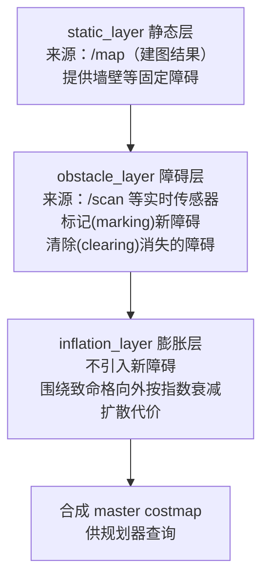

# 02 costmap 代价地图调参

> English version: [02_costmap_tuning.md](../en/40_navigation/02_costmap_tuning.md)

## 目标

- 理解分层代价地图（layered costmap）的三层结构与合成方式。
- 分清 global_costmap 与 local_costmap 的职责、尺寸与更新方式差异。
- 逐文件看懂 TB3 导航包中三个 costmap 参数文件的组织方式。
- 能针对"贴障碍走 / 离障碍太远 / 障碍残影"等典型问题下手调参。

## 原理简介

costmap_2d 把世界表示为栅格，每格一个代价值：`0`（自由）→ `1~252`（越大越危险）→ `253`（内切障碍，机器人中心到此必碰）→ `254`（致命障碍）→ `255`（未知）。地图由多个**层（layer 插件）**依次叠加而成：



- **static_layer**：把建图得到的占据栅格搬进来，只在地图更新时变化。
- **obstacle_layer**：用激光实时**标记**障碍；同时沿激光束**光线追踪（raytrace）**，把光束穿过的格子清空——这就是动态障碍走开后地图能恢复干净的机制。
- **inflation_layer**：以每个致命格为中心，代价按 `exp(-cost_scaling_factor × (distance - inscribed_radius))` 衰减，膨胀到 `inflation_radius` 为止。它让规划器"天然倾向"离障碍远一点，而不是贴边走。

### global vs local costmap

| 维度 | global_costmap | local_costmap |
| --- | --- | --- |
| 服务对象 | 全局规划器 | 局部规划器 |
| 坐标系 `global_frame` | `map` | `odom`（局部平滑，不受 amcl 跳变影响） |
| 尺寸 | 覆盖整张静态地图（`static_map: true`） | 固定小窗，TB3 为 3 m × 3 m |
| `rolling_window` | false | **true**：窗口跟随机器人滚动 |
| 典型层 | static + obstacle + inflation | obstacle + inflation（不含 static） |

## 分步操作：逐文件看 TB3 的参数组织

TB3 的 costmap 参数在 `turtlebot3_navigation/param/` 下分三个文件，由 `move_base.launch` 加载——common 文件被**加载两次**，分别落入两个 costmap 的命名空间：

```bash
roscd turtlebot3_navigation/param && ls
# costmap_common_params_burger.yaml  global_costmap_params.yaml  local_costmap_params.yaml ...
```

**① costmap_common_params_burger.yaml —— 两张图共用的部分（典型内容）：**

```yaml
obstacle_range: 3.0        # 该距离内的激光点才标记为障碍
raytrace_range: 3.5        # 沿光束清除障碍的最大距离，应 ≥ obstacle_range
footprint: [[-0.105, -0.105], [-0.105, 0.105], [0.041, 0.105], [0.041, -0.105]]
# robot_radius: 0.105      # 圆形机器人可用半径代替 footprint，二选一

inflation_radius: 1.0
cost_scaling_factor: 3.0

map_type: costmap
observation_sources: scan
scan: {sensor_frame: base_scan, data_type: LaserScan, topic: scan,
       marking: true, clearing: true}
```

**② global_costmap_params.yaml：**

```yaml
global_costmap:
  global_frame: map
  robot_base_frame: base_footprint
  update_frequency: 10.0
  publish_frequency: 10.0
  transform_tolerance: 0.5
  static_map: true
```

**③ local_costmap_params.yaml：**

```yaml
local_costmap:
  global_frame: odom
  robot_base_frame: base_footprint
  update_frequency: 10.0
  publish_frequency: 10.0
  transform_tolerance: 0.5
  static_map: false
  rolling_window: true
  width: 3
  height: 3
  resolution: 0.05
```

> **层插件的显式声明**：Noetic 下若不写 `plugins` 列表，costmap 会按 `static_map`/`rolling_window` 自动装载兼容层；工程上建议显式声明，一目了然且便于增删（如后续加 keepout 层）：
>
> ```yaml
> global_costmap:
>   plugins:
>     - {name: static_layer,    type: "costmap_2d::StaticLayer"}
>     - {name: obstacle_layer,  type: "costmap_2d::ObstacleLayer"}
>     - {name: inflation_layer, type: "costmap_2d::InflationLayer"}
> local_costmap:
>   plugins:
>     - {name: obstacle_layer,  type: "costmap_2d::ObstacleLayer"}
>     - {name: inflation_layer, type: "costmap_2d::InflationLayer"}
> ```

**验证加载结果与实时观察：**

```bash
# 确认参数真的进了对应命名空间
rosparam get /move_base/local_costmap/inflation_layer/inflation_radius

# rviz 中添加 Map 显示，话题分别选：
#   /move_base/global_costmap/costmap
#   /move_base/local_costmap/costmap
# Color Scheme 选 costmap，可看到从紫(致命)到蓝(低代价)的膨胀渐变
```

**动手实验（Gazebo 中验证障碍层）：** 保持 01 篇的导航环境运行，在 Gazebo 里 Insert 一个 unit_box 放到机器人前方 1 m 处：

1. rviz 的 local costmap 上应立即出现致命障碍与其膨胀圈（延迟约 1 个 `update_frequency` 周期）；
2. 在 Gazebo 中把箱子挪开，障碍应在 1~2 个周期内被 raytrace 清除；
3. 用 rqt_reconfigure（`move_base → local_costmap → inflation_layer`）把 `inflation_radius` 从 1.0 拖到 0.3，观察膨胀圈实时收缩——这是理解该参数最直观的方式。

## 关键参数详解

默认值核对自 `navigation/costmap_2d/cfg/*.cfg` 与 `plugins/obstacle_layer.cpp`：

| 参数 | 源码默认 | TB3 burger 值 | 说明 |
| --- | --- | --- | --- |
| `footprint` | `[]` | 四点多边形 | 机器人外轮廓（base 坐标系顶点列表）。非圆形机器人必填，与 `robot_radius` 二选一 |
| `robot_radius` | 0.46 m | — | 圆形机器人半径。宁大勿小，但大了过窄门就难 |
| `footprint_padding` | 0.01 m | — | 在 footprint 基础上外扩的安全垫 |
| `inflation_radius` | 0.55 m | 1.0 m | 膨胀半径。太小规划贴墙，太大窄道直接"封死" |
| `cost_scaling_factor` | 10.0 | 3.0 | 衰减系数，**越大衰减越快**、机器人越敢靠近障碍；越小则越绕着障碍走 |
| `obstacle_range` | 2.5 m | 3.0 m | 超过该距离的激光点不标记为障碍 |
| `raytrace_range` | 3.0 m | 3.5 m | 清障的光线追踪距离，需大于 `obstacle_range`，否则远处残影清不掉 |
| `update_frequency` | 5.0 Hz | 10.0 Hz | 地图内容更新频率。低了动态障碍反应慢，高了吃 CPU |
| `publish_frequency` | 0 Hz | 10.0 Hz | 仅影响可视化发布，不影响规划；实机可降到 1~2 Hz 省带宽 |
| `resolution` | 0.05 m/格 | 0.05 | 局部图分辨率。建议与静态地图一致；边缘单元降载可放宽到 0.1（见 04 篇） |
| `transform_tolerance` | 0.3 s | 0.5 s | 容忍的 TF 延迟，超时 costmap 停更并告警 |
| `max_obstacle_height` | 2.0 m | — | 高于此的观测点忽略（多用于 3D 传感器） |

经验法则：`inflation_radius` 至少 ≥ 机器人外接圆半径 + 期望安全间距；调"离障碍远近"优先动 `cost_scaling_factor`，其次才是 `inflation_radius`。

## 常见问题

**Q1：机器人贴着障碍走，转弯时甚至擦到？**
① `footprint` 量小了——用卷尺重新量外轮廓（含凸出的传感器支架）；② `inflation_radius` 太小或 `cost_scaling_factor` 太大，代价掉得太快，规划器认为贴边没成本。先把 `cost_scaling_factor` 从 10 降到 3 试试。

**Q2：机器人离障碍太远、窄门死活不过？**
反向问题：`inflation_radius` 太大把门"糊死"了。rviz 看 global costmap，若门洞两侧膨胀区连成一片即确诊。减小 `inflation_radius`、增大 `cost_scaling_factor`；分辨率 0.1 的地图过 0.6 m 窄门也难，考虑用 0.05。

**Q3：动态障碍（人）走开了，costmap 上残影不消？**
清除靠 raytrace：① 确认观测源 `clearing: true`；② `raytrace_range` 必须大于障碍所在距离，且 > `obstacle_range`；③ 残影在激光扫不到的高度/角度（如激光装得高、障碍是矮箱子），激光束越不过去就永远清不掉——这是 2D 激光的物理局限，只能靠恢复行为或 `rosservice call /move_base/clear_costmaps "{}"` 手动清。

**Q4：costmap 整体不更新、机器人视而不见地撞上去？**
看 move_base 终端：刷 `Costmap2DROS transform timeout` → TF 延迟超过 `transform_tolerance`（时钟不同步或 CPU 过载）；刷 `The origin for the sensor at ... is out of map bounds` → 传感器 frame 配置错误；`rostopic hz /scan` 无输出 → 传感器断了。也检查 `observation_sources` 的 `topic`/`sensor_frame` 拼写。

**Q5：仿真里正常，实机 global costmap 一片空白？**
`static_map: true` 但没起 map_server，或 `/map` 话题名不一致。`rostopic echo -n1 /map/info` 验证。

## 下一步

代价地图就绪后，决定运动品质的就是局部规划器 → [03 DWA 与 TEB 局部规划器](03_DWA与TEB局部规划器.md)。
