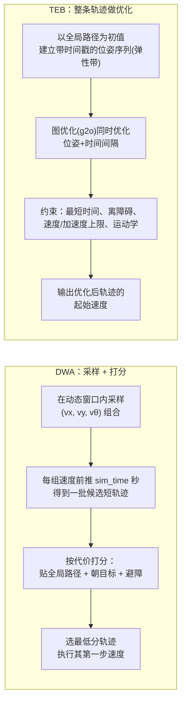

# 03 DWA 与 TEB 局部规划器

## 目标

- 直观理解 DWA（采样评分）与 TEB（弹性带优化）两种局部规划思路的本质差异。
- 掌握两者的核心参数（默认值均已对照本仓库源码 cfg 核实）。
- 学会安装 TEB 并在 move_base 中一行参数完成切换。
- 能按底盘类型（差速/全向/阿克曼）与算力做选型，并用 rqt_reconfigure 在线调参。

## 原理简介



- **DWA**（`dwa_local_planner/DWAPlannerROS`）：每个控制周期在当前速度可达的"动态窗口"里采样若干 `(vx, vθ)`，把每组速度模拟 `sim_time` 秒得到候选轨迹，用三个代价项加权打分取最优。**只在采样集合里挑**，不会创造采样之外的机动（比如倒车绕行），计算量小且稳定可控。
- **TEB**（`teb_local_planner/TebLocalPlannerROS`）：把局部轨迹当成一条可拉伸的"橡皮筋"，用图优化同时变形整条轨迹（含每段时间），在时间最优、避障、运动学约束间求平衡。能主动倒车、切障碍间隙、支持最小转弯半径（阿克曼），代价是 CPU 占用明显更高、参数更多。

## DWA 参数详解

默认值核对自 `navigation/dwa_local_planner/cfg/DWAPlanner.cfg` 与 `base_local_planner/src/local_planner_limits/__init__.py`；TB3 列为 `turtlebot3_navigation/param/dwa_local_planner_params_burger.yaml` 的典型值。命名空间 `/move_base/DWAPlannerROS/`：

| 参数 | 源码默认 | TB3 burger | 说明 |
| --- | --- | --- | --- |
| `max_vel_x` / `min_vel_x` | 0.55 / 0.0 | 0.22 / -0.22 | 前向速度上下限 (m/s)，min 为负允许倒车 |
| `max_vel_trans` / `min_vel_trans` | 0.55 / 0.1 | 0.22 / 0.11 | 合成平移速度上下限；min 过小时机器人容易"蠕动" |
| `max_vel_theta` / `min_vel_theta` | 1.0 / 0.4 | 2.75 / 1.37 | 角速度上限/下限 (rad/s) |
| `acc_lim_x` / `acc_lim_theta` | 2.5 / 3.2 | 2.5 / 3.2 | 加速度限制，务必填底盘真实能力，虚高会导致轨迹执行不出来 |
| `sim_time` | 1.7 s | 1.5 | 轨迹前推时长。短(≤1.5)机动灵活但短视，长(≥3)平滑但转弯保守、算量大 |
| `vx_samples` / `vth_samples` | 3 / 20 | 20 / 40 | x/θ 方向采样数。差速车 `vy_samples` 必须为 0（TB3 即如此，源码默认 10 是给全向车的） |
| `path_distance_bias` | 0.6 | 32.0* | 贴近全局路径的权重 |
| `goal_distance_bias` | 0.8 | 20.0* | 冲向局部目标的权重 |
| `occdist_scale` | 0.01 | 0.02 | 避障权重，太大机器人畏缩不前，太小贴障碍 |
| `xy_goal_tolerance` | 0.1 m | 0.05 | 到点判定的位置容差 |
| `yaw_goal_tolerance` | 0.1 rad | 0.17 | 到点判定的角度容差 |
| `sim_granularity` | 0.025 m | 0.025 | 轨迹碰撞检查步长 |

> \* TB3 的 bias 值与源码默认量级不同是正常的：三个权重只有**相对比例**有意义。经典配比 `path:goal:occdist ≈ 32:24:0.01`（ROS wiki 常用起点）。想让机器人更守路线就加大 path 项，想更果断冲目标就加大 goal 项。

## TEB 安装与切换

### 方式一：apt 安装（推荐）

```bash
sudo apt update && sudo apt install ros-noetic-teb-local-planner
```

### 方式二：源码编译（本套件 fork）

```bash
cd ~/workspace/ws_romindly/src
git clone https://github.com/Romindly-Dev/teb_local_planner.git   # 已有则跳过
cd .. && rosdep install --from-paths src --ignore-src -r -y       # 会装 g2o 等依赖
catkin_make -DCMAKE_BUILD_TYPE=Release && source devel/setup.bash
```

### 切换方法

局部规划器是插件，只改一个参数。复制 TB3 的 move_base.launch 后修改：

```xml
<node pkg="move_base" type="move_base" name="move_base" output="screen">
  <param name="base_local_planner" value="teb_local_planner/TebLocalPlannerROS"/>
  <rosparam file="$(find your_pkg)/param/teb_local_planner_params.yaml" command="load"/>
  <!-- 其余 costmap 参数文件保持不变 -->
</node>
```

TB3 burger 的最小可用 `teb_local_planner_params.yaml` 起点：

```yaml
TebLocalPlannerROS:
  odom_topic: odom
  # 速度/加速度按 burger 实际能力
  max_vel_x: 0.22
  max_vel_x_backwards: 0.1
  max_vel_theta: 2.75
  acc_lim_x: 2.5
  acc_lim_theta: 3.2
  min_turning_radius: 0.0          # 差速车
  footprint_model:
    type: "point"
  # 障碍
  min_obstacle_dist: 0.15          # point 模型需包含机器人半径(约0.105)+余量
  inflation_dist: 0.3
  include_costmap_obstacles: true
  # 目标容差
  xy_goal_tolerance: 0.05
  yaw_goal_tolerance: 0.17
```

验证：move_base 启动日志出现 `Created local_planner teb_local_planner/TebLocalPlannerROS`，rviz 添加 `/move_base/TebLocalPlannerROS/local_plan`（Path）与 `teb_poses`（PoseArray）可看到弹性带轨迹。之后按 01 篇流程发目标即可对比两种规划器的行为差异——最直观的实验：把目标发到机器人**正后方 0.5 m**，DWA 会先原地掉头，TEB 通常直接倒车。

## TEB 参数详解

默认值核对自 `teb_local_planner/cfg/TebLocalPlannerReconfigure.cfg`，命名空间 `/move_base/TebLocalPlannerROS/`：

| 参数 | 默认 | 说明 |
| --- | --- | --- |
| `max_vel_x` / `max_vel_theta` | 0.4 / 0.3 | 速度上限（TB3 burger 改 0.22 / 2.75） |
| `max_vel_x_backwards` | 0.2 | 倒车速度上限。设很小(如 0.02)可基本抑制倒车，**不要设 0**（会破坏优化数值稳定性，官方建议配合 `weight_kinematics_forward_drive` 抑制） |
| `acc_lim_x` / `acc_lim_theta` | 0.5 / 0.5 | 加速度限制 |
| `min_turning_radius` | 0.0 | **阿克曼支持关键参数**：差速车 0；阿克曼车填最小转弯半径，并配 `wheelbase`（默认 1.0）与 `cmd_angle_instead_rotvel`（输出舵角代替角速度） |
| `footprint_model` | `point` | 碰撞模型（非动态参数，写 yaml）：`point`/`circular`/`line`/`two_circles`/`polygon`。越复杂越精确也越耗时；TB3 用 point + 合理 `min_obstacle_dist` 即可 |
| `min_obstacle_dist` | 0.5 | 与障碍最小间距（以 footprint_model 边界计）。point 模型时要含机器人半径 |
| `inflation_dist` | 0.6 | 非致命惩罚缓冲带，应 > `min_obstacle_dist` |
| `dt_ref` | 0.3 s | 轨迹时间分辨率，约 1/控制频率量级 |
| `max_global_plan_lookahead_dist` | 3.0 m | 每次优化截取的全局路径长度 |
| `no_inner_iterations` / `no_outer_iterations` | 5 / 4 | 优化迭代次数，**降 CPU 首选下调项** |
| `weight_optimaltime` | 1 | 时间最优权重，加大则更激进抄近路 |
| `weight_obstacle` | 50 | 避障权重 |
| `weight_kinematics_nh` | 1000 | 非完整约束权重（差速/阿克曼保持大值；全向车调小） |
| `weight_kinematics_forward_drive` | 1 | 抑制倒车权重，不想倒车调到 1000 |
| `weight_kinematics_turning_radius` | 1 | 最小转弯半径约束权重（阿克曼） |
| `weight_max_vel_x` / `weight_acc_lim_x` | 2 / 1 | 速度/加速度上限的软约束权重 |
| `weight_viapoint` | 1 | 贴全局路径权重（配 `global_plan_viapoint_sep` > 0 生效） |
| `xy_goal_tolerance` / `yaw_goal_tolerance` | 0.2 / 0.1 | 到点容差 |

## 选型建议

| 场景 | 推荐 | 理由 |
| --- | --- | --- |
| 差速底盘、规则室内环境 | DWA | 参数少、稳定、CPU 低，够用 |
| 差速底盘、狭窄/动态环境、需要倒车机动 | TEB | 能倒车绕行、走廊会车表现好 |
| 全向底盘（麦轮） | DWA（`vy_samples`>0）或 TEB（设 `max_vel_y`、降 `weight_kinematics_nh`） | 两者都支持横移 |
| 阿克曼（前轮转向） | **只能 TEB** | DWA 无最小转弯半径概念；TEB 设 `min_turning_radius` + `cmd_angle_instead_rotvel` |
| 算力紧张的边缘单元 | DWA | 实测 TEB 单核占用约为 DWA 的 2~5 倍，且随障碍数增长 |

## rqt_reconfigure 在线调参演示

```bash
rosrun rqt_reconfigure rqt_reconfigure
```

左侧展开 `move_base`，可见 `DWAPlannerROS`（或 `TebLocalPlannerROS`）、`global_costmap`、`local_costmap` 等子项。建议实验流程：机器人执行一个较远目标的同时，① 把 DWA 的 `path_distance_bias` 从 32 拖到 5，观察轨迹立刻开始抄近路偏离绿线；② 拖回并把 `occdist_scale` 加到 0.5，观察过窄处明显减速绕行。**注意**：rqt 改的是运行时内存值，重启即失效，调好后务必抄回 yaml 文件。

## 常见问题

**Q1：DWA 报 `DWA planner failed to produce path`？** 采样里没有一条无碰撞轨迹。见 04 篇专项排查。

**Q2：TEB 轨迹抖动、机器人一冲一停？** `dt_ref` 与控制频率不匹配，或迭代次数不够导致每周期解不一致；也检查 CPU 是否已跑满（`top` 看 move_base）。

**Q3：TEB 老是莫名倒车？** 加大 `weight_kinematics_forward_drive`（如 1000），减小 `max_vel_x_backwards`。

## 下一步

单个模块都会调之后，还需要一套整机联调方法 → [04 导航调优清单与常见故障](04_导航调优清单与常见故障.md)。
