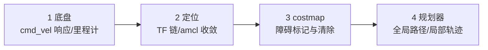

# 04 导航调优清单与常见故障

> English version: [04_tuning_and_troubleshooting.md](../en/40_navigation/04_tuning_and_troubleshooting.md)

## 目标

- 拿到一份"底盘 → 定位 → costmap → 规划器"自底向上的系统化调优 checklist。
- 遇到典型故障（打转、震荡、穿障、恢复行为频发、TF 报错等）能按表定位原因。
- 了解 cmd_vel 限幅、急停接入等速度安全措施。
- 掌握在 x86 边缘计算单元上评估与降低导航栈资源占用的手段。

## 原理简介：为什么按这个顺序调

导航是层层依赖的：规划器的输出品质封顶于 costmap 质量，costmap 封顶于定位与 TF，定位封顶于底盘里程计与传感器。**上层的问题经常是下层欠账**——例如"局部规划总失败"的根因可能只是里程计标定差。所以永远自底向上排查，不要一上来就狂调规划器权重。



## 分步操作：系统化调优 checklist

### 第 1 层：底盘

```bash
# 1.1 开环速度测试：发 0.1 m/s，机器人应匀速直行，方向正确
rostopic pub -r 10 /cmd_vel geometry_msgs/Twist '{linear: {x: 0.1}}'
# 1.2 里程计直线标定：直行实际 2.0 m，比较 /odom 读数，误差应 < 2%
rostopic echo /odom/pose/pose/position/x
# 1.3 旋转标定：原地转 360°，yaw 应回到起始值（误差 < 5°）
```

- [ ] cmd_vel 到轮速延迟 < 100 ms（延迟大则局部规划整体不稳）
- [ ] 确认底盘真实的最大速度与加速度，如实填进规划器参数（虚高是众多"轨迹执行不出来"问题的根源）

### 第 2 层：定位

- [ ] `rosrun rqt_tf_tree rqt_tf_tree`：`map→odom→base_footprint→base_scan` 链完整、无重复父节点
- [ ] `rostopic hz /scan` 频率稳定；rviz 中激光点与地图墙壁贴合
- [ ] 推着机器人走 10 m，amcl 粒子云保持收拢、位姿不跳变
- [ ] 全机 NTP 时间同步（多机部署时 `ntpdate`/chrony），`rosrun tf tf_monitor` 看各变换延迟

### 第 3 层：costmap

- [ ] rviz 叠加 local costmap：真实障碍出现 ≤ 0.2 s，移走后 1~2 个更新周期内清除
- [ ] 膨胀渐变带宽度目视 ≈ `inflation_radius`；窄门处两侧膨胀不粘连
- [ ] move_base 终端无 `transform timeout` / `sensor out of bounds` 告警
- [ ] footprint 实测核对（含外凸部件），`footprint_padding` ≥ 0.01

### 第 4 层：规划器

- [ ] 全局：目标发到地图各角落均能出路径，且路径不擦膨胀区内侧
- [ ] 局部：直行段速度能到 `max_vel_x` 的 90% 以上（到不了说明代价权重过保守或加速度限制过严）
- [ ] 到点：末端不磨蹭（容差合理）、不反复调头
- [ ] 压力测试：动态放/移障碍 10 次，恢复行为触发 ≤ 1 次

## 典型故障排查表

| 现象 | 常见原因 | 对策 |
| --- | --- | --- |
| 一发目标就原地打转 | ① 里程计角速度标定错/左右轮反了；② `min_vel_theta`（含 min_in_place）大于实际能转出的速度；③ 局部规划失败进入 rotate_recovery 循环 | 先做第 1 层旋转标定；看终端是否周期打印 recovery 日志；降低 `min_vel_theta` |
| 目标附近震荡不停、到不了点 | `xy_goal_tolerance`/`yaw_goal_tolerance` 小于底盘控制精度；DWA 末端速度采样过粗 | 放宽容差（差速车建议 xy ≥ 0.05 m、yaw ≥ 0.1 rad）；DWA 可设 `latch_xy_goal_tolerance: true`（进圈即锁定，只调航向）；设置 `oscillation_timeout` 兜底 |
| 全局路径穿过障碍规划 | ① 静态地图与现场不符（挪过家具）；② 障碍只在激光盲区（矮/高于扫描面）；③ global costmap 未加载 obstacle_layer | 重建图或用 keepout 手段；确认 `plugins` 列表含 obstacle_layer；盲区障碍加超声/深度相机观测源 |
| 恢复行为频繁触发（反复清图+转圈） | 下层欠账的总症状：TF 延迟、costmap 残影堵路、速度/加速度参数与底盘不符、`planner_patience` 过短 | 按 checklist 自底向上过一遍；观察触发前终端最后一条 WARN 定位是 planner 还是 controller 超时 |
| `DWA planner failed to produce path`（could not find valid trajectory） | 采样窗内无一条无碰撞轨迹：机器人已陷入膨胀区/障碍贴身；`acc_lim` 填得比实际小导致窗口过窄；`sim_time` 过长使所有轨迹都撞到远处障碍 | 手动清图 `rosservice call /move_base/clear_costmaps "{}"` 或遥控退出障碍区；核实 acc_lim；`sim_time` 降到 1.5；`occdist_scale` 略降 |
| TF 报 `Lookup would require extrapolation into the past/future` | 消息时间戳与 TF 缓存不匹配：多机时钟不同步；传感器驱动打了错误时间戳；CPU 过载 TF 发布延迟 | 校时（chrony）；`rosrun tf tf_monitor` 看平均延迟，适当调大 `transform_tolerance`（治标）；根治靠降载（见下节） |
| 机器人过门/窄道停住不走 | 膨胀区粘连（见 02 篇 Q2） | 减 `inflation_radius`、增 `cost_scaling_factor`、地图分辨率提到 0.05 |
| 到达后 status 一直 ACTIVE 不结 | 局部规划器已停车但 yaw 差一点点又转不动 | 放宽 `yaw_goal_tolerance`；检查 `theta_stopped_vel` |

### 排障常用命令速查

```bash
# 手动清空两张 costmap（残影堵路时最快的临时解）
rosservice call /move_base/clear_costmaps "{}"

# 取消当前目标（机器人在恢复循环里出不来时）
rostopic pub -1 /move_base/cancel actionlib_msgs/GoalID -- {}

# 只让全局规划器算一条路径而不执行（验证"能不能规划"与"能不能执行"是两个问题）
rosservice call /move_base/make_plan "start: {header: {frame_id: map}}
goal: {header: {frame_id: map}, pose: {position: {x: 1.0, y: 0.5}, orientation: {w: 1.0}}}
tolerance: 0.1"

# TF 健康度：看各链路的平均延迟与最大延迟
rosrun tf tf_monitor

# 录一段"事故现场"供离线分析（出问题前先开着）
rosbag record /tf /tf_static /scan /odom /cmd_vel /move_base/status \
  /move_base/global_costmap/costmap /move_base/local_costmap/costmap -o nav_debug
```

判读技巧：故障发生时**第一时间看 move_base 终端最后 10 行**。是 `planner` 相关 WARN → 全局侧（costmap/地图/目标点问题）；是 `controller`/`Could not find a valid trajectory` → 局部侧（速度参数/局部障碍）；是 `transform`/`extrapolation` → 直接跳到 TF 排查，别碰规划器参数。

## 速度平滑与安全

导航输出的 `/cmd_vel` 是阶跃指令，直接驱动电机会顿挫甚至翻倒高重心机器人。建议接入链路：

```text
move_base → /cmd_vel_raw → 速度平滑/限幅节点 → /cmd_vel → 底盘（硬件急停回路独立）
```

- **限幅与平滑**：可用 `yocs_velocity_smoother`（apt: `ros-noetic-yocs-velocity-smoother`）做速度、加速度双限幅；或自写 20 行节点对 Twist 做斜坡限制。上限值取"底盘物理极限 × 0.8"，且与规划器内参数一致，避免两处打架。
- **看门狗**：底盘驱动侧务必实现 cmd_vel 超时刹车（如 0.5 s 无新指令即停），防止 move_base 崩溃后机器人带着最后一条速度冲出去。
- **急停**：硬件急停必须切断电机功率回路，**不要**依赖软件订阅 `/e_stop` 话题实现"急停"——ROS 1 无实时保证。软件层可另加 mux（`topic_tools/mux` 或 `twist_mux`）让手柄/急停话题优先级高于导航。
- 上电自检脚本里加入：`rostopic hz /cmd_vel` 有值时轮子必须在动，反之亦然（检测驱动脱链）。

## x86 边缘单元的资源占用与降载

参考量级（TB3 类小车 + 单线激光 + 本套件 x86 边缘单元，供预算用，实测为准）：

| 组件 | 典型单核 CPU | 主要影响因子 |
| --- | --- | --- |
| move_base + 双 costmap + DWA | 15%~35% | costmap 尺寸/分辨率/update_frequency、controller_frequency |
| 换 TEB 后 | 上表 × 2~5 | 障碍数量、no_*_iterations、footprint_model 复杂度 |
| amcl | 5%~15% | 粒子数 |
| gazebo（仅仿真） | 100%+ | 仿真环境自身，实机不存在 |

监测：`top -H -p $(pgrep -f move_base)`；若 move_base 打印 `Control loop missed its desired rate of 20.0Hz`，说明已经算不过来。

**降载手段（按性价比排序）：**

1. `local_costmap` 分辨率 0.05 → 0.1（面积不变格子数 1/4，注意窄门通过性）；
2. `update_frequency` 10 → 5 Hz，`publish_frequency` 降到 1~2 Hz（后者只影响可视化）；
3. `controller_frequency` 20 → 10 Hz（配套把 TEB `dt_ref` 调到 ~0.1/频率量级）；
4. 缩小 local costmap 窗口（如 4×4 m → 3×3 m）；
5. TEB：`no_inner_iterations` 5→3、`no_outer_iterations` 4→3、`max_global_plan_lookahead_dist` 3.0→2.0，或干脆换回 DWA；
6. `planner_frequency` 降到 0.5 Hz 或 0（按需重规划）；
7. 关闭不用的调试发布（TEB `publish_feedback: false`，rviz 不看时关掉 costmap 显示——订阅本身会触发发布开销）。

## 常见问题

**Q1：调优顺序能跳吗？比如直接调 DWA 权重？**
可以微调，但只要出现"系统性"问题（频繁恢复、随机失败），一律回到 checklist 第 1 层重来。90% 的诡异导航问题最终定位在里程计、TF 时间戳或 footprint 上。

**Q2：参数在仿真调好了，实机要重调吗？**
costmap 结构与规划器权重基本可复用；但速度/加速度上限、footprint、`transform_tolerance`、传感器观测源必须按实机重填。建议为仿真与实机维护两套 yaml，launch 里用 arg 切换。

**Q3：如何量化"调好了"？**
定 5 个固定目标点循环 20 圈，统计：成功率（≥ 95%）、平均到点时间、恢复行为触发次数（≤ 1 次/圈）、最小过障间距。数据比手感可靠。循环发点可用一个小脚本基于 actionlib 依次发送并统计 `result`：

```python
#!/usr/bin/env python3
import rospy, actionlib
from move_base_msgs.msg import MoveBaseAction, MoveBaseGoal

GOALS = [(1.0, 0.5, 0.0), (-1.5, 0.0, 1.57), (0.0, -1.0, 3.14)]  # x, y, yaw
rospy.init_node('nav_bench')
cli = actionlib.SimpleActionClient('move_base', MoveBaseAction)
cli.wait_for_server()
ok = 0
for i, (x, y, yaw) in enumerate(GOALS):
    import tf.transformations as t
    g = MoveBaseGoal()
    g.target_pose.header.frame_id = 'map'
    g.target_pose.header.stamp = rospy.Time.now()
    g.target_pose.pose.position.x, g.target_pose.pose.position.y = x, y
    q = t.quaternion_from_euler(0, 0, yaw)
    g.target_pose.pose.orientation.z, g.target_pose.pose.orientation.w = q[2], q[3]
    t0 = rospy.Time.now()
    cli.send_goal(g)
    cli.wait_for_result(rospy.Duration(120))
    state = cli.get_state()          # 3 = SUCCEEDED
    ok += (state == 3)
    rospy.loginfo("goal %d: state=%d, %.1fs", i, state, (rospy.Time.now()-t0).to_sec())
rospy.loginfo("success %d/%d", ok, len(GOALS))
```

## 本章小结

至此你已具备：看懂 move_base 数据流（01）、按层调 costmap（02）、按底盘选并调局部规划器（03）、以及系统化联调与故障定位（本篇）。下一章将进入传感器驱动与实机部署 → [45 传感器驱动](../45_传感器驱动/README.md)。
