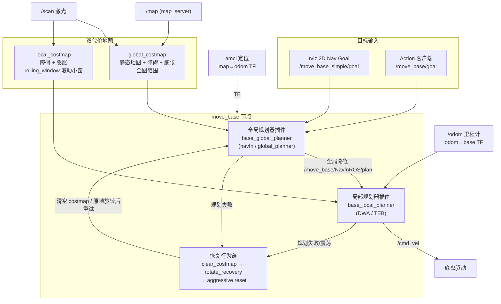

# 40 导航

本章围绕 ROS1 Noetic 导航栈（navigation stack）展开：从 move_base 架构、代价地图调参，到局部规划器选型与系统化调优清单。目标是让你能在 TurtleBot3 仿真中跑通完整导航流程，并具备把同一套方法迁移到实机底盘的能力。

## 本章小节

| 序号 | 文档 | 内容 |
| --- | --- | --- |
| 01 | [move_base 架构与快速上手](01_move_base架构与快速上手.md) | 数据流、插件机制、恢复行为链、TB3 完整演示、实机接入检查清单 |
| 02 | [costmap 代价地图调参](02_costmap代价地图调参.md) | static/obstacle/inflation 三层结构，global vs local costmap，逐文件参数讲解 |
| 03 | [DWA 与 TEB 局部规划器](03_DWA与TEB局部规划器.md) | 采样 vs 优化原理对比、参数表、TEB 安装切换、底盘选型建议 |
| 04 | [导航调优清单与常见故障](04_导航调优清单与常见故障.md) | 系统化调优 checklist、故障排查表、速度平滑与安全、边缘单元降载 |

## move_base 一图流

一句话理解：**全局规划器**在 global_costmap 上算一条从当前位置到目标的路径；**局部规划器**在 local_costmap 上跟踪这条路径并实时避障，输出 `/cmd_vel`；两者任一持续失败时，**恢复行为链**依次清理代价地图、原地旋转，仍不行才宣告目标失败（aborted）。

## 前置条件

- 已完成 [30 定位](../30_定位/README.md)：导航依赖 `map → odom → base_link` 完整 TF 链与一张 2D 栅格地图。
- 已完成 [20 2D 建图](../20_2D建图/README.md)：手上有 `map.yaml` + `map.pgm`。
- 仿真环境：Ubuntu 20.04 + ROS Noetic + TurtleBot3 Gazebo（`turtlebot3_gazebo`、`turtlebot3_navigation` 均已安装）。

## 源码参照

本章参数均已对照工作空间内源码核实，遇到文档与源码不一致时以源码为准：

- `~/workspace/ws_romindly/src/navigation/`（move_base、costmap_2d、dwa_local_planner、global_planner 等，fork 自 ros-planning，noetic-devel 分支）
- `~/workspace/ws_romindly/src/teb_local_planner/`（fork 自 rst-tu-dortmund）
