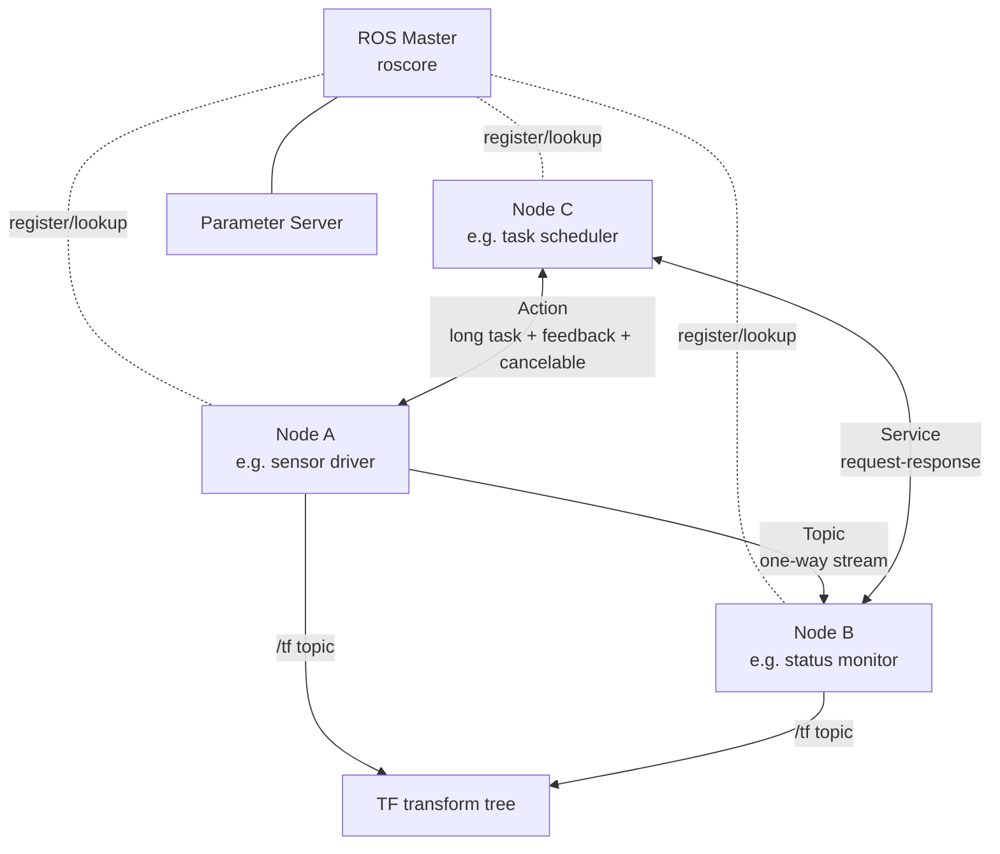
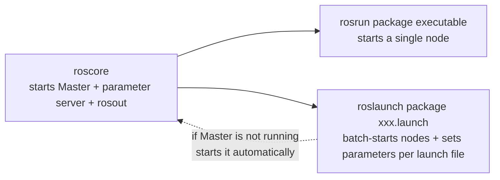

# 01 Core Concepts Overview

> 中文版 / Chinese: [01_核心概念总览.md](../../10_ROS1基础/01_核心概念总览.md)

## Goals

- Understand the overall ROS1 architecture: the roles of the Master, nodes, topics, services, Actions, the parameter server, and TF
- Understand the core abstraction of the "Computation Graph"
- Distinguish the relationship between the three commands `roscore`, `rosrun`, and `roslaunch`
- Know the directory structure of packages and workspaces, and what `package.xml` and `CMakeLists.txt` are each responsible for
- Be able to choose correctly between topics / services / Actions for a given scenario

## How It Works

### ROS1 Architecture

ROS1 is not an operating system; it is a **distributed inter-process communication framework + toolchain + ecosystem**. A robot application is split into multiple independent processes (nodes). Nodes exchange data through topics, services, and Actions, with the Master acting as the "matchmaker" that connects them.



Responsibilities of each component:

| Component | Responsibility |
|---|---|
| **Master** | Name service. Nodes register with it at startup; publishers and subscribers find each other through it. Note: **data does not pass through the Master** — nodes establish point-to-point connections and transfer data directly |
| **Node** | An executable process performing a single function (driver, algorithm, monitoring, etc.). Cross-language: C++ (roscpp) and Python (rospy) nodes interoperate freely |
| **Topic** | One-way, many-to-many asynchronous message stream, suited to continuous data such as sensor readings |
| **Service** | One-to-one synchronous request-response, suited to short "ask once, answer once" tasks |
| **Action** | A long-running-task protocol built on top of topics, supporting mid-task feedback and cancellation |
| **Parameter server** | A global key-value dictionary attached to the Master, storing configuration parameters (e.g. wheel diameter, maximum speed) |
| **TF** | Maintains a tree of time-varying transforms between coordinate frames (e.g. `map → odom → base_link`); underneath it is also a topic (`/tf`) |

### The Computation Graph

All running nodes, topics, and service connections form a directed graph called the **computation graph**. Nodes are the vertices; topics are the edges. `rqt_graph` shows this graph in real time — when debugging "why is my message not received", the first thing to check is whether the two nodes are connected in the computation graph.

### roscore, rosrun, roslaunch



- `roscore`: starts the Master, the parameter server, and the logging node `rosout`. **Run exactly one per machine (per ROS network)**.
- `rosrun <package> <executable>`: starts one node from a package, provided the Master is already running.
- `roslaunch <package> <file>.launch`: starts multiple nodes at once as described in XML, loads parameters, remaps topics; if no Master is detected it **automatically starts roscore**.

### Packages and Workspaces

The standard structure of a catkin workspace (using this tutorial suite as an example):

```
~/ws_romindly/
├── src/                      # source space: all packages go here
│   └── romindly_ros1_tutorials/
│       ├── romindly_msgs/    # one package = one functional unit
│       │   ├── package.xml
│       │   ├── CMakeLists.txt
│       │   ├── msg/  srv/  action/
│       ├── topic_demo/
│       ├── service_demo/
│       └── action_demo/
├── build/                    # intermediate artifacts produced by catkin_make
└── devel/                    # generated executables, message headers, setup.bash
```

Every package must have two files:

- **`package.xml`**: the package's "identity card". Declares the package name, version, maintainer, license, and **dependencies** (`build_depend` for build-time / `exec_depend` for run-time). rosdep uses it to install system dependencies, and catkin uses it to determine build order. See [romindly_msgs/package.xml](https://github.com/Romindly-Dev/romindly_ros1_tutorials/blob/main/romindly_msgs/package.xml).
- **`CMakeLists.txt`**: the package's "build script". Declares which executables to compile, which libraries to link, which messages to generate, and which scripts to install. See [topic_demo/CMakeLists.txt](https://github.com/Romindly-Dev/romindly_ros1_tutorials/blob/main/topic_demo/CMakeLists.txt).

`source devel/setup.bash` registers this workspace into ROS's package search path; only after that can `rosrun`/`roslaunch` find your packages. **You must source it in every new terminal** (or add it to `~/.bashrc`).

### Choosing Between Topics, Services, and Actions

| Dimension | Topic | Service | Action |
|---|---|---|---|
| Communication model | Publish/subscribe, asynchronous | Request/response, synchronous blocking | Goal/feedback/result, asynchronous |
| Connection relationship | Many-to-many | One-to-one | One-to-one |
| Return value | None | Yes | Yes (result + progress feedback) |
| Cancelable mid-way | — (it is a stream by nature) | No | **Yes (preempt)** |
| Typical duration | Continuous | Milliseconds to seconds | Seconds to minutes |
| Typical scenarios | Sensor data, status broadcasts, velocity commands | Query status, trigger a one-off computation, switch modes | Navigate to a goal, arm motion, countdown |
| Example in this suite | `topic_demo` | `service_demo` | `action_demo` |

**Rule of thumb**: use topics for data streams; use services for quick one-question-one-answer exchanges; use Actions for long tasks that need progress and may be canceled.

## Running the Example

First build and load the environment (all later tutorials assume this step has been done):

```bash
cd ~/ws_romindly && catkin_make && source devel/setup.bash
```

Start the Master and observe the initial members of the computation graph:

```bash
# Terminal 1
roscore
```

```bash
# Terminal 2
rosnode list
rostopic list
```

Expected output:

```
/rosout

/rosout
/rosout_agg
```

Even with no nodes started, a log-aggregation node `/rosout` is running. Now start a real node and watch the computation graph change:

```bash
# Terminal 2
rosrun topic_demo talker
```

```bash
# Terminal 3
rosnode list          # /talker_cpp appears
rostopic list         # /robot_status appears
rosnode info /talker_cpp
```

`rosnode info` shows the topics this node publishes/subscribes to and its connection information with the Master — this is "reading" the computation graph from the command line.

## Code Walkthrough

This part focuses on concepts; code details are left to the next three parts. Here we only look at how a package's "skeleton" declares itself. Take [romindly_msgs/package.xml](https://github.com/Romindly-Dev/romindly_ros1_tutorials/blob/main/romindly_msgs/package.xml) as an example:

```xml
<name>romindly_msgs</name>
<buildtool_depend>catkin</buildtool_depend>
<build_depend>message_generation</build_depend>
<exec_depend>message_runtime</exec_depend>
```

- `buildtool_depend`: the build tool; for ROS1 this is always `catkin`
- `build_depend`: needed at build time (generating message code requires `message_generation`)
- `exec_depend`: needed at run time (other nodes need `message_runtime` to load the messages)

Next, the three key lines of [topic_demo/CMakeLists.txt](https://github.com/Romindly-Dev/romindly_ros1_tutorials/blob/main/topic_demo/CMakeLists.txt):

```cmake
add_executable(talker src/talker.cpp)            # declare the executable
target_link_libraries(talker ${catkin_LIBRARIES}) # link the ROS libraries
add_dependencies(talker ${catkin_EXPORTED_TARGETS}) # ensure message headers are generated before compiling
```

`add_dependencies` is often forgotten by beginners: it guarantees that the message headers of `romindly_msgs` are generated before `talker.cpp` is compiled; otherwise a parallel build may fail with "RobotStatus.h not found".

## Hands-on Exercises

1. Run `rosrun topic_demo talker` and `rosrun topic_demo listener` in turn, then run `rqt_graph` and take a screenshot of the computation graph showing the two nodes connected through `/robot_status`; then kill the talker and refresh rqt_graph to see how the graph changes.
2. Under `~/ws_romindly/src`, create a new empty package with `catkin_create_pkg my_first_pkg roscpp rospy`, open the generated `package.xml` and `CMakeLists.txt`, locate the dependency declarations using this article as a reference, then run `catkin_make` to confirm it builds.

## FAQ

**Q1: `rosrun` fails with `Unable to communicate with master`?**
The Master is not running. Start `roscore` in a separate terminal first (`roslaunch` starts it automatically).

**Q2: `rosrun: package 'topic_demo' not found`?**
The current terminal has not sourced the workspace. Run `source ~/ws_romindly/devel/setup.bash`; adding it to `~/.bashrc` is recommended.

**Q3: Can I run two roscores?**
A single ROS network can have only one Master. A second `roscore` will error out immediately. Multi-robot setups usually share one Master (with `ROS_MASTER_URI` pointing to the same machine).

**Q4: If the Master dies, do communicating nodes get disconnected?**
Established topic connections are point-to-point and do not drop immediately; but new nodes can no longer register and no new connections can be made. In production, keep roscore running reliably.
