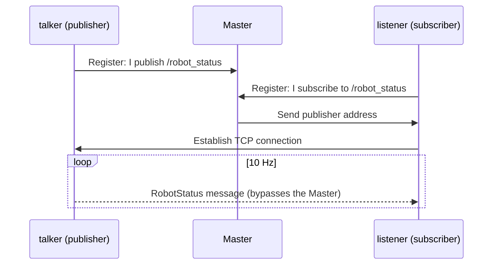

# 02 Topic Communication

> 中文版 / Chinese: [02_话题通信.md](../../10_ROS1基础/02_话题通信.md)

## Goals

- Understand the publish/subscribe model and how a topic connection is established
- Be able to define custom messages (using `RobotStatus.msg` as an example: fields, constants, Header)
- Read and understand both the C++ and Python publisher/subscriber code
- Understand the meaning of `queue_size`
- Be able to observe topics with `rostopic echo/hz/info` and `rqt_graph`

Companion code: [topic_demo](https://github.com/Romindly-Dev/romindly_ros1_tutorials/tree/main/topic_demo), [romindly_msgs](https://github.com/Romindly-Dev/romindly_ros1_tutorials/tree/main/romindly_msgs)

## How It Works

A topic is a **one-way, asynchronous, many-to-many** message stream. Publishers only send onto the topic; subscribers only receive. The two sides are unaware of each other and never wait for each other. The Master only brokers the connection; afterwards messages travel over point-to-point TCP connections between nodes (TCPROS).



Key point: the topic name and message type must match on both sides for the connection to work; a topic can have multiple publishers and multiple subscribers.

### Message Definition: RobotStatus.msg

The custom message lives in [romindly_msgs/msg/RobotStatus.msg](https://github.com/Romindly-Dev/romindly_ros1_tutorials/blob/main/romindly_msgs/msg/RobotStatus.msg):

```
uint8 STATE_IDLE=0
uint8 STATE_MOVING=1
uint8 STATE_CHARGING=2
uint8 STATE_ERROR=3

std_msgs/Header header
string robot_name      # robot name
uint8 state            # current state; see the constants above
float32 battery        # battery level in percent (0~100)
float64 mileage        # accumulated mileage, in meters
```

- **Constants** (lines with `=`): give names to enum values; after compilation they become static constants of the class, so code writes `RobotStatus.STATE_MOVING` instead of the magic number `1`
- **`std_msgs/Header`**: the standard header, containing a timestamp `stamp` and a coordinate frame `frame_id`; recommended for any message with temporal/spatial semantics
- **Primitive types**: `string`, `uint8`, `float32`, `float64`, etc., mapped automatically to C++/Python types

During `catkin_make`, `message_generation` turns this `.msg` file into the C++ header `romindly_msgs/RobotStatus.h` and the Python module `romindly_msgs.msg.RobotStatus` (the generation configuration is covered in the next part, in the CMakeLists section).

## Running the Example

We assume `cd ~/ws_romindly && catkin_make && source devel/setup.bash` has been done.

```bash
# Terminal 1
roscore
```

```bash
# Terminal 2: C++ publisher
rosrun topic_demo talker
```

Expected output:

```
[ INFO] [1757130000.123]: publish: battery=100.0% mileage=0.00m
[ INFO] [1757130000.223]: publish: battery=100.0% mileage=0.05m
...
```

```bash
# Terminal 3: Python subscriber (cross-language interoperation)
rosrun topic_demo listener.py
```

Expected output:

```
[INFO] [1757130001.325]: [romindly_bot] state=1 battery=100.0% mileage=0.65m
...
```

C++ publishes, Python receives, and everything works — ROS messages use a unified serialization format on the wire, independent of the implementation language. You can also verify the reverse combination with `rosrun topic_demo talker.py` and `rosrun topic_demo listener`.

### Observing with Command-Line Tools

```bash
rostopic list                       # list all topics
rostopic info /robot_status        # show type, publishers, subscribers
rostopic echo /robot_status        # print message contents
rostopic hz /robot_status          # measure the actual rate
rosmsg show romindly_msgs/RobotStatus   # show the message definition
```

Expected output of `rostopic info /robot_status`:

```
Type: romindly_msgs/RobotStatus

Publishers:
 * /talker_cpp (http://xxx:xxxxx/)

Subscribers:
 * /listener_py (http://xxx:xxxxx/)
```

`rostopic hz` should hold steady at about 10 Hz:

```
average rate: 10.000
	min: 0.100s max: 0.100s std dev: 0.00012s window: 50
```

View the computation graph graphically:

```bash
rqt_graph
```

You should see the connection `talker_cpp → /robot_status → listener_py`. Note that `rostopic echo` is itself a subscriber node — while it is running, an extra node appears in rqt_graph.

## Code Walkthrough

### C++ Publisher [topic_demo/src/talker.cpp](https://github.com/Romindly-Dev/romindly_ros1_tutorials/blob/main/topic_demo/src/talker.cpp)

```cpp
ros::init(argc, argv, "talker_cpp");
ros::NodeHandle nh;
ros::Publisher pub =
    nh.advertise<romindly_msgs::RobotStatus>("robot_status", 10);
```

- `ros::init`: initializes and names the node. Node names must be unique on the network
- `NodeHandle`: the handle for interacting with the ROS system; publishing/subscribing/parameters all go through it
- `advertise<T>(topic_name, queue_size)`: registers as a publisher. The template parameter is the message type

```cpp
ros::Rate rate(10);  // 10 Hz
while (ros::ok())
{
  romindly_msgs::RobotStatus msg;
  msg.header.stamp = ros::Time::now();
  msg.header.frame_id = "base_link";
  msg.state = romindly_msgs::RobotStatus::STATE_MOVING;  // use the message constant
  ...
  pub.publish(msg);
  ros::spinOnce();
  rate.sleep();
}
```

- `ros::Rate` + `rate.sleep()`: keeps the loop steady at 10 Hz
- `ros::ok()`: becomes false after Ctrl+C or the node being killed, so the loop exits gracefully
- `msg.state` is assigned the constant `STATE_MOVING` defined in the message — far more readable than a bare number

### C++ Subscriber [topic_demo/src/listener.cpp](https://github.com/Romindly-Dev/romindly_ros1_tutorials/blob/main/topic_demo/src/listener.cpp)

```cpp
void statusCallback(const romindly_msgs::RobotStatus::ConstPtr& msg)
{
  ROS_INFO("[%s] state=%u battery=%.1f%% mileage=%.2fm",
           msg->robot_name.c_str(), msg->state, msg->battery, msg->mileage);
  if (msg->battery < 20.0f)
    ROS_WARN("电量过低，请及时充电!");  // "Battery low, please charge soon!"
}

ros::Subscriber sub = nh.subscribe("robot_status", 10, statusCallback);
ros::spin();
```

- The callback parameter is a `ConstPtr` (shared pointer), avoiding copies of large messages
- `ros::spin()`: blocks here, continuously processing arriving messages and invoking callbacks; without it the callback never runs

### Python Version [talker.py](https://github.com/Romindly-Dev/romindly_ros1_tutorials/blob/main/topic_demo/scripts/talker.py) / [listener.py](https://github.com/Romindly-Dev/romindly_ros1_tutorials/blob/main/topic_demo/scripts/listener.py)

```python
pub = rospy.Publisher("robot_status", RobotStatus, queue_size=10)
rate = rospy.Rate(10)
while not rospy.is_shutdown():
    msg = RobotStatus()
    msg.state = RobotStatus.STATE_MOVING
    pub.publish(msg)
    rate.sleep()
```

```python
rospy.Subscriber("robot_status", RobotStatus, status_callback)
rospy.spin()
```

Everything maps one-to-one to C++: `rospy.Publisher` ↔ `advertise`, `rospy.is_shutdown()` ↔ `!ros::ok()`. One difference: rospy subscriber callbacks run in a separate thread, so no `spinOnce` is needed; `rospy.spin()` merely keeps the main thread from exiting.

### What queue_size Really Is

On the publisher side, `queue_size` is the **length of the send buffer queue**: when publishing outpaces the network or the subscriber, messages queue up first; once the queue is full, **the oldest messages are dropped**. Likewise, the second argument to `subscribe` is the receive queue.

- Queue too small + publishing too fast → dropped messages (usually fine for sensor streams, where only the latest data matters)
- Queue too large → the subscriber may be processing "stale" data; be especially careful with control topics
- Rules of thumb: 1~10 for high-rate sensor streams; larger for low-rate events that must not be lost

## Hands-on Exercises

1. Modify [talker.py](https://github.com/Romindly-Dev/romindly_ros1_tutorials/blob/main/topic_demo/scripts/talker.py): when `battery` drops to 0, set `msg.state` to `RobotStatus.STATE_ERROR`, and change the battery drain to 0.5 per step; verify the change of the state field with `rostopic echo /robot_status`.
2. Modify [listener.cpp](https://github.com/Romindly-Dev/romindly_ros1_tutorials/blob/main/topic_demo/src/listener.cpp): accumulate the number of messages received in the callback and print a statistic every 50 messages. Remember to run `catkin_make` again afterwards.

## FAQ

**Q1: The listener receives nothing at all?**
Check in order: (1) are both sides on the same Master (`echo $ROS_MASTER_URI`); (2) do the topic names match in `rostopic list` (watch out for namespace prefixes); (3) does `rostopic info` show both nodes attached to the topic; (4) do the message types match.

**Q2: Build fails with `romindly_msgs/RobotStatus.h: No such file or directory`?**
The message headers `topic_demo` depends on have not been generated yet. Confirm `CMakeLists.txt` contains `add_dependencies(talker ${catkin_EXPORTED_TARGETS})`, that both `find_package` and `package.xml` declare the `romindly_msgs` dependency, then do a full rebuild.

**Q3: `rosrun topic_demo talker.py` fails with Permission denied?**
The script lacks execute permission: `chmod +x ~/ws_romindly/src/romindly_ros1_tutorials/topic_demo/scripts/*.py`.

**Q4: After editing the .msg file, code still sees the old fields?**
Message code is generated at build time. After changing a `.msg` you must re-run `catkin_make` and re-`source devel/setup.bash`.

**Q5: The first published message is often lost?**
After `advertise`, establishing the connection to subscribers takes tens of milliseconds, and messages published in that window have no receiver. This does not matter for continuous streams; if you publish only once, `sleep` briefly before publishing or check `pub.getNumSubscribers()`.
