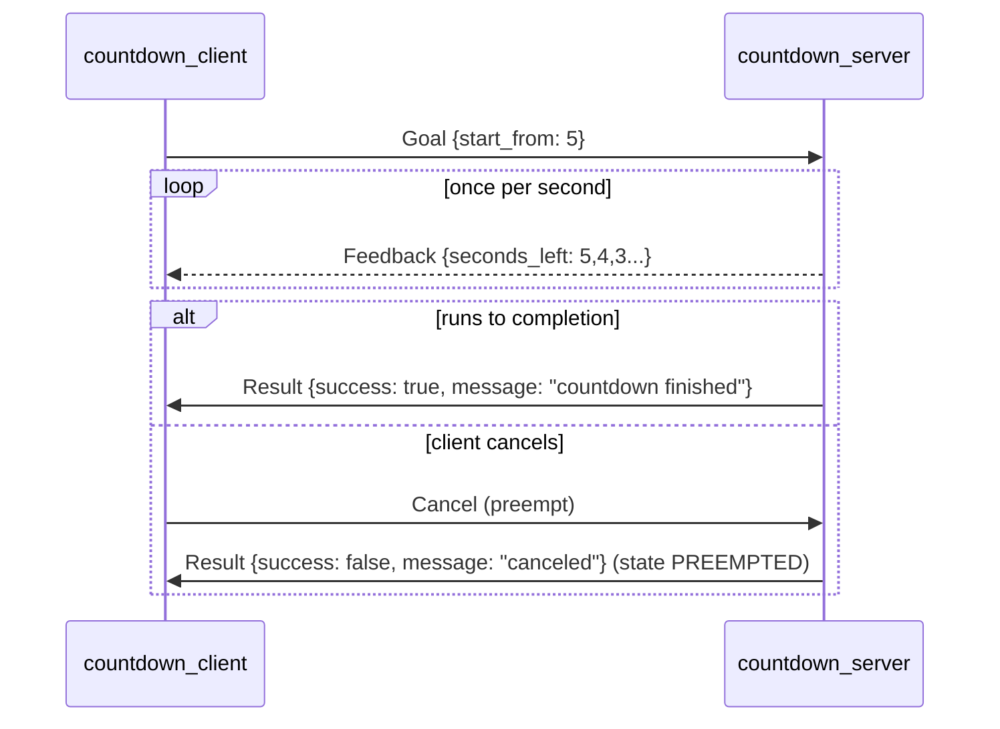

# 04 Action Communication

> 中文版 / Chinese: [04_Action通信.md](../../10_ROS1基础/04_Action通信.md)

## Goals

- Understand why neither topics nor services suit "long-running tasks", and what problem Actions solve
- Be able to write `.action` files (using `Countdown.action` as an example) and master the three-section structure
- Read and understand the usage of `SimpleActionServer` / `SimpleActionClient`
- Be able to demonstrate and understand the preempt (cancellation) mechanism
- Understand the underlying implementation of Actions — 5 topics

Companion code: [action_demo](https://github.com/Romindly-Dev/romindly_ros1_tutorials/tree/main/action_demo), [romindly_msgs](https://github.com/Romindly-Dev/romindly_ros1_tutorials/tree/main/romindly_msgs)

## How It Works

### Why Actions Are Needed

Consider a task like "navigate to point B" that takes tens of seconds:

- With a **service**: the client blocks for tens of seconds, with no progress visibility and no way to cancel
- With **topics**: you can send commands and receive progress, but you would have to reinvent the goal-to-result correspondence and the task state machine yourself

**Action = a protocol purpose-built for long tasks**: the client sends a Goal, the server periodically returns Feedback, and provides a Result at the end; the client can cancel (Preempt) at any time, and everything is asynchronous and non-blocking.



### The Three-Section Structure of an action File

[romindly_msgs/action/Countdown.action](https://github.com/Romindly-Dev/romindly_ros1_tutorials/blob/main/romindly_msgs/action/Countdown.action):

```
# Goal: how many seconds to count down from
int32 start_from
---
# Result: whether it finished normally
bool success
string message
---
# Feedback: seconds currently remaining
int32 seconds_left
```

The two `---` separators divide the file into **Goal / Result / Feedback** sections. At build time, `actionlib_msgs` helps generate 7 message types (`CountdownAction`, `CountdownGoal`, `CountdownResult`, `CountdownFeedback`, plus the task-ID-wrapped `ActionGoal/ActionResult/ActionFeedback`). See `add_action_files` and the `actionlib_msgs` dependency in [romindly_msgs/CMakeLists.txt](https://github.com/Romindly-Dev/romindly_ros1_tutorials/blob/main/romindly_msgs/CMakeLists.txt) for the generation configuration.

### Underneath, It Is Actually 5 Topics

An Action is not a new transport mechanism but a **protocol layer built on 5 topics**: `goal`, `cancel` (client → server), and `status`, `feedback`, `result` (server → client). The `actionlib` library wraps these 5 topics into a state machine, so you only face the clean send_goal / feedback / result interface.

## Running the Example

We assume `cd ~/ws_romindly && catkin_make && source devel/setup.bash` has been done.

```bash
# Terminal 1
roscore
```

```bash
# Terminal 2: Action server
rosrun action_demo countdown_server.py
```

```bash
# Terminal 3: client, count down from 5
rosrun action_demo countdown_client.py 5
```

Expected client output (Chinese logs: "waiting for countdown action server...", "goal sent: counting down from 5", "feedback: N seconds left", "result: ... countdown finished"):

```
[INFO] [...]: 等待 countdown 动作服务...
[INFO] [...]: 目标已发送: 从 5 开始倒计时
[INFO] [...]: 反馈: 剩余 5 秒
[INFO] [...]: 反馈: 剩余 4 秒
[INFO] [...]: 反馈: 剩余 3 秒
[INFO] [...]: 反馈: 剩余 2 秒
[INFO] [...]: 反馈: 剩余 1 秒
[INFO] [...]: 结果: success=True message=倒计时完成
```

### Observing the 5 Underlying Topics

While the server is running:

```bash
rostopic list | grep countdown
```

Expected output:

```
/countdown/cancel
/countdown/feedback
/countdown/goal
/countdown/result
/countdown/status
```

You can also peek at the feedback stream directly: `rostopic echo /countdown/feedback`.

### Demonstrating Cancellation (preempt)

Method 1: run a long countdown on the client, then **Ctrl+C to kill the client mid-way** — a `SimpleActionClient` does not cancel on destruction, but sending a new goal preempts the old one:

```bash
rosrun action_demo countdown_client.py 30   # leave this running
# In another terminal, send a new goal. SimpleActionServer serves only one goal, so the old goal is preempted
rosrun action_demo countdown_client.py 5
```

The server prints `倒计时被取消` ("countdown canceled") and then starts executing the new goal.

Method 2: publish an empty message directly to the cancel topic, canceling all current goals:

```bash
rosrun action_demo countdown_client.py 30   # leave this running
rostopic pub -1 /countdown/cancel actionlib_msgs/GoalID -- {}
```

The server prints `倒计时被取消` ("countdown canceled"); the client receives a Result of `success=False message=已取消` ("canceled").

## Code Walkthrough

### Server [action_demo/scripts/countdown_server.py](https://github.com/Romindly-Dev/romindly_ros1_tutorials/blob/main/action_demo/scripts/countdown_server.py)

```python
self._server = actionlib.SimpleActionServer(
    "countdown",
    CountdownAction,
    execute_cb=self.execute_cb,
    auto_start=False,
)
self._server.start()
```

- `SimpleActionServer`: a simplified server handling one goal at a time; an incoming new goal automatically preempts the old one
- The type passed is `CountdownAction` (the aggregate type), not Goal/Result
- **`auto_start=False` followed by a manual `start()` is the officially mandated pattern** — starting in the constructor has a race condition risk, and actionlib prints a warning about it

```python
def execute_cb(self, goal):
    if goal.start_from <= 0:
        self._server.set_aborted(
            CountdownResult(success=False, message="start_from 必须为正数"))  # "start_from must be positive"
        return

    for seconds_left in range(goal.start_from, 0, -1):
        if self._server.is_preempt_requested() or rospy.is_shutdown():
            self._server.set_preempted(
                CountdownResult(success=False, message="已取消"))  # "canceled"
            return
        self._server.publish_feedback(
            CountdownFeedback(seconds_left=seconds_left))
        rate.sleep()

    self._server.set_succeeded(
        CountdownResult(success=True, message="倒计时完成"))  # "countdown finished"
```

The execute callback must end with **one of three terminal states**, matching the task state machine:

| Call | Terminal state | Meaning |
|---|---|---|
| `set_succeeded(result)` | SUCCEEDED | Completed normally |
| `set_preempted(result)` | PREEMPTED | Terminated in response to a cancel request |
| `set_aborted(result)` | ABORTED | The server itself decided it failed (e.g. invalid parameters) |

Cancellation is **cooperative**: actionlib will not forcibly kill your callback. The server must actively poll `is_preempt_requested()` inside its loop and exit promptly — this is why long-task code should be written as a "small-step loop".

### Client [action_demo/scripts/countdown_client.py](https://github.com/Romindly-Dev/romindly_ros1_tutorials/blob/main/action_demo/scripts/countdown_client.py)

```python
client = actionlib.SimpleActionClient("countdown", CountdownAction)
if not client.wait_for_server(rospy.Duration(5.0)):
    rospy.logerr("等待服务超时，请先启动 countdown_server.py")  # "Timed out waiting for the server; start countdown_server.py first"
    sys.exit(1)

client.send_goal(CountdownGoal(start_from=start_from), feedback_cb=feedback_cb)
client.wait_for_result()
result = client.get_result()
```

- `wait_for_server(timeout)`: analogous to the service client's `wait_for_service`; returns False on timeout
- `send_goal` returns immediately (asynchronous); `feedback_cb` is invoked as each feedback message arrives
- In this example, blocking on `wait_for_result()` keeps the demo simple; in real applications you can skip the wait, get the result via a `done_cb` callback, and let the main thread do other work
- To cancel actively, call `client.cancel_goal()` (used in Exercise 2)

## Hands-on Exercises

1. Modify [countdown_server.py](https://github.com/Romindly-Dev/romindly_ros1_tutorials/blob/main/action_demo/scripts/countdown_server.py): add a `float32 interval` field (seconds per step) to the Goal section of `Countdown.action`, and have the server pace itself with `rospy.Rate(1.0 / goal.interval)`. Remember to re-run `catkin_make` after changing the `.action` file.
2. Modify [countdown_client.py](https://github.com/Romindly-Dev/romindly_ros1_tutorials/blob/main/action_demo/scripts/countdown_client.py): after sending the goal, `rospy.sleep(3.0)`, then call `client.cancel_goal()`, then `wait_for_result()`; observe the result you get and `client.get_state()` (compare against `actionlib.GoalStatus.PREEMPTED`).

## FAQ

**Q1: The client reports a timeout waiting for the server?**
The server is not running, or the Action names differ (the first argument on both the client and the server must be `countdown`). Check whether the 5 topics exist with `rostopic list | grep countdown`.

**Q2: The server warns `You've passed in true for auto_start ... you should always pass in false`?**
`auto_start=False` was not passed when constructing the `SimpleActionServer`. Follow the example pattern: `auto_start=False` first, then an explicit `start()`.

**Q3: A cancel was sent but the server won't stop?**
The execute callback is not polling `is_preempt_requested()`, or a single step sleeps too long to check. Break the long task into a small-step loop and check once per step.

**Q4: No feedback is received at all?**
The feedback rate depends on how often the server calls `publish_feedback` (1 Hz in this example). Also confirm that `feedback_cb` was attached via `send_goal(..., feedback_cb=...)`.

**Q5: A second client sent a goal and the first client's task disappeared?**
That is by design in `SimpleActionServer`: **only one goal is served at a time**, and a new goal automatically preempts the old one. For concurrent multi-goal handling, use the lower-level `ActionServer` class and manage goal handles yourself.
