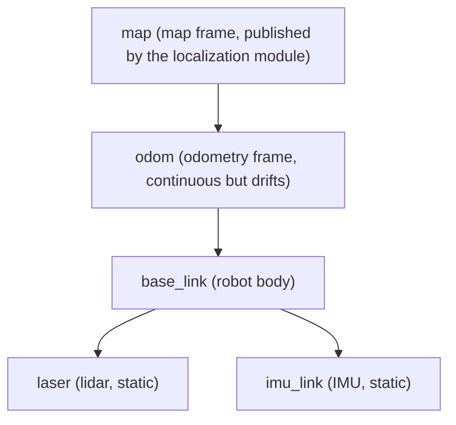

# 06 TF2 Coordinate Transforms

> 中文版 / Chinese: [06_TF2坐标变换.md](../../10_ROS1基础/06_TF2坐标变换.md)

## Goals

- Understand why robot systems need TF and how the TF tree is organized
- Be able to write a dynamic TF broadcaster (including basic quaternion usage) and static transforms
- Be able to query the transform between any two frames with `lookup_transform` and correctly handle the three exception types
- Master the three TF debugging tools: `view_frames`, `tf2_echo`, and RViz

Companion example package: [tf2_demo](https://github.com/Romindly-Dev/romindly_ros1_tutorials/tree/main/tf2_demo)

## How It Works

### Why TF Is Needed

When a lidar reports "obstacle 3 m ahead", it speaks in **its own coordinate frame** (`laser`); navigation needs the obstacle's position in the **map frame** (`map`) to decide where it is on the map. Every sensor and every component on a robot has its own frame, and converting a point from frame A to frame B involves a chain of translations and rotations — maintaining those matrix multiplications by hand is tedious and error-prone.

The TF (Transform) system's approach: each component only broadcasts "the transform between me and my parent frame"; the TF library organizes all transforms into a **tree**, and the transform between any two frames is solved automatically by chaining along the tree. It also **caches with timestamps** (10 seconds by default), so you can query "the pose of laser in odom 0.5 seconds ago". In ROS1 the current implementation is **tf2** (the `tf2_ros` package); the old `tf` package is deprecated.

### The TF Tree and a Typical Hierarchy

The hard rule of the TF tree: **each frame can have only one parent** (otherwise you get cycles/multiple parents and the tree breaks). A typical hierarchy for a mobile robot:



- `odom → base_link`: broadcast **dynamically** by odometry/base driver; smooth short-term but drifts over time
- `map → odom`: published by the localization module (e.g. AMCL) to correct the drift
- `base_link → laser`: the sensor mounting is fixed, so a **static transform** broadcast once is enough

This example implements two of these segments: the dynamic `odom → base_link` (simulating circular motion) and the static `base_link → laser`.

## Running the Example

```bash
cd ~/ws_romindly && catkin_make && source devel/setup.bash
roslaunch tf2_demo tf2_demo.launch
```

Expected output (one line per second; coordinates change with the circular motion; the WARN line reads "TF lookup failed", and the INFO lines read "laser in odom frame"):

```
[WARN] [...]: TF 查询失败: "odom" passed to lookupTransform argument target_frame does not exist.
[INFO] [...]: laser 在 odom 系下: x=2.19 y=0.11 z=0.10
[INFO] [...]: laser 在 odom 系下: x=2.11 y=0.68 z=0.10
[INFO] [...]: laser 在 odom 系下: x=1.93 y=1.22 z=0.10
```

The WARN in the first second or two after startup is **normal**: the listener's buffer has not yet received enough transform data. Afterwards, x/y should vary around a circle of roughly 2 m radius, and z stays constant at 0.10 (the static mounting height of the laser).

The three debugging tools (in another terminal):

```bash
# 1. Generate a PDF of the TF tree: odom → base_link → laser
rosrun tf2_tools view_frames.py && evince frames.pdf

# 2. Print the transform between any two frames in real time
rosrun tf2_ros tf2_echo odom laser

# 3. RViz visualization: set Fixed Frame to odom, Add → TF
rviz
```

`tf2_echo` continuously prints Translation / Rotation (in both quaternion and RPY representations) and is the first tool to reach for when checking "is this transform actually right".

## Code Walkthrough

### Dynamic Broadcasting: dynamic_broadcaster.py

File: [tf2_demo/scripts/dynamic_broadcaster.py](https://github.com/Romindly-Dev/romindly_ros1_tutorials/blob/main/tf2_demo/scripts/dynamic_broadcaster.py)

```python
broadcaster = tf2_ros.TransformBroadcaster()
rate = rospy.Rate(20)  # 20 Hz
```

Under the hood, `TransformBroadcaster` publishes `TFMessage` onto the `/tf` topic. Dynamic transforms must be **sent continuously at a fixed rate** (20 Hz here); if broadcasting stops for longer than the cache duration, lookups start failing.

```python
tfs = TransformStamped()
tfs.header.stamp = rospy.Time.now()
tfs.header.frame_id = "odom"        # parent frame
tfs.child_frame_id = "base_link"    # child frame
```

The three essentials of `TransformStamped`: the timestamp (must be the current time — TF uses it for temporal interpolation), the parent `frame_id`, and the child `child_frame_id`. Do not get the direction backwards: this message expresses "**the pose of base_link in the odom frame**".

```python
tfs.transform.translation.x = radius * math.cos(theta)
tfs.transform.translation.y = radius * math.sin(theta)

yaw = theta + math.pi / 2.0
tfs.transform.rotation.z = math.sin(yaw / 2.0)
tfs.transform.rotation.w = math.cos(yaw / 2.0)
```

The translation part is the standard parametric equation of circular motion. The rotation part uses a **quaternion**: all orientations in ROS are quaternions (x, y, z, w), avoiding the gimbal lock of Euler angles. For a planar robot rotating only about the z-axis, the quaternion degenerates to `z=sin(yaw/2), w=cos(yaw/2)` and can be written by hand; in the general case use `tf_conversions` or `tf.transformations.quaternion_from_euler`. `yaw = theta + 90°` keeps the vehicle's nose pointing along the tangent of the circle, i.e. "driving along the circle".

### Static Transforms: static_transform_publisher

File: [tf2_demo/launch/tf2_demo.launch](https://github.com/Romindly-Dev/romindly_ros1_tutorials/blob/main/tf2_demo/launch/tf2_demo.launch)

```xml
<node pkg="tf2_ros" type="static_transform_publisher" name="laser_static_tf"
      args="0.2 0 0.1 0 0 0 base_link laser"/>
```

Sensor mounting positions do not change, so use the `static_transform_publisher` that ships with `tf2_ros` to publish once to `/tf_static` (latched, so new subscribers still receive it) — no need to write your own node. **Memorize the argument order**:

```
x y z yaw pitch roll parent_frame child_frame
```

That is, translation (meters) first, then rotation, and the rotation is in **yaw pitch roll order (not roll pitch yaw!)**, in radians. Here it means the laser is mounted 0.2 m in front of and 0.1 m above base_link, with no rotation. It also supports a 9-argument form (rotation as a quaternion x y z w), which real projects often use for sensor extrinsic calibration results.

### Lookups and Exception Handling: frame_listener.py

File: [tf2_demo/scripts/frame_listener.py](https://github.com/Romindly-Dev/romindly_ros1_tutorials/blob/main/tf2_demo/scripts/frame_listener.py)

```python
buf = tf2_ros.Buffer()
tf2_ros.TransformListener(buf)
```

`Buffer` is a local cache of the TF tree; `TransformListener` subscribes to `/tf` and `/tf_static` to fill it. Create both **as early as possible** in the node and keep them alive — the cache is empty right after creation, so lookups are bound to fail at first.

```python
tfs = buf.lookup_transform("odom", "laser", rospy.Time(0))
```

`lookup_transform(target, source, time)`: queries the pose of the source frame in the target frame. Passing `rospy.Time(0)` means "use the latest available transform" — the most common and safest choice; passing `rospy.Time.now()` tends to time out because the data has not arrived yet. Note that `odom → laser` is not broadcast directly by any node: TF **automatically composes it along the chain** `odom → base_link → laser` — precisely the value of the TF tree.

```python
except (
    tf2_ros.LookupException,
    tf2_ros.ConnectivityException,
    tf2_ros.ExtrapolationException,
) as exc:
    rospy.logwarn("TF 查询失败: %s", exc)  # "TF lookup failed"
```

The three exception types must be caught, and they mean different things:

| Exception | Trigger scenario |
|---|---|
| `LookupException` | The frame does not exist (not yet broadcast, or the frame name is misspelled) |
| `ConnectivityException` | Both frames exist but are not in the same tree (a broken link in between) |
| `ExtrapolationException` | The requested time is outside the cache range (data too old, or a "future" time) |

Without catching them, the node is guaranteed to crash on an exception at startup.

## Hands-on Exercises

1. Modify `dynamic_broadcaster.py`: change `radius` to 3.0 and `angular_speed` to 1.0, then verify with `rosrun tf2_ros tf2_echo odom base_link` that the translation varies within ±3 m and one full revolution takes about 6.28 seconds.
2. In `tf2_demo.launch`, add an `imu_link` modeled after `laser_static_tf`: mounted 0.05 m directly above base_link, with no rotation. Use `view_frames.py` to confirm the TF tree has a new branch, then change the lookup target in `frame_listener.py` from `laser` to `imu_link` to verify.

## FAQ

**Q: After startup it keeps printing `LookupException: "odom" does not exist`?**
If it lasts only 1~2 seconds, it is normal (the cache is not filled yet). If it never stops, confirm the broadcaster is publishing with `rostopic hz /tf`, then check the frame name spelling (TF is case-sensitive, and in tf2 frame names **must not have a leading `/`**).

**Q: `view_frames.py` not found?**
In Noetic the script is named `view_frames.py` (older tutorials say `view_frames`). If not installed: `sudo apt install ros-noetic-tf2-tools`.

**Q: Nothing shows in RViz and the status bar reports `Fixed Frame [map] does not exist`?**
This example has no map frame. Change Global Options → Fixed Frame on the left to `odom`.

**Q: The static transform's rotation arguments have no effect or point the wrong way?**
Nine times out of ten, the argument order was assumed to be roll pitch yaw — `static_transform_publisher` uses **yaw pitch roll**. After fixing it, verify against the RPY output of `tf2_echo`.

**Q: Can dynamic and static broadcasting be mixed for the same frame pair?**
No. A given child frame can have only one parent and one broadcast source; otherwise the TF tree jitters, which shows up in RViz as a flickering model.
