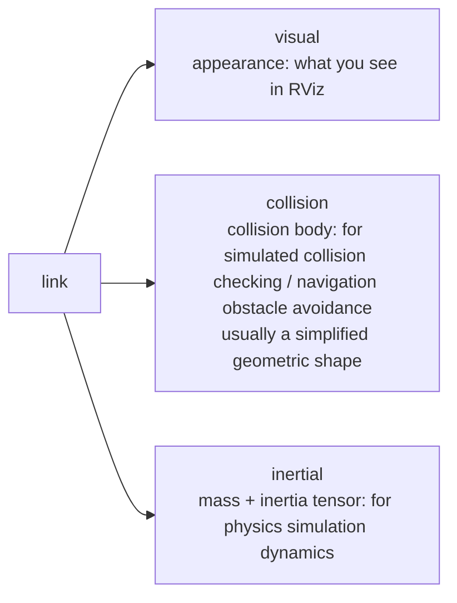

# 07 URDF Robot Modeling

> 中文版 / Chinese: [07_URDF机器人建模.md](../../10_ROS1基础/07_URDF机器人建模.md)

## Goals

- Understand the URDF link/joint model and the common joint types
- Master the purposes of a link's three elements: visual, collision, and inertial
- Be able to eliminate duplicated code using xacro properties, macros, and math expressions
- Understand the division of labor between `robot_state_publisher` and `joint_state_publisher`, and view the model in RViz

Companion example package: [urdf_demo](https://github.com/Romindly-Dev/romindly_ros1_tutorials/tree/main/urdf_demo)

## How It Works

### link and joint

URDF (Unified Robot Description Format) describes a robot in XML as **a tree of rigid bodies (links) + joints**: a link is a part with shape and mass, and a joint defines how two links connect and their relative pose. Like the TF tree, each link can have only one parent link.

Common joint types:

| Type | Motion | Typical use |
|---|---|---|
| `fixed` | No motion | Sensor mounts, virtual frame connections |
| `continuous` | Unlimited rotation about an axis | Drive wheels |
| `revolute` | Limited rotation about an axis (with limits) | Arm joints, pan-tilt units |
| `prismatic` | Translation along an axis (with limits) | Lift mechanisms |
| `floating` / `planar` | 6 DOF / planar 3 DOF | Rarely used |

### The Three Elements of a link



If you only view the model in RViz, visual alone is enough; but **in Gazebo simulation, collision determines "what can be hit" and inertial determines "whether it pushes around like a real vehicle"** — a link missing inertial is ignored by Gazebo or flies around erratically. This example includes all three elements, precisely in preparation for the later simulation chapters.

### Why xacro

Plain URDF supports neither variables nor reuse: the left and right wheels are identical for dozens of lines except for the sign of the y coordinate, and changing the wheel radius means editing four or five places. xacro (XML macro) adds **properties, macros, math expressions, and conditionals** on top of URDF, expanding to plain URDF at build time.

### The base_footprint and base_link Convention

- `base_link`: the robot body frame, usually placed at the geometric center of the chassis, **at some height above the ground**
- `base_footprint`: the **virtual projection frame** of `base_link` on the ground (z=0, no shape). The navigation stack (costmaps, AMCL) uses it as the robot's reference frame by default, since planar navigation assumes the robot sits on the ground

The two are connected by a fixed joint, whose z offset is the height of the chassis center above the ground.

## Running the Example

```bash
cd ~/ws_romindly && catkin_make && source devel/setup.bash
roslaunch urdf_demo display.launch
```

Expected result:

- RViz opens, showing a differential-drive cart with a blue body, two black drive wheels, a black caster ball at the front, and a red lidar on top
- A `joint_state_publisher_gui` window also opens, with two sliders: `left_wheel_joint` and `right_wheel_joint`
- **Drag a slider and the corresponding wheel rotates in RViz** — the entire "joint states → TF → model pose" chain at work

Command-line verification:

```bash
# Check on its own whether the xacro expands correctly to URDF (first step of troubleshooting)
xacro $(rospack find urdf_demo)/urdf/diff_robot.urdf.xacro

# View the joint states topic (position changes as you drag the sliders)
rostopic echo /joint_states -n 1

# View the TF tree: base_footprint → base_link → {left_wheel, right_wheel, caster, laser}
rosrun tf2_tools view_frames.py && evince frames.pdf
```

## Code Walkthrough

### diff_robot.urdf.xacro

File: [urdf_demo/urdf/diff_robot.urdf.xacro](https://github.com/Romindly-Dev/romindly_ros1_tutorials/blob/main/urdf_demo/urdf/diff_robot.urdf.xacro)

**property: vehicle dimensions defined in one place**

```xml
<robot name="diff_robot" xmlns:xacro="http://www.ros.org/wiki/xacro">
  <xacro:property name="base_length" value="0.40"/>
  <xacro:property name="wheel_radius" value="0.08"/>
  <xacro:property name="wheel_separation" value="0.34"/>
```

The root tag must declare the `xmlns:xacro` namespace, or xacro directives are not recognized. Properties are referenced with `${name}`, and `${}` supports arithmetic — every dimension is defined once at the top of the file, and changing the wheel radius updates the whole vehicle automatically.

**Connecting base_footprint and base_link**

```xml
<link name="base_footprint"/>

<joint name="base_joint" type="fixed">
  <parent link="base_footprint"/>
  <child link="base_link"/>
  <origin xyz="0 0 ${wheel_radius}" rpy="0 0 0"/>
</joint>
```

`base_footprint` is an empty link (no visual/collision/inertial), serving only as a coordinate frame. The meaning of the z offset `${wheel_radius}`: with the wheels on the ground, the chassis center is exactly one wheel radius above it.

**The drive_wheel macro: one piece of code instantiates both wheels**

```xml
<xacro:macro name="drive_wheel" params="prefix y_offset">
  <link name="${prefix}_wheel">
    <visual>
      <origin xyz="0 0 0" rpy="${M_PI/2} 0 0"/>
      <geometry>
        <cylinder radius="${wheel_radius}" length="${wheel_width}"/>
      </geometry>
      ...
  <joint name="${prefix}_wheel_joint" type="continuous">
    <parent link="base_link"/>
    <child link="${prefix}_wheel"/>
    <origin xyz="0 ${y_offset} ${-wheel_radius/2}" rpy="0 0 0"/>
    <axis xyz="0 1 0"/>
  </joint>
</xacro:macro>

<xacro:drive_wheel prefix="left"  y_offset="${wheel_separation/2}"/>
<xacro:drive_wheel prefix="right" y_offset="${-wheel_separation/2}"/>
```

Point by point:

- `params="prefix y_offset"`: the macro's parameters. Called twice, it generates the `left_wheel`/`right_wheel` link+joint pairs, with y offsets of opposite sign (`${wheel_separation/2}` and `${-wheel_separation/2}` — math expressions written directly in the attributes)
- `rpy="${M_PI/2} 0 0"` in the visual: a URDF cylinder's axis defaults to z; rotating 90° about x aligns the axis with y — the direction of the wheel's rotation axis. Note this origin only rotates the **geometry's appearance**; it does not affect the joint
- The joint type is `continuous` (unlimited rotation), and `<axis xyz="0 1 0"/>` specifies rotation about this link's y axis
- collision uses the same cylinder as visual; inertial provides a simplified mass and inertia tensor — not precise, but of a reasonable magnitude, enough to get started in Gazebo

**The remaining parts**: the caster (simplified to a fixed joint + sphere at the front underside of the chassis) and the laser (fixed joint, mounted at the front of the roof at `xyz="0.1 0 ${base_height/2 + 0.02}"`) follow the same structure and are not detailed here. The laser link's name follows the same convention as the `laser` frame in the static transform of the [06 TF2 chapter](06_tf2_transforms.md).

### display.launch: the Visualization Chain

File: [urdf_demo/launch/display.launch](https://github.com/Romindly-Dev/romindly_ros1_tutorials/blob/main/urdf_demo/launch/display.launch)

```xml
<param name="robot_description"
       command="$(find xacro)/xacro $(find urdf_demo)/urdf/diff_robot.urdf.xacro"/>
```

`<param command=...>` stores a command's **standard output** into a parameter: it first runs xacro to expand the file, then writes the plain URDF text into the global parameter `robot_description` — the model parameter name that the ROS ecosystem agrees upon; RViz, Gazebo, and MoveIt all read the model from there.

```xml
<node pkg="robot_state_publisher" type="robot_state_publisher" name="robot_state_publisher"/>
<node pkg="joint_state_publisher_gui" type="joint_state_publisher_gui" name="joint_state_publisher_gui"/>
```

The two nodes have clearly separated roles, and both are indispensable:

- `joint_state_publisher_gui`: finds all **movable joints** in `robot_description` and publishes `/joint_states` (`sensor_msgs/JointState`, the angle of each joint) via sliders. On a real robot this role is played by the base driver / encoder node
- `robot_state_publisher`: reads `robot_description` + subscribes to `/joint_states`, performs forward kinematics, and **publishes the transform between each pair of links as TF** (fixed joints to `/tf_static`, movable joints to `/tf`)

RViz's RobotModel display merely places each link's visual according to TF — hence "slider → /joint_states → robot_state_publisher → TF → the wheel turns in RViz".

## Hands-on Exercises

1. Change `wheel_radius` from 0.08 to 0.12, re-run `roslaunch urdf_demo display.launch`, and observe that the wheels grow and the chassis clearance rises automatically (because the z offset of `base_joint` references the same property) — appreciate the benefit of centrally defined parameters.
2. Modeled after the laser, add a `camera_link` at the rear of the vehicle: a small green box (`box size="0.03 0.08 0.03"`, requiring a new material), attached with a fixed joint at `xyz="${-base_length/2} 0 0"`. Confirm the position in RViz, and consider: why does it not appear among the sliders of joint_state_publisher_gui? (Hint: a fixed joint has no degrees of freedom.)

## FAQ

**Q: The model in RViz is all white and reports `No transform from [xxx] to [base_footprint]`?**
`/joint_states` is not being published (joint_state_publisher_gui not started or closed), so robot_state_publisher cannot compute TF for the movable joints. Confirm the GUI window exists; on a headless system, use the GUI-less `joint_state_publisher` instead.

**Q: roslaunch fails immediately with an xacro parse error?**
First run `xacro <file_path>` on its own to see the exact failing line. Frequent errors: referencing an undefined property inside `${}`, missing params when calling a macro, or a root tag lacking the `xmlns:xacro` declaration.

**Q: Do visual and collision have to be identical?**
No. visual may use a detailed mesh for looks, while collision should use the **simplest possible** geometry (box/cylinder/sphere) — the collision-checking cost in simulation and navigation scales directly with collision complexity.

**Q: Can I fill in arbitrary inertial values?**
RViz does not care (it never uses them), but in Gazebo a model with unreasonable mass/inertia will jitter, tip over, or even fly off the map. A rough approach: estimate using the inertia formulas for uniform-density solids, ensuring the magnitudes are right. The next chapter on simulation returns to this topic.

**Q: Closing RViz brings the whole launch down?**
The rviz node in `display.launch` carries `required="true"`; when it exits, the entire launch terminates — a deliberate design for this demo scenario.
