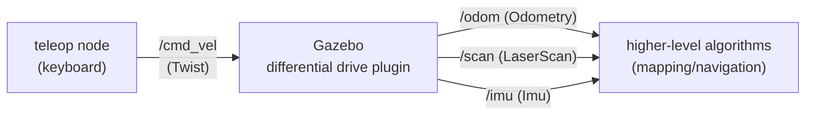

# 02 Keyboard Teleop and Topic Observation

> 中文版 / Chinese: [02_键盘遥控与话题观察.md](../../15_仿真入门/02_键盘遥控与话题观察.md)

## Goal

- Drive the simulated robot with the `turtlebot3_teleop_key` keyboard teleop
- Use the `rostopic` tools from [chapter 10](../10_ros1_basics/02_topics.md) to explore the simulated robot's four core topics: `/scan` `/odom` `/cmd_vel` `/imu`
- Understand the key fields of the `sensor_msgs/LaserScan` and `nav_msgs/Odometry` messages
- Build a mental picture of the data flow using `rqt_graph` and RViz

## How It Works

The simulated robot's data flow is a classic mobile-robot loop:



- **`/cmd_vel`** (`geometry_msgs/Twist`): the single control entry point. Any node — keyboard teleop, the navigation planner, a script you wrote yourself — makes the robot move simply by publishing velocity commands to this topic. A differential-drive robot only uses two fields: `linear.x` (forward speed, m/s) and `angular.z` (turning rate, rad/s).
- **`/odom`** (`nav_msgs/Odometry`): odometry — the pose + velocity estimate the Gazebo plugin integrates from wheel rotation. Its characteristics match the real robot: smooth in the short term, drifting in the long term.
- **`/scan`** (`sensor_msgs/LaserScan`): 360° LiDAR data, the input to every mapping algorithm in chapter 20.
- **`/imu`** (`sensor_msgs/Imu`): angular velocity, linear acceleration, and orientation; used by the EKF fusion in chapter 30.

This part involves no code at all — everything is done with off-the-shelf tools. The point is to build the professional habit of "whenever you take over any ROS system, probe the topics first."

## Step-by-Step Instructions

All commands below require the simulation to be running first (terminal 1):

```bash
roslaunch turtlebot3_gazebo turtlebot3_world.launch
```

### Step 1: Keyboard teleop

Terminal 2:

```bash
roslaunch turtlebot3_teleop turtlebot3_teleop_key.launch
```

Expected output:

```
Control Your TurtleBot3!
---------------------------
Moving around:
        w
   a    s    d
        x

w/x : increase/decrease linear velocity (Burger : ~ 0.22)
a/d : increase/decrease angular velocity (Burger : ~ 2.84)
space key, s : force stop
```

**Keep this terminal focused** (click it once) before pressing keys: `w` speeds up forward, `x` slows down / reverses, `a`/`d` turn left/right, `s` or space is an emergency stop. Note that it uses "increment/decrement" logic, not "hold to move" — press `w` once and the robot keeps moving at that speed; releasing the key does not stop it, press `s` to stop. Drive the robot around the arena a couple of laps and watch the blue rays in Gazebo change as the laser sweeps the cylinders (if the rays are not shown, no problem — RViz shows it more clearly).

### Step 2: Topic list and rates

Terminal 3:

```bash
rostopic list
rostopic hz /scan /odom /imu
```

Expected (rate fluctuation of ±10% is normal and related to the Real Time Factor):

```
        topic       rate   ...
       /scan        5.0
       /odom        30.0
       /imu         ~200
```

Stop with `Ctrl+C`. Now look at `/cmd_vel`: `rostopic hz /cmd_vel` shows teleop's publish rate — **new messages appear only when you press a key to change the speed**; otherwise it may publish nothing for long stretches (the differential drive plugin maintains the speed of the last command). This explains the "doesn't stop when you let go" behavior from step 1.

### Step 3: Understanding LaserScan

```bash
rostopic echo -n 1 /scan
```

Expected output (the ranges array is very long; only the essentials are shown):

```yaml
header:
  frame_id: "base_scan"
angle_min: 0.0
angle_max: 6.28318977355957
angle_increment: 0.01749303564429283
range_min: 0.11999999731779099
range_max: 3.5
ranges: [1.63, 1.62, 1.64, ..., inf, inf, ..., 0.58, ...]
```

Field breakdown:

- `angle_min`/`angle_max`: start and end angles of the scan (radians). 0 to 2π means a full revolution; 0 rad corresponds to **straight ahead** of the robot, increasing counterclockwise.
- `angle_increment`: angular spacing between adjacent beams, 2π/360 ≈ 0.01745 — i.e. one point per 1°, 360 range values per revolution.
- `ranges`: the core data — 360 distance values (meters); the angle of index i = `angle_min + i × angle_increment`. `ranges[0]` is the obstacle distance straight ahead, `ranges[90]` is directly to the left.
- `inf`: nothing was hit within `range_max` (3.5 m) in that direction; readings below `range_min` (0.12 m) are likewise invalid.
- `header.frame_id: base_scan`: the data is expressed in the LiDAR's coordinate frame — converting it into other frames is what TF is for, which is exactly the topic of the next part.

Verify your understanding: teleop the robot to a stop about 0.5 m directly in front of one of the cylinders, then run `rostopic echo -n 1 /scan | grep -A1 ranges` and check whether the first few values of `ranges` are ≈ 0.5.

### Step 4: Understanding Odometry

```bash
rostopic echo -n 1 /odom
```

Key fields:

```yaml
header:
  frame_id: "odom"
child_frame_id: "base_footprint"
pose:
  pose:
    position: {x: 0.32, y: -0.11, z: -0.001}
    orientation: {x: ..., y: ..., z: 0.256, w: 0.966}
twist:
  twist:
    linear: {x: 0.05, ...}
    angular: {z: 0.0, ...}
```

- `pose`: the pose of `base_footprint` in the `odom` frame; the orientation is a quaternion (recall [part 06 on TF2](../10_ros1_basics/06_tf2_transforms.md)) — a planar robot only has the yaw component about z.
- `twist`: the current velocity, expressed in the `child_frame_id` (the robot's own) frame — `linear.x` is the forward speed.
- Drive the robot a bit and echo again: `position` keeps changing. Teleop the robot one full lap around the arena back to its starting point — `position` will not return exactly to zero. That is odometry drift accumulating, and it is precisely what the localization in chapter 30 solves.

### Step 5: The node graph with rqt_graph

```bash
rqt_graph
```

Set the top-left dropdown to `Nodes/Topics (all)`. Expected: `/turtlebot3_teleop_keyboard` points to `/gazebo` via `/cmd_vel`; `/gazebo` emits `/scan` `/odom` `/imu` and more. Note that **the entire simulated robot appears in the graph as the single node `/gazebo`** — all sensors and the base are plugins inside it. This is the biggest difference in the node graph between simulation and a real robot (where each driver is its own node).

### Step 6: Visualization in RViz

```bash
rosrun rviz rviz
```

Configure it by hand (better practice than using a ready-made launch file):

1. In the left panel, change `Global Options → Fixed Frame` to `odom`.
2. `Add → RobotModel`: the robot model appears (it reads the URDF, see [part 07](../10_ros1_basics/07_urdf_modeling.md)).
3. `Add → By topic → /scan → LaserScan`: a red point pattern outlines the hexagonal fence and the cylinders. If it is hard to see, set the display's `Size (m)` to 0.03.
4. `Add → TF`: shows the coordinate frame arrows (the next part explains each segment).

Teleop the robot around and confirm: the model moves in sync in RViz, and the laser points always stay "glued" to the obstacles. This display configuration will be reused for mapping in chapter 20 — save it via `File → Save Config As` to `~/ws_romindly/tb3_basic.rviz`.

## Exercises

**Make the robot drive in a circle**: close teleop first (to avoid conflicting commands), then publish velocities directly with `rostopic pub`:

```bash
rostopic pub -r 10 /cmd_vel geometry_msgs/Twist \
  '{linear: {x: 0.1, y: 0, z: 0}, angular: {x: 0, y: 0, z: 0.5}}'
```

The robot should drive counterclockwise in a circle of roughly 0.2 m radius (radius = linear velocity / angular velocity = 0.1/0.5). Think about and verify:

1. Which number do you change to double the circle's size? (One answer: set `linear.x` to 0.2)
2. After stopping the pub with `Ctrl+C`, why does the robot keep turning? How do you stop it? (Hint: publish one all-zero Twist; `-1` for a single-shot publish is enough)
3. While it circles, run `rostopic echo /odom` and check whether `position` x/y vary periodically.

## Common Issues

**Q1: Key presses in the teleop terminal have no effect.**
Keyboard events only go to the currently focused window — click the teleop terminal with the mouse first. Also confirm it has not exited with an error (teleop also exits when `TURTLEBOT3_MODEL` is unset).

**Q2: `rostopic hz /scan` shows about 5 Hz — isn't that too low?**
No. This deliberately simulates the real rate of the burger's actual LDS-01 LiDAR (about 5 revolutions per second). Mapping algorithms are designed around exactly this order of magnitude.

**Q3: The robot goes haywire / spins in place.**
Most likely teleop and `rostopic pub` are both publishing to `/cmd_vel` and the two command streams take effect alternately. Keep only one `/cmd_vel` publisher at any time; check who is publishing right now with `rostopic info /cmd_vel` and look at the Publishers list.

**Q4: RobotModel is all white in RViz with `No transform from ...` errors.**
The Fixed Frame is wrong (still on the default `map` — no node publishes a map frame yet). Change it to `odom`. A systematic method for diagnosing this class of TF error is covered in the next part.

Next part: [03 The TF Tree and Sensors in Simulation](03_tf_and_sensors_in_sim.md)
