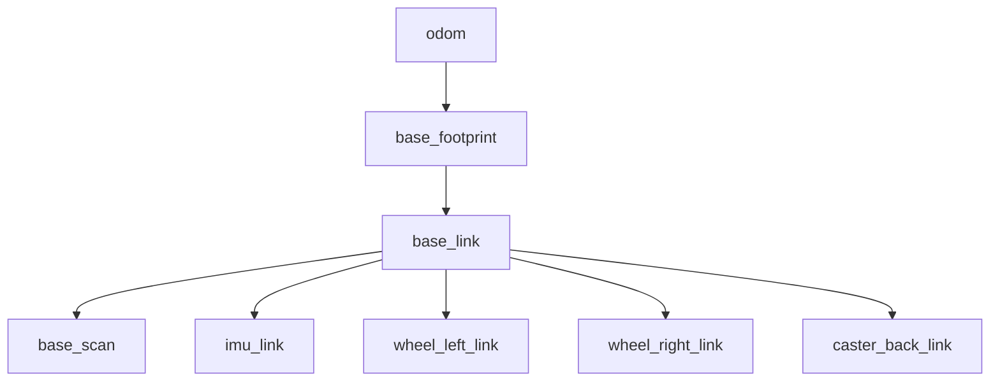
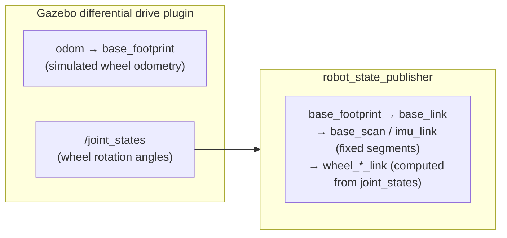

# 03 The TF Tree and Sensors in Simulation

> 中文版 / Chinese: [03_仿真中的TF树与传感器.md](../../15_仿真入门/03_仿真中的TF树与传感器.md)

## Goal

- Export the full TF tree of the simulation with `view_frames` and understand each segment of `odom → base_footprint → base_link → base_scan` layer by layer
- Distinguish which TF segments are published by `robot_state_publisher` versus the Gazebo plugins — the mental model for diagnosing TF problems on real robots
- Understand the roles of `/clock` and `use_sim_time` in simulation (tying back to [part 08 on rosbag](../10_ros1_basics/08_rosbag_and_debugging.md))
- Pin down what the mapping algorithms in chapter 20 require as input: `/scan` + an intact `odom → base` TF

## How It Works

In [part 06 on TF2](../10_ros1_basics/06_tf2_transforms.md) we hand-wrote a mini TF tree of `odom → base_link → laser`; the TB3 simulation provides a **real-project-grade** tree. The previous part showed that `/scan` data lives in the `base_scan` frame and `/odom` describes the pose of `base_footprint` in the `odom` frame — what ties sensor data, odometry, and the robot's structure into one coherent whole is exactly this TF tree. The essence of what mapping algorithms (gmapping, cartographer) do is: **transform every `/scan` frame from `base_scan` into the `odom` frame along the TF chain, then stitch them into a map**. If one TF segment breaks, mapping is dead — so this tree must be fully understood before entering chapter 20.

## Step-by-Step Instructions

### Step 1: Export the TF tree

Start the simulation in terminal 1, then in terminal 2:

```bash
cd ~/ws_romindly
rosrun tf2_tools view_frames.py && evince frames.pdf
```

Expected output:

```
Listening to tf data during 5 seconds...
Generating graph in frames.pdf file...
```

The PDF that opens should show a tree like this (each node box is also annotated with publish rate and broadcaster):



### Step 2: Understanding each layer

| Transform segment | Meaning | Dynamic/static |
| --- | --- | --- |
| `odom → base_footprint` | Odometry: where the robot has traveled since power-on. Numerically identical to the pose in the `/odom` topic | Dynamic (~30 Hz) |
| `base_footprint → base_link` | footprint is the robot's **projection onto the ground** (z=0); base_link is the **geometric center of the base** (at some height). They differ only by a fixed z translation | Fixed |
| `base_link → base_scan` | LiDAR mounting position (on burger, roughly on the center axis, about 0.17 m above ground) | Fixed |
| `base_link → imu_link` | IMU mounting position | Fixed |
| `base_link → wheel_left/right_link` | The two drive wheels. Note this one is **dynamic** — the wheels are spinning, and the rotation angle comes from `/joint_states` | Dynamic |

Why the extra `base_footprint` layer? 2D mapping and navigation both compute in the plane, so a "ground-hugging" reference frame is most convenient, whereas the URDF's physical center `base_link` floats above the ground. This is the standard layering recommended by REP-105 (the ROS coordinate frame naming convention), and real robots look the same.

Verify a static transform with `tf_echo` (in another terminal):

```bash
rosrun tf tf_echo base_link base_scan
```

Expected (the values stay constant, since it is a fixed mount):

```
At time ...
- Translation: [-0.032, 0.000, 0.172]
- Rotation: in Quaternion [0.000, 0.000, 0.000, 1.000]
```

Then check a dynamic segment with `rosrun tf tf_echo odom base_footprint`: teleop the robot around and the Translation should track the motion in real time.

### Step 3: Who publishes which TF segment

Look at the `Broadcaster` field of each transform in frames.pdf and you will find the whole tree is assembled from **two sources**:



- **`robot_state_publisher`**: an old friend from [part 07 on URDF](../10_ros1_basics/07_urdf_modeling.md). It reads the URDF and directly broadcasts the transforms of all **fixed joints**; for **revolute joints** like the wheels, it subscribes to `/joint_states` to get the current joint angles and computes the transforms from them. It is responsible only for the TF "inside the robot's body."
- **The Gazebo differential drive plugin**: plays the role of the "base driver node" on a real robot — it integrates wheel speeds into odometry, publishes the `/odom` topic + the `odom → base_footprint` TF segment, and publishes the wheel angles to `/joint_states` for robot_state_publisher to consume.

Remember this division of labor: **TF internal to the URDF belongs to robot_state_publisher; the TF from odom to the robot belongs to the base driver**. When the TF tree breaks on a real robot in the future, look at which segment broke first — that tells you whether to investigate the URDF/robot_state_publisher or the base driver node. Chapter 20's mapping adds one more segment, `map → odom`, at the top of the tree (published by the mapping/localization algorithm); at that point the whole tree becomes the complete standard form covered in part 06.

### Step 4: /clock and use_sim_time

Part 08 introduced the simulated clock when covering rosbag playback; Gazebo uses the **same mechanism**:

```bash
rosparam get /use_sim_time
# true
rostopic hz /clock
# average rate: ~1000
```

`turtlebot3_world.launch` (via the `gazebo_ros` launch file it includes internally) automatically sets `/use_sim_time` to `true`, and Gazebo publishes `/clock` at about 1 kHz. From then on, `Time.now()` in every node reads **simulation time** rather than the wall clock. This brings two direct benefits:

1. **Self-consistent TF timestamps**: all TF and sensor messages are stamped with simulation time; when the simulation lags (RTF < 1), time slows down with it, so you never get the "data is older than the clock" confusion.
2. **Pause means freeze**: click the pause button at the bottom of Gazebo and `/clock` stops publishing — time stands still system-wide. Try running `rostopic echo /clock -n 1` while paused, then resume.

**Pitfall**: if the simulation is already running (`/use_sim_time` is true) and you then want to run a standalone node that is not part of the simulation (e.g. a mixed setup with a separately started roscore), the node will hang with "time = 0" waiting for `/clock` that never comes — exactly the same symptom as the "only half started" rosbag playback in part 08, and the diagnosis is the same: cross-check the two commands `rosparam get /use_sim_time` and `rostopic hz /clock`.

## Explanation: Paving the Way for the Next Chapter

At this point, both inputs required by the mapping algorithms are fully in place in simulation:

- **`/scan`**: 360 laser range beams (you learned to read them in the previous part)
- **TF `odom → base_footprint → ... → base_scan`**: tells the algorithm "from which pose was each laser scan taken"

When you launch gmapping in chapter 20, you will see that its parameters are precisely `odom_frame`, `base_frame`, and the `scan` topic name — you now know what these names correspond to in the TF tree / topic list, so tuning and troubleshooting come with a map in hand.

## Exercises

1. Use `rosnode info /robot_state_publisher` to confirm it subscribes to `/joint_states` and publishes `/tf` and `/tf_static`; then run `rostopic echo -n 1 /tf_static` to check whether the static segments are broadcast once and latched (recall the static transform mechanism from part 06).
2. Teleop the robot to spin in place (press only `a`) while running `rosrun tf tf_echo odom base_scan`; observe which components change and which do not, and explain why.
3. Pause Gazebo for 10 seconds, then resume; meanwhile watch whether the TF display in RViz reports errors and whether it recovers afterwards — to understand how "frozen simulation time" affects downstream consumers.
4. (Advanced) Restart the simulation with `TURTLEBOT3_MODEL=waffle` and export frames.pdf again; compare which frames waffle has that burger lacks (hint: the camera).

## Common Issues

**Q1: `view_frames.py` reports `No such file or directory`.**
In Noetic the script lives in the `tf2_tools` package and carries the `.py` suffix: `rosrun tf2_tools view_frames.py`. Old tutorials that write `rosrun tf view_frames` (without .py) describe Melodic and earlier.

**Q2: `odom → base_footprint` is missing from frames.pdf.**
The Gazebo differential drive plugin did not come up, usually because the simulation itself failed to start (check the errors in terminal 1), or gzserver is a stale leftover process — run `killall -9 gzserver gzclient` and restart the simulation.

**Q3: RViz reports `Message removed because it is too old`.**
The classic clock-mismatch symptom: some node was started in an environment with `/use_sim_time=false` and stamps wall-clock time, which does not line up with simulation time. Make sure all nodes are started **after** the simulation, under the same ROS Master.

**Q4: How do I manually add a TF segment (e.g. temporarily attach a virtual sensor)?**
Use the static broadcaster from part 06: `rosrun tf2_ros static_transform_publisher x y z yaw pitch roll base_link my_sensor`. But **never** publish another transform for a frame that already has a parent — a frame can have only one parent, and double publishing makes the TF tree jitter. This is a common accident during real-robot integration.

End of this chapter. Next chapter: [20 2D SLAM](../20_2d_slam/README.md) — build your first map on this simulation environment.
