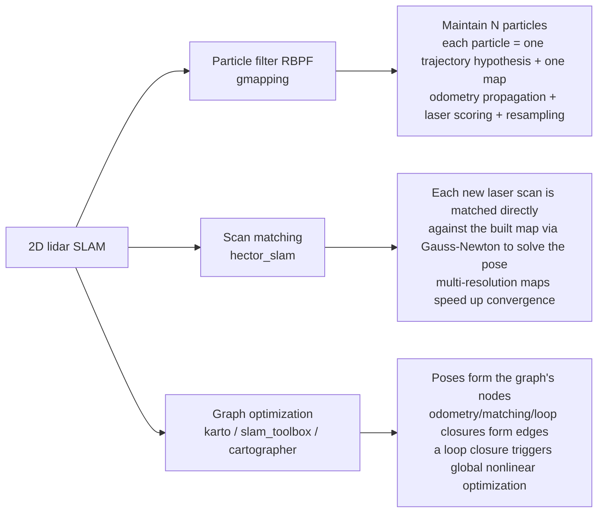
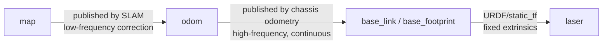

# 01 · Mapping Principles and Solution Selection

> 中文版 / Chinese: [01_建图原理与方案选型.md](../../20_2D建图/01_建图原理与方案选型.md)

## Goals

- Understand the data representation of an occupancy grid map and the meaning of each field in `map.yaml`
- State the SLAM problem in one sentence, and distinguish the three technical approaches: particle filtering, scan matching, and graph optimization
- Know each mapping solution's requirements on input topics and TF
- Be able to select a solution based on hardware conditions and scene scale

## Principles in Brief

### Occupancy Grid Maps

The output of 2D mapping is an occupancy grid map: the plane is divided into cells of fixed resolution (e.g., 5 cm), and each cell stores a "probability of being occupied by an obstacle". In ROS it is published as a `nav_msgs/OccupancyGrid` message (topic `/map`); each cell in the `data[]` array takes one of three typical values:

| Value | Meaning | Color in RViz / PGM image |
| --- | --- | --- |
| `0` | Free — the robot can pass through | White |
| `100` | Occupied — there is an obstacle | Black |
| `-1` | Unknown — never covered by the laser | Gray |

Saving a map with `map_server` produces two files: `map.pgm` (a grayscale image whose pixels are the grid cells) and `map.yaml` (metadata). The `map.yaml` fields:

```yaml
image: map.pgm            # Path to the image file (relative to the yaml's directory)
resolution: 0.050000      # Real-world size per pixel, in m/pixel
origin: [-10.0, -10.0, 0.0]  # [x, y, yaw] of the image's bottom-left pixel in the map frame
negate: 0                 # 0 = white means free; 1 = color meanings inverted
occupied_thresh: 0.65     # Occupancy probability > 0.65 is judged occupied (black)
free_thresh: 0.196        # Occupancy probability < 0.196 is judged free (white)
```

`origin` is the most frequently asked-about field: it determines how the map image aligns with the `map` frame. During navigation, AMCL/map_server rely entirely on it to convert pixel coordinates into world coordinates; after manually cropping the PGM you must update `origin` accordingly.

### The SLAM Problem in One Sentence

**SLAM (Simultaneous Localization and Mapping): a robot in an unknown environment, using only its own sensor data, simultaneously estimates "where am I" (pose) and "what does the surrounding look like" (map) — each is a prerequisite for the other, so they must be solved jointly.**

### Three Technical Approaches



Intuitive understanding:

- **Particle filter (gmapping)**: bets on N "routes I might have taken" at once; every incoming laser scan scores all hypotheses, eliminating the bad ones and duplicating the good ones. Pros: simple framework, stable in small scenes. Cons: history cannot be revised — once the particles converge to a wrong trajectory, the map is wrong forever; and large scenes require more particles, inflating memory and CPU accordingly.
- **Scan matching (hector_slam)**: makes no global hypotheses; each laser scan is directly "aligned" to the current map, essentially treating localization as an image-registration problem. It needs no odometry, but relies on a high-frame-rate lidar and rich environmental geometric features; likewise no loop closure, so error only accumulates and is never corrected.
- **Graph optimization (slam_toolbox / cartographer)**: keeps every historical pose as a graph node; ordinary matching and loop-closure detection simply add constraint edges to the graph. When a loop closure is detected, a nonlinear least-squares optimization runs over the whole graph, **able to go back and correct the historical trajectory**. This is the only approach that can "pull back" accumulated error in large scenes, and it is the current industry mainstream.

### Input Requirements for Mapping

| Input | Type | gmapping | hector | slam_toolbox | cartographer |
| --- | --- | --- | --- | --- | --- |
| `/scan` | `sensor_msgs/LaserScan` | Required | Required | Required | Required |
| TF `odom → base_link` | Odometry | Required | Not needed (can self-publish) | Required | Optional (`use_odometry` in lua) |
| TF `base_link → lidar frame` | Extrinsics | Required | Required | Required | Required (or URDF) |
| IMU | `sensor_msgs/Imu` | Not used | Optional | Not used | Optional in 2D / required in 3D |

All algorithms output the TF `map → odom` (hector, when running without odometry, can be configured to publish `map → base_link` directly or to publish `map → odom` itself). Why not publish `map → base_link` directly? This is a classic ROS design (REP 105): in the TF tree, each frame may have only one parent. `odom → base_link` is published continuously at high frequency by the chassis, while SLAM is only responsible for correcting, at low frequency, the "drift" segment `map → odom`; the two segments compose to give the global pose:



Before mapping, self-check with these commands:

```bash
rostopic hz /scan                        # Confirm laser frame rate (about 5 Hz in TB3 simulation)
rostopic echo -n1 /scan | head -20       # Confirm frame_id and range_min/max are reasonable
rosrun tf tf_echo odom base_footprint    # Confirm the odometry TF exists and changes as the robot moves
rosrun rqt_tf_tree rqt_tf_tree           # Check that the full TF tree is connected
```

### Acceptance Criteria for a "Good Map"

Mapping is not done just because the workflow ran to completion; check against this list before delivery:

1. **Single-line walls**: the same wall appears as only one black line on the map — no ghosting, no double layers;
2. **Loop closure**: after driving a full loop back to the start, walls at the closure point align, with misalignment under 2–3 grid cells;
3. **Right angles are right angles**: room corners are close to 90°, and the two sides of a long corridor stay parallel without diverging;
4. **No through-wall noise**: no patches of "free" area should appear outside walls (glass and mirror reflections can cause this);
5. **Clean traversable area**: areas the robot has driven through are white, with no unexplained black dots (residual shadows of dynamic obstacles).

If these are not met, first troubleshoot hardware (odometry calibration, lidar extrinsics, time synchronization) before tuning algorithm parameters — **80% of map problems stem from the input data, not from SLAM parameters**.

### Loading and Reusing Maps

A finished map is re-published via `map_server` for use by localization and navigation:

```bash
rosrun map_server map_server ~/maps/mymap.yaml
# Publishes: /map (nav_msgs/OccupancyGrid, latched), /map_metadata (nav_msgs/MapMetaData)
# Service: /static_map (nav_msgs/GetMap)
```

Expected output:

```text
[ INFO] [...]: Loading map from image "/home/iot/maps/mymap.pgm"
[ INFO] [...]: Read a 384 X 384 map @ 0.050 m/cell
```

If you need to manually edit the map (erase residual shadows of dynamic obstacles, seal off doors that must not be traversed), open the PGM directly in GIMP: pure black (0) = occupied, pure white (254/255) = free, gray (205) = unknown. As long as you only change pixels without cropping the canvas, `map.yaml` needs no changes.

## Selection Advice

| Your conditions / needs | Recommended solution | Rationale |
| --- | --- | --- |
| Teaching, getting started, understanding SLAM principles | gmapping | Parameters have intuitive physical meaning; the particle filter is the classic starting point for understanding SLAM |
| Chassis without encoders / handheld lidar scanning | hector_slam | The only solution that needs no odometry |
| Production deployment, navigation planned next | slam_toolbox | Officially recommended by ROS (Nav2 default); supports map serialization for continued mapping and pure localization |
| Very large scenes (>5000 m²), multi-sensor fusion | cartographer | Submaps + branch-and-bound loop closure; best robustness in very large scenes |
| Low-cost controller with tight CPU budget | hector or gmapping (low particle count) | Graph-optimization back ends have continuous background computation overhead |

## FAQ

**Q1: What is the relationship between mapping and localization?**
During the mapping phase you run SLAM to generate the map; during deployment you usually load the existing map and only do localization (AMCL or slam_toolbox localization mode) — see [30_Localization](../30_localization/README.md). SLAM localizes itself while mapping, so in theory you could keep running SLAM after the map is built, but pure localization has far lower CPU overhead and the map cannot be polluted.

**Q2: Why are there gray areas at the map edges in RViz?**
Gray = `-1` unknown area — the laser never scanned it (occluded or beyond range). This is normal; during navigation the global planner does not traverse unknown areas by default (configurable).

**Q3: What resolution should I choose?**
0.05 m is the general choice for indoor navigation. Finer (0.025 m) maps look nicer but roughly quadruple memory and matching cost; coarser than 0.1 m causes narrow doorways to be "blocked" in the costmap.

**Q4: What are the lidar-mounting requirements for 2D mapping?**
The lidar must be mounted level, and targets within the scan plane must be stable (avoid heights near "now-you-see-it, now-you-don't" objects like table edges); the `base_link → laser` TF must be accurate — especially the yaw angle: a 1° extrinsic error means a 17 cm point-cloud offset at 10 m.

**Q5: Can I still map when pedestrians / forklifts are moving in the environment?**
Yes, but with care: dynamic objects leave black residual shadows on the map. Countermeasures: map during low-traffic periods; scan the same area several times (probabilistic updates gradually "wash out" the shadows — for hector you can reduce `update_factor_free` to speed this up); finally clean up manually with GIMP. For scenes with many persistent dynamic obstacles, prefer solutions with probabilistic updates and loop closure (slam_toolbox / cartographer).

**Q6: Do I really have to practice in simulation first?**
Strongly recommended. In simulation, odometry and extrinsics are "perfect"; get the workflow and parameter meanings down in simulation first, so that when things go wrong on a real robot you can distinguish "data problems" from "parameter problems". Every experiment in this chapter can be done in simulation first and then reproduced on hardware.

**Q7: How do I convert pixel coordinates to map coordinates?**
Commonly needed by map-reading programs. Let the image height be H (pixels) and the pixel be (px, py) (origin at top-left, py pointing down); then:

```text
x = origin[0] + px * resolution
y = origin[1] + (H - 1 - py) * resolution
```

Note that the PGM's y axis points opposite to the map frame's — this is the most common mistake when in-house tools read maps.
