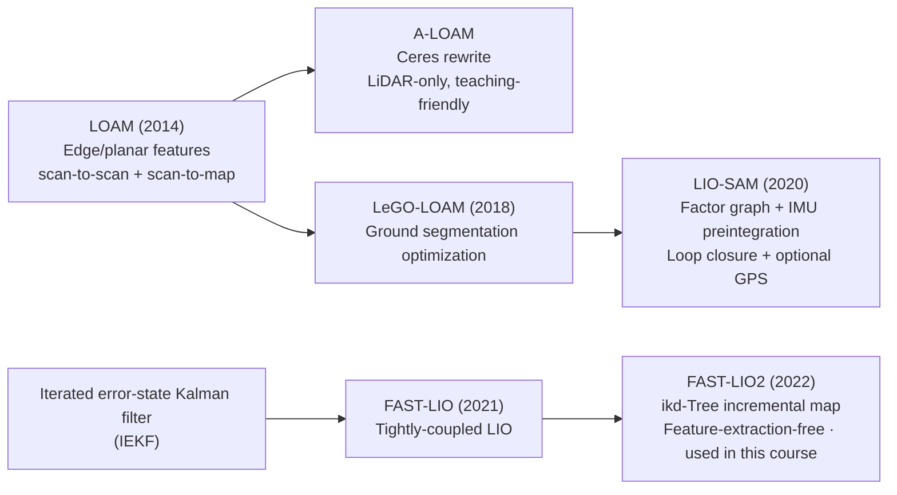

# 01 · 3D LiDAR SLAM Overview and Setup

> 中文版 / Chinese: [01_3D激光SLAM概览与准备.md](../../25_3D激光SLAM/01_3D激光SLAM概览与准备.md)

## Goals

- Understand the essential differences between 3D LiDAR SLAM and 2D mapping (map representation, state degrees of freedom, compute requirements)
- Build a mental map of the technical lineage: feature-based methods (LOAM family) vs tightly-coupled direct methods (LIO family)
- Install all dependencies for this chapter in one pass (Ceres, GTSAM, Livox-SDK) and successfully build the four repositories
- Prepare the public demo datasets for all three solutions

## 1. 2D vs 3D: More Than Just an Extra Dimension

| Dimension | 2D LiDAR SLAM (Chapter 20) | 3D LiDAR SLAM (this chapter) |
| --- | --- | --- |
| Sensor | Single-beam LiDAR (rplidar etc.), a few thousand points per revolution | Multi-beam mechanical (VLP-16 etc., 16–128 beams) or solid-state (Livox), hundreds of thousands of points per second |
| Map representation | Occupancy grid (`nav_msgs/OccupancyGrid`, PGM image) | 3D point cloud map (PCD file), can be post-processed into grids/meshes/octrees |
| State degrees of freedom | 3 DoF (x, y, yaw), assumes flat ground | 6 DoF (x, y, z, roll, pitch, yaw), handles slopes, bumps, handheld use |
| Motion distortion | Few points per revolution, usually ignored | The platform moves while a 100k-point frame is being scanned — **de-skewing is mandatory** (via IMU or constant-velocity assumption) |
| Compute | A single core suffices | Point cloud registration + nonlinear optimization; multi-core x86 is the entry-level configuration |

Problems in 2D setups such as "the LiDAR is mounted at an angle" or "the map smears when crossing a speed bump" are exactly what happens when the 3-DoF assumption breaks down; 3D SLAM solves this at the root with a full 6-DoF pose, at the cost of compute and sensor expense.

## 2. Technical Lineage: Feature-Based and Tightly-Coupled



The core difference between the two routes:

- **Feature-based (LOAM family)**: first extract geometric features (edge points, planar points) from the raw point cloud, and register using only the features, keeping compute under control. A-LOAM is a LiDAR-only implementation; LIO-SAM adds tightly-coupled IMU and a factor-graph backend on top of the same feature front end.
- **Direct tightly-coupled (FAST-LIO2)**: skips feature extraction, registers the downsampled raw points directly into an incremental kd-tree (ikd-Tree), and fuses IMU and LiDAR at the state level with an iterated Kalman filter — fast and compute-efficient.

"Tightly-coupled" means IMU measurements enter the same state-estimation problem (filter or factor graph) and are optimized jointly with the LiDAR, rather than a loose coupling of two independent odometry results as done by robot_localization in Chapter 30.

## 3. Point Cloud Basics

The standard ROS message for 3D LiDAR is `sensor_msgs/PointCloud2`: a binary blob of point data plus a `fields` description (which attributes each point has, their types, and their offsets). Use `rostopic echo -n1 /velodyne_points --noarr` to view only the header and field definitions. Common fields:

| Field | Meaning | Who needs it |
| --- | --- | --- |
| `x, y, z` | Point coordinates (meters) | All solutions |
| `intensity` | Reflection intensity | Visualization / feature assistance |
| `ring` | Beam index the point belongs to (0 to N_SCAN-1) | **Hard requirement of LIO-SAM** |
| `time` / `t` | Point timestamp relative to the frame header | **Required for de-skewing in LIO-SAM/FAST-LIO** |

PCL (Point Cloud Library) in one sentence: the standard C++ library for processing point clouds in the ROS ecosystem (filtering, downsampling, registration, and KD-trees all come from it). All three solutions depend on it, and it ships with `ros-noetic-desktop-full`, so no separate installation is needed.

## 4. Consolidated Dependency Installation

The extra dependencies of the three solutions are summarized below; installing them all at once is recommended:

| Dependency | Used by | Installation method |
| --- | --- | --- |
| Ceres Solver 1.14 | A-LOAM (two-level nonlinear optimization) | Direct apt install |
| GTSAM 4.0 | LIO-SAM (iSAM2 factor-graph backend) | PPA install |
| Livox-SDK + livox_ros_driver | FAST-LIO (Livox LiDAR support, required for compilation) | Build from source + build with the workspace |

### 4.1 Ceres (direct apt install is enough)

The Ubuntu 20.04 repository ships version 1.14, which is compatible with A-LOAM — no source build needed:

```bash
sudo apt install libceres-dev
```

### 4.2 GTSAM (install the 4.0 series via PPA)

```bash
sudo add-apt-repository ppa:borglab/gtsam-release-4.0
sudo apt update
sudo apt install libgtsam-dev libgtsam-unstable-dev
```

### 4.3 Livox-SDK (build and install from source)

livox_ros_driver depends on the underlying SDK, which must be built from source:

```bash
cd ~/workspace   # any source directory — do NOT place it inside the catkin workspace
git clone https://github.com/Livox-SDK/Livox-SDK.git
cd Livox-SDK/build
cmake ..
make
sudo make install
```

Once the SDK is installed, `livox_ros_driver` is an ordinary catkin package: place it under `src/` and build it with the workspace via `catkin_make` (built together in the next section).

> Note: FAST-LIO's message definitions depend on livox_ros_driver. **Even if you only use Velodyne data, you must build livox_ros_driver first**, otherwise the FAST_LIO build fails.

## 5. Cloning the Repositories and Building

All four repositories in this chapter are forks under the Romindly-Dev organization (kept in sync with upstream for unified maintenance). If you cloned via the Chapter 00 script they already exist; clone whichever is missing:

```bash
cd ~/ws_romindly/src
git clone -b devel  https://github.com/Romindly-Dev/A-LOAM.git
git clone -b master https://github.com/Romindly-Dev/LIO-SAM.git
git clone -b main --recursive https://github.com/Romindly-Dev/FAST_LIO.git   # contains the ikd-Tree submodule, --recursive is mandatory
git clone -b master https://github.com/Romindly-Dev/livox_ros_driver.git
```

Build (after all dependencies are installed):

```bash
cd ~/ws_romindly
catkin_make
source devel/setup.bash
```

The expected output ends with `[100%] Built target ...` and no red Error. Verify the build artifacts of the four packages:

```bash
ls devel/lib/aloam_velodyne/   # ascanRegistration alaserOdometry alaserMapping kittiHelper
ls devel/lib/lio_sam/          # lio_sam_imuPreintegration lio_sam_imageProjection ...
ls devel/lib/fast_lio/         # fastlio_mapping
```

## 6. Preparing the Public Datasets

You can complete every experiment in this chapter without a physical 3D LiDAR. The authors of all three solutions provide official rosbags (hosted on Google Drive; refer to each repository's README for the links — direct links are not pasted here to avoid link rot):

| Dataset | Used for | How to obtain |
| --- | --- | --- |
| NSH indoor outdoor (VLP-16) | A-LOAM | Google Drive link in Section 3 of `A-LOAM/README.md` |
| KITTI Odometry | A-LOAM (optional) | Download from the KITTI website, convert to bag with `kitti_helper.launch` |
| Walking / Park / Garden | LIO-SAM | Google Drive links in the "Sample datasets" section of `LIO-SAM/README.md` |
| Avia indoor / NCLT (HDL-32E) | FAST-LIO | Google Drive links in Section 4 "Rosbag Example" of `FAST_LIO/README.md` |

After downloading, place everything in `~/bags/`:

```bash
mkdir -p ~/bags
# Download in a browser and move here, or download on a machine with a GUI and scp to Romindly Mind
```

> For command-line downloads of large Google Drive files, `pip install gdown` then `gdown <file ID>`; if your network is restricted, download on the office network first and copy to the device.

## FAQ

**Q1: `catkin_make` reports `Could not find GTSAM`?**
Verify that the PPA installed `libgtsam-dev` (the 4.0 series). If a different GTSAM version was previously built from source into `/usr/local`, it will conflict with the PPA version — clean up `/usr/local/lib/cmake/GTSAM*` first.

**Q2: FAST_LIO reports `ikd_Tree.h: No such file or directory`?**
The `--recursive` flag was omitted when cloning. Fix: `cd src/FAST_LIO && git submodule update --init --recursive`.

**Q3: FAST_LIO cannot find `livox_ros_driver/CustomMsg`?**
livox_ros_driver is not under `src/` or has not built successfully yet. Make sure it builds on its own first (`catkin_make --pkg livox_ros_driver`), then build the whole workspace.

**Q4: The build gets OOM-killed due to insufficient memory (cc1plus killed)?**
Building LIO-SAM/FAST_LIO is memory-hungry. On the 8 GB N150 variant, limit parallelism: `catkin_make -j2`.

Next: [02 A-LOAM Hands-On](./02_aloam.md)
