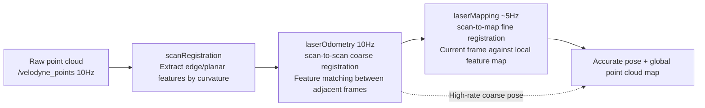

# 02 · A-LOAM Hands-On

> 中文版 / Chinese: [02_A-LOAM实战.md](../../25_3D激光SLAM/02_A-LOAM实战.md)

## Goals

- Intuitively understand the two core ideas of LOAM: edge/planar features, and two-level scan-to-scan + scan-to-map optimization
- Build A-LOAM and run a complete mapping pipeline on a public dataset (NSH or KITTI)
- Master the division of labor and topic relationships among the three nodes, and observe the accumulated drift of LiDAR-only odometry

## 1. The Principles, Intuitively

The cleverness of LOAM (Lidar Odometry and Mapping) lies in this: **instead of brute-force registering hundreds of thousands of points, it only picks the points with "personality"**.

- **Edge points (corner/sharp)**: points lying on object edges, where the distances to their left/right neighbors change sharply (high curvature) — e.g. wall corners, pillar edges;
- **Planar points (surf/flat)**: points lying on flat surfaces, whose neighbors are nearly coplanar (low curvature) — e.g. floors, walls.

During registration, edge points are matched against "lines" in the previous frame/map, and planar points against "planes", forming point-to-line and point-to-plane distance residuals handed to Ceres for nonlinear least squares.

The second core idea is **two-level optimization running at different rates**:



- **scan-to-scan (laserOdometry)**: registers features between adjacent frames — fast, but error accumulates frame by frame;
- **scan-to-map (laserMapping)**: registers the current frame against the already-built local feature map — slower but far more accurate, and it continuously corrects the odometry's drift.

The high-rate coarse pose guarantees real-time performance while the low-rate accurate pose guarantees precision — this "fast/slow dual-layer" architecture has been inherited by nearly every LiDAR SLAM system since. A-LOAM is a Ceres rewrite of LOAM with clean code and no hand-derived Jacobians, making it an excellent first lesson in 3D SLAM.

## 2. Environment Preparation

The only dependencies are Ceres and PCL (PCL ships with ROS):

```bash
sudo apt install libceres-dev
cd ~/ws_romindly && catkin_make --pkg aloam_velodyne
source devel/setup.bash
```

Dataset: download `nsh_indoor_outdoor.bag` from the Google Drive link in Section 3 of `A-LOAM/README.md` (a mixed indoor/outdoor scene captured with a VLP-16, about 3 GB) and place it in `~/bags/`.

## 3. Step by Step: Running the NSH Dataset

**Terminal 1** — launch the three A-LOAM nodes + rviz:

```bash
source ~/ws_romindly/devel/setup.bash
roslaunch aloam_velodyne aloam_velodyne_VLP_16.launch
```

Expected output: three nodes start, rviz opens with the `aloam_velodyne.rviz` configuration loaded, and the terminal waits for point cloud input.

**Terminal 2** — play back the data:

```bash
rosbag play ~/bags/nsh_indoor_outdoor.bag
```

Within a few seconds rviz should show: the white current-frame point cloud, the colored accumulated map, and the green (odometry) and red (mapping) trajectories gradually extending. Terminal 1 continuously prints the per-frame processing time (`whole laserOdometry time` etc.).

**Verify topic connectivity** (terminal 3):

```bash
rostopic hz /velodyne_points /laser_odom_to_init /aft_mapped_to_init
# Expected: /velodyne_points ≈10Hz, /laser_odom_to_init ≈10Hz, /aft_mapped_to_init ≈5Hz
```

### KITTI Dataset (Optional)

After downloading the KITTI Odometry dataset, edit `dataset_folder` and `sequence_number` in `A-LOAM/launch/kitti_helper.launch` (optionally set `to_bag` to save a bag), then:

```bash
roslaunch aloam_velodyne aloam_velodyne_HDL_64.launch   # KITTI uses a 64-beam LiDAR
roslaunch aloam_velodyne kitti_helper.launch            # another terminal, reads and publishes KITTI data
```

## 4. Nodes, Topics, and Parameters in Detail

### 4.1 The Three Nodes and Topic Flow

| Node (executable) | Subscribes | Publishes (main) | Role |
| --- | --- | --- | --- |
| `ascanRegistration` | `/velodyne_points` | `/laser_cloud_sharp`, `/laser_cloud_less_sharp`, `/laser_cloud_flat`, `/laser_cloud_less_flat`, `/velodyne_cloud_2` | Splits the point cloud by beam, computes curvature, extracts the two grades of edge/planar features |
| `alaserOdometry` | The feature topics above | `/laser_odom_to_init` (10 Hz pose), `/laser_cloud_corner_last`, `/laser_cloud_surf_last`, `/laser_odom_path` | scan-to-scan frame-to-frame odometry |
| `alaserMapping` | Features and pose from odometry | `/aft_mapped_to_init` (accurate pose), `/aft_mapped_to_init_high_frec` (high-rate interpolated pose), `/laser_cloud_map`, `/velodyne_cloud_registered`, `/aft_mapped_path` | scan-to-map fine registration and map maintenance |

The difference between sharp/less_sharp (flat/less_flat): sharp are the few points with the highest curvature, used as the "source" of the optimization; less_sharp are more numerous and serve as the matching "target" for the next frame, improving the odds of finding correspondences.

### 4.2 Parameter Table (in the launch file — A-LOAM has only these few parameters)

| Parameter | VLP_16 default | Description |
| --- | --- | --- |
| `scan_line` | 16 | Number of LiDAR beams, **must match the data** (16/32/64), otherwise beam splitting is scrambled and all features are wrong |
| `minimum_range` | 0.3 | Near-range blind zone removal (meters), filters points hitting the platform itself |
| `mapping_skip_frame` | 1 | Odometry sends 1 of every N frames to mapping; 1 = 10 Hz mapping, 2 = 5 Hz — increase when compute is tight |
| `mapping_line_resolution` | 0.2 | Voxel downsampling size for edge features in the map (meters); larger saves compute but is coarser |
| `mapping_plane_resolution` | 0.4 | Voxel downsampling size for planar features in the map (meters), same as above |

The small parameter set is precisely A-LOAM's character: no IMU, no loop closure, no keyframe strategy — everything kept simple. That makes it the best textbook for reading the LOAM paper alongside its code, but also means it is more sensitive to the scene and motion style.

### 4.3 rviz Configuration Essentials

The bundled `rviz_cfg/aloam_velodyne.rviz` is already configured. To set it up manually (or embed it into your own rviz project), the key items are:

- Set Fixed Frame to `camera_init` (A-LOAM keeps LOAM's camera-frame naming; `camera_init` is the mapping origin);
- Map: display `/laser_cloud_map` (feature map, sparse) or `/velodyne_cloud_registered` (registered full point cloud, dense) via `PointCloud2`; increase Decay Time to accumulate the display;
- Trajectories: display `/laser_odom_path` (green, coarse) and `/aft_mapped_path` (red, accurate) via `Path`; comparing the two lines shows directly how much mapping corrects odometry.

## 5. Real-Hardware Integration Essentials

Connecting a physical Velodyne (see [45 Sensor Drivers](../45_sensor_drivers/README.md)) takes only three steps:

```bash
sudo apt install ros-noetic-velodyne            # official driver (this course's velodyne fork can also be built from source)
roslaunch velodyne_pointcloud VLP16_points.launch   # publishes /velodyne_points
roslaunch aloam_velodyne aloam_velodyne_VLP_16.launch
```

Notes:

- `scan_line` must match the real number of beams; use `aloam_velodyne_HDL_32.launch` for 32-beam units;
- If the platform has occluding structures (mounts, enclosures), raise `minimum_range` beyond the occlusion radius;
- A-LOAM has no IMU input — **avoid sharp turns and bumpy surfaces**; the smoother the motion, the better the result. This very limitation is the real-world motivation for the two LIO solutions that follow.

## 6. Observing Drift Without Loop Closure

A-LOAM has no loop closure detection: when you travel a large loop back to the start, the accumulated error is not corrected. The NSH dataset shows this directly — near the end of the bag, back in the indoor area where it started, rviz shows obvious "ghosting" between old and new point clouds (misaligned wall layers). This is not a bug but the fundamental flaw of pure odometry-style SLAM, and the motivation for LIO-SAM's factor graph + loop closure in the next article.

Also note that A-LOAM provides no map-saving service — the map you see in rviz is gone once you close it. To save it, record the registered point cloud with `rosbag record /velodyne_cloud_registered`, or write it to disk with the `pointcloud_to_pcd` tool from `pcl_ros`.

## FAQ

**Q1: No point cloud at all in rviz?**
Check the bag's point cloud topic name: `rosbag info xxx.bag`. A-LOAM subscribes to `/velodyne_points` (fixed); if the topic differs, remap during playback: `rosbag play xxx.bag /your_topic:=/velodyne_points`.

**Q2: The map drifts away quickly / breaks apart?**
The most common cause is `scan_line` not matching the data's beam count (e.g. playing 64-beam KITTI data with the VLP_16 launch). Next is motion that is too fast, or a scene with too few geometric features (long straight corridors, open plazas) — LiDAR-only methods have no answer in such degenerate scenes; an IMU is required (see the next two articles).

**Q3: The printed processing time keeps growing?**
Map feature points grow over time, raising mapping cost. Increase `mapping_line_resolution`/`mapping_plane_resolution` or set `mapping_skip_frame` to 2.

**Q4: `error while loading shared libraries: libceres.so`?**
Ceres was installed/upgraded after the build. Run `catkin_make` again and confirm `sudo ldconfig`.

Next: [03 LIO-SAM Hands-On](./03_lio_sam.md)
