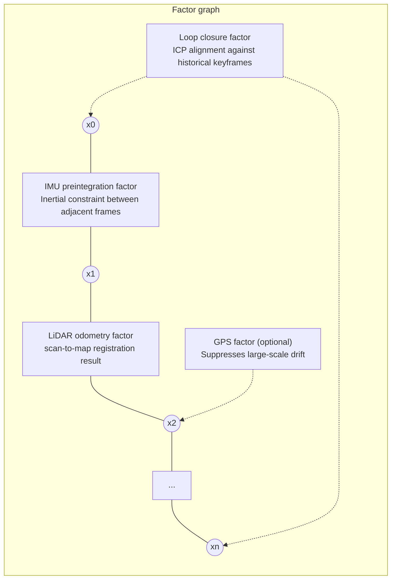

# 03 · LIO-SAM Hands-On

> 中文版 / Chinese: [03_LIO-SAM实战.md](../../25_3D激光SLAM/03_LIO-SAM实战.md)

## Goals

- Understand the four constraint factor types in the factor-graph framework (IMU preintegration, LiDAR odometry, GPS, loop closure)
- Know LIO-SAM's three hard sensor requirements (9-axis IMU, extrinsics, point cloud ring/time fields) — 90% of real-hardware integration pitfalls live here
- Run mapping on the official walking dataset and export a PCD map with the `save_map` service
- Understand the key parameters in `config/params.yaml`

## 1. The Principles, Intuitively: Turning SLAM into a "Constraint Web"

LIO-SAM = Lidar-Inertial Odometry via Smoothing and Mapping. It treats each keyframe pose along the robot's trajectory as a node in a graph, and every sensor measurement becomes a "spring" (factor) between nodes; the backend (GTSAM's iSAM2) continuously relaxes the whole web into its most relaxed (minimum-residual) state:



- **IMU preintegration factor**: "preintegrates" the hundreds of IMU readings between two keyframes into a single relative-motion constraint while estimating IMU biases online; the IMU is also used for point cloud de-skewing and for providing the initial guess for LiDAR registration.
- **LiDAR odometry factor**: LOAM-style edge/planar feature scan-to-map registration (the front end is a direct descendant of A-LOAM).
- **GPS factor** (optional): adds global position constraints to nodes, preventing drift in large outdoor scenes.
- **Loop closure factor**: when a previously visited place is recognized, ICP aligns the current frame with a historical keyframe, and the error is propagated back along the whole trajectory for correction — exactly the capability A-LOAM lacks.

The benefit: any type of measurement is just "adding edges to the graph", so sensors are pluggable; the historical trajectory can be corrected as a whole, keeping the map globally consistent.

## 2. Hard Sensor Requirements (Must-Read Before Real-Hardware Integration)

You will not hit these issues with the official datasets, but verify each item before connecting your own LiDAR/IMU:

1. **9-axis IMU at ≥200 Hz.** LIO-SAM relies on the IMU's roll/pitch (gravity alignment) to initialize the system attitude, and yaw (magnetometer) together with GPS to initialize heading. **A 6-axis IMU (such as the one built into Ouster LiDARs) cannot be used directly.** The authors use a 500 Hz Microstrain 3DM-GX5-25.
2. **The IMU-LiDAR extrinsics must be correct.** `params.yaml` contains two sets of extrinsics: `extrinsicRot` (rotation from the accelerometer/gyroscope frame to the LiDAR frame) and `extrinsicRPY` (rotation from the attitude-angle frame to the LiDAR frame). The defaults are for the author's own IMU (the two sets differ); **if your IMU's axes are consistent, both sets should be changed to the same rotation matrix.** Typical symptoms of wrong extrinsics are listed in the FAQ.
3. **The point cloud must carry `ring` and `time` fields** (the most common pitfall). The `imageProjection` node checks every frame:
   - No `ring` field → errors out immediately: `Point cloud ring channel not available, please configure your point cloud data!`
   - No `time`/`t` field → warns and disables de-skewing: `Point cloud timestamp not available, deskew function disabled, system will drift significantly!`

   The official Velodyne driver outputs both fields by default; many simulation plugins, old drivers, or converted bags lose them — this is the number-one reason for "it runs for others but not for me".

## 3. Environment Preparation

```bash
# GTSAM (skip if already installed in article 01)
sudo add-apt-repository ppa:borglab/gtsam-release-4.0
sudo apt update && sudo apt install libgtsam-dev libgtsam-unstable-dev

cd ~/ws_romindly && catkin_make --pkg lio_sam -j2
source devel/setup.bash
```

Datasets: from the "Sample datasets" section of `LIO-SAM/README.md`, download the **Walking dataset** (handheld indoor/outdoor, runs directly with default parameters) and the **Garden dataset** (for testing loop closure), and place them in `~/bags/`. Note that the Rotation/Campus datasets use a different topic name (`imu_correct`) and require parameter changes per the README before they will run.

## 4. Step by Step: Running the Walking Dataset

**Terminal 1** — launch LIO-SAM (rviz included):

```bash
source ~/ws_romindly/devel/setup.bash
roslaunch lio_sam run.launch
```

**Terminal 2** — playback (the authors suggest up to 3x speed; with loop closure enabled, real-time `-r 1` is recommended):

```bash
rosbag play ~/bags/walking_dataset.bag -r 3
```

Expected: the green trajectory extends in rviz and "Map (cloud)" shows the stitched point cloud; no red errors in the terminal. Check the key output topics:

```bash
rostopic hz /lio_sam/mapping/odometry /lio_sam/imu/path
```

### Testing Loop Closure

Use the Garden dataset at real-time speed. In rviz, uncheck "Map (cloud)" and check "Map (global)" (the former is merely rviz stacking historical point clouds — their positions are not updated by loop-closure corrections; the latter is the actual optimized global map). When the loop returns to the start, yellow loop-closure edges appear on `/lio_sam/mapping/loop_closure_constraints` and the whole trajectory adjusts slightly.

### Saving the Map

Setting `savePCD: true` in `params.yaml` saves automatically on exit; calling the service at any time is preferred (srv definition: `float32 resolution, string destination → bool success`):

```bash
rosservice call /lio_sam/save_map 0.2 "/Downloads/LOAM/"
```

The map (`GlobalMap.pcd`, the trajectory, and the corner/surface feature clouds) is saved to `~/Downloads/LOAM/`. If destination is left empty, the `savePCDDirectory` parameter value is used; **note that this directory is deleted and recreated** — do not point it at a directory containing existing data. Viewing: `pcl_viewer ~/Downloads/LOAM/GlobalMap.pcd` (`sudo apt install pcl-tools`).

## 5. Nodes and Topics at a Glance

`run.launch` starts four core nodes via `module_loam.launch` (plus robot_state_publisher and the optional navsat GPS module):

| Node | Inputs | Outputs (main) | Responsibility |
| --- | --- | --- | --- |
| `imuPreintegration` | `imu_raw`, mapping poses | `odometry/imu` (high-rate odometry at IMU frequency) | IMU preintegration, bias estimation, high-rate pose extrapolation |
| `imageProjection` | `points_raw`, `imu_raw` | `lio_sam/deskew/cloud_deskewed`, `cloud_info` | Projects the point cloud into a range image, de-skews via IMU, validates ring/time |
| `featureExtraction` | `deskew/cloud_info` | `lio_sam/feature/cloud_corner`, `cloud_surface` | LOAM-style edge/planar feature extraction |
| `mapOptimization` | Feature clouds, GPS (optional) | `lio_sam/mapping/odometry`, `map_global`, `path`, the `/lio_sam/save_map` service | scan-to-map registration, factor-graph optimization, loop closure, map saving |

Two topics for downstream navigation: `lio_sam/mapping/odometry` (LiDAR rate, globally optimized) and `odometry/imu` (IMU rate, smooth but subject to loop-closure jump corrections).

## 6. Key params.yaml Parameters Explained

| Parameter | Default | Description |
| --- | --- | --- |
| `pointCloudTopic` | `points_raw` | Input point cloud topic; change to `/velodyne_points` when connecting a real Velodyne |
| `imuTopic` | `imu_raw` | Input IMU topic (raw 9-axis data) |
| `sensor` | `velodyne` | LiDAR type: `velodyne`/`ouster`/`livox`, determines how the ring/time fields are parsed |
| `N_SCAN` / `Horizon_SCAN` | 16 / 1800 | Beam count and points per beam, **must match the LiDAR** (e.g. VLP-16: 16/1800) |
| `downsampleRate` | 1 | Downsampling along the beam direction; a 64-beam unit can set 4 to act as 16-beam, saving compute |
| `lidarMinRange` / `lidarMaxRange` | 1.0 / 1000.0 | Range clipping (meters) |
| `extrinsicTrans` | [0,0,0] | IMU→LiDAR translation |
| `extrinsicRot` / `extrinsicRPY` | See file | The two IMU→LiDAR rotation extrinsics (see Section 2, item 2) |
| `edgeThreshold` / `surfThreshold` | 1.0 / 0.1 | Curvature thresholds separating edge/planar features |
| `numberOfCores` | 4 | Mapping optimization thread count; keep 4 on the N305 (8 cores), use 2 on the N150 |
| `mappingProcessInterval` | 0.15 | Seconds, minimum interval between two scan-to-map runs; increase to lower CPU |
| `surroundingkeyframeAddingDistThreshold` | 1.0 | Meters, distance traveled before adding a keyframe |
| `loopClosureEnableFlag` | true | Loop closure switch |
| `loopClosureFrequency` | 1.0 | Hz, loop closure detection frequency |
| `historyKeyframeSearchRadius` | 15.0 | Meters, how close a historical keyframe must be to the current pose to be considered for loop closure |
| `historyKeyframeFitnessScore` | 0.3 | ICP quality threshold; smaller demands better alignment — lower it if false loop closures occur |
| `savePCD` / `savePCDDirectory` | false / `/Downloads/LOAM/` | Whether to save the map on exit and the path (relative to the home directory) |

## FAQ

**Q1: Error at startup: `Point cloud ring channel not available`?**
Your point cloud has no `ring` field. For Velodyne, use the official `velodyne_driver` (Chapter 45 of this course); for other LiDARs, confirm the driver output, or switch the `sensor` type accordingly.

**Q2: base_link bounces up and down and the map flips as soon as playback starts?**
Typical symptom of wrong IMU extrinsics (e.g. the gravity direction is inverted). Check the acceleration with `rostopic echo /imu_raw` while stationary: the Z axis should read about +9.8; recompute `extrinsicRot`/`extrinsicRPY` for your mounting orientation.

**Q3: Frequent prints of `Large velocity, reset IMU-preintegration!`?**
IMU preintegration diverged and was reset. Common causes: IMU and LiDAR not time-synchronized (the two sensors' timestamps come from different sources), IMU noise parameters wildly off from reality, or wrong extrinsics. Check timestamps first (`rqt_bag` to inspect the time offset between the two topics) and the extrinsics.

**Q4: CPU maxes out and rviz stutters after running for a while?**
Try in order: raise `mappingProcessInterval` to 0.2–0.3; lower `numberOfCores` to 2; disable "Map (cloud)" in rviz; slow down playback. On the N150 variant, enable all of these together.

**Q5: Loop closure never triggers?**
Confirm real-time playback (ICP is slow — 3x speed may not keep up), `loopClosureEnableFlag: true`, and that the trajectory actually returns within `historyKeyframeSearchRadius` (15 m) with a time gap exceeding `historyKeyframeSearchTimeDiff` (30 s).

Next: [04 FAST-LIO Hands-On](./04_fast_lio.md)
