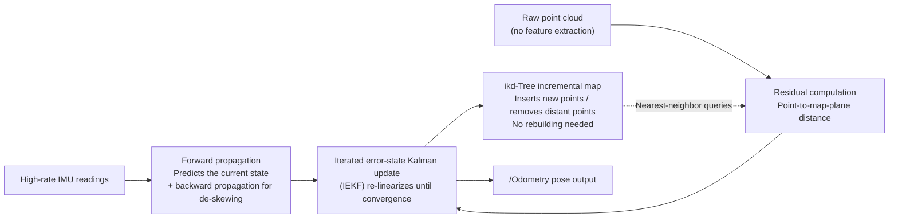

# 04 · FAST-LIO Hands-On

> 中文版 / Chinese: [04_FAST-LIO实战.md](../../25_3D激光SLAM/04_FAST-LIO实战.md)

## Goals

- Intuitively understand FAST-LIO2's two killer features — the iterated error-state Kalman filter (IEKF) and the ikd-Tree — and why it is fast and well suited to x86 edge units
- Build it correctly (submodule + livox_ros_driver prerequisite) and run both Livox and Velodyne data sources with the official datasets
- Understand the key `config/*.yaml` parameters and master deployment tuning on Romindly Mind

## 1. The Principles, Intuitively: Why It Is Fast

LIO-SAM uses a factor graph to "remember" the whole trajectory and re-optimize it repeatedly; FAST-LIO2 takes the other road — **maintain only the current state, and pour the effort into extreme per-frame efficiency**:



Three compute-saving design choices:

1. **No feature extraction**: it no longer picks edge/planar points — the downsampled raw points participate in registration directly (each point finds its neighbors in the map, fits a small plane, and computes the point-to-plane distance). The entire feature front end is eliminated, which also makes it indifferent to the LiDAR's scanning pattern (mechanical or Livox non-repetitive scanning both work).
2. **IEKF instead of graph optimization**: the state is only that of the current instant (pose, velocity, biases, gravity, etc.), and the measurement update uses the authors' equivalent Kalman-gain formula, so compute scales with the number of points rather than the trajectory length — memory and CPU usage do not grow with runtime.
3. **ikd-Tree incremental map**: a conventional kd-tree must be rebuilt from scratch whenever points are added; the ikd-Tree supports incremental insertion, deletion, and automatic rebalancing, and discards distant map points via a "local sliding window" (`cube_side_length`), keeping map queries at O(log n) at all times.

The price is **no loop closure and no global optimization**: it is essentially an extremely robust LiDAR-inertial odometry (LIO), and small drift remains over long loops. It works with a 6-axis IMU (no magnetometer required), which is also far more forgiving than LIO-SAM.

## 2. Environment Preparation

The build order matters: **Livox-SDK → livox_ros_driver → FAST_LIO** (the first two are required even if you only use Velodyne data, because FAST_LIO's message definitions depend on livox_ros_driver). SDK installation is covered in [Article 01](./01_overview_and_setup.md), Section 4.3; confirm the remaining steps here:

```bash
# 1. Confirm the submodule exists (the clone should have used --recursive)
cd ~/ws_romindly/src/FAST_LIO
git submodule update --init --recursive
ls include/ikd-Tree/    # should contain ikd_Tree.cpp / ikd_Tree.h

# 2. Build (livox_ros_driver in the same workspace is automatically ordered first by catkin)
cd ~/ws_romindly && catkin_make -j2
source devel/setup.bash
```

Datasets (Google Drive links in Section 4 "Rosbag Example" of `FAST_LIO/README.md`):

- **Livox Avia indoor bag**: contains `livox_ros_driver/CustomMsg` point clouds and the built-in IMU, paired with `avia.yaml`;
- **NCLT (Velodyne HDL-32E) bag**: a rosbag converted by the authors, paired with `velodyne.yaml`.

Place the downloads in `~/bags/`.

## 3. Step by Step

### 3.1 Livox Data Source (Avia bag)

**Terminal 1**:

```bash
source ~/ws_romindly/devel/setup.bash
roslaunch fast_lio mapping_avia.launch
```

**Terminal 2**:

```bash
rosbag play ~/bags/fast_lio_avia.bag   # file name depends on the actual download
```

In rviz, white/colored point clouds rapidly accumulate into a dense map. Watch the output rate:

```bash
rostopic hz /Odometry   # should be close to the point cloud frame rate (10 Hz) and very stable
```

### 3.2 Velodyne Data Source (NCLT bag)

```bash
roslaunch fast_lio mapping_velodyne.launch   # terminal 1
rosbag play ~/bags/nclt_xxx.bag              # terminal 2
```

`velodyne.yaml` defaults to `scan_line: 32` (HDL-32E) and the topics `/velodyne_points` and `/imu/data`, matching the NCLT bag. If you switch to VLP-16 data: change `scan_line` to 16 and verify `timestamp_unit` (unit of the per-point time field: 0 seconds / 1 milliseconds / 2 microseconds / 3 nanoseconds; NCLT uses microseconds).

### 3.3 Real Livox LiDAR Integration Essentials

You must start the driver with `livox_lidar_msg.launch` (which outputs `livox_ros_driver/CustomMsg` with per-point timestamps; the standard PointCloud2 output of `livox_lidar.launch` lacks per-point time and cannot be de-skewed):

```bash
roslaunch livox_ros_driver livox_lidar_msg.launch
roslaunch fast_lio mapping_avia.launch   # use mapping_mid360.launch for the Mid-360
```

### 3.4 Saving the Map

With `pcd_save_en: true` (the default), **exiting the node with Ctrl-C automatically writes the full accumulated point cloud** to `FAST_LIO/PCD/scans.pcd`:

```bash
pcl_viewer ~/ws_romindly/src/FAST_LIO/PCD/scans.pcd
```

For long runs, note that `interval: -1` means all points go into a single PCD, which can strain memory; change it to split files by frame count.

## 4. Config YAML Parameters Explained (based on avia.yaml / velodyne.yaml)

| Parameter | avia.yaml | velodyne.yaml | Description |
| --- | --- | --- | --- |
| `common.lid_topic` | `/livox/lidar` | `/velodyne_points` | Point cloud topic |
| `common.imu_topic` | `/livox/imu` | `/imu/data` | IMU topic |
| `common.time_sync_en` | false | false | Software time synchronization; enable only when hardware sync is impossible and the two sensors' clock offset is constant |
| `preprocess.lidar_type` | 1 | 2 | 1 = Livox series, 2 = Velodyne, 3 = Ouster |
| `preprocess.scan_line` | 6 | 32 | Beam count (the Avia has 6) |
| `preprocess.timestamp_unit` | — | 2 | Unit of the point cloud time/t field (2 = microseconds), needed only for standard PointCloud2 |
| `preprocess.blind` | 4 | 2 | Near-range blind zone (meters) |
| `mapping.acc_cov` / `gyr_cov` | 0.1 / 0.1 | same | IMU accelerometer/gyroscope noise covariance |
| `mapping.det_range` | 450 | 100 | Maximum LiDAR detection range (meters) |
| `mapping.extrinsic_T` / `extrinsic_R` | factory values | [0,0,0.28] / identity | LiDAR extrinsics in the IMU frame; `extrinsic_est_en: true` enables online refinement |
| `publish.dense_publish_en` | true | true | false publishes the registered point cloud sparsely, saving bandwidth/CPU |
| `pcd_save.pcd_save_en` | true | true | Save the PCD on exit |

The launch file also carries a set of runtime parameters (`mapping_velodyne.launch` defaults): `point_filter_num: 4` (keep 1 of every 4 points), `filter_size_surf: 0.5` / `filter_size_map: 0.5` (input/map voxel downsampling, meters), `max_iteration: 3` (maximum IEKF iterations), `cube_side_length: 1000` (local map cube side length, meters).

Main output topics: `/Odometry` (nav_msgs/Odometry pose), `/cloud_registered` (registered point cloud in the world frame), `/path` (trajectory).

## 5. Comparison with LIO-SAM and N305 Deployment Advice

| Dimension | LIO-SAM | FAST-LIO2 |
| --- | --- | --- |
| Accuracy | Better in large scenes (loop closure + global optimization correct drift) | High local accuracy; small uncorrectable drift over long loops |
| Compute | Medium-high, grows with loop closures / trajectory size | Low and constant; measured usage is clearly below LIO-SAM |
| Loop closure | Yes | No |
| IMU requirements | 9-axis, ≥200 Hz, extrinsics-sensitive | 6-axis suffices, supports online extrinsics estimation |
| Dependency complexity | GTSAM + point cloud ring/time fields | livox_ros_driver + submodule, no GTSAM |
| Best for | Offline surveying, globally consistent maps of large scenes | Real-time localization and mapping on edge/airborne units, feeding odometry to navigation |

Tuning order on Romindly Mind (especially the N150 variant):

1. `roslaunch ... rviz:=false` to disable visualization (rviz often costs more CPU than the algorithm itself); view remotely with rviz on another machine;
2. Increase `filter_size_surf` / `filter_size_map` (0.5 → 0.8–1.0 outdoors) and increase `point_filter_num`;
3. Set `dense_publish_en: false` and `path_en: false` to cut publishing overhead;
4. The N305 (8 cores) runs smoothly in real time with default parameters, with enough headroom to run the navigation stack simultaneously.

## FAQ

**Q1: Build errors `livox_ros_driver/CustomMsg not found` or missing `ikd_Tree.h`?**
The former: livox_ros_driver not built / not sourced. The latter: the submodule was not fetched — `git submodule update --init --recursive`.

**Q2: Warning `Failed to find match for field 'time'`?**
The standard PointCloud2 input lacks the per-point time field, so de-skewing is impossible. Use the official driver for Velodyne; for Livox you must use `livox_lidar_msg.launch` (CustomMsg).

**Q3: The whole map is tilted, or it diverges right after initialization?**
Keep the platform stationary for 2–3 seconds at startup so gravity alignment can complete; if the problem persists, verify `extrinsic_T/R` and the IMU topic units (FAST-LIO adapts to g vs m/s², but the axis directions must be correct).

**Q4: Memory keeps growing over long runs?**
Usually caused by `pcd_save_en: true` + `interval: -1` accumulating the entire run's point cloud in memory. Disable it if you do not need to save the map, or set `interval` to save in chunks.

This concludes the chapter. Selection recap: choose A-LOAM for teaching and understanding, LIO-SAM for survey-grade globally consistent maps, and FAST-LIO for real-time operation on edge units. Combined with hdl_localization from [30_Localization](../30_localization/README.md), you can do localization-only navigation on PCD maps built by FAST-LIO/LIO-SAM.
