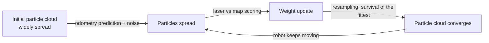
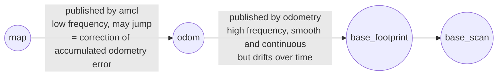

# 01 AMCL Principles and Tuning

> 中文版 / Chinese: [01_AMCL原理与调参.md](../../30_定位/01_AMCL原理与调参.md)

## Goals

- Understand the particle-filter idea behind Monte Carlo Localization (MCL) and judge localization quality from the particle cloud in rviz;
- Master the `map_server + amcl` startup workflow and the manual initialization procedure in rviz;
- Read and adjust AMCL's core parameters (particle count, update thresholds, motion/observation model noise, recovery mechanism);
- Understand AMCL's role in the TF tree: why it publishes `map→odom`.

## Principles in Brief: a "Guess the Position" Game Played by a Swarm of Particles

AMCL (Adaptive Monte Carlo Localization) represents the probability distribution of the robot's pose with a swarm of **particles**. Each particle is a hypothesis — "the robot might be at (x, y, θ)" — carrying a weight that expresses its credibility.

The algorithm loops through three steps:

1. **Prediction (motion update)**: the odometry says the robot moved forward 0.3 m, so all particles are moved forward 0.3 m too, with noise sprinkled on per the `odom_alpha*` parameters — the particle cloud spreads out accordingly (odometry cannot be fully trusted);
2. **Correction (observation update)**: compare the current laser scan against the map. If a particle's position were true, which obstacles should the laser hit? The better the agreement with the actual measurement, the higher that particle's weight;
3. **Resampling**: "survival of the fittest" by weight — high-weight particles get duplicated, low-weight ones are eliminated — and the particle cloud converges toward the true pose.

"Adaptive" means the particle count adjusts dynamically via KLD sampling: more particles when the pose is uncertain (up to `max_particles`), automatically fewer after convergence (down to `min_particles`), saving computation.



Subscribe to `/particlecloud` in rviz (type `geometry_msgs/PoseArray`, shown as a field of small red arrows) for an intuitive view: **arrows clustered in a small bunch pointing the same way = good localization; arrows scattered widely or split into several clusters = poor localization**.

## Step-by-Step

### 1. Start the simulation and navigation (which includes AMCL)

```bash
# Terminal 1: Gazebo simulation
export TURTLEBOT3_MODEL=burger
roslaunch turtlebot3_gazebo turtlebot3_world.launch

# Terminal 2: navigation stack (map_server + amcl + move_base + rviz)
export TURTLEBOT3_MODEL=burger
roslaunch turtlebot3_navigation turtlebot3_navigation.launch map_file:=$HOME/map.yaml
```

Internally, this launch file does three localization-related things: `map_server` loads the map built in Chapter 20 and publishes `/map`; `amcl` subscribes to `/scan` and TF to localize; `rviz` loads the navigation config. Terminal 2's expected output includes:

```text
[ INFO] Requesting the map...
[ INFO] Received a 384 X 384 map @ 0.050 m/pix
[ INFO] Initializing likelihood field model; this can take some time on large maps...
[ INFO] Done initializing likelihood field model.
```

> Launching manually piece by piece is equivalent: `rosrun map_server map_server $HOME/map.yaml` + an `amcl` node with parameters; see `examples/amcl_diff.launch` in the AMCL source package (differential-drive model example).

### 2. Manual initialization in rviz: 2D Pose Estimate

Right after startup, AMCL assumes by default that the robot is at `initial_pose_x/y/a` (all 0 by default). If this does not match the true position in Gazebo, the laser and the map will be visibly misaligned. In that case:

1. Click **2D Pose Estimate** in the rviz toolbar;
2. Press the left mouse button at the robot's **true position** on the map, **drag in the direction** of its heading, then release;
3. The particle cloud instantly concentrates near that position (the spread is determined by `initial_cov_*`);
4. Use `teleop` to move/rotate the robot a little for a few seconds; the particle cloud shrinks quickly, and when the laser points hug the map's wall edges, localization has succeeded.

```bash
# Terminal 3: keyboard teleop, to help the particles converge
export TURTLEBOT3_MODEL=burger
roslaunch turtlebot3_teleop turtlebot3_teleop_key.launch
```

Verify the localization result:

```bash
rostopic echo /amcl_pose -n 1     # Pose + 6x6 covariance
rosrun tf tf_echo map base_footprint
```

If the first two diagonal entries of the `/amcl_pose` covariance matrix (x and y variance) are below roughly 0.05, it has usually converged.

### 3. Global re-localization service

When you have no idea where the robot is (e.g., it was carried somewhere — the "kidnapped robot problem"), you can scatter particles over all free areas of the map and let them re-converge:

```bash
rosservice call /global_localization "{}"
```

After the call, the particle cloud in rviz covers the whole map; teleoperate the robot around **feature-rich** areas (not long straight corridors, not symmetric ones) and the particles will gradually cluster. In maps with symmetric structures they may converge to a wrong symmetric solution, in which case a manual 2D Pose Estimate is still needed. There is also `rosservice call /request_nomotion_update "{}"` to force one observation update while the robot is stationary.

## Parameter Reference Table

The following defaults were verified against `navigation/amcl/src/amcl_node.cpp` in this repository. Parameters go inside `<node pkg="amcl">` in the launch file; TB3's actual values are in `turtlebot3_navigation/launch/amcl.launch`.

| Parameter | Default | Description and tuning advice |
| --- | --- | --- |
| `min_particles` | 100 | Lower bound on particle count. The minimum kept after convergence; too small easily loses localization in feature-sparse areas |
| `max_particles` | 5000 | Upper bound on particle count. Global re-localization and large maps need more; raising it increases CPU usage |
| `update_min_d` | 0.2 (m) | A filter update runs only after translating beyond this value. Smaller → more frequent updates, more responsive localization, but more CPU |
| `update_min_a` | π/6 (≈0.52 rad) | Rotation update threshold, ditto. Reduce it if localization is easily lost while rotating in place |
| `resample_interval` | 2 | Resample once every N filter updates. Increasing it mitigates "particle impoverishment" (diversity lost too fast) |
| `laser_z_hit` | 0.95 | Weight of "hitting a map obstacle" in the observation model. Keep high when the map matches the environment well |
| `laser_z_rand` | 0.05 | Weight of random-noise measurements. With many dynamic obstacles absent from the map (pedestrians, moved shelving), raise it and lower `z_hit`; under the likelihood_field model the two should sum to 1 |
| `odom_alpha1` | 0.2 | Rotational noise induced by rotational motion. Odometry slipping, or localization jumping after rotations → raise it |
| `odom_alpha2` | 0.2 | Rotational noise induced by translational motion |
| `odom_alpha3` | 0.2 | Translational noise induced by translational motion. Raise on floors with heavy wheel slippage |
| `odom_alpha4` | 0.2 | Translational noise induced by rotational motion |
| `recovery_alpha_slow` | 0.001 | Exponential decay rate of the slow average weight. Together with fast, triggers the "inject random particles" recovery mechanism; 0.0 disables it |
| `recovery_alpha_fast` | 0.1 | Decay rate of the fast average weight. When the short-term weight is clearly below the long-term weight (localization may be lost), random particles are scattered for self-rescue |
| `initial_pose_x/y/a` | 0.0 | Initial pose mean (map frame). In deployment, set it to the robot's fixed boot point / charging-dock pose to skip manual initialization every time |
| `initial_cov_xx/yy` | 0.25 (m²) | Initial x/y pose variance (i.e., 0.5²), determining the initial particle spread |
| `initial_cov_aa` | (π/12)² (rad²) | Initial heading variance |

Other common items: `laser_max_beams` (default 30, the number of laser beams scored per frame), `odom_model_type` (default `diff`; for TB3 differential drive use `diff` or the improved `diff-corrected`), `laser_model_type` (default `likelihood_field`), `transform_tolerance` (default 0.1 s; raise it somewhat when TF jitter causes errors).

## The TF Chain: Why AMCL Publishes map→odom Rather than map→base

Beginners intuitively think "localization means computing the robot's pose on the map", so AMCL should publish `map→base_footprint`. But each frame in the TF tree is allowed only one parent, and `odom→base_footprint` is already published continuously at high frequency (tens of Hz) by the odometry (TB3's Gazebo plugin, or the driver on real hardware). So AMCL takes the `map`-frame pose it computed, "subtracts" the current odometry pose, and publishes the resulting **correction** as `map→odom`:



The benefits of this design:

- **Decoupling high and low frequency**: AMCL updates only when the robot moves beyond `update_min_d/a` — low frequency, and the result may jump; the high-frequency, continuous pose the controller needs is provided by the odometry segment, and multiplying the two segments yields `map→base`;
- **Each plays to its strength**: `odom→base` is accurate short-term but drifts long-term; `map→odom` compensates exactly that drift. Local obstacle avoidance uses the odom frame (continuous, no jumps), global planning uses the map frame (absolutely accurate) — precisely the coordinate-frame convention of REP-105;
- **Replaceability**: switching to SLAM or another global localizer only replaces the publisher of `map→odom`; the odometry chain stays untouched.

Verify the TF chain: `rosrun tf view_frames && evince frames.pdf` — you should see a single chain `map → odom → base_footprint → base_scan`, with `/amcl` as the broadcaster of `map→odom`.

## FAQ

**Q1: The laser points are clearly misaligned with the map walls, and it gets worse the farther the robot goes?**
Localization has been lost. Other symptoms: the particle cloud spreads instead of converging, `/amcl_pose` covariance keeps growing, the robot model "clips through walls" in rviz. Recovery options, cheapest first: (1) manually reset with rviz 2D Pose Estimate; (2) call `/global_localization` and teleoperate around; (3) check whether the environment has changed so much that remapping is needed.

**Q2: Localization jumps or is lost after the robot rotates quickly?**
The typical cause is rotational-noise parameters set too low. Raise `odom_alpha1`/`odom_alpha4`, or reduce `update_min_a` so more updates happen during the rotation; on real hardware also verify the IMU/wheel-speed calibration and the `base`-to-laser TF extrinsics.

**Q3: Error `Timed out waiting for transform from base_footprint to map`?**
Usually a TF timing problem: confirm `use_sim_time` is true in all terminals under simulation and the time source is consistent; raise `transform_tolerance` somewhat (e.g., 0.3–0.5); check per-segment TF latency with `rosrun tf tf_monitor`.

**Q4: Many pedestrians around — localization keeps getting disturbed?**
Dynamic obstacles are not on the map and drag down every particle's observation score. Lower `laser_z_hit` to 0.7–0.8 and raise `laser_z_rand` to 0.2–0.3 to tolerate "unexplainable" laser points; if necessary limit `laser_max_range` to ignore unreliable distant returns.

**Q5: Tired of clicking 2D Pose Estimate manually after every boot?**
If the robot always starts from the charging dock, write the dock's map-frame pose into `initial_pose_x/y/a`. AMCL also stores the latest pose into the parameter server at `save_pose_rate` intervals; combined with an external script this enables "resume localization after power-off".

## Next Step

Localization with only wheel odometry + laser still has weaknesses: with heavy odometry drift, AMCL's prediction step drags it down. The next document, [02 robot_localization Multi-Sensor Fusion](02_robot_localization.md), covers using an EKF to fuse the IMU and give AMCL a smoother, more accurate `odom→base`.
