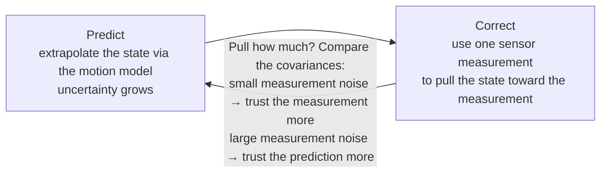
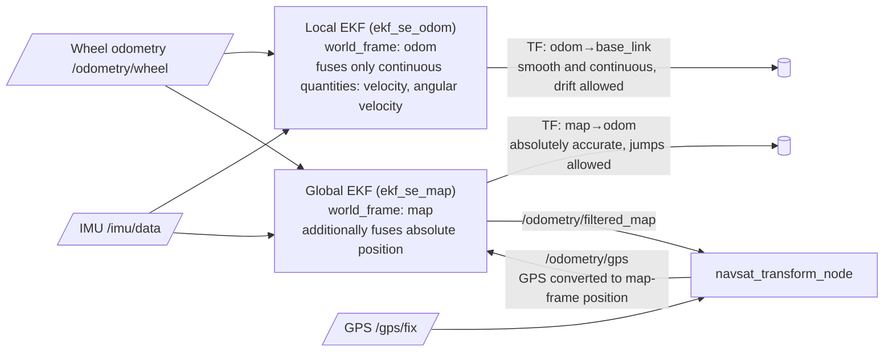

# 02 robot_localization Multi-Sensor Fusion

> 中文版 / Chinese: [02_robot_localization多传感器融合.md](../../30_定位/02_robot_localization多传感器融合.md)

## Goals

- Understand why a single odometry source is not enough and what multi-sensor fusion solves;
- Write a directly runnable `ekf.yaml` and read the 15-dimensional config boolean matrix;
- Understand the typical "dual EKF + navsat_transform" architecture and the division of labor between robot_localization and AMCL;
- Troubleshoot the three common failure classes: covariance explosion, timestamps, and frame configuration.

> This repository's `robot_localization` (forked from cra-ros-pkg, noetic-devel branch) ships officially annotated templates in `params/`: `ekf_template.yaml`, `dual_ekf_navsat_example.yaml`, `navsat_transform_template.yaml`. All parameters in this document are verified against them.

## Why Fuse

Every sensor has its own "character flaws":

| Sensor | What it provides | Flaws |
| --- | --- | --- |
| Wheel odometry (encoders) | Relative displacement, linear velocity | Slippage, wheel-diameter error → **drift accumulates** with distance, rotational angle error especially large |
| IMU | Angular velocity, linear acceleration, attitude (with magnetometer fusion) | Angular velocity accurate short-term, but position from integrating acceleration diverges extremely fast; has bias |
| GPS/GNSS | Global absolute position | Outdoor only, low frequency, jumps, no attitude |

The idea of fusion is to **combine strengths and cover weaknesses**: the IMU's angular velocity is far more accurate than the heading dead-reckoned from wheel odometry (differential-drive wheels slip badly when turning in place), so use it to correct heading; GPS provides a drift-free global anchor to suppress long-term accumulated error. The fused output is a pose estimate smoother and more accurate than any single sensor.

## An Intuitive EKF Explanation: Predict—Correct

`ekf_localization_node` maintains a 15-dimensional state with an Extended Kalman Filter (EKF): position (x, y, z), attitude (roll, pitch, yaw), linear velocity, angular velocity, and linear acceleration — 3 dimensions each. No equations needed; just understand its loop rhythm:



- **Predict**: with no new measurement, extrapolate the pose from the current velocity while inflating uncertainty per `process_noise_covariance` — "the longer without correction, the less confident";
- **Correct**: for each incoming measurement (odom, imu message), compare the measured and predicted values and take a weighted compromise per both covariances. This is why the `covariance` field in sensor messages matters so much: it is the EKF's basis for deciding "whom to trust".

## Step-by-Step

### 1. Install and prepare

```bash
sudo apt install ros-noetic-robot-localization   # Or build from this repository's source
rospack find robot_localization
```

Start the simulation environment (TB3's `/odom` and `/imu` are published by Gazebo plugins):

```bash
export TURTLEBOT3_MODEL=burger
roslaunch turtlebot3_gazebo turtlebot3_world.launch
rostopic hz /odom /imu    # Confirm both topics are publishing normally (about 30 Hz / 200 Hz)
```

### 2. Write ekf.yaml (complete working example)

Save as `~/catkin_ws/src/my_robot_bringup/config/ekf.yaml`:

```yaml
# Local EKF: fuses wheel odometry + IMU, outputs odom→base_footprint
frequency: 30            # Filter output frequency in Hz (starts after the first input arrives)
sensor_timeout: 0.1      # Sensor timeout (seconds); on timeout, predict only, no correction
two_d_mode: true         # Set true for planar robots: z/roll/pitch and their velocities held at 0
publish_tf: true         # Publish the world_frame→base_link_frame TF
print_diagnostics: true  # Misconfigurations show hints on /diagnostics

map_frame: map                  # Can stay default when no global localization is used
odom_frame: odom
base_link_frame: base_footprint # TB3's base frame
world_frame: odom               # Fusing continuous data (wheel odom/IMU) → use odom_frame's value

# ---- Input 0: wheel odometry ----
odom0: /odom
# 15-dimensional boolean matrix, in this fixed order:
#   [ x,  y,  z,
#     roll, pitch, yaw,
#     vx, vy, vz,
#     vroll, vpitch, vyaw,
#     ax, ay, az ]
# true = use that dimension of this message. For differential drive, taking only body-frame velocities is safest:
odom0_config: [false, false, false,
               false, false, false,
               true,  false, false,   # vx (differential drive has no lateral velocity; skip vy)
               false, false, true,    # vyaw
               false, false, false]
odom0_queue_size: 10
odom0_differential: false
odom0_relative: false

# ---- Input 1: IMU ----
imu0: /imu
imu0_config: [false, false, false,
              false, false, true,    # yaw (TB3's simulated IMU provides attitude; on real hardware without a magnetometer, fuse vyaw instead)
              false, false, false,
              false, false, true,    # vyaw angular velocity
              true,  false, false]   # ax linear acceleration
imu0_queue_size: 20
imu0_differential: false
imu0_relative: true                  # Zero the attitude at boot time, avoiding conflicts with the map orientation
imu0_remove_gravitational_acceleration: true  # Remove gravity from the acceleration

# Process noise: 15x15 diagonal matrix (omitted here, see "key points" in the text; built-in defaults are used if unset)
```

**Key points on process_noise_covariance**: it is a 15×15 matrix (usually only the diagonal is filled); the diagonal elements correspond in order to the 15 state variables above, expressing "how fast each state variable's own uncertainty grows during prediction". Reference magnitudes from the default diagonal in `params/ekf_template.yaml`: position ~0.05, yaw 0.06, vx 0.025, vyaw 0.02, ax 0.01. Tuning direction: **a state variable's output lags and cannot keep up with real motion → increase the corresponding diagonal element (trust measurements more); output jitters and is noisy → decrease it (trust the model more)**. Beginners should leave this parameter unset at first, get things running with the defaults, then touch it.

### 3. Launch and verify

Launch file:

```xml
<launch>
  <node pkg="robot_localization" type="ekf_localization_node"
        name="ekf_se_odom" clear_params="true">
    <rosparam command="load" file="$(find my_robot_bringup)/config/ekf.yaml"/>
    <remap from="odometry/filtered" to="odometry/filtered_odom"/>
  </node>
</launch>
```

> Note: TB3's Gazebo differential-drive plugin publishes the `odom→base_footprint` TF itself by default, which conflicts with the EKF (one child frame, two parents). For simulation practice, modify the TB3 urdf/gazebo config to disable the plugin's TF publishing (`<publishOdomTF>false</publishOdomTF>`, keeping the `/odom` topic); on real hardware, disable it in the chassis driver.

Verify:

```bash
rostopic echo /odometry/filtered_odom -n 1   # Fused pose + velocity + covariance
rosrun tf tf_echo odom base_footprint        # Confirm the TF is published by ekf_se_odom
rosrun rqt_tf_tree rqt_tf_tree               # Check the TF tree has no duplicate parents
```

Expected: teleoperate the robot to spin in place several turns and return to the start; the fused yaw error is clearly smaller than the pure wheel `/odom`.

## The Typical Dual-EKF Architecture

Outdoor scenarios, or ones needing GPS, use a two-stage EKF (corresponding to `params/dual_ekf_navsat_example.yaml`):



- **Local EKF**: `world_frame: odom`, fuses only **continuous quantities** such as velocity/angular velocity, outputting a smooth, jump-free `odom→base_link` for control and local obstacle avoidance;
- **Global EKF**: `world_frame: map`, fuses the GPS-derived absolute position on top of the local EKF's inputs, outputting `map→odom` (it publishes the map→odom correction segment, same principle as AMCL), allowed to jump as GPS updates arrive;
- **navsat_transform_node**: converts latitude/longitude into metric map-frame coordinates (needs parameters such as `magnetic_declination_radians` and `yaw_offset`), and is mutually an input with the global EKF.

## Working with AMCL

Indoor scenarios with a map need no GPS; global correction goes to AMCL, forming the most common combination:

| TF segment | Publisher | Characteristics |
| --- | --- | --- |
| `map → odom` | **AMCL** (laser vs map) | Low frequency, may jump; corrects accumulated drift |
| `odom → base_footprint` | **EKF local filter** (wheel odom + IMU) | High frequency, smooth and continuous |

Configuration points: the EKF's `world_frame` must be `odom` (never map, or it fights AMCL over `map→odom`); disable the chassis driver's built-in TF publishing; keep AMCL's `odom_frame_id`/`base_frame_id` consistent with the EKF's frame parameters. The payoff: the EKF provides more accurate heading dead reckoning, AMCL's prediction step improves, `odom_alpha*` can be reduced, and particles converge faster and more stably.

## FAQ

**Q1: Covariance explosion — the covariance values in `/odometry/filtered` keep growing, even to 1e10?**
Some state dimensions have **no measurement correcting them** and are only inflated by the prediction step. Typical scenario: `two_d_mode: false` but no sensor provides z/roll/pitch. Countermeasures: planar robots must use `two_d_mode: true`; check the union of all `*_config` dimension by dimension, ensuring every "estimated" dimension has at least one sensor set to true (or its derivative fused). Also, each absolute pose quantity is best provided by only one sensor — two sources both giving absolute yaw that contradict each other make the output jump back and forth.

**Q2: Warning `Transform ... was unavailable for the time requested`, or laggy output?**
Sensor timestamp problems. Check: `use_sim_time` consistent across all nodes (must be true in simulation); on real hardware, NTP/chrony time-sync all sensor hosts; message header.stamp must not be 0 or mix wall clock with sim clock; if needed, increase `transform_timeout` and the sensors' `*_queue_size`. Compare time sources with `rostopic echo /imu/header/stamp` vs `rostopic echo /odom/header/stamp`.

**Q3: Typical symptoms of frame misconfiguration?**
(1) `world_frame` mistakenly set to `map` with no global localization source → TF tree breaks or conflicts with AMCL; (2) the IMU message's `frame_id` does not match the actual mounting orientation (robot_localization rotates IMU data into the base_link frame via TF; without the static `base_link→imu_link` TF, the data directions are all wrong) → add a `static_transform_publisher`; (3) two nodes both publishing `odom→base_footprint` → that edge flickers in rqt_tf_tree and the rviz model jitters; turn one of them off.

**Q4: The pose keeps sliding slowly while the robot is stationary?**
IMU acceleration bias is being integrated. Either do not fuse acceleration (set ax to false in `imu0_config`), or confirm `imu0_remove_gravitational_acceleration: true` with the IMU mounted level and bias-calibrated; enabling `two_d_mode` also reduces the affected dimensions.

**Q5: How to quickly check whether the node accepted the configuration?**
With `print_diagnostics: true`, run `rostopic echo /diagnostics`; robot_localization explicitly points out suspicious configuration (e.g., a sensor with all dimensions false, non-positive-definite covariance, etc.).

## Next Step

The 2D localization pipeline is now closed: the EKF fuses a high-quality `odom→base`, and AMCL provides `map→odom`. Phase three adds [03 hdl_localization] (🚧): NDT/GICP localization in a 3D point-cloud map, suited to multi-story structures and outdoor GPS-denied scenes. For navigation applications, continue with [40 Navigation](../40_navigation/README.md).
