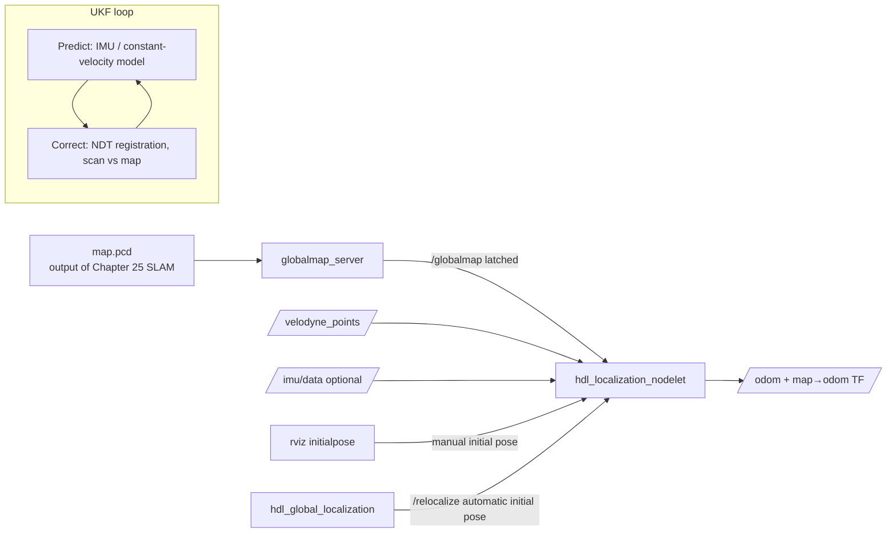

# 03 hdl_localization 3D Point-Cloud Localization

> 中文版 / Chinese: [03_hdl_localization三维点云定位.md](../../30_定位/03_hdl_localization三维点云定位.md)

## Goals

- Understand how hdl_localization works: real-time localization in an **existing 3D point-cloud map** (the PCD file output by [Chapter 25 3D Lidar SLAM](../25_3d_lidar_slam/README.md)), drawing the analogy to 2D AMCL;
- Sort out the respective roles of the three dependency packages ndt_omp / fast_gicp / hdl_global_localization;
- Master the three ways to "tell the robot where it is": globalmap_server loading the PCD, giving an initial pose in rviz, and `/relocalize` global re-localization;
- Run the full workflow on a public bag (velodyne data), and tune for real-time performance on x86 edge-computing units.

## Principles in Brief: Carrying AMCL's Idea into 3D

AMCL answers "which cell of the 2D grid map am I in"; hdl_localization answers "where am I in the 3D point-cloud map (including height and attitude — 6 degrees of freedom)". Their structures are strikingly similar; every component is simply swapped for its 3D version:

| Role | AMCL (2D) | hdl_localization (3D) |
| --- | --- | --- |
| Map | `map_server` loads `map.pgm` | `globalmap_server` loads `map.pcd` |
| Observation model (current scan vs map scoring/alignment) | likelihood-field laser model | **NDT / GICP point-cloud registration** |
| Filter (fusing prediction and observation) | Particle filter | **UKF (Unscented Kalman Filter)** |
| Prediction source | Wheel odometry | IMU (optional) or constant-velocity motion model |
| Manual initial pose | rviz 2D Pose Estimate | rviz 2D Pose Estimate (the same button) |
| Global re-localization without an initial pose | `global_localization` service | `hdl_global_localization` + `/relocalize` service |
| External output | `map→odom` TF + `/amcl_pose` | `map→odom` TF + `/odom` |

One localization cycle: the UKF **predicts** the pose with the IMU (or the constant-velocity model) → using the prediction as the initial guess, the current point-cloud frame is **NDT-registered** against the global map to obtain the observed pose → the UKF **corrects**, outputting a smooth 6DoF pose. A particle filter handles nonlinearity with "many particles"; a UKF approximates nonlinearity with sigma points at far lower cost — exactly the key that lets 3D localization run in real time.



### The Dependency Chain: What Each of the Four Packages Does

| Package | Role | Relationship |
| --- | --- | --- |
| **hdl_localization** | The main body: globalmap_server + UKF + registration orchestration, two nodelets | Calls the three below |
| **ndt_omp** | Multithreaded OpenMP NDT registration (a multi-core accelerated replacement for PCL's built-in NDT), used when `reg_method=NDT_OMP` | The core registration engine, pure CPU |
| **fast_gicp** | Multi-core/CUDA-accelerated GICP, VGICP, and NDT registration library; in this package it provides the two GPU registrations `NDT_CUDA_P2D/D2D` | Merely a build dependency when there is no NVIDIA GPU |
| **hdl_global_localization** | Global re-localization service without an initial pose (three engines: BBS branch-and-bound / FPFH+RANSAC / FPFH+TEASER), answering the "no idea where I am" problem | Invoked via the `/relocalize` service; optional |

Mnemonic by analogy: ndt_omp/fast_gicp correspond to the implementation of AMCL's laser observation model, and hdl_global_localization corresponds to AMCL's `global_localization` service (scattering particles over the whole map) — except that in 3D "scattering particles" is too expensive, so a dedicated global registration algorithm is used instead.

## Step-by-Step

### 1. Build the four packages

```bash
cd ~/catkin_ws/src
git clone https://github.com/Romindly-Dev/ndt_omp
git clone https://github.com/Romindly-Dev/fast_gicp --recursive   # Has submodules; --recursive is mandatory
git clone https://github.com/Romindly-Dev/hdl_localization
git clone https://github.com/Romindly-Dev/hdl_global_localization
cd ~/catkin_ws
catkin_make -DCMAKE_BUILD_TYPE=Release    # Without Release, registration is an order of magnitude slower
```

### 2. Prepare the map and data

Use the PCD map saved in Chapter 25, or first get things running with the official sample bag (outdoor velodyne data, with the matching map `hdl_localization/data/map.pcd`):

```bash
wget http://www.aisl.cs.tut.ac.jp/databases/hdl_graph_slam/hdl_400.bag.tar.gz
tar xzvf hdl_400.bag.tar.gz
```

When using your own map, just change `globalmap_pcd` in the launch file to point at your PCD path.

### 3. Start localization

```bash
# Terminal 1
rosparam set use_sim_time true
roslaunch hdl_localization hdl_localization.launch

# Terminal 2
rviz -d $(rospack find hdl_localization)/rviz/hdl_localization.rviz

# Terminal 3
rosbag play --clock hdl_400.bag
```

Terminal 1's expected output (confirming the registration method and successful map loading):

```text
[ INFO] NDT_OMP is selected
[ INFO] search_method DIRECT7 is selected
[ INFO] globalmap received!
```

To replace terminal 3 with a real lidar: after starting the velodyne driver, pass `points_topic:=/velodyne_points odom_child_frame_id:=velodyne`; if the lidar carries an IMU, add `use_imu:=true imu_topic:=/imu/data`.

### 4. Give an initial pose (choose one of three)

1. **Statically in the launch** (default): with `specify_init_pose=true`, `init_pos_*`/`init_ori_*` are used as the initial pose — suited to a robot that always boots from a fixed charging dock;
2. **Manually in rviz**: toolbar **2D Pose Estimate**, click + drag on the map (published to `/initialpose`) — exactly the same operation as with AMCL, only the map is now a point cloud;
3. **Global re-localization** (no human needed):

```bash
rosservice call /relocalize
```

hdl_global_localization uses the BBS engine (default; can be changed to FPFH_RANSAC / FPFH_TEASER in `config/general_config.yaml`) to search the whole map for the best match of the current scan and reset the UKF — the equivalent of AMCL's "kidnap recovery".

### 5. Observing in rviz

- **/globalmap**: the white global point-cloud map (latched, published once; rviz receives it even if opened late);
- **/aligned_points**: the current frame's point cloud after registration (frame is `map`) — **hugging the map's walls and floor = localization succeeded**; offset or drifting = localization failed;
- **/odom** (`nav_msgs/Odometry`): the estimated pose, `header.frame_id=map`;
- **/status** (`hdl_localization/ScanMatchingStatus`): whether registration converged, matching error, inlier fraction — the key thing to watch while tuning:

```bash
rostopic echo /status
```

### 6. Where the TF tree goes

hdl_localization behaves "smarter" than AMCL: if `robot_odom_frame_id` (default `odom`) already exists in the TF tree (e.g., the chassis / robot_localization is publishing `odom→base_link`), it publishes **`map→odom`**, fully consistent with AMCL's convention; without an odometry TF, it publishes `map→<odom_child_frame_id>` directly. When deploying together with the first two documents of Chapter 30, just keep the defaults; the TF chain is `map→odom→base_link→velodyne`.

## Parameter Reference Table

All parameters below were verified against `launch/hdl_localization.launch` and the nodelet source.

### globalmap_server_nodelet

| Parameter | Default | Description |
| --- | --- | --- |
| `globalmap_pcd` | `data/map.pcd` | Path to the global point-cloud map, the PCD output by Chapter 25 SLAM |
| `convert_utm_to_local` | true | If a `<pcd>.utm` file exists, translate UTM coordinates back to local coordinates (GPS mapping scenarios) |
| `downsample_resolution` | 0.1 | Voxel downsampling leaf size for the map (m); larger = lower memory/time |

### hdl_localization_nodelet

| Parameter | Default | Description |
| --- | --- | --- |
| `reg_method` | NDT_OMP | Registration method: `NDT_OMP` (CPU multithreaded) / `NDT_CUDA_P2D` / `NDT_CUDA_D2D` (GPU required; build with `-DBUILD_VGICP_CUDA=ON`) |
| `ndt_resolution` | 1.0 | NDT voxel leaf size (m). Outdoors 1.0–2.0; cramped indoor environments around 0.5 |
| `ndt_neighbor_search_method` | DIRECT7 | Neighbor voxel search: `DIRECT7` (accurate, a bit slower) / `DIRECT1` (very fast, slightly less stable) / `KDTREE`; `DIRECT_RADIUS` only available with the CUDA methods |
| `ndt_neighbor_search_radius` | 2.0 | Search radius (m) for `DIRECT_RADIUS` |
| `downsample_resolution` | 0.1 | Voxel downsampling leaf size for the input scan (m) — the number-one knob for real-time performance |
| `odom_child_frame_id` | velodyne (passed via launch) | Target frame of localization; the input point cloud is transformed into this frame before registration (for aligning lidar/IMU frames) |
| `use_imu` | false (passed via launch) | Use the IMU for UKF prediction; if false, the constant-velocity motion model is used |
| `invert_acc` / `invert_gyro` | false | Flip the acceleration/angular-velocity signs when the IMU frame's axes are reversed |
| `cool_time_duration` | 2.0 | Cool-down time after initialization (s), during which the IMU is ignored while the UKF stabilizes |
| `enable_robot_odometry_prediction` | false | Use the chassis odometry TF (`robot_odom_frame_id`) for inter-frame prediction; recommended for wheeled robots |
| `robot_odom_frame_id` | odom | Name of the chassis odometry frame |
| `specify_init_pose` | true | true: use the 7 parameters below as the initial pose; false: wait for rviz `/initialpose` |
| `init_pos_x/y/z`, `init_ori_w/x/y/z` | 0,0,0 / 1,0,0,0 | Initial position and quaternion attitude |
| `use_global_localization` | true | Start hdl_global_localization and provide the `/relocalize` service |
| `status_max_correspondence_dist` | 0.5 | Maximum correspondence distance (m) for counting inliers in `/status`; only affects the status report, not the registration |

## Tuning on x86 Edge Units

An x86 industrial PC / NUC without a discrete GPU can only use NDT_OMP. Tune in this order (verify each step reaches the lidar's 10 Hz frame rate using the processing time in `/status` and `rostopic hz /odom`):

1. **Thread count**: ndt_omp uses `omp_get_max_threads()` by default (all cores); the source has no ROS parameter, so cap it with an environment variable to leave cores for navigation and other nodes:

```bash
OMP_NUM_THREADS=4 roslaunch hdl_localization hdl_localization.launch
```

2. **Input downsampling** `downsample_resolution`: 0.1 → 0.2 → 0.3 — the number of registered points drops cubically, the highest-payoff lever; do not exceed 0.3 in small indoor scenes or features get erased;
3. **Search method**: `DIRECT7` → `DIRECT1` — several times faster, at a slight cost in convergence robustness (the official README makes the same suggestion); pairing with IMU or odometry prediction compensates;
4. **NDT resolution** `ndt_resolution`: increase it (e.g., 1.0 → 2.0) — fewer voxels, faster, but coarser accuracy;
5. **Map downsampling** (globalmap_server's `downsample_resolution`): for large maps, downsample to 0.2–0.5 first, which also relieves memory pressure.

A proven combination (i5-class 4-core, VLP-16, mixed indoor/outdoor): `OMP_NUM_THREADS=4` + `downsample_resolution=0.2` + `DIRECT1` + `ndt_resolution=1.0` holds a stable 10 Hz.

## FAQ

**Q1: Localization jumps — `/aligned_points` occasionally shifts as a whole then snaps back?**
Registration falling into a local extremum. Troubleshooting order: (1) check whether `inlier_fraction` in `/status` plunges at the jump; (2) geometrically degenerate scenes like corridors and tunnels have no inherent solution — strengthen the prediction constraint with `use_imu:=true` or `enable_robot_odometry_prediction:=true`; (3) if using `DIRECT1`, switch back to `DIRECT7`; (4) an overly large `ndt_resolution` "blurs" the map — reduce it somewhat.

**Q2: Gave an initial pose in rviz but it never converges — point cloud and map don't line up?**
NDT converges only locally: an initial-pose error beyond roughly one `ndt_resolution` (especially an angle error >30°) can fail. Give a more accurate initial pose again, minding the drag direction; if it keeps failing, `rosservice call /relocalize` and let global re-localization take over. Also note rviz's 2D Pose Estimate carries no z or pitch/roll, so a manual initial pose is inherently off when the robot is on a slope — the UKF pulls it back gradually.

**Q3: The map is huge (hundreds of MB of PCD) — memory blows up after loading or rviz freezes?**
(1) Increase globalmap_server's `downsample_resolution` (0.1 → 0.3–0.5); (2) compress offline at mapping time with `pcl_voxel_grid`: `pcl_voxel_grid map.pcd map_ds.pcd -leaf 0.2,0.2,0.2`; (3) rviz freezing is a rendering issue — reduce the Size of the `/globalmap` display or simply turn it off; localization itself is unaffected.

**Q4: TF conflict — rviz reports two publishers for `map` to `odom`?**
When hdl_localization detects the `odom` frame it publishes `map→odom`; if AMCL or another SLAM node is still running at the same time, the two fight (the robot model jitters in rviz). Only one publisher of `map→odom` may exist at a time: shut down the AMCL/SLAM node, or change hdl_localization's `robot_odom_frame_id` to isolate for testing.

**Q5: Enabled `use_imu:=true` and it drifts more instead?**
Check whether the IMU frame matches `odom_child_frame_id` (the input point cloud is transformed into that frame, IMU data is not); when axis definitions are reversed, flip with `invert_imu_acc` / `invert_imu_gyro`. When unsure, turn the IMU off first — the constant-velocity model is sufficient at low speeds.

---

Next step: [40 Navigation](../40_navigation/README.md) connects the localization output into move_base, so that the robot, having truly "known where it is", can "go where it needs to go".
