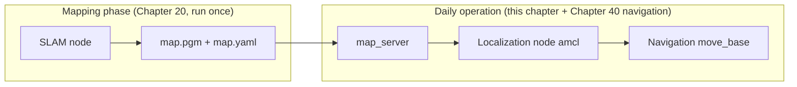

# 30 Localization

> 中文版 / Chinese: [README.md](../../30_定位/README.md)

This chapter solves the problem of "the robot knowing where it is on a **known map**", covering three technical approaches: 2D probabilistic localization, multi-sensor fusion, and 3D point-cloud localization.

## Chapter Contents

| No. | Document | Contents | Status |
| --- | --- | --- | --- |
| 01 | [AMCL Principles and Tuning](01_amcl.md) | Monte Carlo particle-filter localization: particle-cloud convergence, TF chain, global re-localization, tuning table | ✅ Ready to learn |
| 02 | [robot_localization Multi-Sensor Fusion](02_robot_localization.md) | EKF fusion of wheel odometry and IMU, dual-EKF architecture, working with AMCL | ✅ Ready to learn |
| 03 | [hdl_localization 3D Point-Cloud Localization](03_hdl_localization.md) | NDT/GICP-based localization in point-cloud maps, giving a 3D initial pose | ✅ Ready to learn |

## Conceptual Distinction: Localization While Mapping vs. Localization on a Known Map

The point beginners most easily confuse: **in the SLAM chapter the robot also knows where it is — why does localization deserve a chapter of its own?**

The two answer different questions:

| | Localization while mapping (SLAM) | Localization on a known map (this chapter) |
| --- | --- | --- |
| Map | Unknown, built while driving | Already exists (the `map.yaml` + `map.pgm` saved in Chapter 20) |
| Estimation target | Estimate **map** and **pose** simultaneously (a chicken-and-egg problem) | Estimate only the **pose**; the map is a fixed input |
| Typical tools | gmapping / cartographer / slam_toolbox | **amcl** / robot_localization / hdl_localization |
| Computational cost | High (must maintain and optimize the map) | Low (only pose matching), suited to long-term deployment |
| Failure modes | Loop-closure failure, map ghosting | Localization loss (particle divergence), being "kidnapped" |
| Source of the map→odom TF | Published by the SLAM node | Published by the localization node (e.g., amcl) |

The division of labor in engineering practice: **map once, localize every day**. After deployment at a customer site, the robot loads the same map at every boot; the localization node answers "where am I on the map" so the navigation stack can plan paths. The stability of the localization module therefore directly determines whole-machine usability.

## Prerequisites

- Completed [20 2D SLAM](../20_2d_slam/README.md), with `$HOME/map.yaml` saved and usable;
- Familiar with the TF, topic, and service concepts from [10 ROS1 Basics](../10_ros1_basics/README.md);
- Demo environment: Ubuntu 20.04 + ROS Noetic + TurtleBot3 Gazebo simulation ([15 Simulation Primer](../15_simulation/README.md)).

## After This Chapter You Should Be Able to Answer

1. Why does AMCL publish `map→odom` rather than `map→base_footprint`?
2. Localization is off after the robot boots — what is the first thing to do? (Hint: 2D Pose Estimate / global_localization)
3. Wheel odometry clearly drifts — why must the EKF-fused `odom` frame still be "continuous, drift allowed"?
4. When AMCL and robot_localization run at the same time, which segment of the TF tree is each responsible for?
