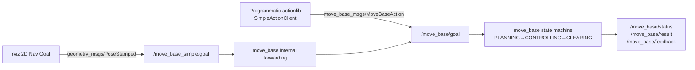

# 01 move_base Architecture and Quick Start

> 中文版 / Chinese: [01_move_base架构与快速上手.md](../../40_导航/01_move_base架构与快速上手.md)

## Goals

- Understand the complete move_base data flow: goal input → global planning → local control → recovery behaviors.
- Run a complete navigation cycle in the TurtleBot3 Gazebo simulation (initialize pose → send goal → arrive).
- Master move_base's own key parameters, and learn to observe navigation state with `rostopic`.
- Get a TF chain and topic checklist to run through before deploying on a real robot.

## How It Works

move_base is a "dispatcher": it does no planning itself. Instead, through the **pluginlib plugin mechanism** it loads three kinds of replaceable components — global planner, local planner, and recovery behaviors — and maintains two costmaps for them to use.

### Two Paths for Goal Input



- `/move_base_simple/goal`: a simple topic interface — publish one `PoseStamped` and off it goes, **with no feedback**. This is what rviz's 2D Nav Goal uses.
- The Action interface (`/move_base/goal`): provides execution feedback and results, and supports cancellation (`/move_base/cancel`). In real projects, programmatic goals should always go through this path. Internally, move_base converts simple goals into action goals, so both paths converge.

### The Plugin Mechanism

| Parameter | Default (source `move_base/cfg/MoveBase.cfg`) | Description |
| --- | --- | --- |
| `base_global_planner` | `navfn/NavfnROS` | Global planner plugin name; can be swapped for `global_planner/GlobalPlanner` |
| `base_local_planner` | `base_local_planner/TrajectoryPlannerROS` | Local planner plugin name; TB3 changes the default to `dwa_local_planner/DWAPlannerROS` |
| `recovery_behaviors` | conservative_reset → rotate → aggressive_reset → rotate | Recovery behavior chain, escalating step by step in order |

### The Recovery Behavior Chain

When planning or control keeps failing (beyond `planner_patience` / `controller_patience`), or the robot fails to travel `oscillation_distance` within `oscillation_timeout`, move_base enters the CLEARING state and executes in order:

1. **Conservative reset**: clear costmap obstacles beyond `conservative_reset_dist` (default 3 m);
2. **In-place rotation** (rotate_recovery): spin once to refresh the sensor's field of view;
3. **Aggressive reset**: clear nearly all obstacles beyond the robot's own footprint;
4. **Rotate again**; if everything fails → the goal is aborted.

`recovery_behavior_enabled: false` disables the whole chain; `clearing_rotation_allowed: false` disables just the rotation (mandatory for Ackermann vehicles).

## Step by Step: Complete TB3 Simulation Demo

Set the model in all three terminals first (or add it to `~/.bashrc`):

```bash
export TURTLEBOT3_MODEL=burger
```

**Terminal 1 — launch the Gazebo world:**

```bash
roslaunch turtlebot3_gazebo turtlebot3_world.launch
```

Expected: Gazebo opens the hexagonal world with no red errors (the first launch may take 10–30 seconds to load models).

**Terminal 2 — launch navigation (using the map saved in the mapping chapter):**

```bash
roslaunch turtlebot3_navigation turtlebot3_navigation.launch map_file:=$HOME/map.yaml
```

Expected output (excerpt):

```
[ INFO] [...]: Using plugin "static_layer"
[ INFO] [...]: Using plugin "obstacle_layer"
[ INFO] [...]: Using plugin "inflation_layer"
[ INFO] [...]: Created local_planner dwa_local_planner/DWAPlannerROS
[ INFO] [...]: odom received!
```

rviz opens at the same time, showing the map and the laser points.

**Step 3 — initialize the pose in rviz:** Click **2D Pose Estimate** in the toolbar, then press and drag on the map at the robot's true position to draw the heading arrow. The green amcl particle cloud should converge around the robot; success is when the laser points hug the wall edges on the map. If the pose is off, teleoperate slightly back and forth to let the particles converge.

**Step 4 — send a goal:** Click **2D Nav Goal** and drag out a goal pose in an open area. A global path (green line) and a local trajectory appear in rviz, and the robot starts moving.

**Step 5 — observe runtime state (Terminal 3):**

```bash
# Velocity commands: keep updating while moving, drop to zero on arrival
rostopic echo /cmd_vel

# Goal execution status
rostopic echo /move_base/status
```

Meaning of the `status` field in `/move_base/status`: `1` = ACTIVE (executing), `3` = SUCCEEDED (arrived), `4` = ABORTED (failed and gave up). On arrival, Terminal 2 prints `Goal reached`.

Other useful commands:

```bash
rostopic hz /cmd_vel          # should be roughly equal to controller_frequency
rostopic echo /move_base/current_goal
rosrun actionlib_tools axclient.py /move_base   # send action goals from a GUI
```

## Key move_base Parameters in Detail

The following defaults were verified against `navigation/move_base/cfg/MoveBase.cfg` (the TB3 launch overrides some of them):

| Parameter | Default | Description and tuning advice |
| --- | --- | --- |
| `controller_frequency` | 20.0 Hz | Control loop frequency, i.e. how often the local planner is called to produce `/cmd_vel`. Too low and the robot is sluggish; too high (with TEB) it may not finish computing in time and the log reports "control loop missed its desired rate". 10–20 Hz is appropriate for a TB3 / x86 edge unit |
| `planner_frequency` | 0.0 Hz | Global replanning frequency. 0 means planning only on a new goal or when local planning fails; for dynamic environments, periodic replanning at 0.5–2.0 Hz is recommended |
| `planner_patience` | 5.0 s | How long global planning may keep failing before recovery behaviors kick in |
| `controller_patience` | 5.0 s | How long the local planner may fail to produce a valid velocity before recovery behaviors kick in |
| `oscillation_timeout` | 0.0 s (disabled) | Time window for oscillation detection: recovery triggers if the robot dithers back and forth longer than this. 10–15 s is recommended on real robots |
| `oscillation_distance` | 0.5 m | Traveling this distance counts as escaping the oscillation and resets the timer |
| `max_planning_retries` | -1 (unlimited) | Number of replanning attempts allowed before entering recovery |
| `conservative_reset_dist` | 3.0 m | During a conservative reset, obstacles within this radius around the robot are kept |
| `shutdown_costmaps` | false | Shut down the costmaps while idle to save CPU (the next goal takes an extra beat to start) |

## Real-Robot Integration Checklist

Verify each item before deploying on a real base. **TF chain** (view with `rosrun tf view_frames` or `rosrun rqt_tf_tree rqt_tf_tree`):

| TF | Provider | Check command |
| --- | --- | --- |
| `map → odom` | amcl (or another localization) | `rosrun tf tf_echo map odom` |
| `odom → base_footprint` (or base_link) | base odometry node | `rosrun tf tf_echo odom base_footprint` |
| `base_footprint → base_link → each sensor` | URDF + robot_state_publisher | `rosrun tf tf_echo base_link base_scan` |

**Topic checklist:**

| Topic | Direction | Type | Checkpoint |
| --- | --- | --- | --- |
| `/scan` | sensor → navigation | sensor_msgs/LaserScan | `rostopic hz /scan` is stable (~5 Hz on TB3); `frame_id` matches the costmap sensor configuration |
| `/odom` | base → navigation | nav_msgs/Odometry | Push the robot 1 m: the `x` increment should be close to 1.0; rotate one full turn in place: yaw returns to its original value |
| `/map` | map_server → navigation | nav_msgs/OccupancyGrid | `rostopic echo -n1 /map/info` |
| `/cmd_vel` | navigation → base | geometry_msgs/Twist | Manually `rostopic pub` one low-speed command: the base responds and moves in the correct direction |
| `/move_base/status` | navigation → upper layers | actionlib_msgs/GoalStatusArray | Periodic output present |

**Other:** all machines clock-synchronized (NTP — TF timeouts are usually timestamp issues); `/scan` and `/odom` message timestamps use the same clock source; the emergency stop circuit is independent of software (see chapter 04).

## FAQ

**Q1: I send a goal and absolutely nothing happens?**
Check in order: `rostopic info /move_base_simple/goal` — is there a subscriber (is move_base alive)? → `rostopic echo /move_base/status` — any output? → is the move_base terminal spamming TF-related warnings? Nine times out of ten a link in the TF chain is broken.

**Q2: `Timed out waiting for transform ... map to base_footprint`?**
amcl is not up or has not converged (no 2D Pose Estimate done). Initialize the pose first.

**Q3: The robot reaches the goal but grinds in place for a long time before reporting arrival?**
The goal tolerances are too tight — see `xy_goal_tolerance` / `yaw_goal_tolerance` in chapter 03.

**Q4: Goals sent from rviz become ABORTED instantly?**
The goal point falls inside a lethal obstacle or unknown area. Pick a goal farther from the walls, or check whether the map matches the actual environment.

## Next Step

The costmaps are the shared "world model" of both global and local planning, and the part that most often needs tuning → [02 Costmap Tuning](02_costmap_tuning.md).
