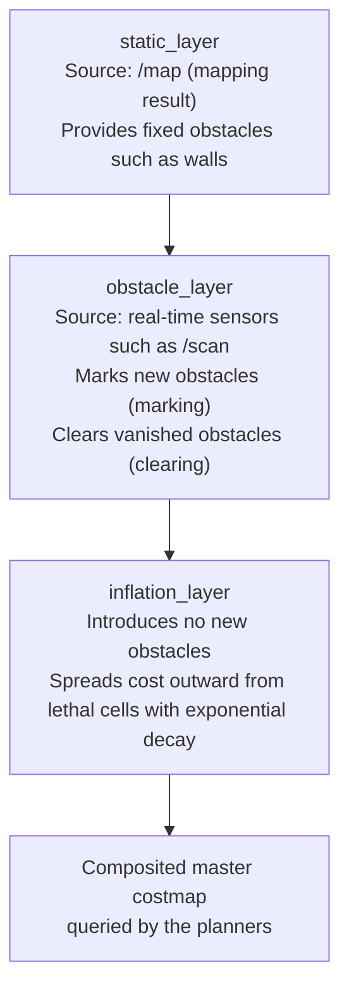

# 02 Costmap Tuning

> 中文版 / Chinese: [02_costmap代价地图调参.md](../../40_导航/02_costmap代价地图调参.md)

## Goals

- Understand the three-layer structure of the layered costmap and how the layers are composited.
- Distinguish the responsibilities, sizes, and update behavior of the global_costmap vs the local_costmap.
- Walk file by file through how the three costmap parameter files in the TB3 navigation package are organized.
- Know where to start tuning for the typical problems: "hugging obstacles / staying too far from obstacles / obstacle ghosting".

## How It Works

costmap_2d represents the world as a grid, with one cost value per cell: `0` (free) → `1–252` (higher = more dangerous) → `253` (inscribed obstacle — a collision is certain if the robot center reaches here) → `254` (lethal obstacle) → `255` (unknown). The map is composed by stacking multiple **layers (layer plugins)** in order:



- **static_layer**: brings in the occupancy grid produced by mapping; it only changes when the map is updated.
- **obstacle_layer**: **marks** obstacles in real time using the laser; at the same time it **raytraces** along each laser beam, clearing the cells the beam passes through — this is the mechanism that lets the map recover cleanly after a dynamic obstacle moves away.
- **inflation_layer**: centered on each lethal cell, cost decays as `exp(-cost_scaling_factor × (distance - inscribed_radius))`, inflating out to `inflation_radius`. It makes the planners "naturally prefer" keeping some distance from obstacles rather than hugging them.

### Global vs Local Costmap

| Dimension | global_costmap | local_costmap |
| --- | --- | --- |
| Serves | Global planner | Local planner |
| Frame `global_frame` | `map` | `odom` (locally smooth, unaffected by amcl jumps) |
| Size | Covers the entire static map (`static_map: true`) | Fixed small window, 3 m × 3 m on TB3 |
| `rolling_window` | false | **true**: the window rolls along with the robot |
| Typical layers | static + obstacle + inflation | obstacle + inflation (no static) |

## Step by Step: The TB3 Parameter Files, One by One

The TB3 costmap parameters live in three files under `turtlebot3_navigation/param/`, loaded by `move_base.launch` — the common file is **loaded twice**, landing in each costmap's namespace:

```bash
roscd turtlebot3_navigation/param && ls
# costmap_common_params_burger.yaml  global_costmap_params.yaml  local_costmap_params.yaml ...
```

**① costmap_common_params_burger.yaml — the part shared by both maps (typical contents):**

```yaml
obstacle_range: 3.0        # only laser points within this distance are marked as obstacles
raytrace_range: 3.5        # maximum distance for clearing obstacles along beams, should be >= obstacle_range
footprint: [[-0.105, -0.105], [-0.105, 0.105], [0.041, 0.105], [0.041, -0.105]]
# robot_radius: 0.105      # a circular robot may use a radius instead of a footprint; pick one of the two

inflation_radius: 1.0
cost_scaling_factor: 3.0

map_type: costmap
observation_sources: scan
scan: {sensor_frame: base_scan, data_type: LaserScan, topic: scan,
       marking: true, clearing: true}
```

**② global_costmap_params.yaml:**

```yaml
global_costmap:
  global_frame: map
  robot_base_frame: base_footprint
  update_frequency: 10.0
  publish_frequency: 10.0
  transform_tolerance: 0.5
  static_map: true
```

**③ local_costmap_params.yaml:**

```yaml
local_costmap:
  global_frame: odom
  robot_base_frame: base_footprint
  update_frequency: 10.0
  publish_frequency: 10.0
  transform_tolerance: 0.5
  static_map: false
  rolling_window: true
  width: 3
  height: 3
  resolution: 0.05
```

> **Declaring layer plugins explicitly**: on Noetic, if no `plugins` list is written, the costmap automatically loads compatible layers according to `static_map`/`rolling_window`. In production, declaring them explicitly is recommended — it is self-documenting and makes layers easy to add or remove (e.g. adding a keepout layer later):
>
> ```yaml
> global_costmap:
>   plugins:
>     - {name: static_layer,    type: "costmap_2d::StaticLayer"}
>     - {name: obstacle_layer,  type: "costmap_2d::ObstacleLayer"}
>     - {name: inflation_layer, type: "costmap_2d::InflationLayer"}
> local_costmap:
>   plugins:
>     - {name: obstacle_layer,  type: "costmap_2d::ObstacleLayer"}
>     - {name: inflation_layer, type: "costmap_2d::InflationLayer"}
> ```

**Verify what was loaded, and observe live:**

```bash
# confirm the parameters really landed in the right namespace
rosparam get /move_base/local_costmap/inflation_layer/inflation_radius

# In rviz, add a Map display and select the topics:
#   /move_base/global_costmap/costmap
#   /move_base/local_costmap/costmap
# Set Color Scheme to costmap to see the inflation gradient from purple (lethal) to blue (low cost)
```

**Hands-on experiment (verify the obstacle layer in Gazebo):** with the navigation environment from chapter 01 still running, Insert a unit_box in Gazebo 1 m in front of the robot:

1. The local costmap in rviz should immediately show the lethal obstacle and its inflation ring (delayed by about one `update_frequency` cycle);
2. Move the box away in Gazebo; the obstacle should be raytrace-cleared within 1–2 cycles;
3. Use rqt_reconfigure (`move_base → local_costmap → inflation_layer`) to drag `inflation_radius` from 1.0 down to 0.3 and watch the inflation ring shrink in real time — the most intuitive way to understand this parameter.

## Key Parameters in Detail

Defaults verified against `navigation/costmap_2d/cfg/*.cfg` and `plugins/obstacle_layer.cpp`:

| Parameter | Source default | TB3 burger value | Description |
| --- | --- | --- | --- |
| `footprint` | `[]` | four-point polygon | The robot's outline (vertex list in the base frame). Required for non-circular robots; mutually exclusive with `robot_radius` |
| `robot_radius` | 0.46 m | — | Radius for circular robots. Better too large than too small, but too large makes narrow doorways hard |
| `footprint_padding` | 0.01 m | — | Safety padding added around the footprint |
| `inflation_radius` | 0.55 m | 1.0 m | Inflation radius. Too small and plans hug the walls; too large and narrow passages get "sealed off" |
| `cost_scaling_factor` | 10.0 | 3.0 | Decay coefficient — **the larger it is, the faster the decay** and the closer the robot dares to approach obstacles; smaller means wider detours around obstacles |
| `obstacle_range` | 2.5 m | 3.0 m | Laser points beyond this distance are not marked as obstacles |
| `raytrace_range` | 3.0 m | 3.5 m | Raytracing distance for clearing; must exceed `obstacle_range`, otherwise distant ghosts can never be cleared |
| `update_frequency` | 5.0 Hz | 10.0 Hz | Map content update frequency. Too low reacts slowly to dynamic obstacles; too high eats CPU |
| `publish_frequency` | 0 Hz | 10.0 Hz | Only affects visualization publishing, not planning; on real robots it can be lowered to 1–2 Hz to save bandwidth |
| `resolution` | 0.05 m/cell | 0.05 | Local map resolution. Recommended to match the static map; for load reduction on edge units it can be relaxed to 0.1 (see chapter 04) |
| `transform_tolerance` | 0.3 s | 0.5 s | Tolerated TF latency; beyond it the costmap stops updating and warns |
| `max_obstacle_height` | 2.0 m | — | Observation points above this height are ignored (mostly for 3D sensors) |

Rule of thumb: `inflation_radius` should be at least ≥ the robot's circumscribed radius + the desired safety clearance; when tuning "how far from obstacles", adjust `cost_scaling_factor` first, and only then `inflation_radius`.

## FAQ

**Q1: The robot hugs obstacles and even grazes them when turning?**
① The `footprint` was measured too small — re-measure the outline with a tape measure (including protruding sensor mounts); ② `inflation_radius` is too small or `cost_scaling_factor` too large, so cost drops off too quickly and the planner sees no cost in hugging the edge. Try lowering `cost_scaling_factor` from 10 to 3 first.

**Q2: The robot keeps too far from obstacles and just won't pass narrow doorways?**
The opposite problem: `inflation_radius` is too large and has "plastered over" the doorway. Look at the global costmap in rviz — if the inflation zones on both sides of the doorway merge into one, that confirms it. Reduce `inflation_radius` and increase `cost_scaling_factor`; a 0.1-resolution map also struggles with a 0.6 m doorway — consider 0.05.

**Q3: A dynamic obstacle (a person) has moved away but its ghost lingers on the costmap?**
Clearing relies on raytracing: ① confirm the observation source has `clearing: true`; ② `raytrace_range` must exceed the distance to the obstacle, and be > `obstacle_range`; ③ if the ghost is at a height/angle the laser cannot scan (e.g. the laser is mounted high and the obstacle is a low box), beams that cannot pass through it will never clear it — a physical limitation of 2D lasers, which only recovery behaviors or a manual `rosservice call /move_base/clear_costmaps "{}"` can fix.

**Q4: The costmap stops updating entirely and the robot drives blindly into obstacles?**
Watch the move_base terminal: spamming `Costmap2DROS transform timeout` → TF latency exceeds `transform_tolerance` (clock desync or CPU overload); spamming `The origin for the sensor at ... is out of map bounds` → sensor frame misconfigured; `rostopic hz /scan` shows nothing → the sensor is down. Also check the `topic`/`sensor_frame` spelling in `observation_sources`.

**Q5: Everything works in simulation, but on the real robot the global costmap is completely blank?**
`static_map: true` but no map_server running, or a mismatched `/map` topic name. Verify with `rostopic echo -n1 /map/info`.

## Next Step

With the costmaps in place, motion quality is decided by the local planner → [03 DWA and TEB Local Planners](03_dwa_and_teb.md).
