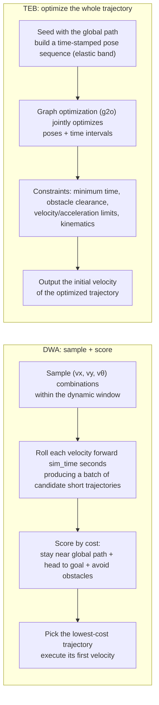

# 03 DWA and TEB Local Planners

> 中文版 / Chinese: [03_DWA与TEB局部规划器.md](../../40_导航/03_DWA与TEB局部规划器.md)

## Goals

- Intuitively understand the essential difference between the two local planning approaches: DWA (sampling and scoring) and TEB (timed-elastic-band optimization).
- Master the core parameters of both (defaults verified against the cfg source in this repository).
- Learn to install TEB and switch to it in move_base with a single parameter change.
- Be able to choose a planner by base type (differential / omnidirectional / Ackermann) and compute budget, and tune online with rqt_reconfigure.

## How They Work



- **DWA** (`dwa_local_planner/DWAPlannerROS`): every control cycle, it samples a number of `(vx, vθ)` pairs inside the "dynamic window" reachable from the current velocity, simulates each for `sim_time` seconds to obtain candidate trajectories, and scores them with a weighted sum of three cost terms to pick the best. **It only chooses from the sample set** — it will never invent maneuvers outside it (such as reversing around an obstacle). Computationally cheap, stable, and predictable.
- **TEB** (`teb_local_planner/TebLocalPlannerROS`): treats the local trajectory as a stretchable "rubber band" and uses graph optimization to deform the entire trajectory (including each time segment) at once, balancing time optimality, obstacle avoidance, and kinematic constraints. It can actively reverse, thread gaps between obstacles, and supports a minimum turning radius (Ackermann) — at the cost of markedly higher CPU usage and more parameters.

## DWA Parameters in Detail

Defaults verified against `navigation/dwa_local_planner/cfg/DWAPlanner.cfg` and `base_local_planner/src/local_planner_limits/__init__.py`; the TB3 column shows the typical values from `turtlebot3_navigation/param/dwa_local_planner_params_burger.yaml`. Namespace `/move_base/DWAPlannerROS/`:

| Parameter | Source default | TB3 burger | Description |
| --- | --- | --- | --- |
| `max_vel_x` / `min_vel_x` | 0.55 / 0.0 | 0.22 / -0.22 | Forward velocity upper/lower limits (m/s); a negative min allows reversing |
| `max_vel_trans` / `min_vel_trans` | 0.55 / 0.1 | 0.22 / 0.11 | Combined translational velocity limits; if min is too small the robot tends to "crawl" |
| `max_vel_theta` / `min_vel_theta` | 1.0 / 0.4 | 2.75 / 1.37 | Angular velocity upper/lower limits (rad/s) |
| `acc_lim_x` / `acc_lim_theta` | 2.5 / 3.2 | 2.5 / 3.2 | Acceleration limits — always enter the base's true capability; inflated values make trajectories unexecutable |
| `sim_time` | 1.7 s | 1.5 | Trajectory rollout duration. Short (≤1.5) is agile but short-sighted; long (≥3) is smooth but conservative in turns and computationally heavier |
| `vx_samples` / `vth_samples` | 3 / 20 | 20 / 40 | Number of samples in x/θ. Differential drives must set `vy_samples` to 0 (TB3 does; the source default of 10 is for omnidirectional bases) |
| `path_distance_bias` | 0.6 | 32.0* | Weight for staying close to the global path |
| `goal_distance_bias` | 0.8 | 20.0* | Weight for driving toward the local goal |
| `occdist_scale` | 0.01 | 0.02 | Obstacle avoidance weight — too large and the robot cowers; too small and it hugs obstacles |
| `xy_goal_tolerance` | 0.1 m | 0.05 | Position tolerance for goal arrival |
| `yaw_goal_tolerance` | 0.1 rad | 0.17 | Angular tolerance for goal arrival |
| `sim_granularity` | 0.025 m | 0.025 | Step size for trajectory collision checking |

> \* It is normal for TB3's bias values to differ from the source defaults by orders of magnitude: only the **relative ratio** of the three weights matters. A classic ratio is `path:goal:occdist ≈ 32:24:0.01` (a common starting point from the ROS wiki). Increase the path term to make the robot stick to the route; increase the goal term to make it charge for the goal more decisively.

## Installing and Switching to TEB

### Option 1: apt install (recommended)

```bash
sudo apt update && sudo apt install ros-noetic-teb-local-planner
```

### Option 2: build from source (this suite's fork)

```bash
cd ~/workspace/ws_romindly/src
git clone https://github.com/Romindly-Dev/teb_local_planner.git   # skip if already present
cd .. && rosdep install --from-paths src --ignore-src -r -y       # installs g2o and other dependencies
catkin_make -DCMAKE_BUILD_TYPE=Release && source devel/setup.bash
```

### How to Switch

The local planner is a plugin — only one parameter changes. Copy the TB3 move_base.launch and modify:

```xml
<node pkg="move_base" type="move_base" name="move_base" output="screen">
  <param name="base_local_planner" value="teb_local_planner/TebLocalPlannerROS"/>
  <rosparam file="$(find your_pkg)/param/teb_local_planner_params.yaml" command="load"/>
  <!-- keep the remaining costmap parameter files unchanged -->
</node>
```

A minimal workable `teb_local_planner_params.yaml` starting point for the TB3 burger:

```yaml
TebLocalPlannerROS:
  odom_topic: odom
  # velocity/acceleration per the burger's actual capability
  max_vel_x: 0.22
  max_vel_x_backwards: 0.1
  max_vel_theta: 2.75
  acc_lim_x: 2.5
  acc_lim_theta: 3.2
  min_turning_radius: 0.0          # differential drive
  footprint_model:
    type: "point"
  # obstacles
  min_obstacle_dist: 0.15          # the point model must include the robot radius (~0.105) + margin
  inflation_dist: 0.3
  include_costmap_obstacles: true
  # goal tolerances
  xy_goal_tolerance: 0.05
  yaw_goal_tolerance: 0.17
```

Verify: the move_base startup log shows `Created local_planner teb_local_planner/TebLocalPlannerROS`; in rviz, add `/move_base/TebLocalPlannerROS/local_plan` (Path) and `teb_poses` (PoseArray) to see the elastic-band trajectory. Then send goals following the chapter 01 procedure and compare the two planners' behavior — the most illustrative experiment: send a goal **0.5 m directly behind** the robot. DWA will turn around in place first, while TEB usually just reverses.

## TEB Parameters in Detail

Defaults verified against `teb_local_planner/cfg/TebLocalPlannerReconfigure.cfg`, namespace `/move_base/TebLocalPlannerROS/`:

| Parameter | Default | Description |
| --- | --- | --- |
| `max_vel_x` / `max_vel_theta` | 0.4 / 0.3 | Velocity limits (change to 0.22 / 2.75 for the TB3 burger) |
| `max_vel_x_backwards` | 0.2 | Reverse speed limit. Setting it very small (e.g. 0.02) mostly suppresses reversing; **never set it to 0** (it breaks the optimizer's numerical stability — the official advice is to suppress reversing with `weight_kinematics_forward_drive` instead) |
| `acc_lim_x` / `acc_lim_theta` | 0.5 / 0.5 | Acceleration limits |
| `min_turning_radius` | 0.0 | **The key parameter for Ackermann support**: 0 for differential drives; for Ackermann vehicles enter the minimum turning radius, together with `wheelbase` (default 1.0) and `cmd_angle_instead_rotvel` (output steering angle instead of angular velocity) |
| `footprint_model` | `point` | Collision model (not a dynamic parameter — set in yaml): `point`/`circular`/`line`/`two_circles`/`polygon`. More complex is more accurate but slower; for TB3, point + a sensible `min_obstacle_dist` suffices |
| `min_obstacle_dist` | 0.5 | Minimum clearance to obstacles (measured from the footprint_model boundary). With a point model it must include the robot radius |
| `inflation_dist` | 0.6 | Non-lethal penalty buffer zone; should be > `min_obstacle_dist` |
| `dt_ref` | 0.3 s | Trajectory time resolution, on the order of 1/control frequency |
| `max_global_plan_lookahead_dist` | 3.0 m | Length of global path taken per optimization |
| `no_inner_iterations` / `no_outer_iterations` | 5 / 4 | Optimization iteration counts — **the first thing to lower for reducing CPU** |
| `weight_optimaltime` | 1 | Time-optimality weight; increase for more aggressive shortcutting |
| `weight_obstacle` | 50 | Obstacle avoidance weight |
| `weight_kinematics_nh` | 1000 | Nonholonomic constraint weight (keep large for differential/Ackermann; reduce for omnidirectional bases) |
| `weight_kinematics_forward_drive` | 1 | Reverse-suppression weight; raise to 1000 if reversing is undesired |
| `weight_kinematics_turning_radius` | 1 | Minimum turning radius constraint weight (Ackermann) |
| `weight_max_vel_x` / `weight_acc_lim_x` | 2 / 1 | Soft-constraint weights for the velocity/acceleration limits |
| `weight_viapoint` | 1 | Weight for hugging the global path (takes effect with `global_plan_viapoint_sep` > 0) |
| `xy_goal_tolerance` / `yaw_goal_tolerance` | 0.2 / 0.1 | Goal tolerances |

## Selection Advice

| Scenario | Recommended | Reason |
| --- | --- | --- |
| Differential base, regular indoor environment | DWA | Few parameters, stable, low CPU — good enough |
| Differential base, narrow/dynamic environment, reversing maneuvers needed | TEB | Can reverse around obstacles, handles corridor encounters well |
| Omnidirectional base (mecanum) | DWA (`vy_samples` > 0) or TEB (set `max_vel_y`, lower `weight_kinematics_nh`) | Both support lateral motion |
| Ackermann (front-wheel steering) | **TEB only** | DWA has no notion of a minimum turning radius; TEB sets `min_turning_radius` + `cmd_angle_instead_rotvel` |
| Compute-constrained edge unit | DWA | Measured TEB single-core usage is roughly 2–5× DWA's, and grows with the number of obstacles |

## Online Tuning Demo with rqt_reconfigure

```bash
rosrun rqt_reconfigure rqt_reconfigure
```

Expand `move_base` on the left to see `DWAPlannerROS` (or `TebLocalPlannerROS`), `global_costmap`, `local_costmap`, and other entries. Suggested experiment while the robot executes a fairly distant goal: ① drag DWA's `path_distance_bias` from 32 down to 5 and watch the trajectory immediately start shortcutting away from the green line; ② drag it back and raise `occdist_scale` to 0.5, and watch the robot visibly slow down and detour through narrow spots. **Note**: rqt changes only the runtime in-memory values, lost on restart — once tuned, always copy them back into the yaml files.

## FAQ

**Q1: DWA reports `DWA planner failed to produce path`?** No collision-free trajectory exists in the sample set. See chapter 04 for a dedicated diagnosis.

**Q2: TEB trajectories jitter and the robot lurches and stalls?** `dt_ref` mismatched with the control frequency, or too few iterations causing inconsistent solutions between cycles; also check whether the CPU is saturated (`top`, watch move_base).

**Q3: TEB keeps reversing for no apparent reason?** Increase `weight_kinematics_forward_drive` (e.g. 1000) and reduce `max_vel_x_backwards`.

## Next Step

Once you can tune each module individually, you still need a whole-system integration method → [04 Navigation Tuning Checklist and Common Failures](04_tuning_and_troubleshooting.md).
