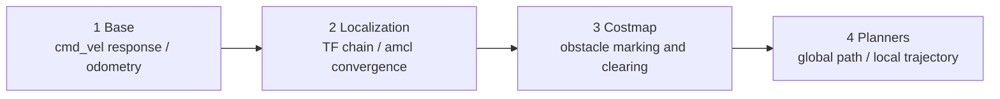

# 04 Navigation Tuning Checklist and Common Failures

> 中文版 / Chinese: [04_导航调优清单与常见故障.md](../../40_导航/04_导航调优清单与常见故障.md)

## Goals

- Get a bottom-up, systematic tuning checklist: "base → localization → costmap → planner".
- Be able to diagnose typical failures (spinning in place, oscillation, driving through obstacles, frequent recovery behaviors, TF errors, etc.) from a lookup table.
- Understand velocity safety measures: cmd_vel limiting and emergency stop integration.
- Learn how to measure and reduce the navigation stack's resource footprint on an x86 edge computing unit.

## Why Tune in This Order

Navigation is a stack of dependencies: planner output quality is capped by costmap quality, the costmap is capped by localization and TF, and localization is capped by the base's odometry and sensors. **Problems at an upper layer are often debts at a lower layer** — for example, the root cause of "local planning keeps failing" may simply be poor odometry calibration. So always troubleshoot bottom-up; never start by frantically tweaking planner weights.



## Step by Step: The Systematic Tuning Checklist

### Layer 1: The Base

```bash
# 1.1 Open-loop velocity test: publish 0.1 m/s, the robot should drive straight at constant speed in the correct direction
rostopic pub -r 10 /cmd_vel geometry_msgs/Twist '{linear: {x: 0.1}}'
# 1.2 Odometry straight-line calibration: drive 2.0 m in reality, compare the /odom reading, error should be < 2%
rostopic echo /odom/pose/pose/position/x
# 1.3 Rotation calibration: rotate 360 degrees in place, yaw should return to its starting value (error < 5 degrees)
```

- [ ] cmd_vel-to-wheel latency < 100 ms (high latency destabilizes local planning as a whole)
- [ ] Determine the base's true maximum velocity and acceleration and enter them honestly into the planner parameters (inflated values are the root cause of many "trajectory won't execute" problems)

### Layer 2: Localization

- [ ] `rosrun rqt_tf_tree rqt_tf_tree`: the `map→odom→base_footprint→base_scan` chain is complete, with no duplicate parents
- [ ] `rostopic hz /scan` is stable; in rviz the laser points hug the map walls
- [ ] Push the robot 10 m: the amcl particle cloud stays converged and the pose does not jump
- [ ] NTP time sync across all machines (`ntpdate`/chrony for multi-machine deployments); check per-transform latency with `rosrun tf tf_monitor`

### Layer 3: Costmap

- [ ] Overlay the local costmap in rviz: real obstacles appear within ≤ 0.2 s and are cleared within 1–2 update cycles after removal
- [ ] The inflation gradient band width visually ≈ `inflation_radius`; inflation zones on both sides of narrow doorways do not merge
- [ ] No `transform timeout` / `sensor out of bounds` warnings in the move_base terminal
- [ ] Footprint verified by physical measurement (including protruding parts), `footprint_padding` ≥ 0.01

### Layer 4: Planners

- [ ] Global: goals sent to every corner of the map all produce a path, and the path does not graze the inner edge of the inflation zone
- [ ] Local: on straight segments the speed reaches at least 90% of `max_vel_x` (falling short means the cost weights are too conservative or the acceleration limits too tight)
- [ ] Arrival: no dawdling at the endpoint (reasonable tolerances), no repeated turning back and forth
- [ ] Stress test: place/remove dynamic obstacles 10 times, recovery behaviors trigger ≤ 1 time

## Troubleshooting Table for Typical Failures

| Symptom | Common causes | Countermeasures |
| --- | --- | --- |
| Robot spins in place as soon as a goal is sent | ① Odometry angular velocity miscalibrated / left-right wheels swapped; ② `min_vel_theta` (including min_in_place) exceeds what the base can actually turn; ③ local planning failed, stuck in a rotate_recovery loop | Do the Layer 1 rotation calibration first; check whether the terminal periodically prints recovery logs; lower `min_vel_theta` |
| Oscillates near the goal, never reaches it | `xy_goal_tolerance`/`yaw_goal_tolerance` smaller than the base's control precision; DWA velocity sampling too coarse at the endpoint | Relax the tolerances (for differential drives, xy ≥ 0.05 m and yaw ≥ 0.1 rad recommended); DWA can set `latch_xy_goal_tolerance: true` (once inside the circle it latches and only adjusts heading); set `oscillation_timeout` as a backstop |
| Global path is planned through obstacles | ① Static map doesn't match the site (furniture moved); ② obstacles only in the laser's blind zone (below/above the scan plane); ③ obstacle_layer not loaded in the global costmap | Re-map or use keepout measures; confirm the `plugins` list includes obstacle_layer; add ultrasonic/depth camera observation sources for blind-zone obstacles |
| Recovery behaviors trigger frequently (repeated clearing + spinning) | The umbrella symptom of lower-layer debt: TF latency, costmap ghosts blocking the way, velocity/acceleration parameters mismatched with the base, `planner_patience` too short | Run through the checklist bottom-up; look at the last WARN in the terminal before triggering to determine whether it is a planner or controller timeout |
| `DWA planner failed to produce path` (could not find valid trajectory) | No collision-free trajectory in the sample window: the robot has sunk into the inflation zone / obstacles are right against it; `acc_lim` set below reality narrows the window; `sim_time` too long makes every trajectory hit a distant obstacle | Clear the maps manually with `rosservice call /move_base/clear_costmaps "{}"` or teleoperate out of the obstacle zone; verify acc_lim; lower `sim_time` to 1.5; slightly lower `occdist_scale` |
| TF reports `Lookup would require extrapolation into the past/future` | Message timestamps don't match the TF cache: multi-machine clock desync; sensor driver stamping wrong timestamps; CPU overload delaying TF publishing | Sync clocks (chrony); check average latency with `rosrun tf tf_monitor`; moderately raise `transform_tolerance` (treats the symptom); the real cure is reducing load (see next section) |
| Robot stops dead at doorways/narrow passages | Merged inflation zones (see chapter 02, Q2) | Reduce `inflation_radius`, increase `cost_scaling_factor`, raise map resolution to 0.05 |
| Status stays ACTIVE after arrival, never finishes | The local planner has stopped but yaw is off by a hair and it can't rotate any more | Relax `yaw_goal_tolerance`; check `theta_stopped_vel` |

### Quick Reference: Troubleshooting Commands

```bash
# Manually clear both costmaps (the fastest temporary fix when ghosts block the way)
rosservice call /move_base/clear_costmaps "{}"

# Cancel the current goal (when the robot is stuck in a recovery loop)
rostopic pub -1 /move_base/cancel actionlib_msgs/GoalID -- {}

# Have the global planner compute a path only, without executing it
# (verifies that "can it plan" and "can it execute" are two separate questions)
rosservice call /move_base/make_plan "start: {header: {frame_id: map}}
goal: {header: {frame_id: map}, pose: {position: {x: 1.0, y: 0.5}, orientation: {w: 1.0}}}
tolerance: 0.1"

# TF health: average and maximum latency of each chain
rosrun tf tf_monitor

# Record an "accident scene" for offline analysis (start it before problems occur)
rosbag record /tf /tf_static /scan /odom /cmd_vel /move_base/status \
  /move_base/global_costmap/costmap /move_base/local_costmap/costmap -o nav_debug
```

Reading tip: when a failure occurs, **immediately look at the last 10 lines of the move_base terminal**. A `planner`-related WARN → global side (costmap/map/goal point issue); `controller`/`Could not find a valid trajectory` → local side (velocity parameters/local obstacles); `transform`/`extrapolation` → go straight to TF troubleshooting, and don't touch the planner parameters.

## Velocity Smoothing and Safety

The `/cmd_vel` produced by navigation is a step command; driving the motors with it directly causes jerking, and can even topple a high-center-of-gravity robot. Recommended integration chain:

```text
move_base → /cmd_vel_raw → velocity smoothing/limiting node → /cmd_vel → base (hardware e-stop circuit independent)
```

- **Limiting and smoothing**: use `yocs_velocity_smoother` (apt: `ros-noetic-yocs-velocity-smoother`) for dual velocity and acceleration limiting, or write a 20-line node of your own applying ramp limits to Twist. Set the limits to "base physical limit × 0.8", and keep them consistent with the planner's own parameters to avoid the two fighting each other.
- **Watchdog**: the base driver side must implement a cmd_vel timeout brake (e.g. stop after 0.5 s without a new command), so the robot doesn't shoot off carrying the last velocity if move_base crashes.
- **Emergency stop**: the hardware e-stop must cut the motor power circuit. **Do not** rely on software subscribing to an `/e_stop` topic to implement an "e-stop" — ROS 1 provides no real-time guarantees. At the software layer, you may additionally add a mux (`topic_tools/mux` or `twist_mux`) so joystick/e-stop topics take priority over navigation.
- Add to the power-on self-test script: whenever `rostopic hz /cmd_vel` shows values, the wheels must be moving, and vice versa (detects a decoupled drive chain).

## Resource Footprint and Load Reduction on x86 Edge Units

Reference magnitudes (TB3-class small robot + single-line laser + this suite's x86 edge unit; for budgeting only, measure to confirm):

| Component | Typical single-core CPU | Main influencing factors |
| --- | --- | --- |
| move_base + two costmaps + DWA | 15%–35% | costmap size/resolution/update_frequency, controller_frequency |
| After switching to TEB | above × 2–5 | number of obstacles, no_*_iterations, footprint_model complexity |
| amcl | 5%–15% | particle count |
| gazebo (simulation only) | 100%+ | the simulation environment itself; absent on real robots |

Monitoring: `top -H -p $(pgrep -f move_base)`; if move_base prints `Control loop missed its desired rate of 20.0Hz`, it can no longer keep up.

**Load reduction measures (ordered by cost-effectiveness):**

1. `local_costmap` resolution 0.05 → 0.1 (same area, 1/4 the cells; mind narrow-doorway passability);
2. `update_frequency` 10 → 5 Hz, `publish_frequency` down to 1–2 Hz (the latter only affects visualization);
3. `controller_frequency` 20 → 10 Hz (adjust TEB's `dt_ref` to ~0.1/frequency magnitude accordingly);
4. Shrink the local costmap window (e.g. 4×4 m → 3×3 m);
5. TEB: `no_inner_iterations` 5→3, `no_outer_iterations` 4→3, `max_global_plan_lookahead_dist` 3.0→2.0, or simply switch back to DWA;
6. Lower `planner_frequency` to 0.5 Hz or 0 (replan on demand);
7. Disable unused debug publishing (TEB `publish_feedback: false`; turn off the costmap displays in rviz when not watching — the subscription itself triggers publishing overhead).

## FAQ

**Q1: Can I skip steps in the tuning order — say, tune the DWA weights directly?**
Fine-tuning is fine, but as soon as "systemic" problems appear (frequent recoveries, random failures), always go back to Layer 1 of the checklist and start over. 90% of mysterious navigation problems are ultimately traced to odometry, TF timestamps, or the footprint.

**Q2: Parameters tuned in simulation — do they need retuning on the real robot?**
The costmap structure and planner weights are largely reusable; but velocity/acceleration limits, footprint, `transform_tolerance`, and sensor observation sources must be refilled for the real robot. Maintain two sets of yaml files for simulation and real hardware, switched by an arg in the launch file.

**Q3: How do I quantify "well tuned"?**
Define 5 fixed goal points and loop 20 rounds, recording: success rate (≥ 95%), average time to goal, recovery behavior triggers (≤ 1 per round), and minimum obstacle clearance. Data beats gut feeling. For cyclic goal sending, a small actionlib-based script can send goals in sequence and tally the `result`:

```python
#!/usr/bin/env python3
import rospy, actionlib
from move_base_msgs.msg import MoveBaseAction, MoveBaseGoal

GOALS = [(1.0, 0.5, 0.0), (-1.5, 0.0, 1.57), (0.0, -1.0, 3.14)]  # x, y, yaw
rospy.init_node('nav_bench')
cli = actionlib.SimpleActionClient('move_base', MoveBaseAction)
cli.wait_for_server()
ok = 0
for i, (x, y, yaw) in enumerate(GOALS):
    import tf.transformations as t
    g = MoveBaseGoal()
    g.target_pose.header.frame_id = 'map'
    g.target_pose.header.stamp = rospy.Time.now()
    g.target_pose.pose.position.x, g.target_pose.pose.position.y = x, y
    q = t.quaternion_from_euler(0, 0, yaw)
    g.target_pose.pose.orientation.z, g.target_pose.pose.orientation.w = q[2], q[3]
    t0 = rospy.Time.now()
    cli.send_goal(g)
    cli.wait_for_result(rospy.Duration(120))
    state = cli.get_state()          # 3 = SUCCEEDED
    ok += (state == 3)
    rospy.loginfo("goal %d: state=%d, %.1fs", i, state, (rospy.Time.now()-t0).to_sec())
rospy.loginfo("success %d/%d", ok, len(GOALS))
```

## Chapter Summary

By now you can: read the move_base data flow (01), tune the costmaps layer by layer (02), choose and tune a local planner by base type (03), and integrate and troubleshoot the whole system methodically (this document). The next chapter moves on to sensor drivers and real-robot deployment → [45 Sensor Drivers](../45_sensor_drivers/README.md).
