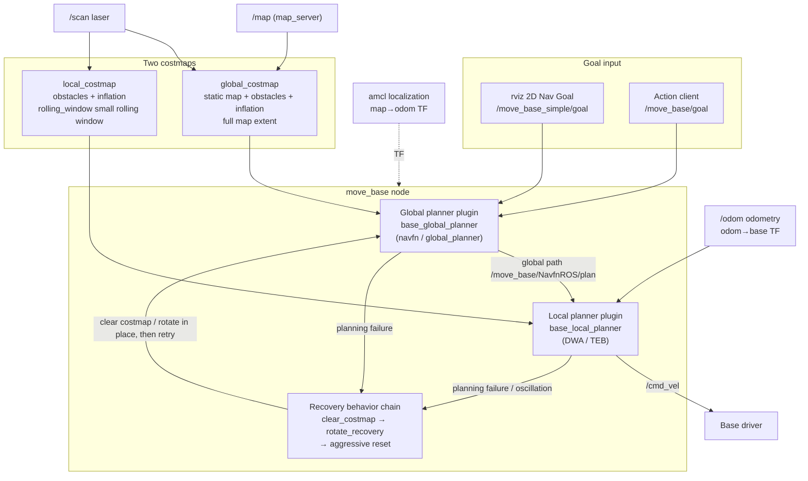

# 40 Navigation

> 中文版 / Chinese: [README.md](../../40_导航/README.md)

This chapter covers the ROS1 Noetic navigation stack: from the move_base architecture and costmap tuning to local planner selection and a systematic tuning checklist. The goal is to get a complete navigation pipeline running in the TurtleBot3 simulation, and to give you a method you can transfer to a real robot base.

## Sections in This Chapter

| No. | Document | Contents |
| --- | --- | --- |
| 01 | [move_base Architecture and Quick Start](01_move_base.md) | Data flow, plugin mechanism, recovery behavior chain, complete TB3 demo, real-robot integration checklist |
| 02 | [Costmap Tuning](02_costmap_tuning.md) | The static/obstacle/inflation three-layer structure, global vs local costmap, file-by-file parameter walkthrough |
| 03 | [DWA and TEB Local Planners](03_dwa_and_teb.md) | Sampling vs optimization principle comparison, parameter tables, TEB installation and switching, base type selection advice |
| 04 | [Navigation Tuning Checklist and Common Failures](04_tuning_and_troubleshooting.md) | Systematic tuning checklist, troubleshooting table, velocity smoothing and safety, load reduction on edge units |

## move_base at a Glance

In one sentence: the **global planner** computes a path from the current position to the goal on the global_costmap; the **local planner** tracks that path on the local_costmap while avoiding obstacles in real time, producing `/cmd_vel`; when either keeps failing, the **recovery behavior chain** clears the costmaps and rotates in place in sequence, and only declares the goal failed (aborted) if all of that fails.

## Prerequisites

- Completed [30 Localization](../30_localization/README.md): navigation depends on a complete `map → odom → base_link` TF chain and a 2D occupancy grid map.
- Completed [20 2D Mapping](../20_2d_slam/README.md): you have a `map.yaml` + `map.pgm` on hand.
- Simulation environment: Ubuntu 20.04 + ROS Noetic + TurtleBot3 Gazebo (`turtlebot3_gazebo` and `turtlebot3_navigation` both installed).

## Source Code References

All parameters in this chapter have been verified against the source code in the workspace; whenever the documentation and the source disagree, the source is authoritative:

- `~/workspace/ws_romindly/src/navigation/` (move_base, costmap_2d, dwa_local_planner, global_planner, etc., forked from ros-planning, noetic-devel branch)
- `~/workspace/ws_romindly/src/teb_local_planner/` (forked from rst-tu-dortmund)
